# Azure vs GCP 第 11 部分:虚拟机(GCP)

> 原文：<https://dev.to/kenakamu/azure-vs-gcp-part-11-virtual-machine-gcp--5657>

在前两篇文章中，我从应用程序部署的角度尝试了 Azure VM。现在我在 GCP 做同样的事情。

# 谷歌计算引擎(GCE)

虽然它是谷歌云，但它支持 [windows](https://cloud.google.com/compute/docs/instances/windows/) 和 Linux OS，有/没有应用程序。我用全。NET 应用程序来尝试这种 Windows 环境。

### 类型

在 Azure 中，类型是大小，详细信息请参见本文中的[，但是有许多面向目的的大小选择可用，例如高 CPU 类型、高/大内存类型和 GPU 等。](https://cloud.google.com/compute/docs/machine-types)

### 地区/区域和价格

有大量的地点可供选择，还有许多价格选项可以优化成本。由于这不是营销博客，我不解释细节。查看[可用地区和区域](https://cloud.google.com/compute/docs/regions-zones/)以及[价格](https://cloud.google.com/compute/pricing)

### 其他特性

和 Azure 一样，我真的不能列出所有的特性，但是你会找到你最需要的，比如:

*   （同 solid-statedisk）固态（磁）盘
*   永久磁盘
*   负载平衡和扩展
*   InternationalAssociationofMachinists 国际机械师协会
*   虚拟机管理
*   监视
*   与其他服务的集成
*   自动化
*   工具
*   定制等。

# 让我们试试

我用全。NET 应用程序来测试这一点，因为 Visual Studio 集成识别它，并让我使用虚拟机的 Windows 映像。

### 调配虚拟机

我可以自己部署干净的 Windows 服务器并安装 IIS、ASP.NET 或任何其他依赖项。或者，我可以使用默认安装了这些依赖项的映像。这一次，我为 ASP.NET 使用预先配置的图像。

1.进入[云控制台](https://console.cloud.google.com/)，从菜单中选择“云启动器”。

[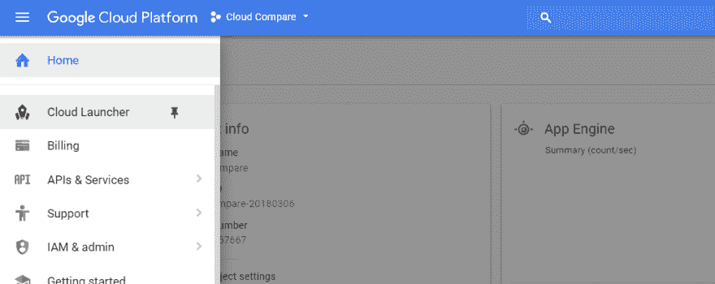T2】](https://res.cloudinary.com/practicaldev/image/fetch/s--0bv7W-8L--/c_limit%2Cf_auto%2Cfl_progressive%2Cq_auto%2Cw_880/https://thepracticaldev.s3.amazonaws.com/i/czx5mwqzu4ubuemkr4vd.PNG)

2.搜索“ASP。NET”并选择“ASP。NET Framework”图像。

[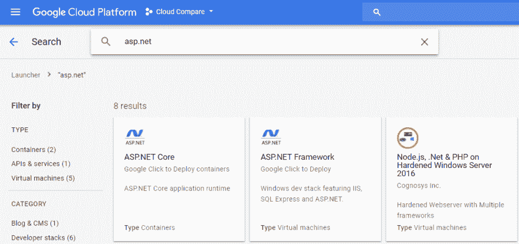T2】](https://res.cloudinary.com/practicaldev/image/fetch/s--0fuMPuAa--/c_limit%2Cf_auto%2Cfl_progressive%2Cq_auto%2Cw_880/https://thepracticaldev.s3.amazonaws.com/i/sqaaay1p5i0l8orqliqj.PNG)

3.单击“在计算引擎上启动”。

[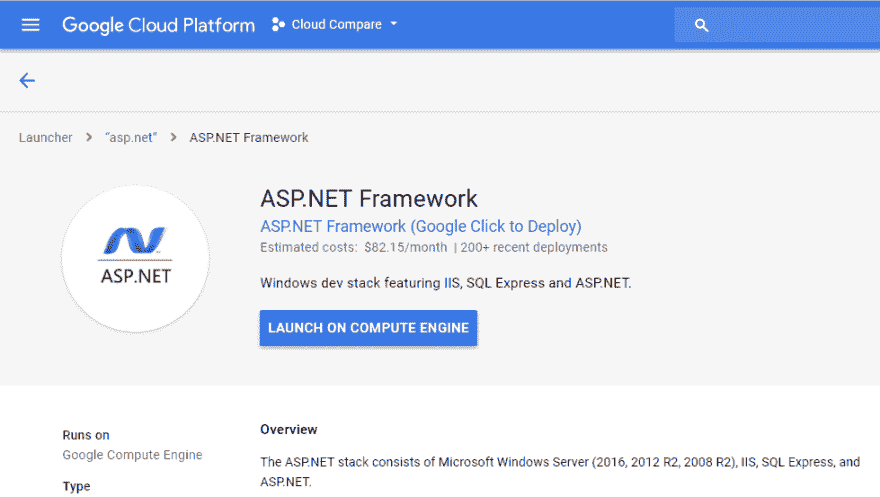T2】](https://res.cloudinary.com/practicaldev/image/fetch/s--kpy0AepE--/c_limit%2Cf_auto%2Cfl_progressive%2Cq_auto%2Cw_880/https://thepracticaldev.s3.amazonaws.com/i/0wj4j1t8e2f0bedi4gvl.PNG)

4.输入必填字段。确保为防火墙启用 HTTP 端口和 WebDeploy。然后点击“确定”。

[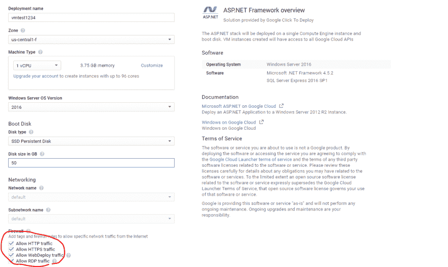T2】](https://res.cloudinary.com/practicaldev/image/fetch/s--Lz8rmDa3--/c_limit%2Cf_auto%2Cfl_progressive%2Cq_auto%2Cw_880/https://thepracticaldev.s3.amazonaws.com/i/uognkoxw0komsaewz92b.PNG)

5.部署管理器显示进度。等待部署完成。这可能需要一点时间。

[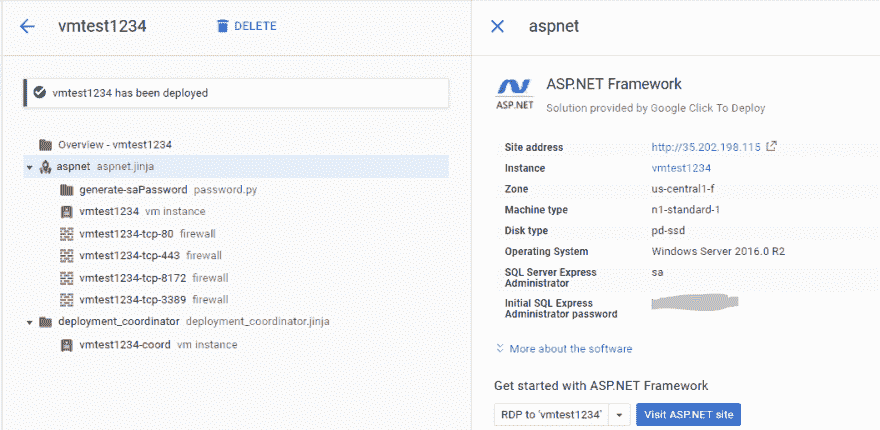T2】](https://res.cloudinary.com/practicaldev/image/fetch/s--EG7XFnFc--/c_limit%2Cf_auto%2Cfl_progressive%2Cq_auto%2Cw_880/https://thepracticaldev.s3.amazonaws.com/i/k7xl5mm4tsf1bdysgpm5.PNG)

这就是部署虚拟机的全部内容。

### 创建应用并部署。

1.打开 Visual Studio 2017 并创建新项目。选择 ASP.NET Web 应用程序(。NET 框架)。

[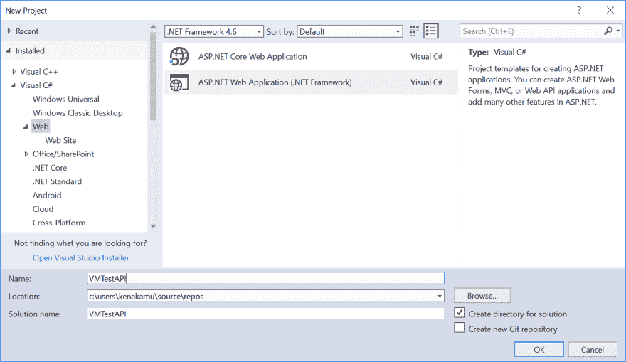T2】](https://res.cloudinary.com/practicaldev/image/fetch/s--XVHC9Sf---/c_limit%2Cf_auto%2Cfl_progressive%2Cq_auto%2Cw_880/https://thepracticaldev.s3.amazonaws.com/i/m01atwtmjjot347os83a.PNG)

2.选择 Web API 模板，然后单击确定。这个模板已经包含了 API，所以我只是使用它。

[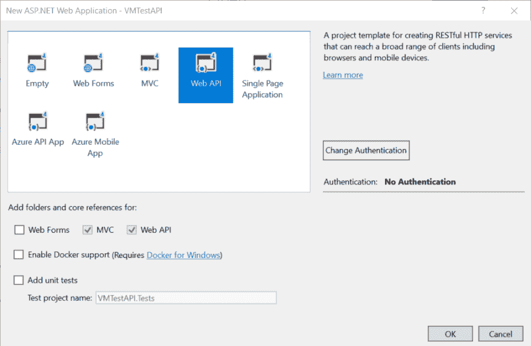T2】](https://res.cloudinary.com/practicaldev/image/fetch/s--9bt5KOBc--/c_limit%2Cf_auto%2Cfl_progressive%2Cq_auto%2Cw_880/https://thepracticaldev.s3.amazonaws.com/i/r8bxnsg97sormo76xard.PNG)

3.右键单击项目，然后单击“发布到 Google Cloud”。

[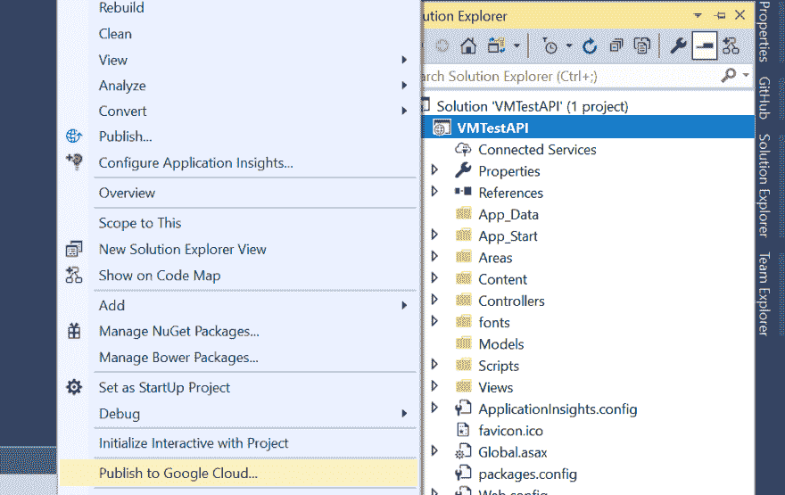T2】](https://res.cloudinary.com/practicaldev/image/fetch/s--7GYhA9cn--/c_limit%2Cf_auto%2Cfl_progressive%2Cq_auto%2Cw_880/https://thepracticaldev.s3.amazonaws.com/i/fmhi6wgx4spg2mov2sb6.PNG)

4.选择“计算引擎”。

[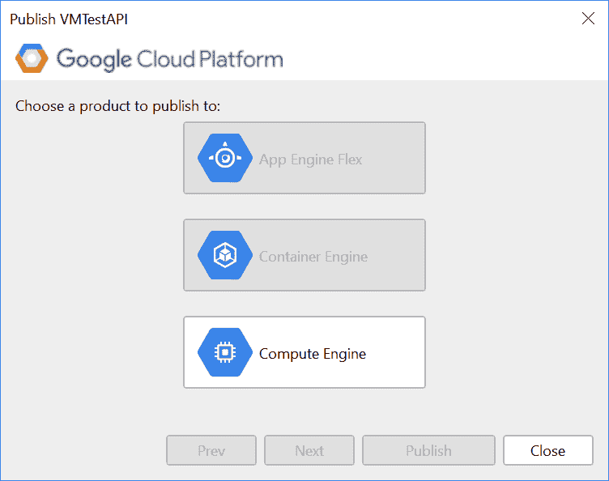T2】](https://res.cloudinary.com/practicaldev/image/fetch/s--vtTpbfeJ--/c_limit%2Cf_auto%2Cfl_progressive%2Cq_auto%2Cw_880/https://thepracticaldev.s3.amazonaws.com/i/f2shsptqjkiz1sfeqksg.PNG)

5.选择要部署到的虚拟机，然后单击“管理 Windows 凭据”。

[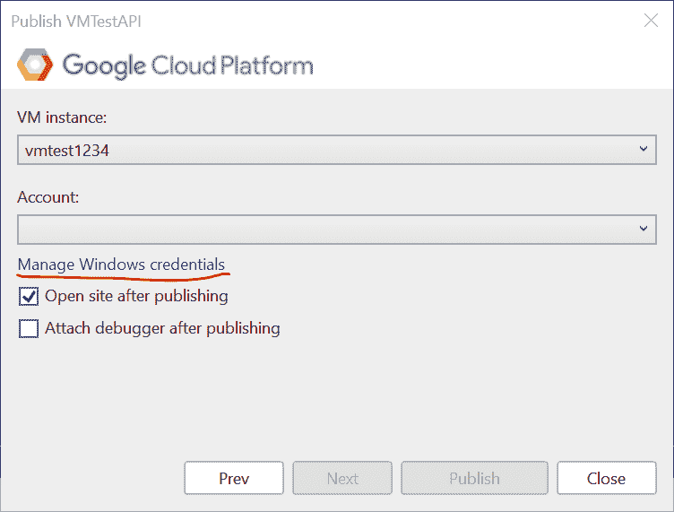T2】](https://res.cloudinary.com/practicaldev/image/fetch/s--uTvaSz-t--/c_limit%2Cf_auto%2Cfl_progressive%2Cq_auto%2Cw_880/https://thepracticaldev.s3.amazonaws.com/i/8nwkaob15tskvhx1rsrd.PNG)

6.单击“添加凭据”并添加新用户。输入虚拟机管理员的用户名和密码。在我的例子中，我让向导生成新密码。稍后它会向您显示密码。关上窗户。

[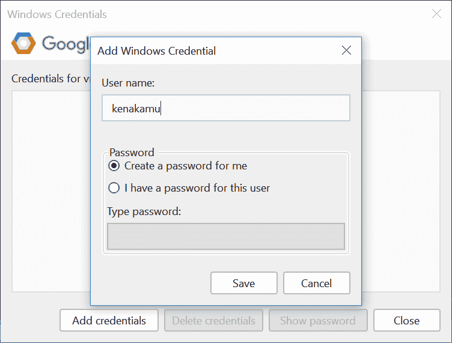T2】](https://res.cloudinary.com/practicaldev/image/fetch/s--sXsdNzdy--/c_limit%2Cf_auto%2Cfl_progressive%2Cq_auto%2Cw_880/https://thepracticaldev.s3.amazonaws.com/i/sgbgpa3rdpgb9ocfkp44.PNG)

7.点击“发布”。

[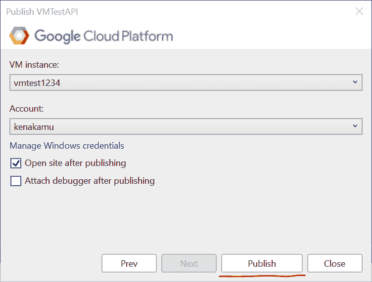T2】](https://res.cloudinary.com/practicaldev/image/fetch/s--UEJhVxsz--/c_limit%2Cf_auto%2Cfl_progressive%2Cq_auto%2Cw_880/https://thepracticaldev.s3.amazonaws.com/i/0328dppumdfk13byrw8o.PNG)

8.等待部署完成。完成后，转到“/api/values”查看它返回的结果。

[T2】](https://res.cloudinary.com/practicaldev/image/fetch/s--Smkee9W7--/c_limit%2Cf_auto%2Cfl_progressive%2Cq_auto%2Cw_880/https://thepracticaldev.s3.amazonaws.com/i/038pvgacmd7blhlyvpjo.PNG)

# 提示

与 Azure 不同，从模板创建 VM 并不创建虚拟网络，而是 GCP 默认准备网络设置。

### 虚拟私有云(VPC)网络

根据[这份文件](https://cloud.google.com/vpc/docs/overview)，VPC 网络是

> 你可以像看待物理网络一样看待 VPC 网络，只不过它是在 GCP 内部虚拟化的。VPC 网络由数据中心的虚拟本地子网网络组成，所有这些网络通过全球广域网连接在一起。网络在逻辑上与 GCP 的所有其它网络相隔离。

1.从菜单中，选择 VPC 网络| VPC 网络。

2.检查部署虚拟机的区域的 IP 地址范围。

[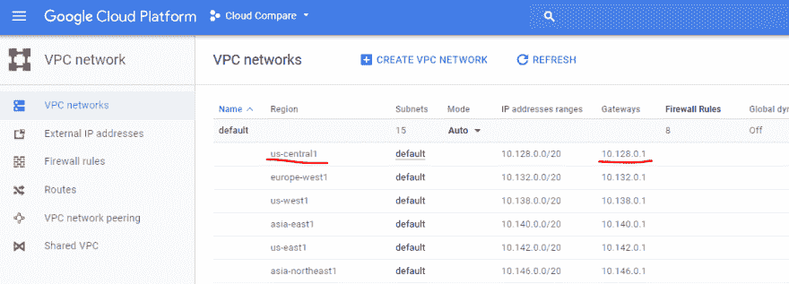T2】](https://res.cloudinary.com/practicaldev/image/fetch/s--S__jJX4z--/c_limit%2Cf_auto%2Cfl_progressive%2Cq_auto%2Cw_880/https://thepracticaldev.s3.amazonaws.com/i/rzgtk7o202dqhuwry005.PNG)

3.转到计算引擎以查看虚拟机的内部 IP。

[T2】](https://res.cloudinary.com/practicaldev/image/fetch/s--AoZVAp7d--/c_limit%2Cf_auto%2Cfl_progressive%2Cq_auto%2Cw_880/https://thepracticaldev.s3.amazonaws.com/i/ydotb8pktked0yvq9jzz.PNG)

### 防火墙规则

配置虚拟机时指定的防火墙规则转到 VPC 网络中的防火墙规则部分。

[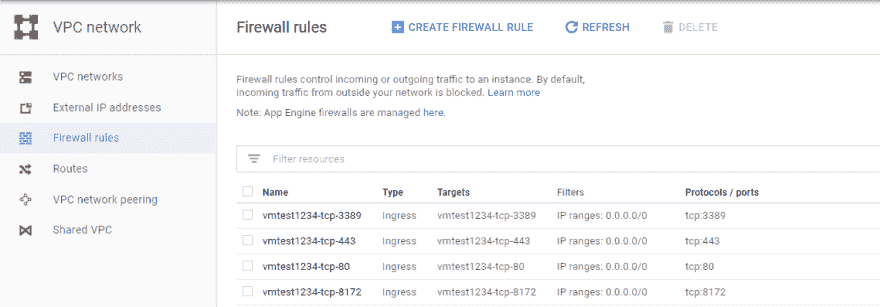T2】](https://res.cloudinary.com/practicaldev/image/fetch/s--j3MtBUV6--/c_limit%2Cf_auto%2Cfl_progressive%2Cq_auto%2Cw_880/https://thepracticaldev.s3.amazonaws.com/i/zn7tnz37ku8o8vsk96z7.PNG)

### 外部 IP

您可以在外部 IP 地址中找到创建的外部 IP。

[T2】](https://res.cloudinary.com/practicaldev/image/fetch/s--HDXAehSm--/c_limit%2Cf_auto%2Cfl_progressive%2Cq_auto%2Cw_880/https://thepracticaldev.s3.amazonaws.com/i/42w8m8nwz5skad9lsfzr.PNG)

### 备份

GCE 提供“快照”功能来备份虚拟机。

1.转到“计算引擎”|“快照”。点击“创建快照”。

[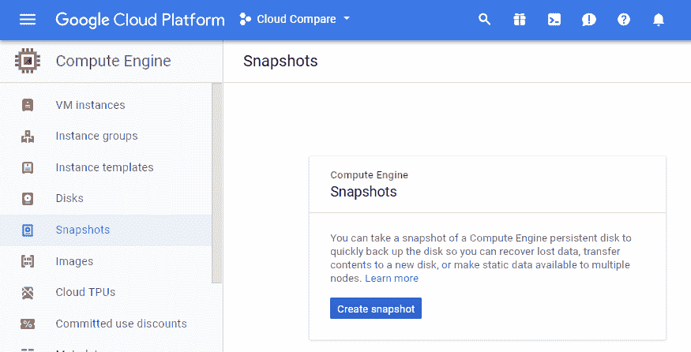T2】](https://res.cloudinary.com/practicaldev/image/fetch/s--AP0q30or--/c_limit%2Cf_auto%2Cfl_progressive%2Cq_auto%2Cw_880/https://thepracticaldev.s3.amazonaws.com/i/v0gxznbucax58ud7cb1x.PNG)

2.指定选项并单击“创建”。

在下一篇文章中，我将研究如何扩展 VM 环境。

肯恩(男名)