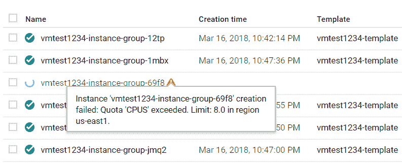

# Azure vs GCP 第 12 部分:虚拟机扩展(GCP)

> 原文：<https://dev.to/kenakamu/azure-vs-gcp-part-12-virtual-machine---scaling-gcp--2op0>

在[上一篇文章](https://dev.to/kenakamu/azure-vs-gcp-part-11-virtual-machine-gcp--5657)中，我使用 GCP 虚拟机(GCE)作为单一实例来托管我的应用程序。

我研究扩展选项[，就像我研究 GCP 的 Azure](https://dev.to/kenakamu/azure-vs-gcp-part-10-virtual-machine---scaling-azure--4ci0) 一样。

# 可用性

重复自 Azure post，但我推荐多实例的原因之一是可用性。有两种类型的担忧。

*   硬件故障
*   软件更新

# 托管实例组

一个组包含相同的虚拟机，并提供自动扩展。当负载超过阈值时，它使用**实例模板**作为种子映像来添加额外的虚拟机。有两种类型的托管实例组。

### 分区管理实例组

所有虚拟机在同一组中运行。[本文](https://cloud.google.com/compute/docs/regions-zones/#choosing_a_region_and_zone)
说“单一故障事件只会影响单一区域”。因此，我认为它可能包括软件更新，但我仍然有硬件故障的问题。

### 区域托管实例组

虚拟机在一个区域的多个分区中运行。这也应该包括硬件故障，除非整个地区都瘫痪了。

# 负载均衡器

GCP 也提供负载平衡器，但它比 Azure 提供了更多的选择。

### 全局外部负载均衡

*   HTTP(S)负载平衡:根据与用户和/或请求的 URL 的接近程度，在实例组之间分配 HTTP(S)流量。
*   SSL 代理负载平衡:根据与用户的接近程度在实例组之间分配 SSL 流量。
*   TCP 代理负载平衡:根据与用户的接近程度在实例组之间分配 TCP 流量。

### 区域外部/内部负载均衡

将网络流量分布在一个区域

*   网络负载平衡:在一个区域内的实例池中分配流量。网络负载平衡可以平衡任何类型的 TCP/UDP 流量。
*   内部负载平衡:将流量从 Google 云平台虚拟机实例分发到同一区域的一组实例。

# 我们试试吧！

说得够多了，现在让我来试试。

### 创建自定义图像

首先，我需要创建包含应用程序的 windows 映像。

1.通过 RDP 登录到包含应用程序的虚拟机。
[T3】](https://res.cloudinary.com/practicaldev/image/fetch/s--hG9a6sUp--/c_limit%2Cf_auto%2Cfl_progressive%2Cq_auto%2Cw_880/https://thepracticaldev.s3.amazonaws.com/i/labgi3ow464gzqn7nrhb.PNG)

2.以管理员身份打开 PowerShell，并运行以下命令。

```
GCESysprep 
```

Enter fullscreen mode Exit fullscreen mode

3.转到“图像”并点击“创建图像”。

4.指定必要的参数。将源设置为磁盘和您刚才概括的源磁盘。点击“创建”。

[T2】](https://res.cloudinary.com/practicaldev/image/fetch/s--jc7ZtWc4--/c_limit%2Cf_auto%2Cfl_progressive%2Cq_auto%2Cw_880/https://thepracticaldev.s3.amazonaws.com/i/5pqdwakry5xq4p389yv6.PNG)

### 创建实例模板

接下来，从定制图像创建实例模板。

1.转到“实例模板”并单击“创建实例模板”。
[T3】](https://res.cloudinary.com/practicaldev/image/fetch/s---WeRgJke--/c_limit%2Cf_auto%2Cfl_progressive%2Cq_auto%2Cw_880/https://thepracticaldev.s3.amazonaws.com/i/761lufm9g4kly1msyvtw.PNG)

2.输入名称并选择机器类型。单击启动盘的“更改”。
[T3】](https://res.cloudinary.com/practicaldev/image/fetch/s--NSNm4dtA--/c_limit%2Cf_auto%2Cfl_progressive%2Cq_auto%2Cw_880/https://thepracticaldev.s3.amazonaws.com/i/zbqaot79dqe399o1yba7.PNG)

3.单击“自定义图像”并选择创建的图像。
[T3】](https://res.cloudinary.com/practicaldev/image/fetch/s--qVJvZTn1--/c_limit%2Cf_auto%2Cfl_progressive%2Cq_auto%2Cw_880/https://thepracticaldev.s3.amazonaws.com/i/o8k40uwc8dw5f06f0ddg.PNG)

4.如果应用程序需要访问 GCP 的任何资源，请设置“身份和 API 访问”。在这种情况下，我不需要任何东西。启用“允许 HTTP 流量”。单击创建。
[T3】](https://res.cloudinary.com/practicaldev/image/fetch/s--qhb2Nm-3--/c_limit%2Cf_auto%2Cfl_progressive%2Cq_auto%2Cw_880/https://thepracticaldev.s3.amazonaws.com/i/ohpvfx7jatiwgx1c5hej.PNG)

### 创建实例组

现在，因为我有了模板映像，所以我继续创建实例组。

1.转到“Insatnce groups”并单击“创建实例组”。
[T3】](https://res.cloudinary.com/practicaldev/image/fetch/s--MSCFgMGa--/c_limit%2Cf_auto%2Cfl_progressive%2Cq_auto%2Cw_880/https://thepracticaldev.s3.amazonaws.com/i/8uy152jm9ofe5arfgwwp.PNG)

2.输入名称，并指定“位置”。我在这里选择“多区域”。
[T3】](https://res.cloudinary.com/practicaldev/image/fetch/s--znmRCKlW--/c_limit%2Cf_auto%2Cfl_progressive%2Cq_auto%2Cw_880/https://thepracticaldev.s3.amazonaws.com/i/h6pr88lmzsbvchqpjrzt.PNG)

3.将“实例模板”指定为创建的模板，并将“自动缩放”设置为“开”。我使用默认值，但你可以调整它。
[T3】](https://res.cloudinary.com/practicaldev/image/fetch/s--U8Kq_oE_--/c_limit%2Cf_auto%2Cfl_progressive%2Cq_auto%2Cw_880/https://thepracticaldev.s3.amazonaws.com/i/z2b4efdoslb4sncvnei7.PNG)

4.除了自动缩放，我还可以设置自动修复。
[T3】](https://res.cloudinary.com/practicaldev/image/fetch/s--4X1psWkl--/c_limit%2Cf_auto%2Cfl_progressive%2Cq_auto%2Cw_880/https://thepracticaldev.s3.amazonaws.com/i/akbwb93kdwjd8joleeo7.PNG)

5.等待创建完成。然后选择创建的实例组。存在使用公共 IP 显示的正在运行的实例。
[T3】](https://res.cloudinary.com/practicaldev/image/fetch/s--p4VucPja--/c_limit%2Cf_auto%2Cfl_progressive%2Cq_auto%2Cw_880/https://thepracticaldev.s3.amazonaws.com/i/adcpe6krp2ud00buifew.PNG)

6.访问公共 IP 来检查应用程序。
[T3】](https://res.cloudinary.com/practicaldev/image/fetch/s--R1GZB9AO--/c_limit%2Cf_auto%2Cfl_progressive%2Cq_auto%2Cw_880/https://thepracticaldev.s3.amazonaws.com/i/whjbqk0nvsmptb10ll79.PNG)

### 创建负载平衡器

当自动缩放开始时，有多个实例。要为用户提供单一接入点，请添加负载平衡器。

1.转到“网络服务”|“负载平衡”，然后单击“创建负载平衡器”。
[T3】](https://res.cloudinary.com/practicaldev/image/fetch/s--QY6mzV9_--/c_limit%2Cf_auto%2Cfl_progressive%2Cq_auto%2Cw_880/https://thepracticaldev.s3.amazonaws.com/i/1qc9ti7pk7h61uop8243.PNG)

2.因为我需要对 HTTP 进行负载平衡，所以选择“HTTP(S)负载平衡”。
[T3】](https://res.cloudinary.com/practicaldev/image/fetch/s--CrI59FyW--/c_limit%2Cf_auto%2Cfl_progressive%2Cq_auto%2Cw_880/https://thepracticaldev.s3.amazonaws.com/i/dda8z149ekuxikf9uzjk.PNG)

3.输入名称，然后单击创建。选择“后端配置”并创建新的后台服务。
[T3】](https://res.cloudinary.com/practicaldev/image/fetch/s--zKlG0ftu--/c_limit%2Cf_auto%2Cfl_progressive%2Cq_auto%2Cw_880/https://thepracticaldev.s3.amazonaws.com/i/0dwhc758wetqglopb1ow.PNG)

4.选择已创建的实例组，然后选择平衡规则。我在这里使用默认规则。点击“完成”。
[T3】](https://res.cloudinary.com/practicaldev/image/fetch/s--VWPywX__--/c_limit%2Cf_auto%2Cfl_progressive%2Cq_auto%2Cw_880/https://thepracticaldev.s3.amazonaws.com/i/ztc3wd1vgokcov2qm2uk.PNG)

5.单击“健康检查”并创建新的健康检查。
[T3】](https://res.cloudinary.com/practicaldev/image/fetch/s--TsQuAfsP--/c_limit%2Cf_auto%2Cfl_progressive%2Cq_auto%2Cw_880/https://thepracticaldev.s3.amazonaws.com/i/swqbw66ldo5lelwnw79q.PNG)

6.现在我可以点击“创建”按钮。

7.其余的我使用默认的规则和配置。单击“创建”创建负载平衡器。等待创建完成。

8.创建负载平衡器后，选择它。检查全局 IP。
[T3】](https://res.cloudinary.com/practicaldev/image/fetch/s--FddwKQmb--/c_limit%2Cf_auto%2Cfl_progressive%2Cq_auto%2Cw_880/https://thepracticaldev.s3.amazonaws.com/i/cy2lt018roq2h29fuhv4.PNG)

9.访问 IP 以确认页面已加载。
[T3】](https://res.cloudinary.com/practicaldev/image/fetch/s--UdNsJwL4--/c_limit%2Cf_auto%2Cfl_progressive%2Cq_auto%2Cw_880/https://thepracticaldev.s3.amazonaws.com/i/v0t67q6f3lpzved6lvtn.PNG)

### 报

由于我使用免费试用帐户，有一定的配额，我不能超过。如果我继续访问端点，并让自动伸缩发生，那么我就超出了我的限制。

1.转到“实例组”并打开我创建的实例组。有一个带有警告的虚拟机。它说我超过定额了。
[T3】](https://res.cloudinary.com/practicaldev/image/fetch/s--8qfcc2Tv--/c_limit%2Cf_auto%2Cfl_progressive%2Cq_auto%2Cw_880/https://thepracticaldev.s3.amazonaws.com/i/zl88fokhk3dr47lode49.PNG)

2.转到“IAM & admin”|“Quotas”。您可以看到该位置有 8 个 CPU 限制。
[T3】](https://res.cloudinary.com/practicaldev/image/fetch/s---pzV--ug--/c_limit%2Cf_auto%2Cfl_progressive%2Cq_auto%2Cw_880/https://thepracticaldev.s3.amazonaws.com/i/y6uu0o2g4a2nlflpidst.PNG)

# 总结

它自动伸缩的方式和 Azure 类似，比如创建种子映像，设置自动伸缩，负载均衡器在前面。但是，每个云平台对待虚拟机的方式有一些不同。

作为一名开发人员，我觉得 Azure 给了我更好的文档，但 GCP 给了我更好的配置缩放环境的体验，尤其是在使用自定义图像时。

我可能还需要考虑很多其他特性，但是我将在下一篇文章中讨论不同的技术。函数或容器。

# 引用

[创建一个 Windows 映像](https://cloud.google.com/compute/docs/instances/windows/creating-windows-os-image)
[自动缩放实例组](https://cloud.google.com/compute/docs/autoscaler/)