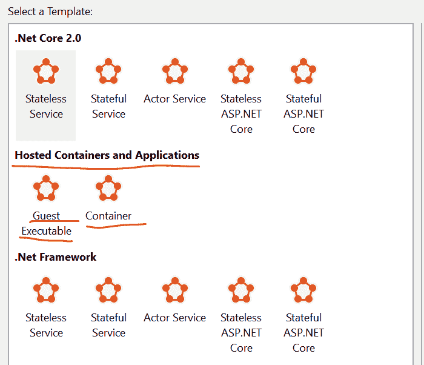

# Azure vs GCP 第 15 部分:微服务

> 原文：<https://dev.to/kenakamu/azure-vs-gcp-part-15-microservices-1ef9>

在这篇文章中，我研究了 Azure 和 GCP 之间的微服务选项。

# 什么是微服务

根据 [microservices.io](http://microservices.io/) 的说法是:

> 微服务——也称为微服务架构——是一种架构风格，它将应用程序构建为松散耦合的服务集合，这些服务实现业务功能。微服务架构支持大型复杂应用的持续交付/部署。它还使组织能够发展其技术堆栈。

简单来说，是架构模式而不是服务。那么 Azure 和 GCP 提供了什么呢？

当我们阅读定义时，我们很容易想象 Web 应用程序/应用程序引擎、功能甚至虚拟机可以是微服务的一部分，这应该是正确的。

### 微服务变更

这是一个伟大的概念，它应该促进开发和发布周期。然而，要支持微服务架构，还有许多挑战需要克服，因为系统中有许多“微”组件，并且它会根据负载动态增加和减少。

*   服务之间的通信
*   服务发现或服务端点
*   原木
*   规定
*   更新或升级
*   试验
*   自动缩放

为了解决这些挑战，微软和谷歌提供了产品。

# 微软和谷歌

这不是 Azure 对 GCP，而是微软对谷歌。为什么？微软提供“Azure Service Fabric ”,谷歌提供可以在任何地方运行的“Kubenetes”。Azure 支持 K8s，我应该在 GCP 上运行 Azure Service Fabric(我从未尝试过)。因此，我在本文中对这两种技术进行了比较。

# 天蓝色服务面料

多年来，微软一直使用 Service Fabric 来提供自己的服务。这意味着该框架是企业级的成熟解决方案，他们将它提供给开发人员。

当我写代码时，它提供了两个选项。

*   。网络应用
*   Windows/Linux 容器

这意味着，如果我已经有了包含代码的容器，我可以简单地将它们放在服务结构上来构建微服务架构。不需要额外投资。

[T2】](https://res.cloudinary.com/practicaldev/image/fetch/s--zEYw8tCQ--/c_limit%2Cf_auto%2Cfl_progressive%2Cq_auto%2Cw_880/https://thepracticaldev.s3.amazonaws.com/i/2exyo29ji1k7e7k11qvx.PNG)

### [T1。网络应用](#net-application)

在我看来，Service Fabric 的优势在于它支持在框架上编写代码。这意味着，您不必考虑如何将代码分离到多个容器中。作为一名开发人员，我想纯粹专注于编写代码。

它提供了几个“类型”,作为微服务的一部分，效果很好。

*   无状态服务:适合前端
*   有状态服务:适合后端
*   演员:这是服务结构的一个独特概念。这个服务让我很容易地创建一个类的可实现的实例，这个类有代码、存储和队列。
*   来宾可执行文件:我也可以让现有的应用程序保持原样。当然也包括集装箱。

Service Fabric 通过使用框架本身和 SDK 解决了微服务架构面临的许多挑战。例如，我没有显式地提供发现服务来查找服务，而是使用特殊的模式来查找我编写到代码中的服务。源代码中集成了如此多的功能。

### Azure 门户集成并支持多个平台

实际上，我可以在任何平台、任何地方安装服务结构。Windows 和/或 Linux。Azure、GCP、AWS，甚至内部部署。但是 Azure Portal 无疑是提供服务的最佳和最容易的地方。

# Kubenetes (K8s)

我个人不了解历史，但根据许多视频或维基百科，谷歌使用名为“Borg”的框架来托管自己的服务。因此，这是另一个经过验证的企业级解决方案。

如前所述，它提供了容器编排。它解决了微服务架构面临的许多挑战。

### K8s 概念

虽然它是一个容器编排服务，但它有几个独特的概念来解决微服务架构的挑战。

*   容器:调度单元的集合或容器。
*   服务:发现某些服务的 pod。
*   标签:用于查找组件的选择器。我喜欢这个主意。

有些东西你不需要像一个开发者一样了解，比如控制器，但是你应该像 K8s 管理员一样了解它。

### GCP 控制台集成

和 Service Fabric 一样，我可以在任何地方安装 K8s，如果是 Linux 的话。Azure、GCP、AWS 甚至内部部署。但就我个人的经验而言，提供这种服务的最佳地点是 GCP。它无缝集成到项目中，易于快速启动。

# 差异

最显著的区别就是我能不能直接写代码。作为一名开发人员，我真的不想超出我的代码。因此，从 C#开发人员的角度来看，服务结构更容易理解、调试和提供。服务结构还允许我们包含现有的应用程序和/或容器，这是一个很大的优势，但也是一个困惑点。

另一方面，如果您已经有大量的容器，并且只需要编排它们，K8s 是一个很好的解决方案。

这两种解决方案都不会将我局限于一个云供应商，因为我真的可以在我想去的任何地方运行它们。从这个角度来看，这不是真正的蓝色对 GCP。

### 类似服务

有很多类似的服务，但 Docker Swarm 是另一个著名的服务。

# 引用

[在微软 Azure 服务架构上设计现代微服务应用](https://www.youtube.com/watch?v=sXZvbqkPu14)
[容器引擎:存储类&Kubernetes 中的动态供应](https://www.youtube.com/watch?v=qktFhjJmFhg)