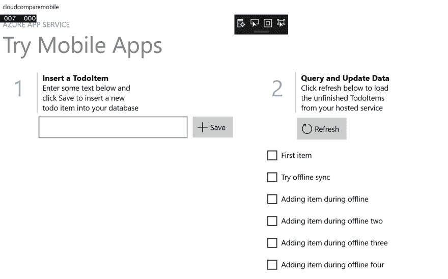
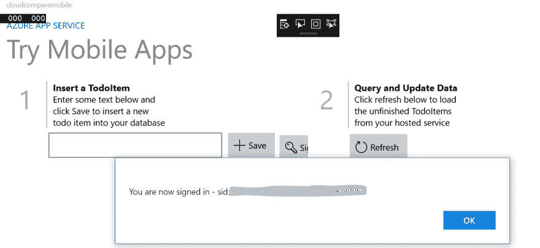

# Azure vs GCP 第 17 部分:移动应用开发(Azure)

> 原文：<https://dev.to/kenakamu/azure-vs-gcp-part-17-mobile-app-development-4j5k>

C#很棒，它几乎可以在任何地方运行。

*   Web 应用程序
*   本地服务/控制台
*   混合现实设备
*   移动应用程序

可以，对于移动，我可以用 Xamarin 写 iOS 和 Android 应用。那么问题是 Azure 和 GCP 如何支持移动应用开发。

在这篇文章中，我研究了 Azure 移动应用服务。

# Azure 移动应用

它不是单一服务，但它包含多种服务来优化移动开发体验，包括:

[T2】](https://res.cloudinary.com/practicaldev/image/fetch/s--_Y2S6TY9--/c_limit%2Cf_auto%2Cfl_progressive%2Cq_auto%2Cw_880/https://docs.microsoft.com/en-us/azure/app-service-mobile/media/app-service-mobile-value-prop/overview.png)

### 开发者的关键特性

它为移动应用程序开发提供了几个关键特性。

*   多平台:提供原生 Windows/iOS/Android 应用的 SDK，以及 Xamarin/Cordova 应用。
*   身份验证:通过 SSO，轻松访问企业中的后端服务和数据。
*   数据访问:OData v3 对许多数据源的数据源支持。
*   离线:支持离线模式和同步功能，当回到线上。
*   通知:通知移动设备。

### 主要功能为操作

除了开发人员体验之外，它还提供了以下操作特性:

*   自动缩放:它是 Web 应用程序的基础，所以很容易自动缩放。
*   Staging:支持多版本进行 A/B 测试、UI 测试等。
*   持续部署:支持与许多 SCM 集成，以支持 DevOps。
*   网络:支持虚拟网络，以便它可以轻松地与本地系统对话。

# 试试吧！

该写代码了！！这一次，我使用预先配置的示例应用程序。

### 获取样本代码

1.转到 [Azure 门户](https://portal.azure.com)并创建新资源。搜索“手机 App”并创建。

[T2】](https://res.cloudinary.com/practicaldev/image/fetch/s--Hz_yAR2Z--/c_limit%2Cf_auto%2Cfl_progressive%2Cq_auto%2Cw_880/https://thepracticaldev.s3.amazonaws.com/i/cza9sftev749sewpddmc.PNG)

2.创建完成后，转到资源并选择“快速启动”。选择您想要尝试的任何样本。我在这里选择了“Windows (C#)”。

[T2】](https://res.cloudinary.com/practicaldev/image/fetch/s--BH_eNtlt--/c_limit%2Cf_auto%2Cfl_progressive%2Cq_auto%2Cw_880/https://thepracticaldev.s3.amazonaws.com/i/uw3lrxtn0iwkenh50dam.PNG)

3.按照向导完成。首先，创建数据库。单击“连接数据库”区域。

[T2】](https://res.cloudinary.com/practicaldev/image/fetch/s--pDGcuvGn--/c_limit%2Cf_auto%2Cfl_progressive%2Cq_auto%2Cw_880/https://thepracticaldev.s3.amazonaws.com/i/u457nruhpn1k8re1v0rt.PNG)

4.单击“添加”并创建您想要的任何数据库类型。我选择“SQL”并按照向导添加新的，或者选择现有的。

[T2】](https://res.cloudinary.com/practicaldev/image/fetch/s--5IXDYZt1--/c_limit%2Cf_auto%2Cfl_progressive%2Cq_auto%2Cw_880/https://thepracticaldev.s3.amazonaws.com/i/38f0i3cz5d6uao98729j.PNG)

5.接下来，在“创建表格 API”中，选择您想要的语言。我选择了 C#并点击“下载”。这是你的服务器端代码。

[T2】](https://res.cloudinary.com/practicaldev/image/fetch/s--wUp39Ztc--/c_limit%2Cf_auto%2Cfl_progressive%2Cq_auto%2Cw_880/https://thepracticaldev.s3.amazonaws.com/i/478tyoh97inv4hdwf4yk.PNG)

6.在“配置您的客户端应用程序”中，单击“创建新应用程序”，然后单击“下载”。这是你的客户。

[T2】](https://res.cloudinary.com/practicaldev/image/fetch/s--ksViZwXJ--/c_limit%2Cf_auto%2Cfl_progressive%2Cq_auto%2Cw_880/https://thepracticaldev.s3.amazonaws.com/i/wl6rzcxbulcp4fd5qwat.PNG)

7.提取我们刚刚下载的两个 zip 文件。

### 部署后端

首先，我部署后端服务。

1.通过 Visual Studio 打开服务器端示例代码解决方案。

2.打开 Web.config 并确保连接字符串名称是您指定的名称。

2.右键单击项目，然后单击“发布”。

[T2】](https://res.cloudinary.com/practicaldev/image/fetch/s--AEhx7hQM--/c_limit%2Cf_auto%2Cfl_progressive%2Cq_auto%2Cw_880/https://thepracticaldev.s3.amazonaws.com/i/30uwzq5fhkov0pn4obj5.PNG)

3.选中“Microsoft Azure 应用服务”的“选择现有”，然后单击“发布”。

[T2】](https://res.cloudinary.com/practicaldev/image/fetch/s--TaYOcxqy--/c_limit%2Cf_auto%2Cfl_progressive%2Cq_auto%2Cw_880/https://thepracticaldev.s3.amazonaws.com/i/2y1211s8xpzwempehgft.PNG)

4.选择您创建的移动应用程序资源，然后单击“确定”。

[T2】](https://res.cloudinary.com/practicaldev/image/fetch/s--w4H43jMc--/c_limit%2Cf_auto%2Cfl_progressive%2Cq_auto%2Cw_880/https://thepracticaldev.s3.amazonaws.com/i/f70mpb9v8mmxzcyome2a.PNG)

### 运行客户端

后端启动并运行后，接下来运行客户端。

1.通过 Visual Studio 打开客户端示例代码解决方案，然后按“F5”开始调试应用程序。

2.在屏幕中输入 todo 项目，然后按 Enter 键。

[T2】](https://res.cloudinary.com/practicaldev/image/fetch/s--0eCPjF5Q--/c_limit%2Cf_auto%2Cfl_progressive%2Cq_auto%2Cw_880/https://thepracticaldev.s3.amazonaws.com/i/62uyexvuqollqhp4vc5h.PNG)

3.确认添加的新项目。您可以通过单击来删除该项目，这表示您已完成该项目。

[T2】](https://res.cloudinary.com/practicaldev/image/fetch/s---Ki5F58V--/c_limit%2Cf_auto%2Cfl_progressive%2Cq_auto%2Cw_880/https://thepracticaldev.s3.amazonaws.com/i/38gc0cmji387d0vs7279.PNG)

# 添加离线

基本用法很简单。现在添加离线功能。

1.在客户端示例中打开 MainPage.xaml.cs。评论中有如何启用离线功能的说明。

[T2】](https://res.cloudinary.com/practicaldev/image/fetch/s--7XIB7dvq--/c_limit%2Cf_auto%2Cfl_progressive%2Cq_auto%2Cw_880/https://thepracticaldev.s3.amazonaws.com/i/khr4840q3swwwawtp32c.PNG)

2.右键单击项目并选择“管理 Nuget 包”，然后安装“微软。azure . mobile . client . sqlitestore”。此外，应用所有更新。

[T2】](https://res.cloudinary.com/practicaldev/image/fetch/s--DiensE_L--/c_limit%2Cf_auto%2Cfl_progressive%2Cq_auto%2Cw_880/https://thepracticaldev.s3.amazonaws.com/i/xj75s1uj40o3bbbb1nw4.PNG)

3.按照说明取消注释#define OFFLINE_SYNC_ENABLED。

4.此外，更新代码以对所有 PushAsync 方法使用 try/catch。

```
try
{
    await App.MobileService.SyncContext.PushAsync();
}
catch (MobileServicePushFailedException ex)
{
    if (ex.PushResult.Status == MobileServicePushStatus.CancelledByNetworkError)
    {
        // ignore
    }
} 
```

Enter fullscreen mode Exit fullscreen mode

5.运行应用程序，然后使设备离线。添加几个项目。

[T2】](https://res.cloudinary.com/practicaldev/image/fetch/s--YBqz6peK--/c_limit%2Cf_auto%2Cfl_progressive%2Cq_auto%2Cw_880/https://thepracticaldev.s3.amazonaws.com/i/7x5priojokq61xwxwp82.PNG)

6.回到在线状态，在同步之前先检查 Azure SQL。“尝试脱机同步”是在我联机时创建的，因此在我脱机时还没有添加任何项目。

[T2】](https://res.cloudinary.com/practicaldev/image/fetch/s--k3mPaZ4N--/c_limit%2Cf_auto%2Cfl_progressive%2Cq_auto%2Cw_880/https://thepracticaldev.s3.amazonaws.com/i/thi4w0tsh5huv061wh0h.PNG)

7.单击客户端上的“刷新”并再次查询数据库。我可以看到所有的项目都是同步的。

[T2】](https://res.cloudinary.com/practicaldev/image/fetch/s--Z8LV7-ii--/c_limit%2Cf_auto%2Cfl_progressive%2Cq_auto%2Cw_880/https://thepracticaldev.s3.amazonaws.com/i/71so3sm3m33br6lm4t7o.PNG)

# 添加认证

这一次，我使用脸书来验证用户。

### 配置脸书登录。

1.在此参考文档[注册应用程序。](https://docs.microsoft.com/en-us/azure/app-service/app-service-mobile-how-to-configure-facebook-authentication)

2.配置脸书应用程序后，请返回 azure portal 并选择移动应用程序。单击“身份验证/授权”部分，然后单击“脸书”。

3.输入您配置的 facebook 应用程序 Id 和密码，然后单击确定。

4.在“允许的外部重定向 URL”中，输入值“cloud compare://easy auth . callback”。我使用“cloudcompare”作为协议来调用我的应用程序。

[T2】](https://res.cloudinary.com/practicaldev/image/fetch/s--EP6UZnTO--/c_limit%2Cf_auto%2Cfl_progressive%2Cq_auto%2Cw_880/https://thepracticaldev.s3.amazonaws.com/i/x9df2cl2vi8mjow3zepb.PNG)

### 更新代码

1.转到后端项目，打开 ToDoItemController.cs，在类级别添加[Authorize]属性。

[T2】](https://res.cloudinary.com/practicaldev/image/fetch/s--paxwuTyV--/c_limit%2Cf_auto%2Cfl_progressive%2Cq_auto%2Cw_880/https://thepracticaldev.s3.amazonaws.com/i/zvw8yw3iqj9g540bnl7m.PNG)

2.发布后端。

3.转到客户端项目并打开 MainPage.xaml.cs。这段代码通过脸书登录来验证用户。如果您使用的身份提供商不是脸书，请将上面的 MobileServiceAuthenticationProvider 值更改为您的提供商的值。

```
// Define a member variable for storing the signed-in user. 
private MobileServiceUser user;

// Define a method that performs the authentication process
// using a Facebook sign-in. 
private async System.Threading.Tasks.Task<bool> AuthenticateAsync()
{
    string message;
    bool success = false;
    try
    {
        // Change 'MobileService' to the name of your MobileServiceClient instance.
        // Sign-in using Facebook authentication.
        user = await App.MobileService
            .LoginAsync(MobileServiceAuthenticationProvider.Facebook, "cloudcompare");
        message =
            string.Format("You are now signed in - {0}", user.UserId);

        success = true;
    }
    catch (InvalidOperationException)
    {
        message = "You must log in. Login Required";
    }

    var dialog = new MessageDialog(message);
    dialog.Commands.Add(new UICommand("OK"));
    await dialog.ShowAsync();
    return success;
} 
```

Enter fullscreen mode Exit fullscreen mode

4.替换 OnNavigatedTo 方法以支持 auth。

```
protected override async void OnNavigatedTo(NavigationEventArgs e)
{
    if (e.Parameter is Uri)
    {
        App.MobileService.ResumeWithURL(e.Parameter as Uri);
    }
} 
```

Enter fullscreen mode Exit fullscreen mode

5.添加登录按钮点击事件。稍后我会添加实际的按钮。

```
private async void ButtonLogin_Click(object sender, RoutedEventArgs e)
{
    // Login the user and then load data from the mobile app.
    if (await AuthenticateAsync())
    {
        // Switch the buttons and load items from the mobile app.
        ButtonLogin.Visibility = Visibility.Collapsed;
        ButtonSave.Visibility = Visibility.Visible;
        await InitLocalStoreAsync(); //offline sync support.
        await RefreshTodoItems();
    }
} 
```

Enter fullscreen mode Exit fullscreen mode

6.打开 MainPage.xaml 并在 save 下添加登录名。

```
<Button Name="ButtonLogin" Visibility="Visible" Margin="0,8,8,0" 
        Click="ButtonLogin_Click" TabIndex="0">
    <StackPanel Orientation="Horizontal">
        <SymbolIcon Symbol="Permissions"/>
        <TextBlock Margin="5">Sign in</TextBlock> 
    </StackPanel>
</Button> 
```

Enter fullscreen mode Exit fullscreen mode

7.打开 App.xaml.cs 并添加 OnActivated 方法。

```
protected override void OnActivated(IActivatedEventArgs args)
{
    if (args.Kind == ActivationKind.Protocol)
    {
        ProtocolActivatedEventArgs protocolArgs = args as ProtocolActivatedEventArgs;
        Frame content = Window.Current.Content as Frame;
        if (content.Content.GetType() == typeof(MainPage))
        {
            content.Navigate(typeof(MainPage), protocolArgs.Uri);
        }
    }
    Window.Current.Activate();
    base.OnActivated(args);
} 
```

Enter fullscreen mode Exit fullscreen mode

8.我需要添加协议激活。双击 Package.appxmanifest 并选择“声明”。然后选择“协议”并点击“添加”。

[T2】](https://res.cloudinary.com/practicaldev/image/fetch/s--r8hCLRR9--/c_limit%2Cf_auto%2Cfl_progressive%2Cq_auto%2Cw_880/https://thepracticaldev.s3.amazonaws.com/i/yx39q6u67kjn3dd8y0f2.PNG)

9.输入“cloudcompare”以命名字段并保存。

[T2】](https://res.cloudinary.com/practicaldev/image/fetch/s--sOSA3yIA--/c_limit%2Cf_auto%2Cfl_progressive%2Cq_auto%2Cw_880/https://thepracticaldev.s3.amazonaws.com/i/cstc9zdqpjdgdnjb41gd.PNG)

### 测试认证

一切就绪，现在测试它！

1.按 F5 运行客户端，然后单击“登录”。

2.当您导航到 facebook 登录页面时，请登录。如果成功，您会看到一条弹出消息，指示您已登录。

[T2】](https://res.cloudinary.com/practicaldev/image/fetch/s--0zb-zS-p--/c_limit%2Cf_auto%2Cfl_progressive%2Cq_auto%2Cw_880/https://thepracticaldev.s3.amazonaws.com/i/xkmqr3ipm9tcmqh327zy.PNG)

3.现在，我可以做任何操作，因为我是认证。

# 推送通知

好了，最后一个功能是推送通知。让我们开始吧。

### 为应用程序创建和配置通知中心

我需要创建服务，并将其与移动应用程序和客户端应用程序相关联。

1.转到 Azure 门户并选择移动应用服务。然后，点击“推送”菜单。

[T2】](https://res.cloudinary.com/practicaldev/image/fetch/s--3p4ODVJx--/c_limit%2Cf_auto%2Cfl_progressive%2Cq_auto%2Cw_880/https://thepracticaldev.s3.amazonaws.com/i/wk3y6gfn67zh42sy17pf.PNG)

2.点击“连接”按钮并添加通知中心。

[T2】](https://res.cloudinary.com/practicaldev/image/fetch/s--6SxqieLR--/c_limit%2Cf_auto%2Cfl_progressive%2Cq_auto%2Cw_880/https://thepracticaldev.s3.amazonaws.com/i/2hb1mfoq72et7ynlpojg.PNG)

3.部署通知中心后，启用应用程序通知。转到客户端项目，右键单击该项目，然后选择商店|将应用程序与商店关联。

[T2】](https://res.cloudinary.com/practicaldev/image/fetch/s--HGsyHNVg--/c_limit%2Cf_auto%2Cfl_progressive%2Cq_auto%2Cw_880/https://thepracticaldev.s3.amazonaws.com/i/e344brepw38vergexej2.PNG)

4.保留应用程序名称。我用“CloudCompareMobile”作为它的名字。

5.关联完成后，进入 [Windows 开发中心](https://dev.windows.com/en-us/overview)，使用 azure 的相同帐户登录。选择保留的应用程序。

6.点击应用程序管理| WNS/MPNS，然后点击“实时服务网站”链接。

[T2】](https://res.cloudinary.com/practicaldev/image/fetch/s--uKKX4gP3--/c_limit%2Cf_auto%2Cfl_progressive%2Cq_auto%2Cw_880/https://thepracticaldev.s3.amazonaws.com/i/we46m9vcxevjzat1sf5x.PNG)

7.复制应用程序机密和包 SID。

8.返回 Azure Portal，并选择您刚刚创建的通知中心。然后从菜单中选择“Windows”。输入您刚刚获得的 SID 和密钥。

[T2】](https://res.cloudinary.com/practicaldev/image/fetch/s--MsfSIqGD--/c_limit%2Cf_auto%2Cfl_progressive%2Cq_auto%2Cw_880/https://thepracticaldev.s3.amazonaws.com/i/a0h64l80kja7u301t1yo.PNG)

### 更新代码

接下来，更新后端代码以启用推送。

1.转到后端项目并添加 Microsoft。Azure.NotificationHubs NuGet 包。

[T2】](https://res.cloudinary.com/practicaldev/image/fetch/s--bsIwVtKK--/c_limit%2Cf_auto%2Cfl_progressive%2Cq_auto%2Cw_880/https://thepracticaldev.s3.amazonaws.com/i/c2uy8jmlnc6r6bghuls1.PNG)

2.打开 TodoItemContoller.cs 并添加 using 语句。

```
using System.Collections.Generic;
using Microsoft.Azure.NotificationHubs;
using Microsoft.Azure.Mobile.Server.Config; 
```

Enter fullscreen mode Exit fullscreen mode

3.在 PostTodoItem 方法中，在 InsertAsync 后插入以下代码。它定义 toast 格式并将其发送到通知中心。

```
// Get the settings for the server project.
HttpConfiguration config = this.Configuration;
MobileAppSettingsDictionary settings =
    this.Configuration.GetMobileAppSettingsProvider().GetMobileAppSettings();

// Get the Notification Hubs credentials for the Mobile App.
string notificationHubName = settings.NotificationHubName;
string notificationHubConnection = settings
     .Connections[MobileAppSettingsKeys.NotificationHubConnectionString].ConnectionString;

// Create the notification hub client.
NotificationHubClient hub = NotificationHubClient
    .CreateClientFromConnectionString(notificationHubConnection, notificationHubName);

// Define a WNS payload
var windowsToastPayload = @"<toast><visual><binding template=""ToastText01""><text id=""1"">"
                        + item.Text + @"</text></binding></visual></toast>";
try
{
    // Send the push notification.
    var result = await hub.SendWindowsNativeNotificationAsync(windowsToastPayload);

    // Write the success result to the logs.
    config.Services.GetTraceWriter().Info(result.State.ToString());
}
catch (System.Exception ex)
{
    // Write the failure result to the logs.
    config.Services.GetTraceWriter()
        .Error(ex.Message, null, "Push.SendAsync Error");
} 
```

Enter fullscreen mode Exit fullscreen mode

4.发布服务器。

5.转到客户端项目并打开 App.xaml.cs。使用语句添加。

```
using System.Threading.Tasks;
using Windows.Networking.PushNotifications; 
```

Enter fullscreen mode Exit fullscreen mode

6.在 App 类中添加以下方法，将应用程序注册到通知中心。

```
private async Task InitNotificationsAsync()
{
    // Get a channel URI from WNS.
    var channel = await PushNotificationChannelManager
        .CreatePushNotificationChannelForApplicationAsync();

    // Register the channel URI with Notification Hubs.
    await App.MobileService.GetPush().RegisterAsync(channel.Uri);
} 
```

Enter fullscreen mode Exit fullscreen mode

7.在 OnLaunched 中添加以下代码以初始化中心。我还需要将 OnLaunched 方法标记为 async。

```
await InitNotificationsAsync(); 
```

Enter fullscreen mode Exit fullscreen mode

### 测试通知

1.运行客户端应用程序并登录。

2.那就加一项。

[T2】](https://res.cloudinary.com/practicaldev/image/fetch/s--H6EUGbtt--/c_limit%2Cf_auto%2Cfl_progressive%2Cq_auto%2Cw_880/https://thepracticaldev.s3.amazonaws.com/i/p6sg0l5icgt0bg5i4afk.PNG)

3.检查您是否收到通知。

[T2】](https://res.cloudinary.com/practicaldev/image/fetch/s--XVqwnHGf--/c_limit%2Cf_auto%2Cfl_progressive%2Cq_auto%2Cw_880/https://thepracticaldev.s3.amazonaws.com/i/okfah0xegdbj5c686239.PNG)

# 总结

我可以在几个小时内建立一个简单的离线应用程序，认证和推送通知。有样品真是太好了！

# 参考文献

[移动应用文档:查看如何！](https://docs.microsoft.com/en-us/azure/app-service-mobile/)