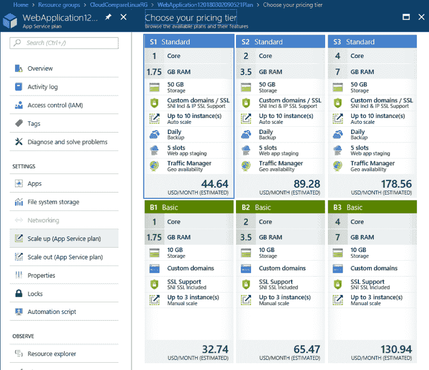
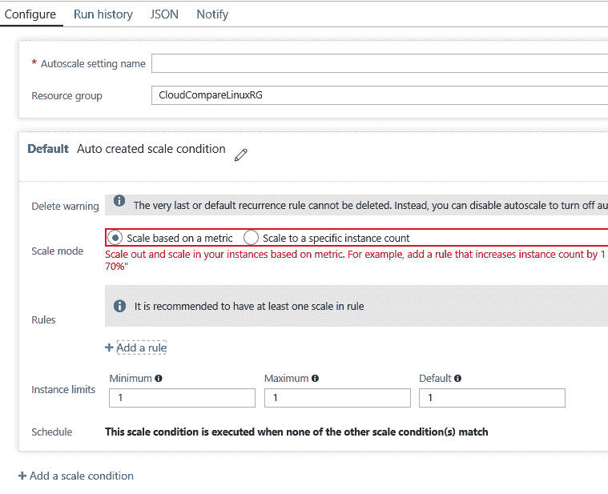
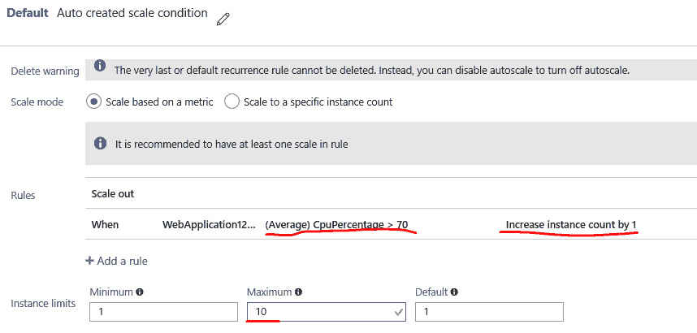
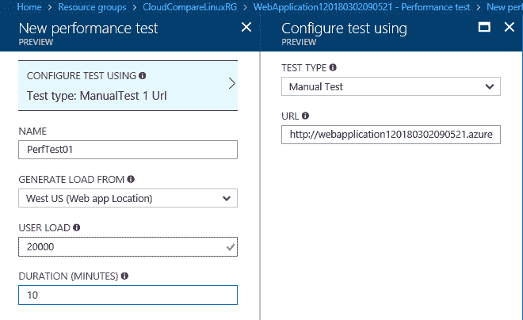
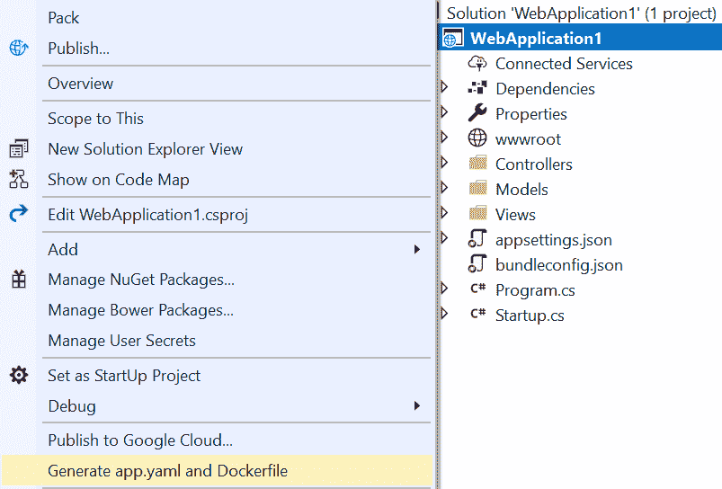
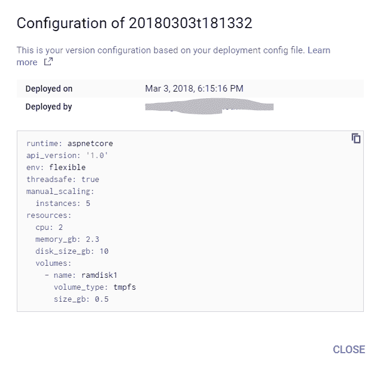

# Azure vs GCP 第 4 部分:Web 应用和应用引擎扩展特性

> 原文：<https://dev.to/kenakamu/azure-vs-gcp-part-4-web-apps-and-app-engine-scaling-features-1g48>

我知道如何将我的 dotnet 核心应用程序部署到 Azure Web Apps 和 GCP 应用程序引擎。缩放怎么样？作为一名开发人员，我为什么要关心这些事情？因为我想用云平台的原因之一就是利用它的特性:)

# 为什么缩放很重要

将应用程序部署到单个实例很容易，但是如果您自己管理基础结构，那么向外扩展就很困难。

*   添加服务器
*   管理 IP 地址
*   添加负载平衡
*   管理名称解析
*   通过对版本的完美控制，将应用程序部署到多个服务器上
*   还有更多。

但是我们需要根据请求进行伸缩，以优化资源使用！

虽然两个平台都支持自动/手动缩放，但如何设置它们似乎很不一样。

# Azure Web Apps

Azure 提供与性能相关的设置作为“计划”。

1.首先，选择合适的计划。转到您创建的应用服务计划并选择“向上扩展”，然后它会为您提供可用的计划。

在本例中，我选择了“S1 ”,这为我提供了多达 10 个自动伸缩实例，具有 1 个核心 CPU 和 1.75 GB RAM。
[T3】](https://res.cloudinary.com/practicaldev/image/fetch/s--oDU5VLSW--/c_limit%2Cf_auto%2Cfl_progressive%2Cq_auto%2Cw_880/https://thepracticaldev.s3.amazonaws.com/i/3dt8orys4qeovqpp68uy.PNG)

2.然后转到“横向扩展”菜单。如果使用滑动条选择实例计数，则是手动比例设置。我手动设置了 6 个实例。
[T3】](https://res.cloudinary.com/practicaldev/image/fetch/s--t5rzVmCj--/c_limit%2Cf_auto%2Cfl_progressive%2Cq_auto%2Cw_880/https://thepracticaldev.s3.amazonaws.com/i/syghxuaxq95nvk5uz1nx.PNG)

3.要启用自动缩放，请点按“启用自动缩放”并设定设置。同样，如果您指定“缩放到特定实例数”，它将变为手动缩放。因此，我选择“基于一个指标的规模”。单击“添加规则”。
[T3】](https://res.cloudinary.com/practicaldev/image/fetch/s--AtLjYcU3--/c_limit%2Cf_auto%2Cfl_progressive%2Cq_auto%2Cw_880/https://thepracticaldev.s3.amazonaws.com/i/7qsvv1dc5w8q0mygqa70.PNG)

4.然后我指定 CPU 阈值规则并添加。如果需要，您可以添加多个规则。我还将最大实例数设置为 10。
[T3】](https://res.cloudinary.com/practicaldev/image/fetch/s--nUGdU0ur--/c_limit%2Cf_auto%2Cfl_progressive%2Cq_auto%2Cw_880/https://thepracticaldev.s3.amazonaws.com/i/wp081epctz9ulb96273w.PNG)

5.最后，命名规则并保存它。

## 测试一下！

要测试自动缩放，最简单的方法是使用性能测试。

1.转到您想要测试的 Web 应用程序，然后单击“性能测试”。
[T3】](https://res.cloudinary.com/practicaldev/image/fetch/s---VCRgOrw--/c_limit%2Cf_auto%2Cfl_progressive%2Cq_auto%2Cw_880/https://thepracticaldev.s3.amazonaws.com/i/1zdunw5gd05f974f66zj.PNG)

2.单击添加以添加测试。这很简单，所以我不会在这里解释细节，但运行测试足够长的时间，以超过阈值。*这将创建 VSTS 帐户背景。
[T3】](https://res.cloudinary.com/practicaldev/image/fetch/s--_KVeOdGS--/c_limit%2Cf_auto%2Cfl_progressive%2Cq_auto%2Cw_880/https://thepracticaldev.s3.amazonaws.com/i/yltwltevfzlaw36adwpt.PNG)

3.创建测试后，选择创建的测试，这将导航到测试页面。测试真正开始需要几分钟。测试开始后，检查实际分配了多少实例。

然而，默认的模板应用程序并不像我预期的那样工作得很好。这么多失败的访问，但实际上没有自动伸缩，因为 CPU 使用率没有超过阈值。在这种情况下，手动缩放可能有意义。

# GCP App 引擎

据我所知，改变它的唯一方法是通过 app.yaml。如果有人知道如何通过 UI 做到这一点，请让我知道。

1.在您的 dotnet 核心项目中，右键单击 solution，然后单击“生成 app.yaml 和 Dockerfile”。
[T3】](https://res.cloudinary.com/practicaldev/image/fetch/s--7i5lNPoJ--/c_limit%2Cf_auto%2Cfl_progressive%2Cq_auto%2Cw_880/https://thepracticaldev.s3.amazonaws.com/i/g1r047pv1612e79vyitk.PNG)

2.对于自动缩放，添加自动缩放部分。更多详情见[此处](https://cloud.google.com/appengine/docs/flexible/dotnet/configuring-your-app-with-app-yaml#services)。顺便说一句，每个都有默认值，所以如果默认值有效，你就不必设置它来启用自动缩放。

```
automatic_scaling:
  min_num_instances: 1
  max_num_instances: 15
  cool_down_period_sec: 180
  cpu_utilization:
    target_utilization: 0.6 
```

Enter fullscreen mode Exit fullscreen mode

*   最小实例数:必须大于等于 1，默认值为 2
*   最大实例数:默认值为 20
*   cool_down_period_sec:必须大于等于 60 秒。默认值为 120。
*   target_utilization:目标 CPU 利用率。默认值为 0.5。

如果手动缩放，请使用 manual_scaling 部分。

```
manual_scaling:
  instances: 5 
```

Enter fullscreen mode Exit fullscreen mode

3.对于实例资源设置，请在资源部分中指定。更多详情见[此处](https://cloud.google.com/appengine/docs/flexible/dotnet/configuring-your-app-with-app-yaml#resource-settings)。

```
resources:
  cpu: 2
  memory_gb: 2.3
  disk_size_gb: 10
  volumes:
  - name: ramdisk1
    volume_type: tmpfs
    size_gb: 0.5 
```

Enter fullscreen mode Exit fullscreen mode

4.一切就绪后，发布到 Google Cloud。在本例中，为了说明这一点，我使用上面指定的资源将手动缩放设置为 5 个实例。部署完成后，转到应用引擎|版本。点击“查看”进行配置。

[T2】](https://res.cloudinary.com/practicaldev/image/fetch/s--SMVq0ISw--/c_limit%2Cf_auto%2Cfl_progressive%2Cq_auto%2Cw_880/https://thepracticaldev.s3.amazonaws.com/i/nwigtdm9u1mxu66hrpda.PNG)

5.您可以看到配置信息。
[T3】](https://res.cloudinary.com/practicaldev/image/fetch/s--XYIADLhR--/c_limit%2Cf_auto%2Cfl_progressive%2Cq_auto%2Cw_880/https://thepracticaldev.s3.amazonaws.com/i/dehez4suozcswhzldf26.PNG)

6.转到实例以查看每个实例信息。我不知道原因，但只有四个实例，而不是五个。也许以后会出现？
[T3】](https://res.cloudinary.com/practicaldev/image/fetch/s--eh88dcg4--/c_limit%2Cf_auto%2Cfl_progressive%2Cq_auto%2Cw_880/https://thepracticaldev.s3.amazonaws.com/i/o1g3q9xljvv99qll3vlh.PNG)

# 总结

这两个平台都提供了手动和自动扩展功能，以及各种资源。这是我发现的。

*   Azure 提供了出色的用户界面体验和易于理解的计划。
*   GCP 提供具有更精细控制的版本嵌入配置。

# 参考文献

[使用谷歌应用引擎](https://www.youtube.com/watch?v=HN5JKvvKUgQ)
[开发可自动扩展的应用程序在 Visual Studio Team Services 中进行云加载测试](https://www.youtube.com/watch?v=tX-QvDWEl74)

肯恩(男名)