# Azure vs GCP 第 7 部分:NoSQL 数据库(Azure)

> 原文：<https://dev.to/kenakamu/azure-vs-gcp-part-7-nosql-database-azure-17d>

在[第 5 部分](https://dev.to/kenakamu/azure-vs-gcp-part-5-storage-options-4k8p)和[第 6 部分](https://dev.to/kenakamu/azure-vs-gcp-part-6-storage-gcp-4f50/)中，我比较了 Azure 和 GCP 的存储，我在那里存储了 blob 对象。我在本文和下一篇文章中比较了 NoSQL 数据库服务。

# Azure 数据库

Azure 提供了很多数据库服务，如 SQL、NoSQL、缓存等。完整列表见 [Azure 数据库列表](https://azure.microsoft.com/en-us/services/#databases)。

### SQL 数据库

可以用 Azure SQL，和微软 SQL Server 很像但是云版本，MySQL 和 PostgreSQL。如果您对 RDBMS 感兴趣，请查看这些服务。

### NoSQL

Azure Cosmos DB 是 NoSQL 服务的 Azure 版本。这是我对这篇文章的看法。哦，你想知道文档 DB 会发生什么？那就是现在的 Cosmos DB:)

### 其他

Azure 还提供 Redis 缓存、表存储或仓库类型的数据库。

在本文中，我研究了 Azure Cosmos DB。

# 天蓝色宇宙 DB

有关 Cosmos DB 的详细信息，请参考[本文档](https://docs.microsoft.com/en-us/azure/cosmos-db/introduction)，但简单来说，它是:

*   全球规模
*   多数据模型/api
*   永远在线
*   高性能的
*   低成本解决方案等。

听起来不错。

### 多个数据模型

关于 Cosmos DB，有一点有点令人困惑，那就是多数据模型支持。作为一名开发人员，我将“Cosmos DB”视为一个品牌，其中有多种产品，从 SLA、成本、性能、可伸缩性方面来看，它们都具有相同的功能。

目前，它支持以下模型和 API。

*   SQL API:这与文档数据库相同。
*   MongoDB API:顾名思义，它是 MongoDB 兼容的。
*   Cassandra API:顾名思义，它是 Cassandra 兼容的。
*   Graph (Gremlin) API:它是开放的 Graph API 基础。
*   表格 API:它与 Azure 表格存储兼容。

我在本文中使用 SQL(文档数据库)。

### SDK

每个 API 都为多种语言和 REST 端点提供了 SDK。因此，如果 SDK 不适用于您的首选语言，您仍然可以调用 REST endpoint。

对于 SQL，。NET，Java，Node.js，Python 和 Xamarin SDK 可用。其他 API 可能支持不同语言集。

# 获取代码

这一次，我从零开始编写代码，而是使用示例代码。

1.进入 [Azure 门户](https://portal.azure.com)，点击“创建资源”。然后搜索“Cosmos DB”

[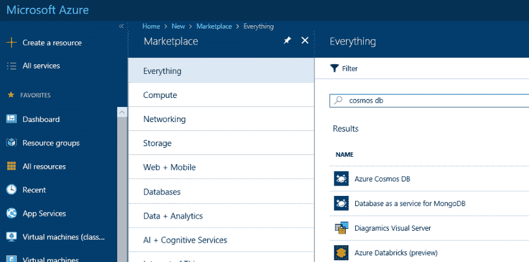T2】](https://res.cloudinary.com/practicaldev/image/fetch/s--n9zPt_UG--/c_limit%2Cf_auto%2Cfl_progressive%2Cq_auto%2Cw_880/https://thepracticaldev.s3.amazonaws.com/i/qsmkp5s4cyx7178b6m7f.PNG)

2.选择 Azure Cosmos DB 并点击“创建”。

3.给出全局唯一的名称并选择“SQL”API。然后创造。如果需要，您可以选择“启用地理冗余”。当然，您也可以将磁贴“钉”在仪表板上。

[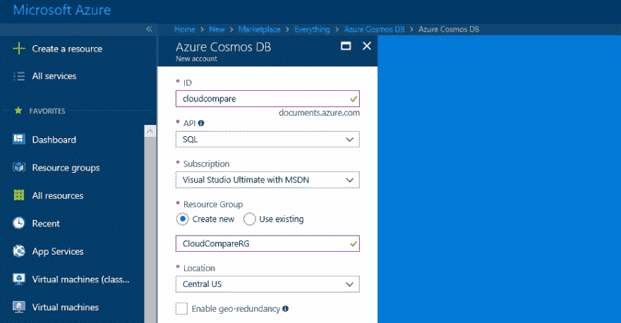T2】](https://res.cloudinary.com/practicaldev/image/fetch/s--Qg40nozA--/c_limit%2Cf_auto%2Cfl_progressive%2Cq_auto%2Cw_880/https://thepracticaldev.s3.amazonaws.com/i/l5apccjuzek0bae25rzq.PNG)

4.创建完成后，选择创建的 Cosmos DB。

[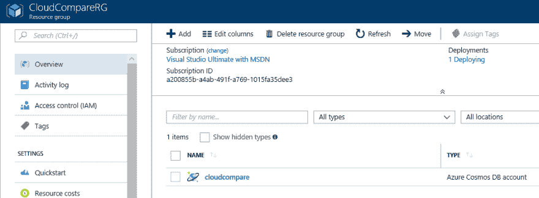T2】](https://res.cloudinary.com/practicaldev/image/fetch/s--mhld3N4a--/c_limit%2Cf_auto%2Cfl_progressive%2Cq_auto%2Cw_880/https://thepracticaldev.s3.amazonaws.com/i/p4xf3lxb6ebwahi33pqo.PNG)

5.从菜单中选择“快速启动”，然后单击“”。NET Core”选项卡。然后点击“创建‘物品’收藏。

[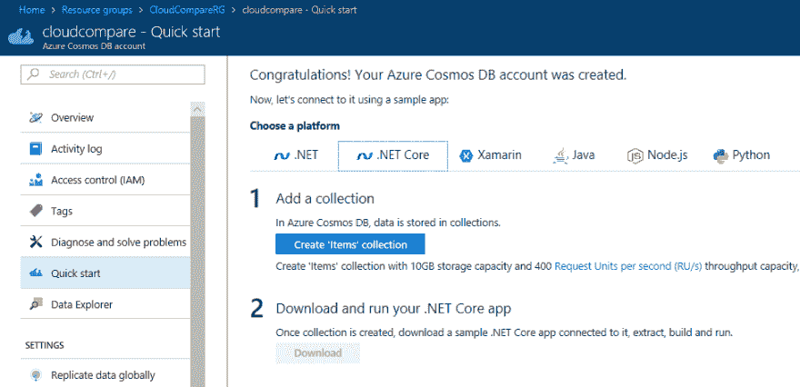T2】](https://res.cloudinary.com/practicaldev/image/fetch/s---1puYO0R--/c_limit%2Cf_auto%2Cfl_progressive%2Cq_auto%2Cw_880/https://thepracticaldev.s3.amazonaws.com/i/bah8xsh2gzv35woxcx2n.PNG)

6.单击“下载”下载示例代码。

[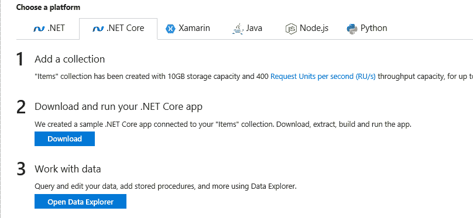T2】](https://res.cloudinary.com/practicaldev/image/fetch/s--Q_nJmU1t--/c_limit%2Cf_auto%2Cfl_progressive%2Cq_auto%2Cw_880/https://thepracticaldev.s3.amazonaws.com/i/vt4oio4xcqrzwsn6mvge.PNG)

7.然后转到“键”并注意 URI 和主键。

[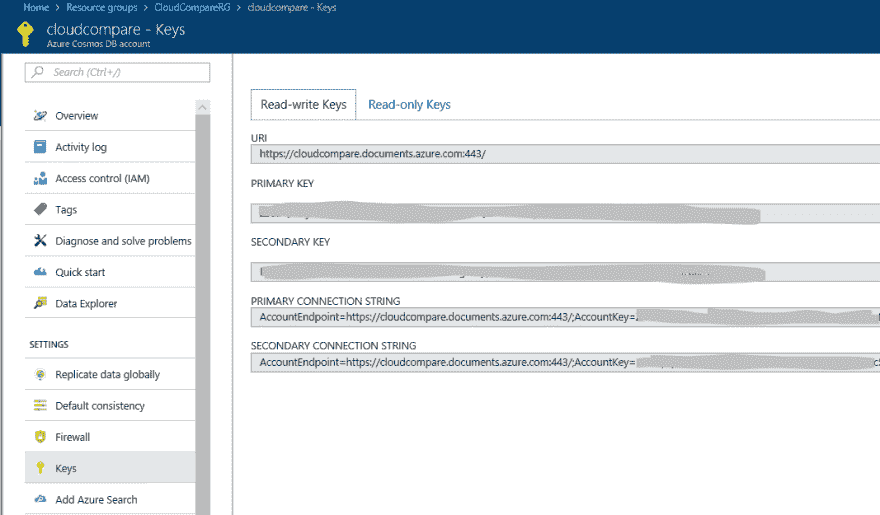T2】](https://res.cloudinary.com/practicaldev/image/fetch/s--83UGqb1E--/c_limit%2Cf_auto%2Cfl_progressive%2Cq_auto%2Cw_880/https://thepracticaldev.s3.amazonaws.com/i/ovzg9qk13vbrhj92vqt1.PNG)

8.下载完成后，解压缩文件并使用 Visual Studio 打开 quickstartcore.sln 解决方案。

9.打开 DocumentDBRepository.cs 并替换 endpoint 和 key，然后按 F5 测试应用程序。不过，你应该把钥匙存放在单独的、安全的地方。

[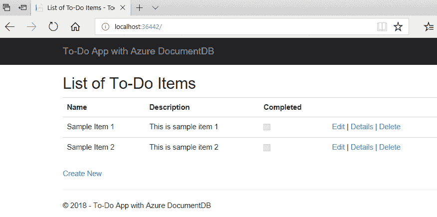T2】](https://res.cloudinary.com/practicaldev/image/fetch/s--4XDNw0Iu--/c_limit%2Cf_auto%2Cfl_progressive%2Cq_auto%2Cw_880/https://thepracticaldev.s3.amazonaws.com/i/cty8tnjp10i8p6zyu45k.PNG)

## 工作原理

与 Cosmos DB 交互的所有代码都存储在 DocumentDBRepository.cs 中。它支持 LINQ 查询，这是我喜欢的。

##### 连接并创建数据库和集合

```
public static void Initialize()
{
    client = new DocumentClient(new Uri(Endpoint), Key);
    CreateDatabaseIfNotExistsAsync().Wait();
    CreateCollectionIfNotExistsAsync().Wait();
} 
```

Enter fullscreen mode Exit fullscreen mode

##### 利用 LINQ 获取物品

```
public static async Task<IEnumerable<T>> GetItemsAsync(Expression<Func<T, bool>> predicate)
{
    IDocumentQuery<T> query = client.CreateDocumentQuery<T>(
        UriFactory.CreateDocumentCollectionUri(DatabaseId, CollectionId),
        new FeedOptions { MaxItemCount = -1 })
        .Where(predicate)
        .AsDocumentQuery();

    List<T> results = new List<T>();
    while (query.HasMoreResults)
    {
        results.AddRange(await query.ExecuteNextAsync<T>());
    }

    return results;
} 
```

Enter fullscreen mode Exit fullscreen mode

# 部署到蔚蓝和 GCP

尝试部署两个平台，它就像 Azure 存储一样工作。

[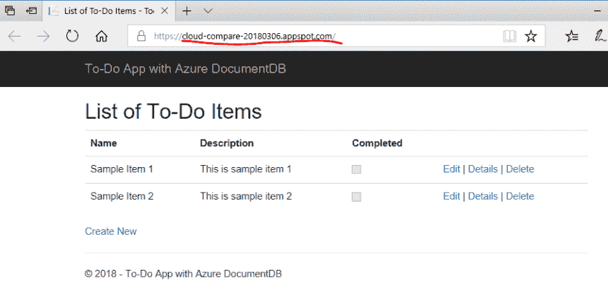T2】](https://res.cloudinary.com/practicaldev/image/fetch/s--k_4YZsYB--/c_limit%2Cf_auto%2Cfl_progressive%2Cq_auto%2Cw_880/https://thepracticaldev.s3.amazonaws.com/i/3cgp2suh4xa060brz5rw.PNG)

# 资源管理器工具

作为一名开发人员，我可能需要从应用程序外部检查数据。有几个资源管理器工具可用。所有的工具都可以通过 Azure 门户访问。

## 数据浏览器

它显示您的数据库和收藏，以及每个项目。您也可以创建、更新和删除项目。

[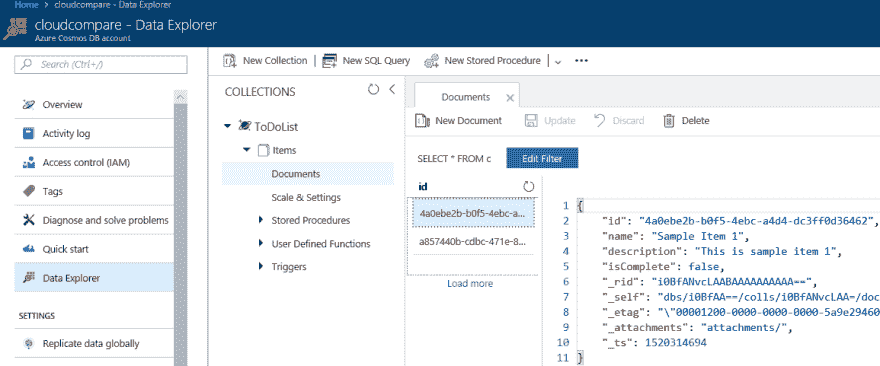T2】](https://res.cloudinary.com/practicaldev/image/fetch/s--cH8nVOPz--/c_limit%2Cf_auto%2Cfl_progressive%2Cq_auto%2Cw_880/https://thepracticaldev.s3.amazonaws.com/i/64ua83a4vlzpc5cwy9t5.PNG)

您也可以运行 SQL 查询。这对我来说太容易了。

[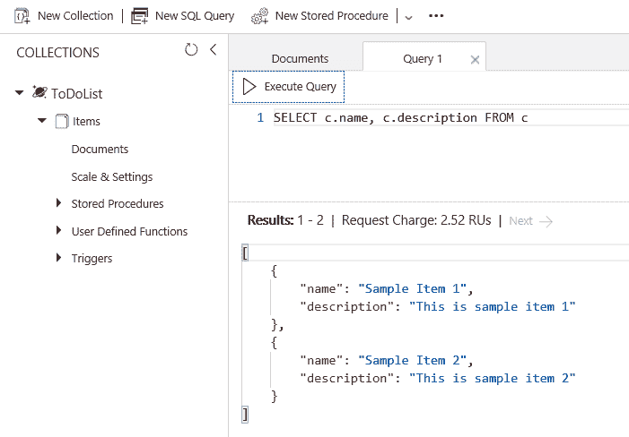T2】](https://res.cloudinary.com/practicaldev/image/fetch/s--aS3tuh1s--/c_limit%2Cf_auto%2Cfl_progressive%2Cq_auto%2Cw_880/https://thepracticaldev.s3.amazonaws.com/i/g427nieeydffrtprfx4i.PNG)

## 其他探险家

我也可以从“收集”的角度看数据。收藏菜单下有几个工具。

[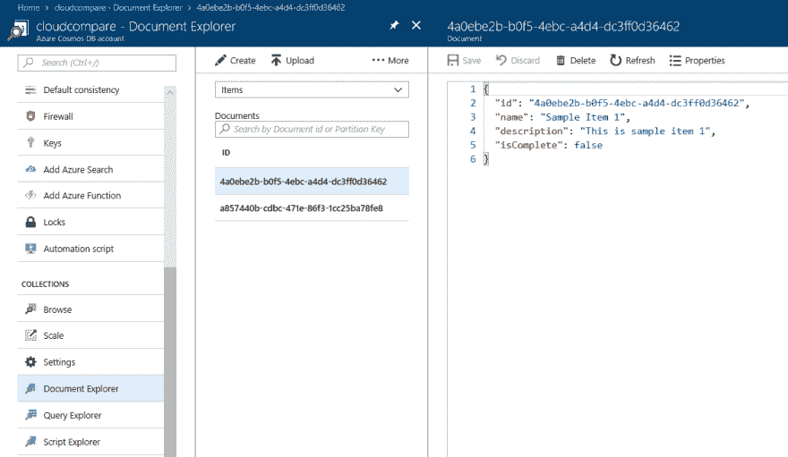T2】](https://res.cloudinary.com/practicaldev/image/fetch/s--6wdw0hKi--/c_limit%2Cf_auto%2Cfl_progressive%2Cq_auto%2Cw_880/https://thepracticaldev.s3.amazonaws.com/i/w3kmunllq8ssjqd67hy0.PNG)

# 总结

我感觉开发体验和 Azure Storage 差不多。门户 GUI 和工具易于理解，足够的文档、SDK 和示例。当我部署到 GCP 时，它也能正常工作，不需要修改任何代码，这很好。

我将在下一篇文章中尝试 GCP 的 NoSQL 解决方案。

# 参考文献

[Azure Cosmos DB:在几分钟内构建全球规模的移动应用](https://azure.microsoft.com/en-us/resources/videos/build-2017-azure-cosmos-db-build-planet-scale-mobile-apps-in-minutes/)
[Azure Cosmos DB，全球分布式应用的设计模式和案例研究](https://www.youtube.com/watch?v=F0wEDdxQER0)

肯恩(男名)