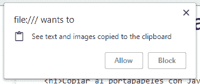
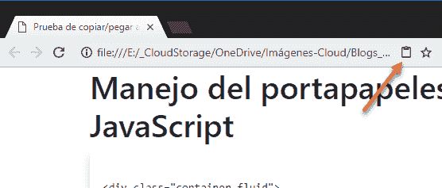
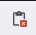
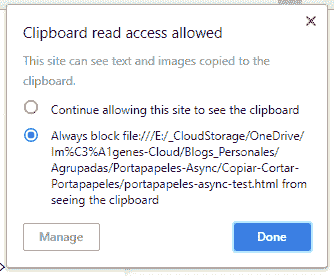

# 使用异步 JavaScript - API 将文本复制到剪贴板

> [https://dev . to/jmalarcon/copy-from-text-al-clipboard-con-JavaScript---API-异步-3ho6](https://dev.to/jmalarcon/copiado-de-texto-al-portapapeles-con-javascript---api-asncrona-3ho6)

在上篇文章[中，他用一种所有浏览器都支持的简单方式与您交谈](https://www.jasoft.org/Blog/post/copiado-de-texto-al-portapapeles-con-javascript-metodo-clasico.aspx)，以便从浏览器中的 JavaScript 代码访问剪贴板。这是一种简单但有点麻烦的实施方法，因为您必须在页面上选择范围才能复制其内容。此外，由于未标准化，浏览器之间的部署略有不同。

采用“经典”方法的另一个重要胶水是同步的。也就是说，执行复制或贴上作业时，浏览器的主要执行绪会被锁住。在正常情况下，这并不重要，因为这是一个非常快速的操作，但如果操作涉及非常广泛的内容，可能会导致页面界面堵塞，从而带来可用性和用户体验。

为了解决所有这些问题，W3C 创建了**【异步剪贴板 API】**，这一点和写这一点的时间还处于草案阶段，但非常稳定。此 API **统一了权限模型**，使所有浏览器平等实现，此外**是异步的**，因此在使用时不会锁定页面。对于异步部分，我们可以同时使用 ECMAScript 2017 年版的**承诺**和**异步/await**API。

> 撰写本文时，此 API 仅受 Google Chrome 支持，但预计不久其他浏览器也将支持。如您所见，在不支持的情况下，可以轻松添加检查并使用最早的方法，以便我们的应用程序能够适应未来，同时支持当前和过去。

让我们看看它是如何工作的。

## 剪贴板对象

此对象是对象`navigator`的新属性，因此我们只需键入:
即可访问它

```
if (!navigator.clipboard) { alert('¡Tu navegador no soporta la API Asíncrona del Portapapeles!')} 
```

Enter fullscreen mode Exit fullscreen mode

例如，我们会检查 API 是否受目前浏览器支援。

此对象有两种读取方法和两种写入剪贴板的方法。让我们看看它们是如何使用的。

## 用异步 API 写入剪贴板

将平面文本写入剪贴板的最简单方法是使用上一个对象的“`writeText`”方法。它的使用非常简单，因为我们只需调用它并异步管理调用结果**。**

 **为此，我们有两种基本方法。一是使用承诺。解释承诺不是本文的主题，所以我指的是[MDN](https://developer.mozilla.org/en-US/docs/Web/JavaScript/Guide/Using_promises)(或我们奇妙的[**【JavaScript 课程和高级校园脚本 MVP】**](https://www.campusmvp.es/catalogo/Product-Programaci%C3%B3n-avanzada-con-JavaScript-y-ECMAScript_206.aspx)如果你需要了解它们。

以诺言书写就是做这样的事情:

```
navigator.clipboard.writeText(contenidoACopiar).then(function() { exito(); mostrarAlerta(); }); 
```

Enter fullscreen mode Exit fullscreen mode

也就是说，从产生的承诺中调用函数和方法`then`来处理它工作时你想做的事情(在这种情况下显示警告消息)。

> 你也可以用`catch()`处理一个可能的故障，当然。

如果您更喜欢使用异步，那么支持此剪贴板 API 的所有浏览器也应该支持异步，那么就更简单、更直接了当:

```
await navigator.clipboard.writeText(contenidoACopiar)exito();mostrarAlerta(); 
```

Enter fullscreen mode Exit fullscreen mode

显然，包含此代码片段的功能必须标有“`async`”才能运行。这样可以更清楚地看到所有内容，并且在调用`writeText`时停止执行。为了控制可能的错误，我们将使用常规的、常见的结构化管理方法，其中包括“`try-catch`”。

这种方法很容易将文本复制到剪贴板。

> 不需要任何特殊权限，因为虽然根据标准有特定权限，Chrome 并不要求您这样做，它总是允许您将“**”复制到活动选项卡“**”上的剪贴板中。我们会看到，从剪贴板看，情况正在改变。

除了我们刚才看到的方法`DataTransfer`之外，还有一个更通用的方法叫做`write`，它允许您使用与[拖动 API 相同的对象将任何内容(例如相同内容的文本和 HTML 版本)一般写入剪贴板](https://www.campusmvp.es/catalogo/Product-Especialista-en-programaci%C3%B3n-Web-con-HTML5,-CSS3,-JavaScript-y-jQuery_235.aspx)

我不会详细介绍它的用途，但这个例子说明它也不是很复杂:

```
var data = new DataTransfer();data.items.add("Hola <b>amiguetes</b>", "text/html");data.items.add("Hola amiguetes", "text/plain");await navigator.clipboard.write(data); 
```

Enter fullscreen mode Exit fullscreen mode

这是创建数据传输对象、用格式填充该对象并调用该方法。它相当直截了当，尤其是用`async`写成的版本。

## 从剪贴板读取

从剪贴板中读取(相当于从剪贴板“粘贴”)的过程与上一个过程相同，只是使用了`read()`和`readText()`方法来读取所有存在的格式或仅读取可能的文本。这两种方法的工作方式相同，只是它们不采用任何参数，而是分别通过调用对象`DataTransfer`或剪贴板中的文本来接收。

例如，有了承诺，我们会做:

```
navigator.clipboard.readText().then(function(contenido) { zonaDondePegar.innerText = contenido;}).catch(function(ex) { excepcion(); mostrarAlerta();}); 
```

Enter fullscreen mode Exit fullscreen mode

以此为例，我们收到剪贴板内容作为*回调*函数的参数，用于`then`方法的承诺。我们也用`catch`方法捕捉可能出现的错误，因为在没有许可的情况下很容易发生错误(关于这一点马上就有更多的说明)。

以`async`开头的版本会比较简单:

```
try { var contenido = await navigator.clipboard.readText(); zonaDondePegar.innerText = contenido;}catch(ex) { excepcion(); mostrarAlerta();} 
```

Enter fullscreen mode Exit fullscreen mode

因为它被视为一般线性码。

“粘贴”最有趣的部分是，现在我们需要页面用户的许可，否则我们可能会在不知情的情况下窃取剪贴板上的信息，这会带来可怕的隐私和安全后果。

所以当我们尝试使用上述代码时，我们会得到这样的信息:

[T2】](https://res.cloudinary.com/practicaldev/image/fetch/s--LiqqbIud--/c_limit%2Cf_auto%2Cfl_progressive%2Cq_auto%2Cw_880/https://www.jasoft.org/Blog/image.axd%3Fpicture%3D/2018/API-Portapapeles-Permisos.png)

在这种情况下，由于它是直接从磁盘中使用的，因此该 URL 会很快退出(“T0”)，但在正常情况下，它会退出当前域。

> 顺便说一句，虽然它会从文件系统和 localhost 起作用，但如果你把它放在互联网上的服务器上，就像大多数 html 5 API 一样，**只有在 HTTPS** 下才会起作用。如果您仍然认为“我的域不需要 HTTPS，因为我不处理私有或密钥数据”，请考虑这一点。

## 权限

接受并运行数据读取后，您将在浏览器栏中看到一个文件夹图标，指示我们已授予了对剪贴板的访问权限:

[T2】](https://res.cloudinary.com/practicaldev/image/fetch/s--ichiXKyp--/c_limit%2Cf_auto%2Cfl_progressive%2Cq_auto%2Cw_880/https://www.jasoft.org/Blog/image.axd%3Fpicture%3D/2018/API-Portapapeles-Icono-Permisos.png)

如果访问被阻止，将显示一个类似但带有删除线的图标:

[T2】](https://res.cloudinary.com/practicaldev/image/fetch/s--9NyjEDA1--/c_limit%2Cf_auto%2Cfl_progressive%2Cq_auto%2Cw_880/https://www.jasoft.org/Blog/image.axd%3Fpicture%3D/2018/API-Portapapeles-Icono-Denegado.png)

如果用户单击它，则始终可以更改先前授予的权限:

[T2】](https://res.cloudinary.com/practicaldev/image/fetch/s--1CfYidLN--/c_limit%2Cf_auto%2Cfl_progressive%2Cq_auto%2Cw_880/https://www.jasoft.org/Blog/image.axd%3Fpicture%3D/2018/API-Portapapeles-Permisos-Revocar.png)

因此，我们有一个与浏览器中其他 API 一致的权限模型，而不是您希望每个 API 实现的任何内容。我们还会授予您控制权，以便您可以随时决定是否授予相应权限。

有一个浏览器 API(可通过对象“`permissions`”访问)，允许我们在执行特定操作(例如从剪贴板读取信息)之前检查用户的不同权限。对于剪贴板，您可以检查两种权限:

*   剪贴板-读取
*   剪贴板-写入

现在最重要的(只要事情没有改变)是第一个，它允许从剪贴板读取。

我们可以用类似这样的代码来验证:

```
if (navigator.permissions) { var estadoAct = await navigator.permissions.query({ name: 'clipboard-read' }) switch(estadoAct.state) { case "prompt": alert("Permisos sin establecer todavía") break; case "denied": alert("Permiso denegado") break; case "granted": alert("Permiso concedido") break; default: alert("Estado desconocido: " + estadoAct.state) }} 
```

Enter fullscreen mode Exit fullscreen mode

所做的是读取许可的当前状态`clipboard-read`。在接收到的对象中，我们查询属性`state`，该属性返回一个字符串，其中包含该权限的三个可能值:

*   **提示**:意思是尚未向用户请求许可，即未明确定义。
*   **拒绝**:即被问及用户，而用户明确拒绝**。**
***   **授予**:即被问及用户，而用户明确授予**。****

 ****这样，我们就可以知道我们是否已经拥有许可证，并在必要时询问是否拥有许可证，但由于浏览器本身是第一次尝试这样做，因此在大多数情况下并不需要这样做。是的，如果我们事先知道它被拒绝了，我们现在可以禁用我们所拥有的按钮，以便从剪贴板中读取。

## 总之

我们已经看到了处理剪贴板内容的未来 API。它是标准的、异步的，具有一致的权限模型，因此将是实现这些功能的首选方法，而不是传统的方法。

我给你留下了一个相当于前一篇文章的完整的例子 (ZIP，2.24KB)，这样你就可以下载它和它一起玩了:

[T2】](https://res.cloudinary.com/practicaldev/image/fetch/s--qfSbykIf--/c_limit%2Cf_auto%2Cfl_progressive%2Cq_66%2Cw_880/https://jmalarcon.blob.core.windows.net/blog/imgs/Varias/Ejemplo-Copiado-Pegado-JavaScript.gif)

看看代码:你有注释版本用“`async`”这样你就可以测试它们了。以`Promise`评论版本，并讨论其他版本进行测试。如果你把它放在网上，你必须用 HTTPS。

目前，该 API 仅由 Chrome 实现，但在接下来的几个月里，我希望其他人已经实现了。与此同时，我们可以让它们很容易地共存。

直到结果出来！******