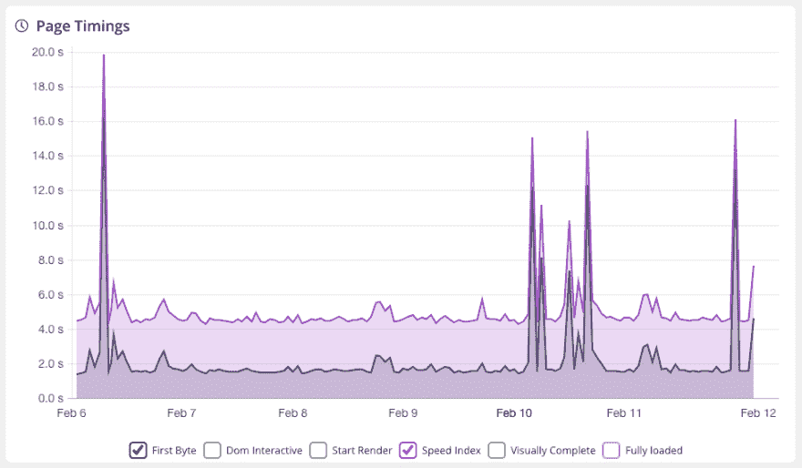
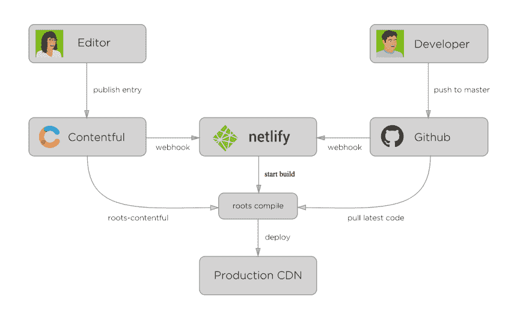
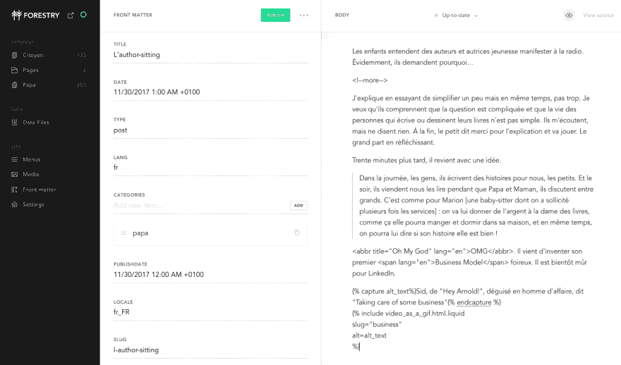
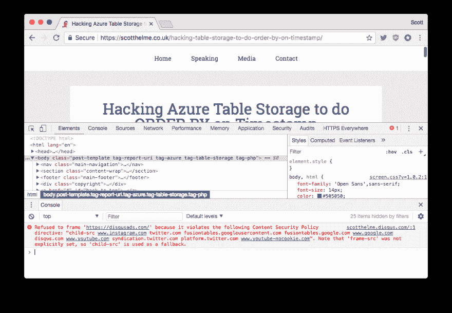

# 用 JAMStack 回到静态:实现更好的 UX 和 web 性能的范式转变

> 原文：<https://dev.to/borisschapira/back-to-static-a-paradigm-shift-for-better-ux-and-web-performance-4ljc>

几年来，web 技术领域出现了一系列新的解决方案。静态站点生成器、无头 CMS、内容基础设施...这些解决方案促成了一种全球趋势。“静态趋势”、“JAMStack”，有好几个名字，但没有一个真正涵盖了 web 应用程序架构的全新提议，以及某种程度上对 Web 根源的回归。

## 我们从哪里来？

当用户试图访问网页时，他们的浏览器会向托管该网页的服务器发出请求。要么服务器立即响应存储的页面，要么服务器通过按需执行代码来生成页面。

虽然 Web 被认为是静态文件的结合，但是服务器端编程语言很早就出现了，并且现在被广泛使用。[据 W3Techs](https://w3techs.com/technologies/overview/programming_language/all) 报道，使用服务器端语言的服务器中，80%以上都在运行 PHP。提供没有动态语言支持的服务器的主机提供商几乎不存在。

然而，动态生成 HTTP 响应在 web 性能方面有很大的缺点。动态网页通常是围绕加载执行语言的 web 服务器构建的，该执行语言分析 HTTP 请求，通常请求数据库(有时位于数据中心的另一个服务器上)和第三方服务，填充逻辑模型，该逻辑模型通过模板的集合显示自身以生成 HTML 响应。从逻辑上来说，[到第一个字节](https://www.dareboost.com/en/glossary#ttfb) (TTFB)的时间更长。

<figure>

[T2】](https://res.cloudinary.com/practicaldev/image/fetch/s--XedwejTk--/c_limit%2Cf_auto%2Cfl_progressive%2Cq_auto%2Cw_880/https://thepracticaldev.s3.amazonaws.com/i/4ekc2b7lft2kzqxebs43.png)

<figcaption>A high TTFB penalizes the Speed Index of a page.</figcaption>

</figure>

为了优化服务器响应时间，多年来出现了许多缓存解决方案。第一个请求页面的用户需要支付生成费用，但结果会存储在一个或多个代理服务器上，有时会在世界各地的不同位置进行同步。然后，这些缓存的页面会对所有类似的请求做出响应，从而确保快速一致的交付。如今，可以找到软件缓存解决方案(如 [Varnish](https://varnish-cache.org/) )、平台和基础设施(内容交付网络)。所有这些都确保了动态可以再次变成静态。江山易改，本性难移。

## 然而，使用静态内容还有其他优点。

如果您想要交付您的静态页面，您必须预先编译它们。这个事实，尽管看起来微不足道，却改变了一切。事实上，编译被证明是静态的主要优势:将复杂性从生产环境转移到集成过程。

如果您的页面是由 web 服务器提供的，而不是首先生成的，那么您就不需要执行服务器端语言。因此，许多攻击媒介消失了。如果你既没有数据库，也没有服务器端的执行语言，就无法通过注入恶意代码来窃取机密数据。

不在服务器上执行代码也意味着每个 HTTP 响应的 CPU 消耗非常低，从而为您提供了更好的可伸缩性。但是要注意:正如我们将看到的，部署是一个关键因素，会消耗 CPU 时间。弹性是另一个优势。在最坏的情况下，错误可能在生成过程中发生，但可以在部署之前检测出来。例如，由糟糕的贡献导致的技术问题不再影响访问者浏览的网站。最糟糕的情况是，网站没有崩溃。它的内容根本不是最新的。

然而，这些优势只是冰山一角。静态趋势允许你完全改变一个站点的发布方式。难怪[粉碎杂志已经迁移了](https://www.smashingmagazine.com/2017/03/a-little-surprise-is-waiting-for-you-here/)！

## 静态是一种分布形态。它的技术栈是什么？

静态站点生成器(SSG)是一种在本地执行的软件，或者作为一种服务，使用一些模型和配置数据源以及包含业务逻辑的模板来生成(有时部署)静态网站。

SSG 市场正在蓬勃发展，每月有两次新产品上市。他们中的大多数从一组文件中生成一个网站，通常使用轻量级语法编写，如 [Markdown](https://daringfireball.net/projects/markdown/) 或 Asciidoc。将转换为 HTML 的责任分配给了负责逻辑的模板引擎(Liquid、Go Template、Nunjucks)和负责将标记转换为 HTML 的转换器( [kramdown](https://kramdown.gettalong.org/) 、 [commonmark](http://commonmark.org/) 、 [blackfriday](https://github.com/russross/blackfriday) 、[asciidor](http://asciidoctor.org/)……)。SSG 只不过是这一代网站的技术指挥者，因此，主要是知道如何运作的前端开发人员的游乐场。

事实上，SSG 是技术工具，而不是内容管理系统的替代品。然而，当你跟随外部数据源的线索时，它们变得非常有趣，因为那时，我们可以谈论不用于呈现 HTML，而仅用于存储和公开数据的 CMS。他们被称为无头 CMS。

无头 CMS 包括:

> 一种存储数据的方式
> 一个 CRUD UI
> 一个对数据的 API
> <cite>[什么是无头 CMS？](https://css-tricks.com/what-is-a-headless-cms/)、克里斯·科伊尔</cite>

它们通常可以通过使用您的常用系统获得。例如，Wordpress 有一个 [REST API](http://v2.wp-api.org/) 。Drupal 有一整个 T2 工作组在研究 Headless。然而，在这里，随着[软件和服务](https://www.headlesscms.org/)的出现，市场正在蓬勃发展。

我们究竟为什么要把贡献环境和生成工具分开呢？因为关注点的分离。

开发团队从维护数据库的负担中解放出来，可以专注于平台的技术发展和资产管道，而贡献团队可以细化其内容。

贡献者可以处理易于存储和修改的平面文件。他们与开发人员唯一的共同语言是每个文件中传递的元数据，通常用[开头的](https://jekyllrb.com/docs/frontmatter/)来编写。他们可以使用自己选择的编辑工具或服务，甚至是确保协作的工具。每当他们想查阅文件的历史，合并几个版本或分支编写他们不想立即发布的内容时，他们也可以从源代码版本化中受益。

<figure>

[T2】](https://res.cloudinary.com/practicaldev/image/fetch/s--i3C5Phwh--/c_limit%2Cf_auto%2Cfl_progressive%2Cq_auto%2Cw_880/https://thepracticaldev.s3.amazonaws.com/i/8d57myypciue65s303z2.png)

<figcaption>Carrot (a digital agency) static CMS workflow, as described [on their blog](https://carrot.is/coding/static_cms.html)</figcaption>

</figure>

在内容贡献之后，网站的生成和部署通常由基础设施的相同组件来操作。为了监控这一步的性能，您需要评估编译服务器在生成和部署期间的性能(持续时间、CPU 消耗、内存)。但这还不是全部:记住还要监视目标基础设施(由一台或多台服务器组成)，因为复制任务可能要求很高。

这意味着我们不再处于一个以同时访问人数作为可伸缩性主要衡量标准的系统中。DevOps 必须彻底改变他们的思维，创建一个能够适应贡献者所要求的生成和部署频率的系统。

这里又出现了[演员](https://www.thenewdynamic.org/tools/hosting-deployment/)。事实上，最著名也可能是最有效的可能是 Netlify。它简洁明了的界面可以帮助你点击几下鼠标就可以连接你的源代码库。然后，Netlify 将动态地为每次提交生成并部署您的网站。

一个无头 CMS、一个 SSG 和一个部署协调器:我们现在有了完整的后端堆栈。然而，我们仍然生成一个没有个性化内容的静态网站。由于用户对动态性或个性化的需求从未如此强烈，我们难道没有犯错误吗？

## 静？没有那么多。

我们已经看到这个静态堆栈产生了一个非常标准化的标记。为了引入动态性和个性化，我们需要导入数据——通过 API 交付——并在客户端处理它——因此依赖于 Javascript。

这个新的" **J** avaScript +松散耦合的 **A** PI + **M** arkup "堆栈有一个名字:JAMStack 和几个主角，每个主角都有一组特定的服务: [Stripe](https://stripe.com/) 用于支付， [Algolia](https://www.algolia.com/) 用于即时搜索， [Disqus](https://disqus.com/) 或 [IntenseDebate](https://www.intensedebate.com/) 用于评论，[snipart](https://snipcart.com/) forms spree 或[static man](https://staticman.net/)for forms……注意，并非所有这些产品都是为 JAMStack 设计的:您可以从服务器端完美地使用 Algolia 超快的 API。

JAMStack 是一个真正的范式转变。提供给访问者的网站比以往任何时候都更像是一个外壳，其中动态地注入了服务，无论是自托管的还是第三方的。甚至有可能依赖几个服务来实现相同的目的，如果主服务不可用，就切换到后备服务。

既然你把很多精力转移到了前端，为什么不更进一步，用 Vue、Angular 或 React 这样的单页面应用(SPA)框架来构建你的网站，或者把它改造成一个完整的渐进式 Web 应用(PWA)，设计成“离线优先”？这并不是 JAMStack 所固有的，而是由开发范式的变化促成的。

然而，对于用户来说，差别很小。试着在这个网站上搜索一个产品[。你是否体验到了与 PHP 网站不同的东西？](https://community.algolia.com/instantsearch.js/v2/examples/e-commerce/)

对于贡献者来说，范式转变改变了一切，因为它将贡献平台与网站托管平台分离开来。他们中的一些人会更喜欢使用具有写作辅助功能的软件(修改、建议、文档投稿)。其他人会对可定制的在线贡献平台感到满意。假设内容的存储独立于解决方案，他们每个人都可以使用自己喜欢的工具，而不会干扰其他人。

<figure>

[T2】](https://res.cloudinary.com/practicaldev/image/fetch/s---iBeZZ86--/c_limit%2Cf_auto%2Cfl_progressive%2Cq_auto%2Cw_880/https://thepracticaldev.s3.amazonaws.com/i/5rx5748vfwjnesgffelm.png)

<figcaption>[Forestry.io](https://forestry.io/) editing interface. The edited contents are saved in the files of a git repository and can also be edited with a text editor.</figcaption>

</figure>

但有些产品走得更远，将贡献转化为一流的体验。投稿人可以利用定制的解决方案，利用丰富的多媒体投稿选项，而不会对出版流程或目标网站的性能产生任何影响。

<figure>

[T2】](https://res.cloudinary.com/practicaldev/image/fetch/s--z0oNgdgm--/c_limit%2Cf_auto%2Cfl_progressive%2Cq_66%2Cw_880/https://thepracticaldev.s3.amazonaws.com/i/eihmmkndfhehe8y10xj1.gif)

<figcaption>[Prismic.io](https://prismic.io/) is one of the most customizable Content Platform (here, reusable slices). Contents or layouts, everything is contributed on the platform. During the build, the SSG requests the Prismic.io API to retrieve the information.</figcaption>

</figure>

## 静态还是动态？托马托，托马托

尽管 JAMStack 方法有许多优势，包括安全性、性能、可扩展性、开发和贡献体验，但它也意味着新的风险，忽视这些风险是危险的。

第一个风险是迷失在过多的无头 CMS、生成器和服务平台中。请花时间评估您的需求，因为每个解决方案都有其优点和缺点。例如，Jekyll 是一个众所周知的 SSG，用 Ruby 开发，有很好的文档记录，但是相当慢。[雨果](https://gohugo.io/)，另一方面，是一个快得多的 SSG，但也更复杂的处理，如果你是一个新手。如果不高频发布内容，对于一个等效的结果，生成时间有那么重要吗？

也请注意所选服务的使用条款。在 Dareboost，我们经常警告用户不要滥用第三方脚本。如果需要评论，使用 Disqus，你同意动态注入他们的广告吗？如果你已经遵循了我们关于内容安全政策的建议，希望你不会担心这个问题。

> Scott Helme@ Scott _ HelmeDisqus 开始在使用他们评论系统的页面中注入广告，比如我的博客。他们的问题是我的 CSP 不允许他们的广告被收录😎2018 年 2 月 08 日下午 14:48

另一个风险但并非最不重要:即使你的网站不容易出现安全问题，它仍然可以通过它所依赖的 API 受到攻击。你绝对需要确保你使用的脚本没有被篡改，并且通过 HTTPS 与第三方服务的每一次交换都是安全的。确保您的自托管 API 符合所有安全最佳实践，并毫不犹豫地审查您所依赖的第三方服务的 SLA。

最后，还必须根据支持这些 API 的组织的可持续性来仔细选择这些 API。如果你将关键功能的责任转移给第三方服务，你最好确保他们会坚持并保持恒定的质量水平。一个好的方法是[监控用户旅程](https://www.dareboost.com/en/tool/user-journey-monitoring)，它能够模拟与你的网站的功能交互。

## 新的机会之地

一旦你完全掌握了具体的风险，并制定了适当的工作流程，JAMStack 仍然提供了它的机会。从 Headless CMS 或 SSG 解决方案迁移到另一个的成本通常很低。您可以轻松地从文件的本地贡献切换到内容基础架构，如 Netlify CMS、Forestry、Contentful 或 Prismic，这使您可以快速评估最适合您需求的解决方案。创建一个静态站点需要时间，并且需要一个包含多个解决方案的架构。今天，它可能看起来很复杂，但请记住你的第一个动态站点:选择一个主机，掌握 FTP，篡改 web 服务器日志...这一切都不容易。你会一步一步学习这个逻辑。对于有经验的 JAMStack 用户来说，这很自然。

像 Netlify 这样的统一平台虽然存在集中化的风险，但仍然提供了令人印象深刻的服务目录:网站生成和部署、DNS 注册、SSL 证书和表单管理、无服务器功能、内容交付网络…

足够的开箱即用功能，让您的前端团队专注于前端开发和 web 性能优化。由于首字节时间如此之短，团队可以通过测量[速度指数](https://blog.dareboost.com/en/2018/02/speed-index-web-performance/)完全专注于 UX！

* * *

*感谢艾琳·西蒙斯、[弗兰克·塔兰迪尔](https://twitter.com/dirtyf)和整个 [jamstatic.fr 社区](https://jamstatic.fr/)、[巴德·帕尔](https://twitter.com/budparr)、[尼古拉斯·霍夫曼](https://twitter.com/Nico3333fr)和我的同事[菲利普·吉尔博特](https://twitter.com/GuilbertPhil)和[达米恩·朱博](https://twitter.com/DamienJubeau)的时间和建议。*

* * *

## 附加资源

*   “[为什么静态发电机是下一件大事](https://www.smashingmagazine.com/2015/11/modern-static-website-generators-next-big-thing/)”，Matt Biilmann
*   “不要把 Contentful 的内容基础设施称为‘CMS’”，Michelle Gienow

* * *

如果你喜欢这个帖子，请随意给我你的心或者骑独角兽！你也可以👏它在介质上[。](https://medium.com/@borisschapira/back-to-static-a-paradigm-shift-for-better-ux-and-web-performance-56f4199d74ff)