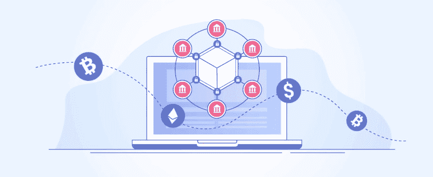

# 银行技术趋势

> 原文：<https://dev.to/galyna_chekan/banking-technology-trends-24m4>

变化是今天唯一不变的。我们在过去几年中观察到，通过实施各种[数字化转型战略](https://perfectial.com/blog/digital-transformation-strategy/)，客户关系和体验被每个人都在谈论的颠覆性技术改变，行业正在发生动摇和重塑。在银行业，我们正在见证另一场支付革命。中国正自信地走向无现金社会。如今，支付宝和微信支付已经成为中国[最受欢迎的两种在线支付方式](https://www.scmp.com/business/companies/article/2130400/china-moves-further-towards-cashless-society-payment-giants)。微信的二维码或快速响应扫描或支付宝在零售点的“微笑支付”支付选项不仅使现金支付成为可能，而且传统的信用卡交易似乎也变得过时了。为了跟上客户的步伐，银行需要注意并掌握最新的技术趋势。下面，我们详细介绍了一些最有前景的银行技术趋势，并试图揭示银行如何充分利用这些趋势。

## 体验 AR/VR 银行新方式

今天，AR 和 VR 似乎处于所有行业客户体验的最前沿，银行业也不例外。

一些银行已经加入了这一趋势。比如阿曼国家银行(National Bank of Oman),它使用 AR 帮助客户找到最近的自动取款机，或者在阿曼的商场或任何街道上购物时找到一些优惠和交易。与此同时，[法国巴黎银行](http://www.bnpparibas.it/en/2017/05/30/bnp-paribas-contributing-to-the-development-of-virtual-reality/)为他们的客户提供虚拟现实体验，允许他们虚拟访问账户活动和交易记录，或在虚拟现实模式下引导用户完成房地产购买的各种复杂步骤。

2019 年，包括增强现实(AR)、虚拟现实(VR)和混合现实(MR)的扩展现实(XR)是银行业最有前景的技术趋势之一。根据今年的调查，45%精通技术的消费者希望他们的银行提供新的交流方式，如可穿戴设备或虚拟现实。与此同时，80 %的受访者认为成为 XR 解决方案的先锋非常重要。

## 艾作为同事

[T2】](https://res.cloudinary.com/practicaldev/image/fetch/s--JUw4bxEj--/c_limit%2Cf_auto%2Cfl_progressive%2Cq_auto%2Cw_880/https://perfectial.com/wp-content/uploads/2018/07/Artificial-intelligence.jpg)

人工智能可能是银行业和其他金融领域最受欢迎的科技趋势。它已经成为头条新闻，并引发了关于其裁员潜力的辩论。事实上，无数公司都对人工智能将取代的员工数量做出了令人震惊的预测。德意志银行首席执行官甚至预测，该行 98，000 名员工中的一半将被机器人取代。

这些预测是否接近现实，只有时间才能证明。但今天，人工智能已经在银行业占据了非常突出的地位。除了聊天机器人和虚拟助理，银行可以使用客户档案和算法排序，根据详细的客户档案提供定制的通信和决策。ML &人工智能软件解决方案也可以简化流程，并在完全了解法规和法律的情况下接受一些决策的委托。

## 设计思维了解顾客需要什么

[T2】](https://res.cloudinary.com/practicaldev/image/fetch/s--3HAcGDVf--/c_limit%2Cf_auto%2Cfl_progressive%2Cq_auto%2Cw_880/https://perfectial.com/wp-content/uploads/2018/07/Design-Thinking.jpg)

银行技术的最新趋势之一是设计思维。随着每年涌现出大量金融科技创业公司，银行业几乎没有选择，只能适应新的创业文化，并开始像创业公司一样思考。这就是设计思维可以发挥作用的地方。

它与美学关系不大，更关注产品如何工作，如何帮助客户并解决他们的问题。设计思维通过将设计原则应用于人们与世界互动的方式来实现其目标。这个过程包括试图理解客户的行为，一种思考和行为的方式(同理心)，以便弄清他们的问题，并看看是否有众多用户的共同问题(定义)。它允许头脑风暴(构思)的完全自由，通过对原型的反馈来查看哪些疯狂的想法可行，哪些不可行(原型)，最后用真人来验证你的假设(测试)。

## 数据的准确性一如既往的有价值

大数据意味着重大责任。业务越是由数据驱动，信息的准确性和完整性就越有价值。它可能会损害公司做出的决策或他们所依赖的洞察力。

对于银行业来说，传统上银行拥有大量关于其客户、合作伙伴和服务的重要机密信息，数据安全尤为重要。这意味着，如果银行希望与客户建立长期、牢固的关系，它们需要一定程度的信任。这种信任可以通过像 GDPR 这样的法规来实现。但为了真正取得成功，赢得客户的信任和尊重，银行必须更进一步，加强网络安全，利用区块链等技术来增强交易银行业务。

## 区块链改变传统银行业务

[T2】](https://res.cloudinary.com/practicaldev/image/fetch/s--aNvnR6YH--/c_limit%2Cf_auto%2Cfl_progressive%2Cq_auto%2Cw_880/https://perfectial.com/wp-content/uploads/2018/07/Blockchain.jpg)

如果没有包括银行业在内的人们谈论最多的技术，这就不是真正的[商业技术趋势](https://perfectial.com/services/blockchain-for-business/)概述。

区块链已经在各个行业激起了创新银行业也不例外。[十个银行高管中有九个表示他们的银行目前正在探索区块链的使用。区块链允许跟踪每一笔交易，并从网络中的任何一点提供准确的信息。当被银行完全采用时，它将允许足够快速和准确的支付处理，同时降低其成本。随着技术的进一步发展和成熟，它有望在未来经济高效地取代银行的遗留系统。](https://www.accenture.com/hu-en/insight-blockchain-technology-how-banks-building-real-time)

今天的银行技术趋势告诉我们，银行需要掌握如何最好地将颠覆性技术应用到他们的战略中，以满足他们精通技术的客户日益增长的需求。最终，赢家将学会领导和适应新技术，输家将无法实现机构的数字化转型。

*想了解更多最新的技术趋势吗？联系我们的专家[获得免费咨询。](https://perfectial.com/about/)T3】*

这个帖子最先出现在软件开发公司 Perfectial 上。