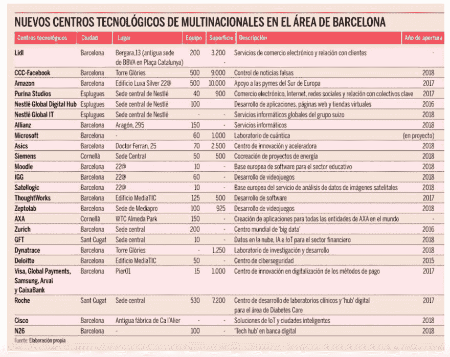

# 巴塞罗纳成为雀巢、Lidl、安联、N26、脸书、Moodle、微软、西门子、Satellogic & Zeptolab 的数字中心

> 原文：<https://dev.to/apium_hub/barcelona-becomes-digital-hub-for-nestl-lidl-allianz-n26-facebook-moodle-microsoft-siemens-satellogic--zeptolab-1mn3>

每周我们都会读到关于初创公司或跨国公司在巴塞罗那开设或迁移数字中心的新闻。为什么？嗯，2017 年，西班牙公司最需要的职业是计算机工程师，也是因为[科技生态系统](https://dev.to/apium_hub/barcelona-tech-ecosystem-map-of-the-main-players-4a8)和领先的[创新场景](https://dev.to/apium_hub/barcelona-makes-it-to-the-top-5-of-innovation-hubs)。另一个原因是质量和成本，巴塞罗那的开发人员水平很高，而工资却低于柏林、伦敦、苏黎世、巴黎、阿姆斯特丹等。当然，还有高质量的生活！

让我们看看这张照片，你会发现一些公司已经或正在巴塞罗那开设他们的数字中心。

[T2】](https://apiumhub.com/wp-content/uploads/2018/07/Screen-Shot-2018-07-03-at-08.49.22.png)

*来源:[qtorb](http://www.qtorb.com/2018/06/barcelona-la-cara-b-de-ser-hub-tecnologico.html)T3】*

印象深刻吧。在这里，我们看到来自美国、澳大利亚、俄罗斯、瑞士、德国等国的非常知名的公司。

## 脸书抵达巴塞罗纳

好吧，让我们从社交媒体巨头脸书说起。500 人将在巴塞罗那工作。脸书决定在巴塞罗纳开设办事处，因为这座城市在数字创新方面发展非常迅速。

## 澳大利亚 Moodle 落户巴塞罗那

澳大利亚公司 Moodle 也在巴塞罗那开设了办事处，创造了 40 个就业机会。事实上，这将是他们第一个在其原籍国以外的办事处。

Moodle 创始人兼首席执行官 Martin Dougiamas 表示:“巴塞罗那是通往欧洲的门户，与许多国际首都相连，在网络社区和软件开发领域也越来越受欢迎。

Moodle 已经在伦敦有一个远程工作的团队，但是随着办公室的开放，将进行软件开发和移动应用，以及个性化服务。

## 阿根廷 Satellogic 登陆巴塞罗那

Satellogic 将其欧洲总部设在巴塞罗那，目标是到 2020 年创造 100 个就业机会。在新闻发布会上，Satellogic 的创始人 Emiliano Kargieman 和 Satellogic 欧洲区负责人 Marco Bressan 解释说，公司选择巴塞罗那是因为他们在这座城市看到了人才和创业生态系统。巴塞罗那办公室的人将致力于创造技术解决方案，将图像转化为数据。

## Lidl 将在巴塞罗那开设一个数字中心来管理电子商务

这家德国经销商将在巴塞罗那市中心设立一个办公室，专门负责欧洲的电子商务和数字业务。Lidl 计划雇佣 250 人。该办公室将有 3200 平方米，将占据这栋大楼 13 层中的 4 层，归阿曼西奥·奥特加所有。根据房地产咨询公司 Forcadell 的声明，“被认为是加泰罗尼亚首府最具象征意义的建筑之一。”

## 微软也选择巴萨

微软正在巴塞罗那开设一个量子实验室中心，将在那里成立一个大约 60 人的团队。量子计算是 IT 领域的下一个技术挑战之一，旨在开发能够在短时间内进行复杂计算的计算机。而这是微软选择巴塞罗那继续创新的好迹象。

## 俄罗斯视频游戏公司 Zeptolab 搬到巴塞罗那的 22@

这家俄罗斯公司已经搬到 22 @区，这是巴塞罗那相对较新的技术领域，也是亚马逊(Amazon)和惠普(Hewlett Packard)等行业巨头的所在地。在那里，该集团租用了 925 平方米的空间。在接受 Kippel01 采访时，22 @ Network 公司和机构协会主席 Xavier Monzó保证，该地区的基础设施和创新生态系统是该地区对技术行业参与者的主要吸引力。

## 雀巢依靠巴塞罗那的最新技术

雀巢公司最近宣布将把它的 it 活动从瑞士转移到巴塞罗那的 Esplugues de Llobregat，在那里它已经有了它的全球数字中心。Nespresso 的子公司也将在西班牙和葡萄牙获得职位，计划在那里创造 80 个就业机会。

## 西门子也在加泰罗尼亚设立了一个中心

西门子将在 Cornellà de Llobregat 建立新的创新中心，开发数字解决方案。西门子将与供应商、软件工程师和行业专家合作，研究如何获得应用于能源的数字技术的最大效益，并提高工厂的效率。

## 安联正在巴塞罗那实施其技术中心

欧洲最大的保险集团安联在巴塞罗那创建了一个技术中心。

安联之所以决定选择巴萨，是因为技术领域训练有素的人。另一个原因是——从其他国家吸引工人的能力，在某些情况下，这意味着成本的降低。

## N26 在巴塞罗那建立了一个技术中心

另一家大型金融科技公司正在巴塞罗那建立一个技术中心。N26 是数字银行领域的全球领导者，总部位于柏林，不久将在柏林开设办事处。这家金融科技公司计划到 2019 年底在巴塞罗那雇佣 100 多名工程师和产品专家。

他们选择巴塞罗那的原因:

*“巴塞罗那将通过吸引更多人才和为高度多元化的劳动力提供更多国际机会，帮助我们*继续发展*成为世界级的全球技术雇主，”N26 首席执行官 Valentin Stalf 说。*

另一个原因是企业家精神:

N26 的西班牙总经理 Francisco Sierra 评论道:“巴塞罗那是 N26 发展最快的城市之一，贴近客户对我们来说非常重要。这座城市与 N26 有着相同的国际化和创业精神，这使得它成为我们在柏林之外的第一个欧洲团队的天然家园。"

巴塞罗那分公司将专注于产品和技术开发。N26 的首席执行官认为，这个数字中心将意味着员工在地理位置方面有更大的灵活性。

N26 的首席执行官 Valentin Stalf 说:“我们的团队是我们成功的关键之一，在巴塞罗那开设新的办事处将使我们作为顶级技术雇主继续发展，并继续吸引最优秀的人才，为他们提供国际机会。

此外，Valentin 表示，巴塞罗那已经巩固了自己作为“欧洲生态系统中最成熟的技术中心之一”的地位，因为移动应用程序占了该市初创公司的 55%。因为 N26 是一家移动银行——对 N26 来说，这是一个完美的地方。巴塞罗那的生活质量很高，到这座城市旅游很方便，有三所顶级商学院，城市里学术水平很高的外籍人士很多。

看起来这并不是结束，我们将会看到更多的公司在巴塞罗那开设他们的数字中心。知道下一个会是谁吗？下面在评论区讨论一下吧。

我希望这篇文章对你有用！如果你对巴塞罗那作为数字中心的最新消息感兴趣，我强烈推荐你订阅我们的每月简讯[这里](http://eepurl.com/cC96MY)。

## 如果您觉得这篇关于巴塞罗那作为数字中心的文章很有趣，您可能会喜欢…

*   [值得阅读的顶级商业博客](https://apiumhub.com/tech-blog-barcelona/top-business-blogs/)
*   [巴塞罗那的科技生态系统](https://dev.to/apium_hub/barcelona-tech-ecosystem-map-of-the-main-players-4a8)
*   [领先的创新中心:巴塞罗那排名第四](https://dev.to/apium_hub/barcelona-makes-it-to-the-top-5-of-innovation-hubs)
*   [以人为中心的创新](https://apiumhub.com/tech-blog-barcelona/human-centered-innovation/)
*   [值得关注的顶级智能城市项目](https://apiumhub.com/tech-blog-barcelona/smart-city-projects-leaders-barcelona/)
*   [区块链技术:用例、统计、收益、初创公司&事件](https://apiumhub.com/tech-blog-barcelona/blockchain-technology/)
*   [巴塞罗那；欧洲最佳智能城市之一](https://apiumhub.com/tech-blog-barcelona/barcelona-smart-cities/)
*   [颠覆性创新追踪](https://apiumhub.com/tech-blog-barcelona/disruptive-technology-innovations/)
*   [独角兽时代](https://dev.to/apium_hub/the-era-of-tech-unicorns-companies-to-watch-in-2018-4nb)
*   [巴塞罗那 20 大有前途的创业公司](https://dev.to/apium_hub/top-20-promising-startups-in-barcelona-in-2017-3mj)
*   [IOT 可能改变世界的项目](https://apiumhub.com/tech-blog-barcelona/iot-projects-will-change-world/)

帖子[巴塞罗纳成为雀巢、Lidl、安联、N26、脸书、Moodle、微软、西门子、Satellogic & Zeptolab](https://apiumhub.com/tech-blog-barcelona/digital-hub/) 首次出现在 [Apiumhub](https://apiumhub.com) 上。