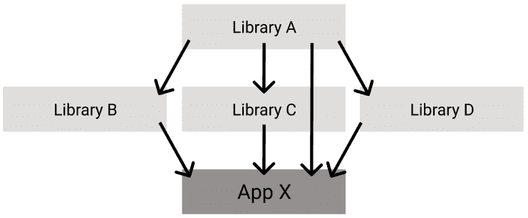

# 基础库应该稳定

> 原文：<https://dev.to/jeroendedauw/base-libraries-should-be-stable-2de5>

在这篇文章中，我回顾了管理包(库)设计的原则和一个我遇到过几次的具体问题。

罗伯特·C·马丁提出了六项一揽子原则。就我个人而言，我发现维基百科上的(链接)描述相当令人困惑，尤其是如果你还不了解这些原则的话。以下是我对图书馆设计的简单看法:

图书馆应该

*   涵盖单一责任
*   为他们的用户提供一个干净的、隔离良好的界面
*   隐藏/封装实现细节
*   没有循环依赖
*   不依赖不太稳定的库

这篇文章的其余部分着重于最后一点的重要性。

## 稳定基库

我假设使用包管理器，如 [Composer](https://getcomposer.org/) (PHP)或 NPM。这意味着每个库都定义了它的依赖项(如果有的话)和与之兼容的版本范围。库有版本，这些版本遵循[语义版本](https://semver.org/)。这也意味着库最终被以同样方式定义其依赖关系的应用程序所使用。

考虑这样一个场景，您有各种各样的应用程序，它们都使用一个基本库。

[T2】](https://res.cloudinary.com/practicaldev/image/fetch/s--l_xPNF9T--/c_limit%2Cf_auto%2Cfl_progressive%2Cq_auto%2Cw_880/https://thepracticaldev.s3.amazonaws.com/i/qkw7z63gdhwfse7z0rrn.png)

如果这个库包含很多具体的代码，它将不会非常稳定，并且它将不时地被需要或期望来进行一个主要的发布。主要版本是指包含重大变更的版本，因此不会自动被库的使用者使用。相反，这些消费者需要手动更新他们兼容的库的版本范围，并可能调整他们的代码来处理这些重大的变化。

在这种情况下，这不是问题。假设该库的版本为 1.2，并且所有应用程序都使用 1.x 版。如果在库中进行了重大更改，则需要发布 2.0 版。由于版本控制系统，消费应用程序可以在空闲时升级。当然，发布一个主要版本是有成本的。消费者仍然需要在升级上花费一些时间，尤其是如果他们受到重大变更的影响。不过，这通常很容易处理，并且是开发过程的正常部分。

当我们有一个不稳定的库被其他库使用时，事情会发生巨大的变化，即使那些库本身也不稳定。

[T2】](https://res.cloudinary.com/practicaldev/image/fetch/s--4b6rT5s4--/c_limit%2Cf_auto%2Cfl_progressive%2Cq_auto%2Cw_880/https://thepracticaldev.s3.amazonaws.com/i/5mw09zlmniyoxng3rb9v.png)

在这种情况下，对基础库进行突破性的修改是非常昂贵的。让我们假设我们对基本库做了一个突破性的改变，并且我们想在我们的应用程序中使用它。我们实际上需要做些什么才能到达那里？

*   发布基础库(库 A)
*   更新库 B 以指定它与 A 的新版本兼容，并发布 B 的新版本
*   更新库 C 以指定它与新版本的 A 兼容，并发布新版本的 C
*   更新库 D 以指定它与新版本的 A 兼容，并发布新版本的 D
*   更新我们的应用程序，以指定它与

换句话说，我们需要为每个使用我们的基础库并且也被我们的应用程序使用的库做一个新的发布。这可能是非常痛苦的，而且如果这些中间库一开始就没有受到重大变化的影响，这将是对时间的极大浪费。这意味着让库依赖于另一个不太稳定的库是很昂贵的，而且通常是个坏主意。

稳定可以通过几种方式实现。如果包非常抽象，并且我们假设设计良好，那么它将是稳定的。想象一个提供日志接口的包，比如 psr/log。也可以通过遵循包原则和注意避免破坏性更改的组合来实现。

结论:牢记打包原则，尽可能避免依赖自己库中不稳定的库。

## 亦见

*   [我的软件开发博客](https://www.entropywins.wtf/blog)
*   [组件设计(博文)](https://www.entropywins.wtf/blog/2014/07/12/component-design/)
*   [组件设计(幻灯片)](http://bit.ly/component-design)
*   [打包原则(维基百科)](https://en.wikipedia.org/wiki/Package_principles)