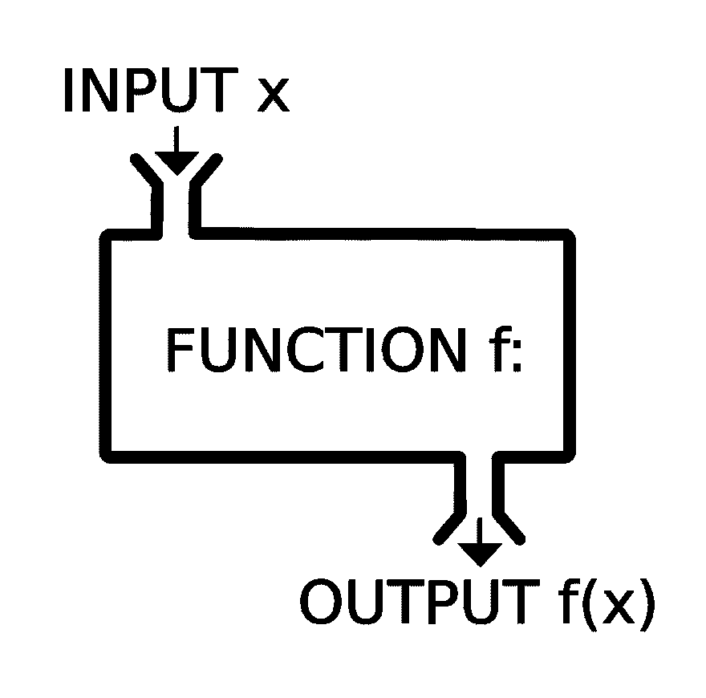

# 使用 Javascript 的基本函数式编程

> 原文：<https://dev.to/marpme/basic-functional-programming-with-javascript-2elj>

函数式编程- *嗯，听起来很有趣* -但实际上我对这个话题毫无头绪？...那么，欢迎你完整地阅读这篇文章。

1.  它会给你一些关于函数式编程如何工作的基本知识
2.  函数式编程的基本组件
3.  与众所周知的面向对象编程有什么不同。

让我们真正开始吧！

## 基本函数编程知识

为此，我们首先要了解函数式编程是如何定义的。对此的解释其实很简单:

函数式编程(通常缩写为 FP)是通过组合纯函数、避免共享状态、可变数据和副作用来构建软件的过程 - Eric Elliott(精通 JavaScript 访谈:什么是函数式编程？)

良好的...是啊，太多流行语了！让我们快速地把这个句子分解成它的重要部分，然后，我们应该得出那些:

*   **纯函数**

[T2】](https://res.cloudinary.com/practicaldev/image/fetch/s--4bEYLci3--/c_limit%2Cf_auto%2Cfl_progressive%2Cq_auto%2Cw_880/https://thepracticaldev.s3.amazonaws.com/i/kq34mrtitnuolaulcpfz.png)

它基本上遵循的原则是在任何时候任何给定的输入都有相同的输出。

这种行为也被称为函数的确定性。所以一个普通的函数确实有它的输入和计算它的输出，但是由于全局变量的变化或者某些副作用，它们在任何时候都不一定是相同的。

一个纯函数 tho 和一个普通函数有相同的要求，但是不同的是它不允许访问任何全局/外部状态，所以它和一个给定的输入是一致的，输出也是一样的。*(像一对一的关系)*

*   **避免共享状态**

函数之间没有共享状态。所以函数 A 不应该知道函数 B 做了什么，反之亦然。也不是通过使用全局状态。

*   **避免可变数据**

在使用数据时，永远不要修改数据。在更常见的函数式编程语言中，值被内存复制并作为一个新对象返回。为了支持这种不可变的数据，javascript 提供了以下函数:`Map`、`Reduce`、`RightReduce`、`filter`...

*   **避免副作用**

副作用正在被引入，例如，依赖于从某处读入文本文件。文件的内容很容易改变，因此会导致巨大的差异(又名。副作用)而你从未注意到它。

```
namespace studentExample {
  const costPerStudentPerMonth: number = 200;
  const months: number = 2;
  const students: Array<{ name: string }> = [
    {
      name: 'lulu'
    },
    {
      name: 'lala'
    },
    {
      name: 'lili'
    },
    {
      name: 'lele'
    }
  ];

  //normal function
  // + side effects, when changing any variable
  // + relying on a shared state
  const calculateStudentsCost = (students: Array<{ name: string }>) =>
    `${students.length * costPerStudentPerMonth * months} $`;

  // pure function
  // - side-effects, same input = same output!
  // - no shared state
  const pureCalculateStudentsCost = (studentsCount: number) => (
    monthsToCalculate: number
  ) => (costPerStudentPerMonth: number) =>
    `${studentsCount * costPerStudentPerMonth * monthsToCalculate} $`;

  console.log(calculateStudentsCost(students)); // 1600 $
  console.log(pureCalculateStudentsCost(students.length)(months)(costPerStudentPerMonth)); // 1600 $
} 
```

Enter fullscreen mode Exit fullscreen mode

您可能已经注意到，使用函数式编程的最大缺点之一是一切都变得更加冗长，可能也更难理解。通过使用面向对象的方法，您的大脑确实得到了很好的训练，能够理解某些概念。

例如，如果有人想出一个计算圆的直径和周长的任务，大多数人会选择面向对象的方法，因为它看起来很容易理解。首先，您将创建一个 circle 类，它获取所有必需的类变量以及计算所需数字所需的方法。

根据经验，很少有人会真的选择一个函数，因为这样做感觉不太自然，但我也注意到，数学函数是一个很好的例子，可以作为一种函数方法来投影。让我们用上面的圆例子来试试:

```
 namespace circleExample {

  // diameter = radius * 2
  const circleDiameter = (radius: number) => radius * 2;

  // Circumference = π × Diameter
  const circumferenceWithDiameter = (diameter: number) => Math.PI * diameter;

  // Circumference = π × radius × 2
  const circumferenceWithRadius = (radius: number) => Math.PI * radius * 2;

  // area = π × radius ** 2
  const areaWithRadius = (radius: number) => Math.PI * radius ** 2;

  // Example calculation
  console.log(areaWithRadius(4))
  console.log(circumferenceWithDiameter(circleDiameter(4)))
} 
```

Enter fullscreen mode Exit fullscreen mode

对我来说，这看起来非常实用，可读性也很好，因为你可以把函数和它们的输入一起读。根本不用看代码，你就能感觉到那里发生了什么。除了这个特定的项目示例之外，数学总是展示函数式编程有多强大的好例子。

除此之外，你有没有注意到我们在编程例子中从不改变任何变量，这是使用函数式编程的一个很好的效果。

最后，我希望你能从阅读这篇文章中获得一些知识，我也希望你在再次接触你的个人或工作相关的项目时记住这一点。这只是对函数式编程范式的一个非常基本的了解，关于这一点还有很多要探索的。请随时给我留下一些反馈，这样我们就可以看看我们是否可以更深入地研究它。:)