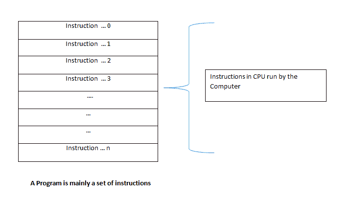

# 初学者的基本编程概念

> 原文：<https://dev.to/lucpattyn/basic-programming-concepts-for-beginners-2o73>

为了开始编程，你首先需要了解什么是程序

# 什么是程序

程序是计算机执行的一组指令。

<small>(更准确地说，程序是加载在 CPU 中的一组指令，CPU 执行这些指令以达到一个结果)。</small>

[T2】](https://res.cloudinary.com/practicaldev/image/fetch/s--z5YCFTsZ--/c_limit%2Cf_auto%2Cfl_progressive%2Cq_auto%2Cw_880/https://thepracticaldev.s3.amazonaws.com/i/vr95ldiwraw9h36ae1ma.png)

# 现在开始编程，但首先..

先学一点数学。

这里有一个简单的等式
*Z = X + Y*
假设，X 的值为 100，Y = 200，那么
我们知道 Z = 300。

现在编程世界的转折来了，它打破了一个有抱负的初学者的已知世界。如果我们把等式改成:

*Y = X + Y*

信不信由你，这在几乎所有编程语言中都是一个有效的表达式。

编程语言是计算机能理解的语言。它就像任何其他语言一样，有自己的语法和结构。程序员用它来使计算机遵循他/她的指令。

### 清晰的时刻

在继续之前，让我澄清一下编程和计算机科学之间的区别。

编程是通过一种编程语言来指导计算机执行某些任务，以获得你想要的输出。你可能已经听过这些语言的名字了——C/c++、Java、Python、PHP、Javascript 等等。对于许多目的来说，即使没有计算机科学学位，很好地掌握某些编程语言也是足够的。所以，不要让任何人告诉你——没有学位你不可能成为一名程序员，但是如果你了解计算机科学的理论，它们肯定会有所帮助。

计算机科学是对计算机和计算系统的研究。它是计算及其应用的科学和实用的方法。你越了解这个领域的理论，你就会成为越好的程序员。因此，您可以编写更高效的代码，这有助于使用更少的计算机资源更快地运行程序。但是一开始，绝对的热情和绝对的努力就足以在早期阶段成为一名相当优秀的程序员。

### 运行程序的核心硬件组件

执行程序的两个主要组件是
*i) CPU*
*ii)内存(RAM)*

<small>CPU(中央处理器)运行一组指令。
RAM(随机存取存储器)作为临时存储器，帮助 CPU 实现所需的输出/结果。</small>

为什么我们在继续编程之前讨论这些无聊的硬件？通过掌握好基础知识，让你成为更好的程序员。

# 好吧！真正开始编程

让我回到那个著名的表达

如果你对数学很了解，那么你应该知道 X，Y，Z 等等。都是变量)

假设我们知道 X = 100，Y = 200，我们要求计算机计算 X + Y 的值(数学上等于 Z)。

我们是这样实现的:

<small>**我会用类似 Javascript 的语法但语言不重要，概念是*</small>

因为我们有三个变量，我们需要在程序中声明它们。大多数优秀的编程语言都要求你显式地声明变量。

因此我们写道

其中有 x
有 y
有 z

这叫做变量声明。

因为我们知道 X 是 100，Y 是 200，所以我们写:

X = 100
Y = 200

这叫做变量赋值。

我们实际上可以写
var X = 100——在这种情况下，我们称之为带初始化的变量声明。

在这种情况下，我们将减少如下几行:

其中 x = 100
var y = 200
var z

现在，理解幕后发生的事情是非常重要的，否则我们稍后将处理的令人兴奋的东西(Y = X + Y)将很难理解。

当我们写变量 X 或变量 Y 的时候，RAM 中分配了一个空间，因为与主要存在于我们大脑中的数学变量不同，程序的变量驻留在一个实际的物理位置。

为了更好地理解，这里有一个概念图:

[T2】](https://res.cloudinary.com/practicaldev/image/fetch/s--tfL9inZ---/c_limit%2Cf_auto%2Cfl_progressive%2Cq_auto%2Cw_880/https://thepracticaldev.s3.amazonaws.com/i/4w2ejuxzzlngv2xli5lg.png)

x 和 Y 就像建筑物中的房间(也就是我们的 RAM ),它们有能力保存我们赋予它们的值。我们可以说房间号 X 的值为 100，房间号 Y 的值为 200，因为我们已经通过赋值运算符“=”将这些值赋给了它们。

为了计算 X + Y 的值，我们可以简单地写出
X + Y

然而，进行这种运算(每一个数学运算都发生在 CPU 中)而不将结果存储在某个地方将意味着这种运算的结果将永远丢失。因此，我们需要在某个地方存储运算结果，幸运的是，我们的 RAM 中有足够的空间来为 Z 提供空间，Z 将保存 X + Y 结果的值。

因此，当我们写出
Z = X + Y 时

我们告诉计算机从 RAM 中取出 X 和 Y 的值，在 CPU 中将它们相加，然后将结果存储在另一个叫做 z 的空间中。

[T2】](https://res.cloudinary.com/practicaldev/image/fetch/s--FiZ7M2Qz--/c_limit%2Cf_auto%2Cfl_progressive%2Cq_auto%2Cw_880/https://thepracticaldev.s3.amazonaws.com/i/yecpi29n5x6ckkmsqmlc.png)

上图中的“CPU 指令”不过是我们编写的程序，如下所示:

其中有 x
有 y
有 z

X = 100
Y = 200

Z = X + Y

这里，Z 被赋予一个值，该值是 X + Y 的运算结果

现在来看表达式
Y = X + Y，现在应该有一些意义了。

我们现在做的是，从 RAM 中取出 X 和 Y 的值，在 CPU 中相加，然后把值放回 Y 中。

我希望现在你已经明白计算机编程语言最好从右向左读，有点像阿拉伯语，不是吗:)？不，只是吓吓你！这非常直观。我们只需要记住赋值操作符(' = ')右边的所有东西都是先被处理，然后赋值发生。

再来一个形象的说明:

为了使它圆满，

a)我们声明变量——在内存中为它们分配空间(我希望在你读完这篇文章后，从现在开始你会对内存稍微小心一点，毕竟所有东西都有价格)。前任。var X；

b)我们分配变量——将值放入房间内。前任。X = 100

c)为了执行一个操作，我们通过简单地引用变量，提及它们之间的操作来获取/引用这些赋值。例如，
X + Y 表示取 X 的值，取 Y 的值，并在这些变量之间进行运算('+')；

d)我们通过简单地分配给我们选择的房间(Z 或 Y)来存储操作结果；

如果你善于观察，你会发现像 Y = X + Y 这样的表达式不需要 Z，因此我们不需要声明 Z，这样可以节省一点内存空间。对于基本编程来说，这当然无关紧要。然而，留意空间和其他资源将有助于你将来成为一名伟大的程序员。是的，在现代编程中，我们有很多硬件资源，但有时我们会因对编程方法不小心而滥用它们。

在所有的设置和完成之后，你可能想知道我们应该用 Y 或 z 做什么。把计算的结果显示给你的程序的用户怎么样？在一些语言中，我们通过调用一个叫做 print 的指令来实现。如果你写了类似 print(Z)的东西，它会在一个类似黑屏的 DOS(控制台)中把 Z 作为输出显示给最终用户。对于 Javascript，我们可以用 alert(Z)在消息框中显示值。然而，向计算机/移动屏幕显示输出是另一个讨论。

现在，在直接进入编程之前，请尝试掌握这里提到的概念。

快乐编码。

实际上，我计划继续为我的侄女阿娜写一系列博客(我已经为她准备了这个基础教程)。她刚刚完成高中学业。她将和那些还处于青少年后期的人一起评判——这种方法是否容易理解基本的编程概念。然而，评论和建设性的批评总是受欢迎的..

下一篇文章:[https://dev . to/lucpattyn/programming-constructs-for-初学者- jae](https://dev.to/lucpattyn/programming-constructs-for-beginners--jae)

## 承认

Tanzim Hussain，Jacques Raphanel，同事，
NSU 学院(特别是 MKA 和 ALH)

## 历史

文章发表于 2018 年 3 月 23 日

文章编辑于 2018 年 3 月 31 日-包含下一篇文章。