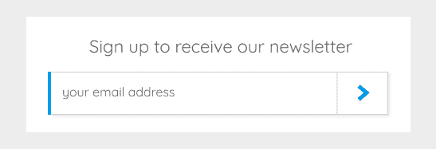
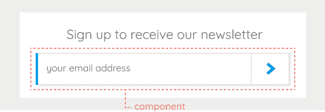
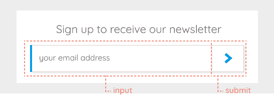
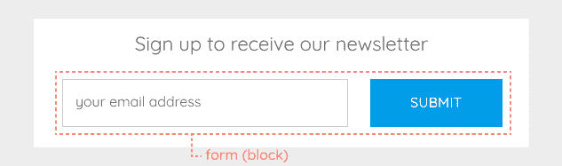
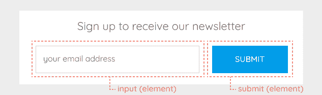

# RSCSS 和 BEM 系统的基本规则

> 原文：<https://dev.to/neshaz/basic-rules-of-rscss-and-bem-systems-4cpc>

通常，对于如何正确使用 CSS 有很多困惑。本文件旨在提供澄清。

**[SASS 3](http://sass-lang.com/)** 预处理器引入了一种被称为 **[SCSS](http://sass-lang.com/documentation/file.SCSS_FOR_SASS_USERS.html)** 的新语法，在科洛塞克的项目中使用。

要学习的最重要的事情之一是在 Sass 中嵌套。

两个最常用的导向系统是[rscs](http://rscss.io/index.html)和 [BEM](http://getbem.com/introduction/) 。我将介绍这两个系统的基础知识，以确保您在任何当前和未来的项目中正确使用它们。

## 一般规则

首先，让我们来看看应该遵循的一些通用 CSS 规则。

1.  写 CSS 的时候，应该使用**类**，避免使用**id**。
2.  使用 **SCSS** 语法，**从不使用**语法。
3.  使用**两个空格**进行缩进。
4.  当在规则声明中使用多个选择器时，**给每个选择器一行**。
5.  当需要使用一个**边距或填充辅助类**时，首先看看它是否可以被合并到元素 CSS 规则中，以**避免在单个元素**中添加太多的类。
6.  不要嵌套选择器超过**两层。**

 **#### **组件**

使用 RSCSS 时，您应该考虑**组件**。UI 的每一部分都应该被看作一个独立的组件。

组件的类别应该用两个单词命名，中间用一个破折号。

一些命名示例包括:

*   搜索表单，
*   照片容器，
*   主要按钮。

#### **元素**

每个组件包含**个元素**。班级应该只有一个**字**。

如果一个元素包含多个单词，它们应该连接在一起组成一个单词。

例如:

*   用户信息，
*   小文本，
*   我们的肚脐。

写 CSS 的时候应该避免使用**标签名**和**id**。

#### **变种**

变体可用于**组件和元素名称* *。
变量的类名以破折号* *为前缀。

例如:

*   class="button-primary -large "，
*   class="avatar -round "，
*   class= "输入-表单范围"。

在下面的例子中，我将把组件分解成元素，并展示 RSCSS 的实际应用。

[T2】](https://res.cloudinary.com/practicaldev/image/fetch/s--bMPDDkwZ--/c_limit%2Cf_auto%2Cfl_progressive%2Cq_auto%2Cw_880/https://kolosek.com/conteimg/2017/12/Group-10--1-.png)

该图像显示了一个带有按钮和占位符文本的简单输入字段。
首先，我们将**识别组件并将其分解为元素**。

[T2】](https://res.cloudinary.com/practicaldev/image/fetch/s--K72iGc1p--/c_limit%2Cf_auto%2Cfl_progressive%2Cq_auto%2Cw_880/https://kolosek.com/conteimg/2017/12/Group-11.png)

该组件包括输入字段和提交按钮。

[T2】](https://res.cloudinary.com/practicaldev/image/fetch/s--AeZW8y8x--/c_limit%2Cf_auto%2Cfl_progressive%2Cq_auto%2Cw_880/https://kolosek.com/conteimg/2017/12/Group-11.1--1-.png)

现在，是时候写 CSS 类了。我将把组件、元素和变量命名为。

```
.signup-form {
   .inputfield {
     ...
   }
   .submitbtn {
     ...

     &.-inverted {
       ..
     }
   }
} 
```

为了命名元素，我将这两个词连接起来(没有使用破折号或下划线)。使用了一个变量来定义按钮的样式。因此，类的 submitbtn 和-inverted 都必须在 button 元素上使用。

## **[贝姆](http://getbem.com/introduction/)T5】**

边界元法是一种基于块体-单元-修正系统的方法。只使用类名选择器，避免使用 id。

#### **街区**

**块**可以嵌套，也可以相互交互。它们**类似于 rscs**中的组件，并且语义相等。

Bloks 通常有一个由一个或两个单词组成的类名，中间用破折号隔开。块名可以由拉丁字母、数字和破折号组成。

#### **元素**

元素是块的一部分。

元素名称可以由拉丁字母、数字、破折号和下划线组成。类名由块名**加上两个下划线和元素名**组成。例如:“ **forminput** ”。

#### **修饰语**

修饰词用在元素上以显示外观、行为或状态的变化。通过添加或移除修改器来改变元素设计。

修饰符名称可以由拉丁字母、数字、破折号和下划线组成。修饰符类名由元素类名加上两个破折号和修饰符名组成。当元素有修饰符时，它必须同时有元素类和修饰符类。
例如:“ **blockinput blockinput -虚线**”。

在下一个例子中，你可以看到一个边界元方法的例子。

[T2】](https://res.cloudinary.com/practicaldev/image/fetch/s--vQlupXWR--/c_limit%2Cf_auto%2Cfl_progressive%2Cq_auto%2Cw_880/https://kolosek.com/conteimg/2017/12/Group-18--1-.png)

上图显示了一个块，其类别为“ **form** ”。它由一个输入字段和一个提交按钮组成。

[T2】](https://res.cloudinary.com/practicaldev/image/fetch/s--arFMm1nH--/c_limit%2Cf_auto%2Cfl_progressive%2Cq_auto%2Cw_880/https://kolosek.com/conteimg/2017/12/Group-17.png)

现在，您已经确定了块中的元素。这些元素是“**输入**和“**提交**”。“**提交**”元素有一个外观修饰符，使按钮更宽。

根据所有这些信息，我们的样式表将被写成:

```
.form { }
.form__input { }
.form__submit { }
.form__submit--wide { } 
```

HTML 文件将如下所示:

```
<form class="form">
  <input class="form__input" placeholder="your email address" />
  <input type="submit" class="form__submit form__submit--wide" />
</form> 
```

我希望这篇文章能帮助您理解 RSCSS 和 BEM 的基础知识，以及类命名约定。

一定要查看其他与 CSS 属性相关的详细文章，比如这篇: [CSS 位置](https://kolosek.com/css-position-relative-vs-position-absolute/)、[萨斯和少嵌套](https://kolosek.com/nesting-in-less-and-sass/)、 [CSS 列](https://kolosek.com/css-columns/)。

本文原载于 [Kolosek 博客](https://kolosek.com/css-formatting/?utm_source=dvt)。**