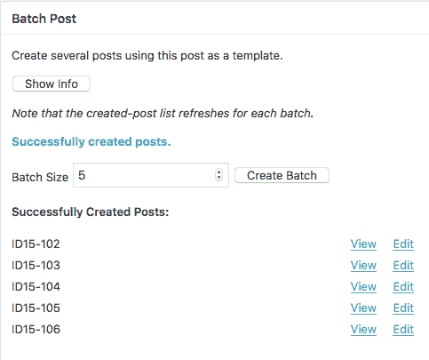

# 批量过帐

> 原文：<https://dev.to/foresthoffman/batch-post--207f>

批量发布 WordPress 插件让作者能够从一个模板帖子中生成大量帖子。使用插件的自定义短代码，模板文章的标题和正文部分可以被表示为在生成过程中应该改变的内容。

在常规基础上， [Rob Schwartz](https://acatestprep.com/) 需要创建一组 10-50 个帖子，每个帖子之间略有差异。手动完成这一工作非常繁琐，这就是批量发布插件发挥作用的地方！使用 Batch Post，Rob 可以创建一个模板，指明他希望更改标题和内容的位置，指定任何元数据(类别、标签等)。)应该应用于该批，并根据他的需要创建尽可能多的帖子。

批处理创建过程还可以根据需要覆盖之前批处理的帖子，从而节省时间。也就是说，如果批处理要创建已经存在的帖子，它们将被删除并重新创建。比较帖子的 slugs 以防止永久链接问题。

当一个批处理被创建时，模板 post 被解析为`bpauto`短代码的实例。短码本身有两种用法:

1.  默认，例如`[bpauto]`
2.  带有偏移量，例如`[bpauto offset=1]`

shortcode 的 offset 参数根据文章在批处理中的位置，接受给每个文章的数字的正或负偏移量。

如果批处理模板的文章标题为`ID15-1[bpauto]`，并且批处理大小等于`5`，则结果将是:

[T2】](https://res.cloudinary.com/practicaldev/image/fetch/s--bIqUIEJv--/c_limit%2Cf_auto%2Cfl_progressive%2Cq_auto%2Cw_880/https://foresthoffman.com/wp-content/uploads/2018/02/batchpost-template-title.png)

[T2】](https://res.cloudinary.com/practicaldev/image/fetch/s--lsrfNfLa--/c_limit%2Cf_auto%2Cfl_progressive%2Cq_auto%2Cw_880/https://foresthoffman.com/wp-content/uploads/2018/02/batchpost-metabox.png)

或者，如果批处理模板的文章标题是`ID15-1[bpauto offset=1]`，一批`5`，结果将是:

[T2】](https://res.cloudinary.com/practicaldev/image/fetch/s--VnMWgGSi--/c_limit%2Cf_auto%2Cfl_progressive%2Cq_auto%2Cw_880/https://foresthoffman.com/wp-content/uploads/2018/02/batchpost-template-title-2.png)

[T2】](https://res.cloudinary.com/practicaldev/image/fetch/s--1ulQUYzS--/c_limit%2Cf_auto%2Cfl_progressive%2Cq_auto%2Cw_880/https://foresthoffman.com/wp-content/uploads/2018/02/batchpost-metabox-2.png)

通过模板标题的独特选择，批量帖子可以相互链接。例如，考虑这个帖子模板:

帖子标题

> ID15-1 `[bpauto]`

帖子正文

> < video src = " example . com/WP-content/uploads/2018/02/id15-1`[bpauto]`. MP4></video>
> 
> < a href = " example . com/id15-1`[bpauto offset=1]`"><按钮>下一个视频</按钮> < /a >

该模板使用默认形式的短代码，并提供一个偏移量(+1)。

批量大小为`5`，上述模板将为第一篇文章生成以下内容:

帖子标题

> ID15-1 `01`

帖子正文

> < video src = " example . com/WP-content/uploads/2018/02/id15-1`01`. MP4 "></video>
> 
> < a href = " example . com/id15-1`02`"><按钮>下一个视频</按钮> < /a >

...第二点:

帖子标题

> ID15-1 `02`

帖子正文

> < video src = " example . com/WP-content/uploads/2018/02/id15-1`02`. MP4 "></video>
> 
> < a href = " example . com/id15-1`03`"><按钮>下一个视频</按钮> < /a >

...诸如此类。