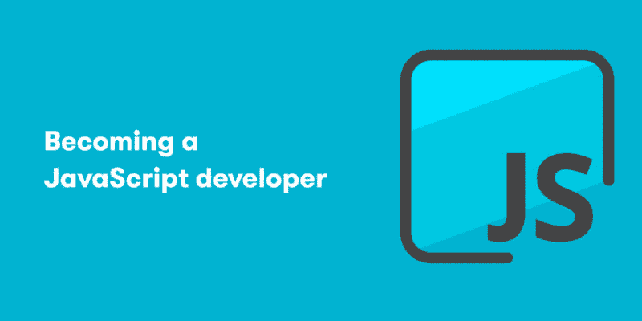

# 成为 JavaScript 开发人员

> 原文：<https://dev.to/insmartcode/becoming-a-javascript-developer-5h63>

 
我们生活在一个数字时代，脸书、谷歌、Airbnb、亚马逊和优步等公司正在开辟新的领域，重塑全球商业生态系统。然而，如果没有程序员(当然包括 JavaScript 开发人员)的工作，这一切都是不可能的。

**为什么是 JavaScript？**

JavaScript 是一种轻量级的解释编程语言。它是为创建以网络为中心的应用而设计的。它是 Java 的补充，并与 Java 集成在一起。JavaScript 非常容易实现，因为它与 HTML 集成在一起。它是开放的和跨平台的。

1:学习基础知识。

首先，设置您的机器。不管是 Windows，Linux 还是 Mac，弄个编程 IDE，或者用新手的话说“程序员的文本编辑器”，像 Webstorm 或者 Atom。然后试着写 Hello World (1。下面)在选定的 IDE/编辑器中。

一些 JavaScript 基础任务:
任务 1:创建脚本块
任务 2:隐藏您的 JavaScript 代码
任务 3:为您的 JavaScript 代码提供替代方案
任务 4:包括外部源代码
任务 5:注释您的脚本
任务 6:编写 JavaScript 命令
任务 7:临时从脚本中删除命令
任务 8:使用花括号
任务 9:将输出写入浏览器
任务 10:创建变量【T10

做第一个自制的小项目。

这是非常重要的一步。你需要知道如何把这些片段连接起来。创建一个非常简单的静态网站，如:计算器或交通灯模拟器。

参加一个课程来强化你所学的东西。

如果你学了第二种(或第三种)语言，你就去上课。编程语言也是如此，JavaScript 也不例外。

**4:学习 ECMAScript 6。**

ECMAScript (ES)是由 ECMAScript International 标准化的脚本语言规范。应用程序使用它来启用客户端脚本。像 JavaScript、Jscript 和 ActionScript 这样的语言都是由这个规范管理的。

ECMAScript 引入了您绝对需要学习的新概念:

箭头功能
承诺和异步/等待增强
集合(地图、集合)

**5:学习第一个框架。**

在 JavaScript 领域，领先的 JavaScript 框架是 Angular 和 Ember。Angular:由谷歌开发者积极开发。一个伟大的框架，拥有一个简单项目所需的所有功能。非常容易学习，有很好的文档。

**6:提高自己在 CSS 方面的技能，学习 HTML 5。**

选择器，包括特殊字符，如>和+
标签、类和 id 的优先级
Flexbox 及其规则
如果您了解:

CSS 预处理程序之一，如 SASS 或 LESS
一些 CSS 模式，如 BEM 或 SMACSS
自然，随着 CSS 的发展，您应该会对 HTML 及其扩展 HTML5 非常熟悉:

新标签:部分、文章、页眉、页脚、导航
画布
数据集和类列表

学习算法以及如何提高解决方案的性能。

你可能应该从排序算法开始，比如快速排序和合并排序，然后转移到图算法，广度优先搜索和深度优先搜索。