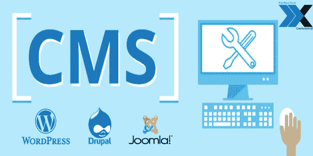

# 选择 WordPress 而不是其他内容管理系统的好处

> 原文：<https://dev.to/xtreemsolution/benefits-of-choosing-wordpress-over-other-content-management-systems-4p4n>

当你开始发布你的内容的时候，你可能已经注册了内容管理系统，比如 Drupal，Joomla 或者其他任何一个。这可能是你想要不同的特性、功能、部件和主题的情况。不管原因是什么，你可能正在寻找一个升级的 CMS，最好考虑 WordPress 进行迁移。当然，有各种各样的合作医疗有不同的好处。Drupal 有自己非常活跃的社区。

[T2】](https://res.cloudinary.com/practicaldev/image/fetch/s--Lf-oHEyP--/c_limit%2Cf_auto%2Cfl_progressive%2Cq_auto%2Cw_880/https://image.ibb.co/cciaQ8/Benefits_of_choosing_Word_Press_over_Other_Content_Management_Systems.jpg)

Joomla 已经被全世界成千上万的人使用。Alfresco 允许你把不同的文件变成不同的网页。尽管有这些好处，WordPress 仍然是其中的佼佼者。为什么 WordPress 被认为是世界上最好的 CMS，有很多不同的因素。它为 WordPress 开发服务开辟了新的途径。所以，现在让我们来看看这些因素，这些因素使得 WordPress 成为比其他内容管理系统更好的解决方案。

**1。简单明了**
Joomla 和 Drupal 的大多数用户通常会发现他们的需求非常复杂。有各种各样的用户无法掌握的功能，他们不知道该做什么。因此，他们试图利用一个复杂的系统来满足他们简单的需求。WordPress 拥有过多的高级功能，但它的优势在于简单。

如果想创建 Word 文档，可以很容易地创建博客帖子或网页。这使得 web 开发变得容易。用户不必学习编码，这使得它非常受欢迎的企业，特别是那些没有任何程序员或网页设计师。用 WordPress 制作一个网站很容易。

**2。插件和主题的广泛生态系统**
WordPress 附带了过多的主题和插件。人们可以很容易地选择适合自己要求的主题。他可以安装任何插件来增加网站的功能。你想提高你的网页搜索引擎优化？你可以很容易地在 WordPress 中找到一个插件。

它有一个庞大的用户群，以及一个包含不同支持功能的完整生态系统，这些功能都在这个 CMS 平台上。有各种各样的第三方为 WordPress 的用户创造了很棒的小工具、主题和插件。有数以千计的插件，用户可以使用这些插件来定制他们自己的内容管理系统，包括他们需要的所有功能，从销售产品到在网站上发布内容。

**3。活跃的 WordPress 社区**
当谈到不同的内容管理系统时，最令人沮丧的事情是当用户遇到问题时很难找到解决方案。有新的 CMS 公司正在成长，但他们没有像 WordPress 那样建立起庞大的社区，而 WordPress 已经积累了数千年的用户。

如果你有任何问题，这个活跃的社区为你提供所有的解决方案。它有一个网站支持页面和一个论坛，在那里你可以要求解决不同的 WordPress 问题以及其他问题，你可以很容易地找到可以为你提供解决方案的人。

**4。高性价比的解决方案**
大多数其他 CMS 平台经常收费，但 WordPress 对任何人都是免费的。这就是为什么数以百万计的小企业使用它进行网络开发，因为他们不必支付任何费用。没有任何网站开发预算或无法雇用网站开发人员的小型企业可以使用这种 CMS。然而，当涉及到额外的功能以及插件时，你必须付费。

一些 WordPress 插件带有付费升级选项，而大部分是完全免费的，或者他们有一个完全健壮的免费增值版本，可供用户使用。你需要做的就是 [**雇佣 WordPress 专家**](https://xtreemsolution.com/hire-wordpress-developer.html) 来建立你的网站。

**5。简单的电子商务整合**
近年来，电子商务的步伐明显加快。大多数企业都希望开设网上商店，以吸引更多的顾客。有不同的电子商务托管网站，这些网站是可用的，但它们的成本很高。一个企业可以雇佣一个网页设计师来创建一个复杂的电子商务平台。

但是有了 WordPress，用户有能力轻松整合不同的电子商务系统。有一些像 WooCommerce 这样的平台，只需要几个步骤就可以与 WordPress 网站完全整合。

**6。移动响应能力**
在当前时代，网站需要对移动设备友好，因为大多数客户现在使用移动设备浏览网站。由于大多数客户拥有不同类型的移动设备，因此响应式设计也变得非常重要。

一个好的网站，是移动友好和反应迅速，吸引更多的客户，使其成为一个愉快的体验。WordPress 的大部分主题都是手机友好的。

### 结论

比起不同的内容管理系统，选择 WordPress 有很多好处。它很容易使用，非常便宜，不断更新，等等。这意味着您的网站保持安全和前沿。它提供了很好的用户体验，并提供了获得更多客户的更多机会。这就是为什么你应该为你的商业网站雇佣一个 [**WordPress 开发公司**](https://xtreemsolution.com/wordpress-development-services.html) 。

## 标签:

wordpress 开发公司，雇佣 wordpress 专家，WordPress 开发服务