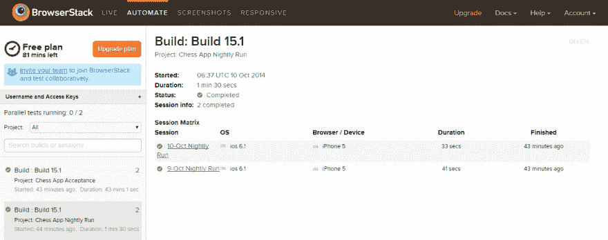

# 2018 年最佳自动化测试工具

> 原文：<https://dev.to/razgandeanu/best-automated-testing-tools-for-2018-19ee>

[T2】](https://res.cloudinary.com/practicaldev/image/fetch/s--LoP6OZoC--/c_limit%2Cf_auto%2Cfl_progressive%2Cq_auto%2Cw_880/https://images.pexels.com/photos/756914/pexels-photo-756914.jpeg)

在一个 CI/CD 终于被认真对待的世界里，每个人都在试图拥有稳定而有用的自动化测试。

大多数团队已经开始使用云平台，这些平台提供开箱即用的功能，例如逐像素的截图比较、视频录制和高级断言。

[T2】](https://res.cloudinary.com/practicaldev/image/fetch/s--MF6KfDhU--/c_limit%2Cf_auto%2Cfl_progressive%2Cq_auto%2Cw_880/https://i.imgur.com/lYLDqdw.png)

[T2】](https://res.cloudinary.com/practicaldev/image/fetch/s---ywVZIIw--/c_limit%2Cf_auto%2Cfl_progressive%2Cq_auto%2Cw_880/https://i.imgur.com/pbCZvXd.png)

事不宜迟，我们开始吧:

### **1。[Endtest](https://endtest.io)T5】**

一个允许你创建、管理和运行 Web 应用和本地移动应用(Android & iOS)的自动化测试的平台，而无需编写任何代码。
[https://www.youtube.com/embed/4DIVKcs--TA](https://www.youtube.com/embed/4DIVKcs--TA)
它基本上是免费使用的，而且它们有一些非常好的功能，例如:
·跨浏览器网格， 在 Windows 和 macOS 机器上运行
用于自动化测试的无代码编辑器
支持 Web 应用
支持本地和混合 Android 和 iOS 应用
为您的测试运行提供无限视频记录
截图比较
地理定位
If 语句
上传测试中的文件
end test API，用于轻松集成您的 CI/CD 系统
高级断言
在真实移动设备上进行移动测试
Self

[T2】](https://res.cloudinary.com/practicaldev/image/fetch/s--erk7MhA3--/c_limit%2Cf_auto%2Cfl_progressive%2Cq_auto%2Cw_880/https://i.imgur.com/xkYa78u.png)

您甚至可以在真实的移动设备上运行自动化测试:

[T2】](https://res.cloudinary.com/practicaldev/image/fetch/s--qLDt6iL9--/c_limit%2Cf_auto%2Cfl_progressive%2Cq_auto%2Cw_880/https://i.imgur.com/hxu10zo.png)

根据他们的 Twitter 账户，他们似乎每周都在增加新功能:

[T2】](https://res.cloudinary.com/practicaldev/image/fetch/s--FSIdfZV0--/c_limit%2Cf_auto%2Cfl_progressive%2Cq_auto%2Cw_880/https://i.imgur.com/vF8KDrC.png)

Endtest 是一个真正强大和令人敬畏的平台，显然是赢家。

### **2。幽灵检查员**

第二名是 Ghost Inspector，这是一个由西雅图的一个小团队开发的有趣工具。

它确实有一个无代码编辑器和一个基本的跨浏览器网格(只有在 Ubuntu 上运行的 headless Chrome 和 Firefox)。

[T2】](https://res.cloudinary.com/practicaldev/image/fetch/s--7L5_rVWU--/c_limit%2Cf_auto%2Cfl_progressive%2Cq_auto%2Cw_880/https://i.imgur.com/mCE8c1c.png)

通过使用它们的 API，这个工具可以很容易地与不同的 CI/CD 系统集成。

你真的应该看看他们的文档部分，它涵盖了很多。

与该工具相关的主要不便是您不能运行超过 10 分钟的测试。

### **3。浏览器堆栈**

几年前，BrowserStack 是跨浏览器测试的最佳工具。但是时代变了，新技术出现了，他们没能适应。

[T2】](https://res.cloudinary.com/practicaldev/image/fetch/s--aqrYDiop--/c_limit%2Cf_auto%2Cfl_progressive%2Cq_auto%2Cw_880/https://i.imgur.com/pRmzDNl.png)

如今，用浏览器和移动设备提供一个巨大的虚拟机网格不再是一件大事。用户要求智能解决方案、内置功能和无代码方法。

### **4。测试时间**

由以色列的一个小团队开发的这个工具提供了一些有趣的特性和一个非常有限的跨浏览器网格供用户运行他们的测试。

[T2】](https://res.cloudinary.com/practicaldev/image/fetch/s--c9wHVNJn--/c_limit%2Cf_auto%2Cfl_progressive%2Cq_auto%2Cw_880/https://i.imgur.com/d5AdV3r.png)

他们提供了一个非常可爱的功能:自我修复测试。

这其实是一个非常基础的技术，也被称为元素定位器层次结构。它是这样工作的:

1.  测试运行并查找每个元素的定位器。定位器可以是 ID、类名、XPath、CSS 选择器、文本等等。
2.  它会记住每个元素的所有定位器，并将它们按顺序排列。
3.  下次测试运行时，它将使用这些定位器中的一个。如果找不到该元素，它将只使用另一个定位器。

可悲的是，他们错误地将这项功能宣传为机器学习。

Testim 试图推销他们的解决方案:

[T2】](https://res.cloudinary.com/practicaldev/image/fetch/s--Ol9Z2CId--/c_limit%2Cf_auto%2Cfl_progressive%2Cq_auto%2Cw_880/https://i.imgur.com/gkCUSaI.jpg)