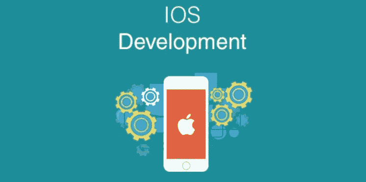
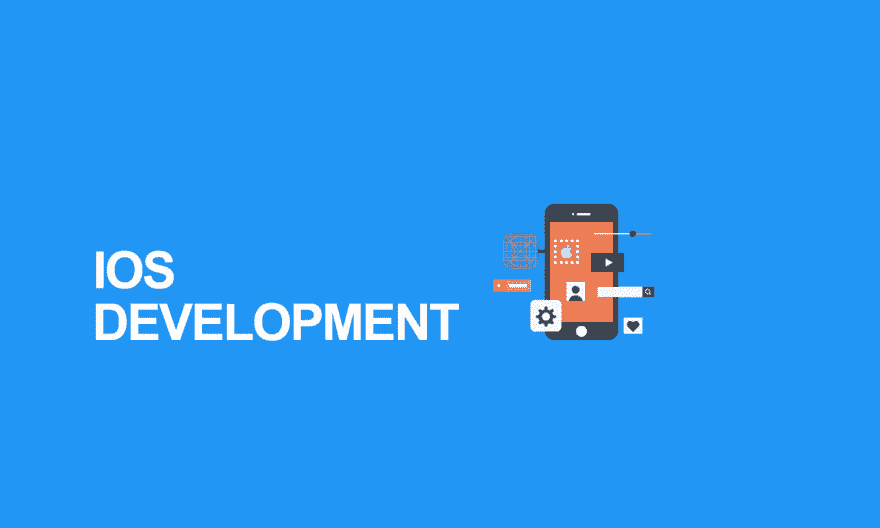

# 最佳 Windows 应用程序开发教程

> 原文：<https://dev.to/jeremykeefer/best-ios-app-development-on-windows-tutorial-31p3>

# 一学习 iOS 开发时第一个问题一般是“我要赚多少钱，多快能赚到？我必须有一台 Mac 电脑才能创建一个很酷的 iOS 应用程序吗？”。

## 两个没有任何其他既定想法的人通常会毫无准备地开始开发他们的 iPhone 应用程序想法。

[T2】](https://res.cloudinary.com/practicaldev/image/fetch/s--3ppe1ETG--/c_limit%2Cf_auto%2Cfl_progressive%2Cq_auto%2Cw_880/https://i.imgur.com/NUeKTPA.png)

令人难过的事实是，即使你完成的 iPhone 应用程序概念通过了苹果公司的严格测试，应用程序销售失败也是司空见惯的。下一个场景通常会把你看作是试图把你的应用送人的[应用开发者](http://offingapp.com/)。当你到达这个阶段的时候，你的 iPhone 应用程序概念已经变成了一个没有结果的冒险，让你感到沮丧，并且赔钱。

Windows 中的 iOS 应用程序开发流程。第一阶段你的应用创意

[T2】](https://res.cloudinary.com/practicaldev/image/fetch/s--CMbQ7xGp--/c_limit%2Cf_auto%2Cfl_progressive%2Cq_auto%2Cw_880/https://i.imgur.com/hZY316o.png)

所以你有一个很酷的 iPhone 应用程序的想法。你认为这是一个赢家，你想开始发展这个想法，并使它成为一个巨大的受欢迎的成功。你不会编程，也没有昂贵的苹果电脑。您的预算很低，负担不起昂贵的硬件或软件。

但你的决心从未减弱，你想发展你的应用程序概念。如果那是你，那听起来就像你，我们有共同点。我没有苹果电脑，也多年没有编程了。但是开发你的 iPhone 应用不仅仅是编码、框架和编译。在 Windows 上进行 iOS 开发，最重要的事实是你的想法。

开始你的应用程序开发，在你动笔之前，你必须对你的想法进行评估、评价和改进。不要放弃太多，但 FreeTheApps 过程的一部分会一步一步地教你如何检查你的竞争对手，看看你的想法如何改进你的竞争对手的想法。因此，当它进入 iPhone 应用商店时，你就有了目标受众。

这都是对你的 iPhone 应用进行评估和评价的一部分。作为一个评估的例子，如果竞争对手的应用程序只对触摸命令做出反应，那么构建您的应用程序来对语音和触摸命令做出反应。你知道我们要做什么了。还有更多的工作要做，你将会看到如何更好地推广你的应用，因为仅仅让你的应用在 iPhone 应用商店中获得批准已经不够了。一旦你多次完成这个阶段，它就会变成你的第二天性。

如果你希望通过制作 iPhone 应用程序获得可观的收入，并学习维持这种收入的方法，那么你应该使用 Offingapp 的培训教程。