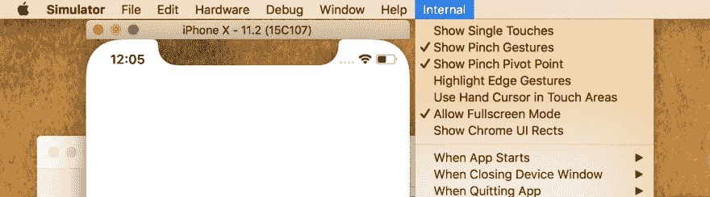

# 最佳 iOS 开发技巧和诀窍

> 原文：<https://dev.to/developerinsider/best-ios-development-tips-and-tricks-2pk4>

最初发布于[开发者内幕](https://developerinsider.co/best-ios-development-tips-and-tricks/)。

## 1.在 Xcode 中跟踪构建时间

如果您不知道项目的确切构建时间，请在 Xcode 中启用以下选项。

```
defaults write com.apple.dt.Xcode ShowBuildOperationDuration -bool YES 
```

[T2】](https://res.cloudinary.com/practicaldev/image/fetch/s--HF3Vcl2b--/c_limit%2Cf_auto%2Cfl_progressive%2Cq_auto%2Cw_880/https://github.com/developerinsider/developer-insider-content/blob/master/POST/iOS/TipsAndTricks/BuildTime.png%3Fraw%3Dtrue)

## 2.缩短您的 Swift 项目构建时间

Xcode 9.2 发行说明提到了一项实验性功能，该功能可以缩短 Swift 构建时间，通过“buildsystemscheduleinherentlyparallelcommands exclusive”用户默认设置启用。

```
defaults write com.apple.dt.Xcode BuildSystemScheduleInherentlyParallelCommandsExclusively -bool NO 
```

**注**:根据发布说明，这是一个实验性的特性，可以“在构建期间增加内存使用”

## 3.在 Xcode 的全屏模式下使用模拟器

能够在全屏模式下同时运行 Xcode 和 iOS simulator，大概是我最喜欢 Xcode 9 的特性了。您可以在终端中执行以下命令来启用此功能:

```
defaults write com.apple.iphonesimulator AllowFullscreenMode -bool YES 
```

[https://www.youtube.com/embed/YFPUgQpUmuE](https://www.youtube.com/embed/YFPUgQpUmuE)

如果你想在模拟器中使用更多的秘密功能，你应该启用苹果隐藏内部菜单。为此，您需要在根目录中创建一个名为“ **AppleInternal** 的空文件夹。只需运行以下命令并重启模拟器:

```
sudo mkdir /AppleInternal 
```

新的菜单项应该会出现。
[T3】](https://res.cloudinary.com/practicaldev/image/fetch/s--e_SYwFoE--/c_limit%2Cf_auto%2Cfl_progressive%2Cq_auto%2Cw_880/https://github.com/developerinsider/developer-insider-content/blob/master/POST/iOS/TipsAndTricks/SimulatorInternal.png%3Fraw%3Dtrue)

## 4.捕捉 iOS 模拟器视频

您可以使用 xcrun 命令行实用程序对模拟器窗口进行截图或录制视频。要录制视频，请执行以下命令

```
xcrun simctl io booted recordVideo <filename>.<file extension>. 
```

例如:

```
xcrun simctl io booted recordVideo appvideo.mov 
```

按`control + c`停止录制视频。创建的文件的默认位置是当前目录。

## 5.从 Finder 共享文件到模拟器

从 Xcode 9 开始，Simulator 具有 Finder 扩展，允许您直接从 Finder 窗口共享文件。然而，拖放文件到模拟器的窗口似乎快得多。

[https://www.youtube.com/embed/G7gpQQ49mhA](https://www.youtube.com/embed/G7gpQQ49mhA)

但是，您可以使用下面的 simctl 命令对图像/视频文件执行类似的操作:

```
xcrun simctl addmedia booted <PATH TO FILE> 
```

## 6.用你的指纹来数独

如果你想在 Macbook Pro 上使用你的指纹作为你的 sudo 密码，编辑`/etc/pam.d/sudo`并在顶部添加下面一行

```
auth sufficient pam_tid.so 
```

你现在可以用你的指纹来数独了。

## 7.使用声音通知调试自动布局约束

这是调试自动布局约束的好方法。只需在启动时传递 UIConstraintBasedLayoutPlaySoundOnUnsatisfiable 参数，它就会在运行时约束被破坏时播放声音。

```
-_UIConstraintBasedLayoutPlaySoundOnUnsatisfiable YES 
```

[https://www.youtube.com/embed/G_fuCXMChp8](https://www.youtube.com/embed/G_fuCXMChp8)

## 8.从 Xcode 中移除不可用的模拟器

这个小命令将从 Xcode 中删除所有不可用的模拟器。这里的“不可用”是指 xcode-select 的 xcode 版本不可用。

```
xcrun simctl delete unavailable 
```

你最喜欢的是什么？请在评论区添加。

[最佳 iOS 开发技巧和诀窍——第二部分](https://developerinsider.co/best-ios-development-tips-and-tricks-part-2/)