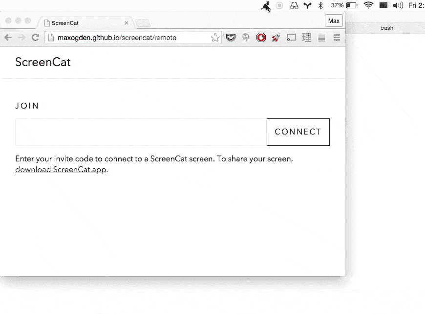
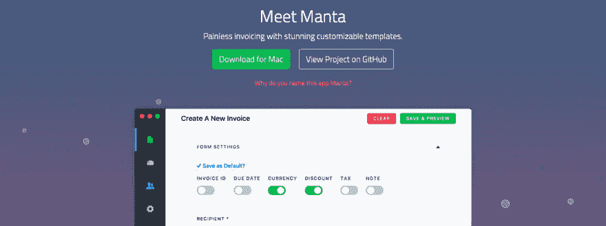
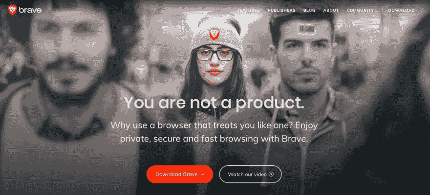
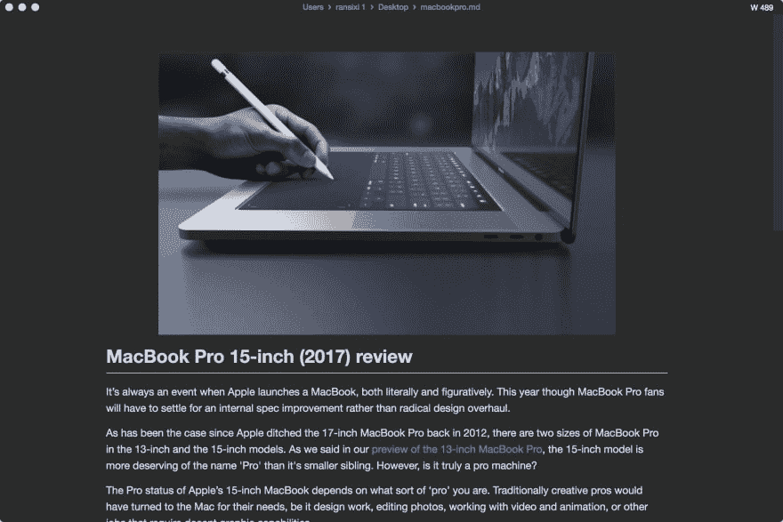
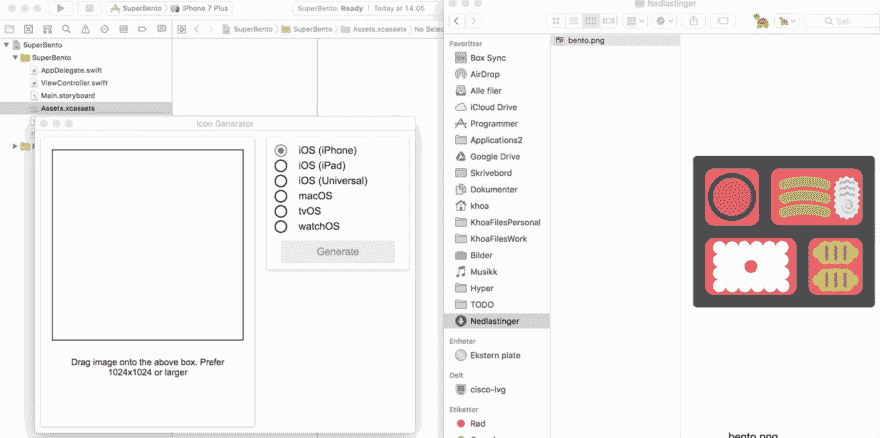
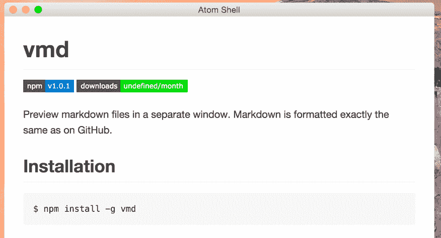
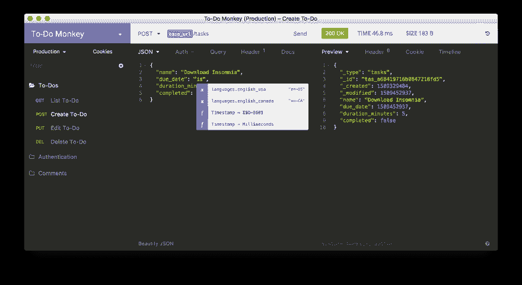

# 开发者最佳开源工具🛠

> 原文：<https://dev.to/xenoxdev/best-open-source-tools-for-developers--300f>

你和我一样兴奋吗？在我寻找最适合你的应用程序的过程中，我自己发现了一些非常棒的工具。最棒的是下面所有的应用程序都是免费和开源的。我们开始吧🏃🏻‍♂️

### 1\. Screencat 🙀

[T2】](https://res.cloudinary.com/practicaldev/image/fetch/s--PErENk1q--/c_limit%2Cf_auto%2Cfl_progressive%2Cq_66%2Cw_880/https://github.com/maxogden/screencat/raw/master/img/remote-control.gif)

🖥 ***平台可用性*** :所有平台
🔗 ***Github 链接*** : [Screencat](https://github.com/maxogden/screencat)

下一个应用程序让屏幕共享变得超级简单。您可以与其他人共享您的桌面，同时让他们远程共享您的鼠标和键盘。它内置在 electron.js 中。

### 2。女用披巾💸

[T2】](https://res.cloudinary.com/practicaldev/image/fetch/s--jxs7C1Ut--/c_limit%2Cf_auto%2Cfl_progressive%2Cq_auto%2Cw_880/https://i.imgur.com/wwGYH3k.png)

🖥 ***平台可用性*** :所有平台
🔗 ***Github 链接*** : [Manta](https://github.com/hql287/Manta)
任何自由职业者最令人沮丧的部分就是给客户寄发票。在网上搜索一个模板，然后在文字处理软件中编辑它需要很多时间，结果看起来仍然很难看。试试 Manta，这是一个桌面应用程序，可以用漂亮的可定制模板创建发票。这会让你的工作变得轻松。

### 3。勇敢的浏览器

[T2】](https://res.cloudinary.com/practicaldev/image/fetch/s--THyjUKP1--/c_limit%2Cf_auto%2Cfl_progressive%2Cq_auto%2Cw_880/https://i.imgur.com/FfUrlmI.jpg)

🖥 ***平台可用性*** :所有平台
🔗 ***Github 链接*** : [勇者](https://github.com/brave/browser-laptop)

隐私和安全应该是每个人的头等大事，这也是我在我的博客上经常谈论的话题。当为了隐私而改变应用程序时，浏览器是清单上的第一件事。即使你使用的是虚拟专用网，谷歌也会从谷歌浏览器中追踪你的大量数据。用 Brave，它是免费开源的。查看其他一些很酷的在线隐私应用[点击这里](https://medium.com/naturehub/the-only-apps-you-need-to-ensure-online-privacy-344d36afc45f)

### 4。标记文本📝

[T2】](https://res.cloudinary.com/practicaldev/image/fetch/s--J3nMTJ1---/c_limit%2Cf_auto%2Cfl_progressive%2Cq_auto%2Cw_880/https://github.com/marktext/marktext/raw/master/doc/dark.jpg)

🖥 ***平台可用性*** :所有平台
🔗 ***Github 链接*** : [Marktext](https://github.com/marktext/marktext/)

Markdown 很棒，markdown 编辑器也很棒。有很多开源的 Markdown 编辑器，但是 Mark Text 是我所知道的最酷的。它有实时预览功能，这是我最喜欢的功能之一。试试看。

### 5。图标生成器👾

[T2】](https://res.cloudinary.com/practicaldev/image/fetch/s--KKKP0VwC--/c_limit%2Cf_auto%2Cfl_progressive%2Cq_66%2Cw_880/https://github.com/onmyway133/IconGenerator/raw/master/Screenshots/gif.gif)

🖥 ***平台可用性*** :仅限 MacOS
🔗 ***Github 链接*** : [图标生成器](https://github.com/onmyway133/IconGenerator)

如果你做过电子或者做过 iOS 应用，你就知道生成各种大小图标的痛苦。这个漂亮的小应用程序可以非常优雅地帮你做到这一点。

### 6。veterinariae medicinae doctor 兽医学博士🌁

[T2】](https://res.cloudinary.com/practicaldev/image/fetch/s--Pwy_Eed1--/c_limit%2Cf_auto%2Cfl_progressive%2Cq_auto%2Cw_880/https://i.imgur.com/43FdX7A.png)

🖥 ***平台可用性*** :所有平台
🔗 ***Github 链接*** : [vmd](https://github.com/yoshuawuyts/vmd)

一个简单但非常方便的工具。它给你任何`README.md`文件的 GitHub 主题预览。可以使用 npm 轻松安装。它还有其他一些很酷的选项，可以在 Github 页面上查看。

### 7。失眠😴

[T2】](https://res.cloudinary.com/practicaldev/image/fetch/s--5hfHFL03--/c_limit%2Cf_auto%2Cfl_progressive%2Cq_auto%2Cw_880/https://raw.githubusercontent.com/getinsomnia/insomnia/master/screenshots/main.png)

🖥 ***平台可用性*** :所有平台
🔗 ***Github 链接*** : [失眠](https://github.com/getinsomnia/insomnia)

失眠症是一个跨平台的 REST 客户端，建立在 electronic 之上。它有各种插件，你可以很容易地安装 npm 和增加其功能。

## 结论

伙计们，这只是暂时的。希望你喜欢这篇文章。我将很快发布另一篇关于更多应用程序的文章，所以不要忘记关注。

如果你喜欢，请与你的开发伙伴分享👨🏻‍💻。

还有一点😜。我正计划做一些很酷的 Javascript 项目，如果你也是，那么让我们一起合作吧。在 [@sarthology](https://twitter.com/sarthology) 发微博给我。