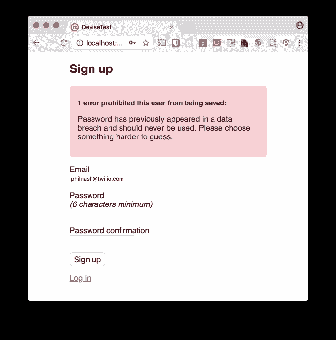

# 使用 Pwned 密码 API 在 Ruby 应用程序中使用更好的密码

> 原文：<https://dev.to/twilio/better-passwords-in-ruby-applications-with-the-pwned-passwords-api-4o9f>

在 Twilio，我们是使用第二个因素来保护用户账户的粉丝，但这并不意味着我们忘记了第一个因素。鼓励用户选择强密码仍然是他们账户的第一道防线。

Troy Hunt 花了几年时间从公开的数据漏洞中收集密码列表，并在之前向[提供了一个 API 来检查密码是否被使用过。这篇文章将向你展示如何通过检查 pwned 密码 API 来鼓励你的用户使用更强的密码。](https://haveibeenpwned.com/API/v2#PwnedPasswords)

## Pwned 密码 API

2017 年，NIST ( [国家标准与技术研究所](https://en.wikipedia.org/wiki/National_Institute_of_Standards_and_Technology))作为其[数字身份指南](https://www.nist.gov/itl/tig/projects/special-publication-800-63)的一部分，建议针对现有的公开数据泄露检查用户密码。这个想法是，如果一个密码在此之前已经出现在数据泄露中，那么它就被认为是泄露的，不应该被使用。当然，这些建议还包括[使用双因素认证来保护用户账户](https://www.twilio.com/docs/tutorials/two-factor-authentication-ruby-rails)。

[Pwned Passwords API](https://haveibeenpwned.com/API/v2#PwnedPasswords) 允许您检查潜在的密码是否已经作为 web 上大量数据泄露的一部分而暴露。有一个在线版本的 API，你可以[输入一个密码，看看它是否在](https://haveibeenpwned.com/Passwords)之前被使用过。如果有，它还会显示出现的次数。该数据有超过 500，000，000 个以前使用过的唯一密码。

当你这样做的时候，用你的电子邮件地址检查主 [haveibeenpwned](https://haveibeenpwned.com/) 服务，看看你的凭证是否有任何数据泄露。剧透警报，大概有吧！

### API

Pwned 密码 API 允许我们对照密码数据库检查密码。根据研究结果，我们可以建议用户在注册服务、登录或更改密码时选择更好的密码。

一想到要将所有用户的密码发送给第三方，你的安全意识可能会感到兴奋。谢天谢地，你不必担心。

您只需使用 [SHA-](https://en.wikipedia.org/wiki/SHA-1) [1](https://en.wikipedia.org/wiki/SHA-1) 散列密码并发送结果的前 5 个字符，而不是发送整个密码。这将返回数据集中以这 5 个字符开头的所有哈希，如果哈希的剩余部分存在，则密码在列表中。[你可以在这篇文章](https://www.troyhunt.com/ive-just-launched-pwned-passwords-version-2/)中读到更多关于这项技术、密码转储和 API 的内容。

让我们看看如何在一个 Ruby 应用程序中使用这种方法，使用两个 gem 来抽象这个过程。

## Ruby 中的 Pwned 密码

如果你想在任何 Ruby 应用程序中使用 Pwned 密码 API，那么我有 gem 给你。它叫做 [pwned](https://rubygems.org/gems/pwned) ，它使得根据 API 检查密码变得非常容易。
你可以在 GitHub 上查看 pwned 的所有[文档，但这里是你如何开始。](https://github.com/philnash/pwned)

安装宝石:

```
gem install pwned 
```

Enter fullscreen mode Exit fullscreen mode

打开一个 irb 会话进行测试。

```
irb -r pwned
> password = Pwned::Password.new("password")
> password.pwned?
#=> true
> password.pwned_count
#=> 3303003 
```

Enter fullscreen mode Exit fullscreen mode

好吧，那怎么样。密码“password”在公开数据泄露事件中已经出现*超过 300 万次*。😱

您也可以使用快捷方式:

```
> Pwned.pwned?("password1")
#=> true
> Pwned.pwned_count("password1")
#=> 2310111 
```

Enter fullscreen mode Exit fullscreen mode

哇哦。“密码 1”几乎一样糟糕！像这样玩数据很有趣，但是如果你想在一个真实的应用程序中使用它呢？你可以直接使用 gem，但是如果你使用 Rails 的话，那就太好了。

## Pwned 密码和 Rails

我们之前在这个博客上看过[如何编写主动模型验证器](https://www.twilio.com/blog/2017/06/validate-ruby-objects-with-active-model-validations.html)。这种[抛光宝石带有一个开箱](https://github.com/philnash/pwned/blob/master/lib/pwned/not_pwned_validator.rb)。如果你正在使用 Rails，你可以通过添加 gem 到你的`Gemfile` :
来使用这个验证器

```
gem "pwned", "~> 1.2.1" 
```

Enter fullscreen mode Exit fullscreen mode

运行`bundle install`安装 gem。现在您可以在您的模型中访问一个`:not_pwned`验证器。比如:

```
class User < ApplicationRecord
  has_secure_password

  validates :password, not_pwned: true
end 
```

Enter fullscreen mode Exit fullscreen mode

现在，根据 Pwned 密码 API 验证用户对象非常简单:

```
user = User.new(email: "<a class="c1" href="mailto:philnash@twilio.com">philnash@twilio.com</a>", password: "password!")
user.valid?
#=> false
user.errors.messages
#=> {:password=>["has previously appeared in a data breach and should not be used"]} 
```

Enter fullscreen mode Exit fullscreen mode

让我们尝试一个强密码短语(但不是[“正确的马电池钉”](https://xkcd.com/936/)——在被破坏的数据中出现两次):

```
user.password = "wet koalas are terrifying"
user.valid?
#=> true 
```

Enter fullscreen mode Exit fullscreen mode

在 validator 中还可以使用其他选项，比如设置密码在数据中出现的次数的阈值，或者在 API 返回错误时如何处理。详细信息见文档。

如果你使用 Rails 和[device](https://github.com/plataformatec/devise)，有一个更简单的方法来使用 API。

## Pwned 密码和设计

要将 API 与 device 一起使用，有一个不同的 gem 可用:[device-pwned _ password](https://github.com/michaelbanfield/devise-pwned_password)。要使用它，将宝石添加到您的`Gemfile` :

```
gem "devise-pwned_password", "~> 0.1.4" 
```

Enter fullscreen mode Exit fullscreen mode

运行`bundle install`安装宝石。现在您需要做的就是为您的`User`模型
添加`:pwned_password`选项到设计方法中

```
class User < ApplicationRecord
  devise :database_authenticatable, 
         :recoverable, :rememberable, :trackable, :validatable, :pwned_password
end 
```

Enter fullscreen mode Exit fullscreen mode

现在，当您的用户尝试注册时，Devise 将检查 Pwned 密码 API。

[T2】](https://res.cloudinary.com/practicaldev/image/fetch/s--f7-4ie8u--/c_limit%2Cf_auto%2Cfl_progressive%2Cq_auto%2Cw_880/https://twilioinc.wpengine.com/wp-content/uploads/2018/03/PKl6U6IBFObKYXVnrYvVyzDd6g1431Tx5zoNRB01EWvDocBaeYKuknJMWG4l5TVQy1bmcQJZWpGACJ8Sff2Swcs6hTYGru2xTai63F3g02OhJ1U0RIBdxB4U19zKS43xNyIERO4.png)

您还可以使用 Devise 插件在现有用户登录时警告他们的密码。为此，您需要在您的`ApplicationController` :
中覆盖`after_sign_in_path_for(resource)`

```
def after_sign_in_path_for(resource)
  set_flash_message! :alert, :warn_pwned if resource.respond_to?(:pwned?) && resource.pwned?
  super
end 
```

Enter fullscreen mode Exit fullscreen mode

## 高级选项

如果 API 在后台失败，[设计插件](https://github.com/michaelbanfield/devise-pwned_password)和 [pwned gem](https://rubygems.org/gems/pwned) 都会将密码标记为有效。有了 pwned gem，你可以[改变这种网络故障行为](https://github.com/philnash/pwned#network-errors-handling)。您可以将模型设置为无效，或者运行您自己的过程，以便记录错误。

如果您不想将只使用过一次或两次的密码标记为无效，这两个 gem 都提供了设置阈值的方法。通过 pwned，您可以在验证中设置阈值:

```
validates :password, not_pwned: { threshold: 1 } 
```

Enter fullscreen mode Exit fullscreen mode

使用 device-pwned _ password，打开`config/initializers/devise.rb`并添加以下配置:

```
config.min_password_matches = 2 
```

Enter fullscreen mode Exit fullscreen mode

要了解更多选项，请查看[密码](https://github.com/philnash/pwned)和[设计密码](https://github.com/michaelbanfield/devise-pwned_password)的文档。

## 更安全的用户，更安全的密码

使用 [Pwned 密码 API](https://haveibeenpwned.com/API/v2#PwnedPasswords) 您可以确保或鼓励您的用户在注册帐户、登录或更新密码时使用更好的密码。

正如我在开始时所说的，我还建议[在 Rails 应用程序中实现 2FA](https://www.twilio.com/blog/2016/01/two-factor-authentication-in-rails-4-with-devise-authy-and-puppies.html)以保证用户账户的安全。

你是否在寻求其他方法让你的用户使用更好的密码？你认为 Pwned 密码 API 是一个很好的工具吗？请在评论或 Twitter 上告诉我，地址是 [@philnash](http://twitter.com/philnash) 。

最后，在我编写 pwned gem 的初始版本时，我想对贡献了许多改进的 [Dmytro Shteflyuk](https://github.com/kpumuk) 表示感谢，包括 ActiveModel validator。谢谢！

* * *

*[使用 Pwned 密码 API 的 Ruby 应用中更好的密码](https://www.twilio.com/blog/2018/03/better-passwords-in-ruby-applications-pwned-passwords-api.html)最初发表于 2018 年 3 月 20 日 [Twilio 博客](https://www.twilio.com/blog)。*