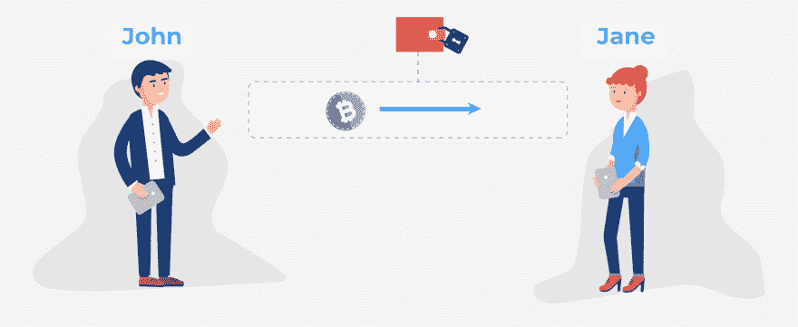
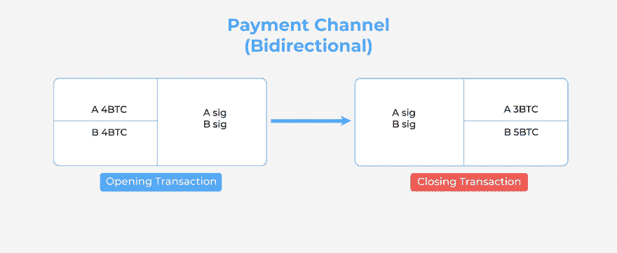

# 区块链交易的未来

> 原文：<https://dev.to/galyna_chekan/bidirectional-payment-channels-the-future-of-blockchain-transactions-3b02>

如果你一直关注区块链新闻周期，你会知道可扩展性问题仍然是比特币网络非常紧迫的问题。

目前，比特币上的区块每 10 分钟被挖掘一次，区块大小被限制在 1 兆字节。该网络每 10 分钟能够处理近 2000 笔交易，这意味着每秒只能处理约 3 笔交易。将这一能力与 Visa(约 1700 万亿次)或 Paypal(193 万亿次)的吞吐量相比，你会发现，在这一点上，比特币是一个慢得可怜的支付系统。

* * *

比特币是一个慢得可怜的支付系统。

[点击推文](https://twitter.com/share?text=Bitcoin+is+a+pathetically+slow+payment+system.&via=perfectial&related=perfectial&url=https://perfectial.com/blog/bidirectional-payment-channels-the-future-of-blockchain-transactions/)

* * *

为了解决这个问题，多年来，比特币核心开发者和社区提出了许多倡议。其中最有希望的包括[隔离证人](https://en.wikipedia.org/wiki/SegWit)、[施诺尔签名](https://en.wikipedia.org/wiki/Schnorr_signature)，当然还有支付渠道，这也是今天文章的主题。

在本帖中，我们将讨论支付渠道是如何工作的，以及采用支付渠道可能带来的结果。系好安全带。

## 什么是支付渠道？

在比特币被放入区块甚至被网络看到之前，每笔交易都经过了初步的离线签名。

如果约翰想给简一些比特币，他就建立一个交易，从他的钱包里发送输出。他用自己的私钥签名，然后将它广播给比特币区块链。直到后来，矿工们才知道它的存在，捡起交易，并最终将其写入分布式分类账(这个过程既费时又费钱)。

然而，使用支付通道，约翰可以“私下”进行相同的交易，永远不会向比特币网络显示。他可以即时、免费地进行点对点支付。

## 支付渠道是如何运作的？

如果没有 multisig 交易的出现，就不会有比特币或其他支付渠道，multi SIG 交易实际上是一种智能合同。

闪电网络(和其他支付通道规范)使用二对二的 multisig 地址，顾名思义，需要两个私钥来授权解锁资金。

[T2】](https://res.cloudinary.com/practicaldev/image/fetch/s--JzqJAzQj--/c_limit%2Cf_auto%2Cfl_progressive%2Cq_auto%2Cw_880/https://perfectial.com/wp-content/uploads/2018/02/img4.jpg)

它是这样工作的:假设约翰和简必须定期交易，而不是以传统方式进行交易，这将产生大量费用，他们创建了一个多签名地址，双方同意向该地址发送一定数量的比特币。为了清楚起见，让我们假设每个人贡献 4 个比特币，使得通道总共价值 8 个比特币。

***注*** :一般情况下不会这样，因为支付渠道更适合微支付。

除此之外，他们都创建了一个**秘密值**，并在彼此之间交换它的**散列值**。

然后，John 为开始的事务构建了一个后续事务；在闪电网，这叫承诺交易。当他试图给简一个比特币时，他给自己发送了 3 个比特币，其余 5 个发送到一个多签名地址，该地址中有一个 [CSV 锁](https://en.bitcoin.it/wiki/Timelock)。如果 Jane 试图从中获得资金，她将不得不等待一段时间(例如，直到 100 个新区块被开采并被写入区块链)才能解锁硬币。

[T2】](https://res.cloudinary.com/practicaldev/image/fetch/s--lt1kANKI--/c_limit%2Cf_auto%2Cfl_progressive%2Cq_auto%2Cw_880/https://perfectial.com/wp-content/uploads/2018/02/img3-4.jpg)

同时，John 也可以清空地址，但是他需要一个秘密值，Jane 已经给了他这样做的散列值。

在签署交易后，约翰将交易直接交给简(而不是广播给比特币)。

接下来，简准确地模仿了约翰所做的。她也创建了一个后续的承诺交易，但向自己发送了 5 个比特币，向 multisig 地址发送了 3 个。这些限制对她来说也是有效的——她知道 Bob 在 100 个新区块被开采出来之前无法获得资金，并且她无法在不应用 John 的秘密(她有一个 hash)的情况下解锁这些区块。因此，Jane 将已签名的半有效交易发送给 John，最后，他们广播了开始的交易(并向矿工支付费用)以开始支付通道。

两个承诺交易仍然半有效；约翰和简都没有签署和广播它们，因为那样会关闭他们的支付渠道。

至此，我们完成了第一笔“付款”。

现在，如果约翰想向简发送另一个比特币(或者简想发回一个)，他们会创建另一对后续交易——这一次没有开始的交易。可以说，它们重新分配通道上的平衡并更新其状态。它们创建新的秘密值和散列，同时在彼此之间交换来自第一次交易的旧秘密。

这样做是为了确保信任。

如果简决定自己关闭频道(通过向网络广播第一个承诺交易),约翰会马上得到他的 3 个比特币。另一方面，Jane 必须等到开采完 100 个新区块后才能获得 CSV 锁定的资金。但是，正如我们前面提到的，有两种方法可以从 multisig 地址中解锁资金——John 可以通过使用 Jane 刚刚给他的秘密(来自第一次交易),抢先获得资金。所以，如果她决定出轨，约翰会得到所有的钱。

反过来也一样。约翰知道简可以利用他的秘密泄露地址；他受到强烈的激励，保持良好的行为。

一旦支付通道被打开并被记录到不变的区块链中，约翰和简就可以无限期地通过它进行交易，而不会产生任何费用。只有当他们决定关闭频道时，他们才能再次获得报酬。

[T2】](https://res.cloudinary.com/practicaldev/image/fetch/s--B6Vv9N3A--/c_limit%2Cf_auto%2Cfl_progressive%2Cq_auto%2Cw_880/https://perfectial.com/wp-content/uploads/2018/02/img2-4.jpg)

如果您想了解更多关于支付渠道和区块链理工大学的信息，请联系我们的专家。他会很乐意为你提供免费咨询。

帖子[双向支付渠道:区块链交易的未来](https://perfectial.com/blog/bidirectional-payment-channels/)最早出现在[软件公司完美](https://perfectial.com)上。