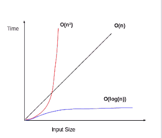

# 大 O 符号和算法复杂性分析

> 原文：<https://dev.to/geeksambhu/big-o-notation-and-algorithmic-complexity-analysis--71c>

### 简介

当使用算法执行一个特定的任务时，每个问题解决者都想到的一个共同点是高效快速的算法来解决这个问题。但是，快速和高效到底意味着什么呢？

它是真实处理时间的度量吗？

不，它不是秒和分之类的实时指标，因为与新的英特尔 i3 处理器相比，采用奔腾处理器的旧计算机可能需要更长的时间来处理相同的算法，或者，用汇编编写的坏算法可能比用`python`编写的好算法执行得更快。

因此，不能用程序的运行时间来衡量算法的效率。

因此，为了测量算法效率，引入了程序的**渐近复杂性**的概念和描述这种复杂性的符号，称为**大 O** 。**大 O** 是最坏的情况，**大ω**和**大θ**是最好和一般的情况符号。最坏的情况意味着我们在那个问题领域最不走运，也就是说，任务的前提条件对我们不利。复杂性分析是一种工具，它允许我们解释当输入变大时算法如何表现。

### 场景

将大小为`10000`的数组与大小为`100`的数组进行排序，并分析程序的运行时间是如何增长的。

现在，让我们潜得更深，

**统计字符串中的字符数:**

一种最简单的方法是逐个字母地遍历整个字符串，并将计数器变量递增 1。这种算法方法相对于字符串中的字符数' **n** '以线性时间运行，即它以 **O(n)运行。**

**为什么？？**

使用这种方法，遍历整个字符串所需的时间与字符串中的字符数成正比，即遍历 40 个字符的字符串所需的时间是遍历 20 个字符的字符串所需时间的两倍，因为查找单个字符所需的时间是相同的。

另一种方法是，在程序的早期，即在存储第一个字符之前，声明一个变量并存储变量中的字符数，比如“长度”。现在，没有必要查看字符串，而是必须检查变量的值。这种变量的存取一般是渐近常数时间操作，或 **O(1)。**这是因为渐近意味着“运行时间如何随着输入的增长而变化”。在这种方法中，字符串的长度无论是一个字符还是数千个字符，我们唯一需要做的就是找到字符串长度，这可以通过读取“length”变量来完成，这个变量的读取时间是常数，与字符串大小无关。因此，这种方法可以称为恒定时间运行。

**O(1)** 不随输入的大小而变化。

### 变化多端

有许多不同的大 O 运行时，如 **O(n)、O(n** 等

**O(n** )在渐近上比 **O(n)** 慢，即如果 **n** 增长 **O(n** )将比 **O(n)花费更多的时间。**

这并不意味着 **O(n)** 总是运行得更快，也许如果输入更小，那么 **O(n** 可能运行得更快而不被注意到

类似地，我们可能有对数 **O(log(n))** 用于某些情况，比如在二分搜索法。二分搜索法每次运算都会将数组大小减半。

简单的程序可以通过计算嵌套循环的数目来分析。

*   n 个项目上的单个循环具有 **O(n)** 复杂度。
*   循环中的循环具有 **O(n** )的复杂度

|  |
|大魔神变型|

关于这个的原博文在这里[。](https://www.shivagaire.com.np/2017/05/05/big-oh-notation-and-algorithmic.html)