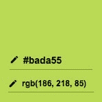

# 二进制和十六进制:第 2 部分-转换

> 原文：<https://dev.to/rpalo/binary-and-hexadecimal-part-2---conversions-m65>

在上一篇文章中，我们发现了数两个数的纯粹乐趣——数两个数！-新的数字系统:二进制和十六进制。

但是会数数只是第一步。要真正释放这些数字系统的力量，你必须能够在它们之间转换。如果你知道如何使用搜索引擎，那么你就已经知道如何输入“将 11001 转换成十进制”。但是，为了快速转换(也为了好玩)，最好知道它们是如何组合在一起的。

## 批注上的注释

有时你可能会看到人们用`0b`开头来表示二进制数，比如`0b11011101`。这只是给你一个线索，让你知道你在看什么样的数字。如果你在看一个十六进制数，它可能以`0xFCDE23`中的`0x`开始。

## 二进制- >十进制

如果你还记得，在上一篇文章中，我们讨论了二进制中的数字如何表示两个的**次方。这里有一张漂亮的表格提醒你:**

| 数字(2 的幂) | seven | six | five | four | three | Two | one | Zero |
| --- | --- | --- | --- | --- | --- | --- | --- | --- |
| 小数值 | One hundred and twenty-eight | Sixty-four | Thirty-two | Sixteen | eight | four | Two | one |

所以，当你遇到一个二进制数时，你要做的就是算出每个数字的十进制值，然后把总数加起来！假设您正在转换二进制数`1101 0011`。

| 二进制数字 | one | one | Zero | one | Zero | Zero | one | one | 总数 |
| --- | --- | --- | --- | --- | --- | --- | --- | --- | --- |
| 小数值 | One hundred and twenty-eight | Sixty-four | Zero | Sixteen | Zero | Zero | Two | one | Two hundred and eleven |

没错！二进制的`1101 0011`等于十进制的`211`。如果你对某个数字的值感到困惑，一种解决方法是在一张纸上列出一系列数字，从右向左。从 1 开始，下一个数字加倍。一倍等于二，二倍等于四，四倍等于八，以此类推。

```
128 <- 64 <- 32 <- 16 <- 8 <- 4 <- 2 <- 1 
```

然后看看你的二进制数。哪里有零，就把那个数字划掉！

```
128 <- 64 <- XX <- 16 <- XX <- XX <- 2 <- 1 
```

现在你可以把剩下的加起来。

## 十进制转为二进制

从十进制到二进制有点难。有几种不同的方法来做这件事。两种方式我都给你，你可以自己决定有没有你更喜欢的。

### 减法

我个人比较喜欢这个方法。它更适合我的大脑。如果你能很好地记住 2 的幂，这个版本就很好。请记住，我们将从左(最大)到右(最小)填充二进制数字。我会给你一个循序渐进的指导，并搭配一个例子。它是这样工作的:

1.  从您要转换的数字开始。我们将使用在上一节中使用的相同的 211，这样我们可以检查我们的工作。
2.  求**的最大**的二次方，即**小于**的数来换算。在这种情况下，256 (2^8)太大了。不过，128 (2^7)比 211 小，所以刚刚好。
3.  在一张纸上(或屏幕上)标出 1 的二次方。
4.  从你主数中减去 2 的幂(128)。在这种情况下，结果是 211 - 128 = 83。
5.  按 2 的 1 次方下台。2^6 今年 64 岁。如果 64 **小于**当前值(实际上是),则将 2 的幂标记为 1，然后再次减去。例如，我们将标记 1，得到 83 - 64 = 19。
6.  将二的幂继续下去。对于任何异能，如果该异能比你当前的数字大**(这样你就不能减去并得到正的结果)，则该异能标记为 0，并且不减去任何东西。继续 2 的下一次幂。在我们的例子中，32 是 2 的下一次幂，它大于 19。所以，标记一个零，继续前进。**
7.  2 的下一次幂是 16，小于 19。所以标个 1，做 19 - 16 = 3。
8.  接下来是 8。8 大于 3，所以标个零，不要减。
9.  接下来是 4。4 大于 3，所以标个零，不要减。
10.  接下来是 2。2 小于 3，所以标上 1，减去:3 - 2 = 1。
11.  接下来是 1。1 等于 1，所以标个 1，减去:1 - 1 = 0。
12.  一旦数到零，就停下来！你完了。看看你的分数。你应该有:

```
1 1 0 1 0 0 1 1 
```

这与上一节中的内容相符吗？是啊！成功！

如果这种方式看起来没有多大意义，那完全没问题。还有一种方法不需要你记住 2 的幂。

### 对方道:师

对于这种方法，我们从**右(最小)到左(最大)**填充二进制数字。我们将再次使用 211。对于这些计算中的每一个，我们都要除以 2(有余数的底数除法)。确保跟踪结果值*和*的余数。余数表示二进制数字，结果值是我们将用于下一轮计算的值。我们开始吧:

1.  从你的号码开始。除以 2。1 还有余数吗？如果是，请标记 1。否则，标记 0。在我们的例子中，211 / 2 = 105，余数为 1。所以，我们记住 105，标上 1。
2.  重复一遍。105 / 2 = 52，余数 1。记得 52，标个 1。
3.  52 / 2 = 26，余数为 0。记得 26，标个 0。
4.  26 / 2 = 13，余数为 0。记得 13，标个 0。
5.  13 / 2 = 6，余数 1。记 6，标个 1。
6.  6 / 2 = 3，余数为 0。记住 3，标个 0。
7.  3 / 2 = 1，余数 1。记住 1，标个 1。
8.  1 / 2 = 0，余数为 1。标个 1，就完事了！

所有加在一起(再次，这次从**右到左**，我们的二进制数字是:

```
1 1 0 1 0 0 1 1 
```

我们再次取得了甜蜜的胜利！

## 十六进制到十进制

这件事真正酷的是你已经知道如何做这件事了，只是你还不知道而已。这和二进制到十进制的转换是一样的。每个位置都有一个值，你把所有的数字加起来！不过这一次，每个地方都是 16 的幂。老实说，对于大于两位数的十六进制值，我总是使用计算器或其他工具。我只记得 2 的前三次幂:16^0 = 1，16^1 = 16，16^2 = 256。 *256、你说！那个*是*一个容易记住的数字。我会永远记住的！*

先做一个短例子，再做一个长例子。首先，让我们试着把`6C`转换成十进制。我们在“16”的位置有 6，在“1”的位置有`C`(或 12)。

| 十六进制数字 | six | C | 总数 |
| --- | --- | --- | --- |
| 小数值 | 6 * 16^1 = 96 | 12 * 16^0 = 12 | One hundred and eight |

没错！`6C`在二进制中等于 108。

您会注意到两个十六进制数字可以包含 0 到 255 之间的所有值。对于那些注意的人来说，你可能认识到 0 - 255 也是可以用 8 个二进制数字或者一个字节显示的值！这很有用，因为 CSS 之类的东西在引用该范围内的值时通常使用十六进制数字。现在，您可以将十六进制颜色的`#BADA55`转换为 RGB 值:

1.  R: BA = `11*16 + 10*1` = 186
2.  G: DA = `13*16 + 10*1` = 218
3.  55 = `5*16 + 5` = 85

所以我们知道`#BADA55`是一种带有相当多绿色、中高量红色，而不是大量蓝色的颜色。

[T2】](https://res.cloudinary.com/practicaldev/image/fetch/s--ykCaoanS--/c_limit%2Cf_auto%2Cfl_progressive%2Cq_auto%2Cw_880/https://assertnotmagic.com/img/bada55.jpeg)

**表白！**

## 十进制转为十六进制

同样，将十进制数转换为十六进制数的过程与将二进制数转换为十进制数的过程相同。可以使用任何一种二进制方法(减法或除法)。

> 一旦我们了解了如何在二进制和十六进制之间来回转换，您可能会认为先将十六进制转换为二进制，然后再将二进制转换为十进制更容易。你想怎么做就怎么做！

我们做一个除法的例子来确认一下。让我们把 108 转换成十六进制来检查我们的答案。再次记住，因为我们在做除法，我们必须从右到左写下十六进制数字。

1.  从 108 开始。除以 16。108 / 16 = 6，余数 12。最右边的数字是 12，即`C`。
2.  6 / 16 = 0，余数 6。下一个数字是 6。

总共 108 进制是`6C`！再次成功！

## 十六进制转为二进制

十六进制和二进制的好处是 16 是 2 的倍数。事实上，16 = 2^4.当把十六进制转换成二进制时，你可以把每个十六进制数字转换成四个二进制数字，反之亦然。如何将十六进制的一位数转换成二进制的四位数取决于你。当我这样做时，它归结为一点记忆和转换成十进制的结合。

让我们来看看。让我们把`DB`从十六进制转换成二进制。

1.  `D`在十六进制中是十进制的 13。
2.  接下来，我们算出需要哪 4 个二进制数字来构成 13。13 是 8 + 4 + 1。二进制中的那些位是:`1101`。
3.  因此，第一个数字`D`的二进制转换为`1101`。
4.  下一个数字是`B`。同样的过程。`B`是十进制的 11。
5.  用二进制表示 11:8+2+1，即`1011`。
6.  由此，B = `1011`。

Soooo，组合一切，hex 中的`DB`和`1101 1011`一样。我有没有计划让二进制数如此对称？不。我会为此邀功吗？绝对的。

## 二进制到十六进制

走另一条路，过程正好相反。我们将再次把`1101 1011`从二进制转换成十六进制来检查我们的工作。

1.  让我们把我们的二进制数分成 4 个一组(就像我一直在做的):`1101 | 1011`。
2.  现在我们将第一个块转换成十进制:`1101 = 8*1 + 4*1 + 2*0 + 1*1 = 13`。
3.  十进制的 13 转换成十六进制的`D`。我们的第一位数字是`D`！(不出所料。)
4.  下一大块二进制:`1011 = 8*1 + 4*0 + 2*1 + 1*1` = 11。
5.  十进制的 11 转换成十六进制的`B`。我们的第二位数是`B`！

最后，我们最终的十六进制数是`DB`。就像我们想的那样。

## 真正的力量...权力

就是这样！勇往直前，征服世界各地的数字。用二进制语言和你的朋友交谈，让他们大吃一惊(或者，可能会被嘲笑为超级书呆子😁)，通过目测十六进制代码来简化您的 CSS 编码，并对理解计算机和数学的工作原理感觉很好。这些转换技巧中有很多将会应用到其他数字系统中:试着查找八进制，并在八进制和八进制之间做一些转换！

像往常一样，数学可能有点吓人，所以如果你有任何问题或者对你的数字-fu 没有 100%的信心，请随时联系我，我很乐意展示更多的例子，帮助你跟上速度。

* * *

*原帖 [`assert_not magic?`](https://assertnotmagic.com/2018/09/16/binary-and-hexadecimal-part-2-conversions/)*