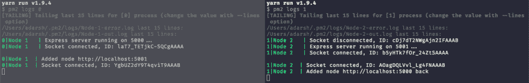
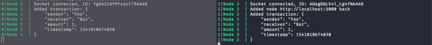
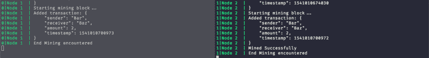
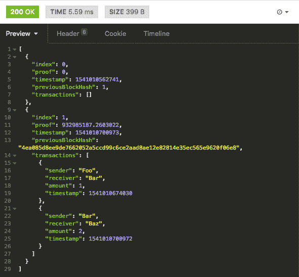

# 使用 NodeJS 和 Socket.io 的区块链

> 原文：<https://dev.to/sadarshannaiynar/blockchain-using-nodejs-and-socketio-5gbe>

我对区块链的概念非常着迷，区块链是一种基于分散信任的系统，用于传输和验证通过网络发送的数据。它所基于的概念非常简单，所以为了理解其中的概念，我决定创造我自己的区块链，很快这些概念就变成了说起来容易做起来难的故事。所以让我来演示一下什么是区块链以及如何创建它。

## 区块链 101

首先，区块链不是加密货币。区块链是加密货币背后的技术，类似于互联网是电子邮件背后的技术。它是维护分布式数字分类账的过程，该分类账包含一系列链接在一起且不会损坏的记录。这是一项革命性技术的简单定义。它扰乱了许多领域，如医药、物流、教育和金融(大部分)。让我们来看看区块链的组成部分。

### 区块链的组成部分

1.  块:它是一个数据集合，通常有一个数据单元大小或数量的上限。

2.  链:它是由使用前一个块的信息的算法链接在一起的块的集合。

3.  节点:区块链的一个系统，用于核实区块的真实性，并维护按时间顺序记录所有区块的数字分类账。

这些只是组成区块链的组成部分。真正让区块链变得安全的是相关的过程。

### 开采一块

挖掘是生成新块并将其添加到网络中的过程，它包括两个过程。

1.  工作生成的证明:
    如前所述，使用一种算法来链接块，该算法利用前一块的信息来生成下一块。这种算法被称为工作证明，通常以这样一种方式设计，即很难生成输出，但很容易验证输出。

2.  工作验证证明:
    当网络中的一个节点成功生成块时。网络中的其余节点必须验证证据和链的真实性。因此，节点验证证明是否正确，并检查链的真实性。如果一切正常，则该块被挖掘，并且所有其他节点更新它们的分类帐以包括新挖掘的块。

### 区块链的事件流程

让我们来看看向区块链添加数据时事件是如何展开的

1.  从发送者到链中的一个节点接收交换数据的请求。

2.  然后，该节点向其他节点广播关于其他节点的传入数据，并将其添加到当前事务池中。

3.  一旦达到块的限制(单位的大小或数量)。节点开始挖掘该块。

4.  这些节点相互竞争以找到工作证明解决方案。当其中一个节点成功挖掘时，它会广播解决方案。

5.  然后，其他节点验证输出并检查是否有效。然后，他们验证链中的块，并添加新挖掘的块。

## 打造自己的区块链

现在我们已经学习了基本原理，让我们开始创建我们自己的区块链。我已经决定使用 Socket.io 来实现跨节点的实时通信系统。让我们继续创建模型。

### 型号

交易模式:

```
class Transaction {
  constructor(sender, receiver, amount) {
    this.sender = sender;
    this.receiver = receiver;
    this.amount = amount;
    this.timestamp = Date.now();
  }

  /* Stringfying and Parser functions */ 
}

module.exports = Transaction; 
```

这个模型非常简单，我们有发送者、接收者、金额和时间戳等数据。

积木模型:

```
const crypto = require('crypto');

const Transaction = require('./transaction');

class Block {
  constructor(index, previousBlockHash, previousProof, transactions) {
    this.index = index;
    this.proof = previousProof;
    this.previousBlockHash = previousBlockHash;
    this.transactions = transactions;
    this.timestamp = Date.now();
  }

  hashValue() {
    const { index, proof, transactions, timestamp } = this;
    const blockString= `${index}-${proof}-${JSON.stringify(transactions)}-${timestamp}`;
    const hashFunction = crypto.createHash('sha256');
    hashFunction.update(blockString);
    return hashFunction.digest('hex');
  }

  setProof(proof) {
    this.proof = proof;
  }

  getProof() {
    return this.proof;
  }

  getIndex() {
    return this.index;
  }

  getPreviousBlockHash() {
    return this.previousBlockHash;
  }

  /* Stringify and Parsing functions */
}

module.exports = Block; 
```

块的重要方面是`hashValue()`和`previousBlockHash`。`hashValue()`负责创建块的哈希值。它生成块的字符串表达式，并发送给 NodeJS `crypto`模块的`createHash()`函数，并使用指定的`sha256`算法创建散列。然后将生成的散列存储在`previousBlockHash`中的下一个块中。

链条型号:

```
const Block = require('./block');

const actions = require('../constants');

const { generateProof, isProofValid } = require('../utils/proof');

class Blockchain {
  constructor(blocks, io) {
    this.blocks = blocks || [new Block(0, 1, 0, [])];
    this.currentTransactions = [];
    this.nodes = [];
    this.io = io;
  }

  addNode(node) {
    this.nodes.push(node);
  }

  mineBlock(block) {
    this.blocks.push(block);
    console.log('Mined Successfully');
    this.io.emit(actions.END_MINING, this.toArray());
  }

  async newTransaction(transaction) {
    this.currentTransactions.push(transaction);
    if (this.currentTransactions.length === 2) {
      console.info('Starting mining block...');
      const previousBlock = this.lastBlock();
      process.env.BREAK = false;
      const block = new Block(previousBlock.getIndex() + 1, previousBlock.hashValue(), previousBlock.getProof(), this.currentTransactions);
      const { proof, dontMine } = await generateProof(previousBlock.getProof());
      block.setProof(proof);
      this.currentTransactions = [];
      if (dontMine !== 'true') {
        this.mineBlock(block);
      }
    }
  }

  lastBlock() {
    return this.blocks[this.blocks.length - 1];
  }

  getLength() {
    return this.blocks.length;
  }

  checkValidity() {
    const { blocks } = this;
    let previousBlock = blocks[0];
    for (let index = 1; index < blocks.length; index++) {
      const currentBlock = blocks[index];
      if (currentBlock.getPreviousBlockHash() !== previousBlock.hashValue()) {
        return false;
      }
      if (!isProofValid(previousBlock.getProof(), currentBlock.getProof())) {
        return false;
      }
      previousBlock = currentBlock;
    }
    return true;
  }

  /* Stringify and Parsing functions */
}

module.exports = Blockchain; 
```

链条有两个主要部件`currentTransactions`和`blocks`。`currentTransactions`包含一个尚未挖掘到块中的事务列表。`blocks`包含根据开采时间排序的区块链中所有区块的列表。上述链的块大小也是 2 个事务。

在构造函数中，我们将`blocks`设置为最初有一个单独的块，其中`index`为`0` `previousBlockHash`为`1``proof`为`0`。这也称为初始块。但是我们有一个传递给链的块列表，我们只是用它收到的值`blocks`。

`addNode()`功能负责将当前节点与区块链网络的其他节点连接起来。`mineBlock()`函数将被挖掘的块添加到链中，并通知其他块结束挖掘。

最重要的方法是`newTransaction()`和`checkValidity()`。当节点收到事务请求时，调用`newTransaction()`方法。我们将事务推送到`currentTransactions`池。如果`currentTransaction`池的大小是 2，我们开始开采区块。我们首先获得当前链的最新块。我们用最新块的`hashValue`、`index`和`currentTransactions`池创建一个块。然后，我们通过将最新块的`proof`传递给`generateProof()`方法来生成工作证明的解决方案(我们将在后面研究这个实现)。一旦解决方案到达，我们设置新创建的块的证明。然后，我们重置`currentTransaction`池，并使用`dontMine`标志检查该区块是否可以开采。如果能开采出来，我们就在这个街区继续开采。

`checkValidity()`方法从初始块开始检查链的有效性。我们得到`currentBlock`和`previousBlock`，我们检查当前块的`previousHash`是否与前一块的`hashValue`相同。如果它们不匹配，我们拒绝。然后，我们检查当前块和先前块之间的证明的有效性。如果他们也不匹配，我们拒绝链。然后我们检查`currentBlock`是否是`previousBlock`。我们这样做，直到链结束，然后返回真，如果没有发现差异。

上面提到的对块的验证使得区块链不可能被破坏和改变。如果攻击者必须更改`currentBlocks`数据，他必须更改`previousBlocks`数据，因为我们的哈希计算是基于这些数据的。如果数据改变，散列也改变，因此他必须这样做，直到初始块。另一个安全方面来自证明生成。如果攻击者改变了对块的篡改，则证明解决方案也会改变，因此攻击者必须从初始到被篡改的块一直生成证明，这可能会花费大量时间，因为证明的计算不是非常简单和容易的。

### 工作证明的生成和验证

```
const crypto = require('crypto');

const generateProof = (previousProof) => new Promise((resolve) => {
  setImmediate(async () => {
    let proof = Math.random() * 10000000001;
    const dontMine = process.env.BREAK;
    if (isProofValid(previousProof, proof) || dontMine === 'true') {
      resolve({ proof, dontMine });
    } else  {
      resolve(await generateProof(previousProof));
    }
  });
});

const isProofValid = (previousProof, currentProof) => {
  const difference = currentProof - previousProof;
  const proofString = `difference-${difference}`;
  const hashFunction = crypto.createHash('sha256');
  hashFunction.update(proofString);
  const hexString = hashFunction.digest('hex');
  if (hexString.includes('000000')) {
    return true;
  }
  return false;
};

exports.generateProof = generateProof;
exports.isProofValid = isProofValid; 
```

这是任何区块链采矿中最耗时也是最关键的部分。工作证明是对一个更难解决但更容易验证的问题的解决方案。一个例子是生成两个大素数，当它们相乘时可以被 5 整除。寻找两个大质数是一项艰巨的任务，我们必须通过数百万种组合才能找到一种可能的解决方案。但是验证这两个大素数的乘积是否能被 5 整除还是很容易的。

我们将生成算法包装在一个`setImmediate`函数中，并进一步包装在一个`Promise`下。好了，现在你一定想知道为什么把它包在`setImmediate`下面。原因是我有一个环境变量，它标志着挖掘过程的结束。如果网络中的任何其他节点已经完成了对一个块的挖掘，我将该变量设置为`true`。如果我将生成算法包装在一个`while`循环中，它会阻塞事件循环，并且永远不会检查环境变量的状态，直到它完成一个解决方案。`setImmediate`允许它绕过该进程，等待当前进程执行完毕后再进行下一次生成。这允许我的程序中的另一个模块去改变环境变量的状态。它还允许我在调用递归函数时绕过调用堆栈限制。

我们的工作证明问题很简单，当前和先前证明之间的差的哈希值必须包含六个连续的零。我们从一个随机数开始，然后乘以一个巨大的数。然后，我们验证证据是否满足条件，还验证是否设置了挖掘结束。如果它满足我们解决的价值，否则我们再试一次。我们重复这个过程，直到我们得到一个证明。

### 服务器 App

太好了，我们已经有了模型和生成设置，我们需要的只是一个工作服务器来协调动作并与区块链交互。

```
const app = require('express')();
const bodyParser = require('body-parser');
const httpServer = require('http').Server(app);
const axios = require('axios');
const io = require('socket.io')(httpServer);
const client = require('socket.io-client');

const BlockChain = require('./models/chain');
const SocketActions  = require('./constants');

const socketListeners = require('./socketListeners');

const { PORT } = process.env;

const blockChain = new BlockChain(null, io);

app.use(bodyParser.json());

app.post('/nodes', (req, res) => {
  const { host, port } = req.body;
  const { callback } = req.query;
  const node = `http://${host}:${port}`;
  const socketNode = socketListeners(client(node), blockChain);
  blockChain.addNode(socketNode, blockChain);
  if (callback === 'true') {
    console.info(`Added node ${node} back`);
    res.json({ status: 'Added node Back' }).end();
  } else {
    axios.post(`${node}/nodes?callback=true`, {
      host: req.hostname,
      port: PORT,
    });
    console.info(`Added node ${node}`);
    res.json({ status: 'Added node' }).end();
  }
});

app.post('/transaction', (req, res) => {
  const { sender, receiver, amount } = req.body;
  io.emit(SocketActions.ADD_TRANSACTION, sender, receiver, amount);
  res.json({ message: 'transaction success' }).end();
});

app.get('/chain', (req, res) => {
  res.json(blockChain.toArray()).end();
});

io.on('connection', (socket) => {
  console.info(`Socket connected, ID: ${socket.id}`);
  socket.on('disconnect', () => {
    console.log(`Socket disconnected, ID: ${socket.id}`);
  });
});

blockChain.addNode(socketListeners(client(`http://localhost:${PORT}`), blockChain));

httpServer.listen(PORT, () => console.info(`Express server running on ${PORT}...`)); 
```

该服务器由 express 和 socket 应用程序组成，这些应用程序被绑定到在特定端口上运行的 http 服务器。`/nodes`端点允许我们连接到另一个节点的 socket 应用程序，并发送信息让另一个节点连接回来。我们还将套接字侦听器绑定到创建的套接字连接。`/transaction`端点接收事务请求，并向其他节点广播事务信息。`/chain`端点列出了区块链的细节。还有一个套接字连接侦听器，它主动记录 ID 并监视节点之间的连接状态。最后，我们让服务器监听特定的端口。

### 套接字监听器

服务器应用程序仅充当套接字侦听器的门面，并且仅促进节点之间的连接。套接字监听器负责触发事件，例如向区块链添加事务、挖掘新的块以及向区块链网络中的其他节点发信号通知一个节点的成功挖掘状态。

```
const SocketActions = require('./constants');

const Transaction = require('./models/transaction');
const Blockchain = require('./models/chain');

const socketListeners = (socket, chain) => {
  socket.on(SocketActions.ADD_TRANSACTION, (sender, receiver, amount) => {
    const transaction = new Transaction(sender, receiver, amount);
    chain.newTransaction(transaction);
    console.info(`Added transaction: ${JSON.stringify(transaction.getDetails(), null, '\t')}`);
  });

  socket.on(SocketActions.END_MINING, (newChain) => {
    console.log('End Mining encountered');
    process.env.BREAK = true;
    const blockChain = new Blockchain();
    blockChain.parseChain(newChain);
    if (blockChain.checkValidity() && blockChain.getLength() >= chain.getLength()) {
      chain.blocks = blockChain.blocks;
    }
  });

  return socket;
};

module.exports = socketListeners; 
```

套接字监听其他节点发出的两个事件`ADD_TRANSACTION`和`END_MINING`事件。`ADD_TRANSACTION`监听器主动监听网络上任何节点触发的传入事务事件。通过调用链的`newTransaction`方法将其添加到区块链。

当其中一个节点成功挖掘块时，触发`END_MINING`事件。它将`BREAK`标志设置为 true，告知网络上的其他节点停止挖掘并开始验证解决方案。我们解析字符串化的链以返回正确的区块链，并调用解析链的`checkValidity()`方法。我们还检查被解析的链的长度是否大于当前链的长度。如果成功了，我们就用新的链条替换掉，否则我们就拒绝使用旧的链条。

我们已经设置了链的代码，让我们运行它，看看输出。

## 运行它...

我使用 PM2 来生成在不同端口上运行的应用程序实例。因此，一旦这两个实例启动并运行，我就从其中一个节点触发`/nodes`端点连接到另一个节点，输出是:

[T2】](https://res.cloudinary.com/practicaldev/image/fetch/s--8TXwQgAh--/c_limit%2Cf_auto%2Cfl_progressive%2Cq_auto%2Cw_880/https://thepracticaldev.s3.amazonaws.com/i/5x51v450kdalehd5s2hk.png)

输出显示，这两个节点之间已经成功建立了 websocket 连接。

然后我从其中一个节点触发`/transaction`端点。然后，它向另一个节点发出关于传入事务的信号，两个节点都将其添加到自己的事务池中。

[T2】](https://res.cloudinary.com/practicaldev/image/fetch/s--5Y4Ddqbz--/c_limit%2Cf_auto%2Cfl_progressive%2Cq_auto%2Cw_880/https://thepracticaldev.s3.amazonaws.com/i/4d67glv4ti8am572t4z1.png)

然后我再次触发`/transaction`，因为我们的块大小是 2，所以挖掘过程在两个节点上开始。当其中一个节点成功挖掘该块时，它发出挖掘结束的信号，并开始验证过程，一旦验证过程完成，新的链将在整个网络中被替换。

[T2】](https://res.cloudinary.com/practicaldev/image/fetch/s--uEl7i1nq--/c_limit%2Cf_auto%2Cfl_progressive%2Cq_auto%2Cw_880/https://thepracticaldev.s3.amazonaws.com/i/h79rqnrb6d5zfragzk78.png)

然后，当我点击`/chain`端点时，我收到了链中的块列表。

[T2】](https://res.cloudinary.com/practicaldev/image/fetch/s--zxeYGg3---/c_limit%2Cf_auto%2Cfl_progressive%2Cq_auto%2Cw_880/https://thepracticaldev.s3.amazonaws.com/i/owlqpq3lboxl4et7fzak.png)

就这样，我们使用 NodeJS 和 Socket.io 创建了自己的区块链

## 结论

我们创造了一个简单的区块链。这篇文章的全部目的是通过实际实施来总结治理和赋予区块链权力的基本过程。有一些概念，比如区块链的分叉，我还没有涉及到，但是建议你读一读。在这篇文章中，我几乎没有涉及到区块链交易中的其他流程，因为还有其他文章和文章深入讨论了区块链架构。我还将我的代码提交给了 GitHub，这样你就可以克隆这个库，并通过添加新的进程来进行试验；).

最后，当你想学习一些东西的时候，试着学习一些概念并自己去实现它们，这将帮助你对所涉及的技术有更深的理解和知识。