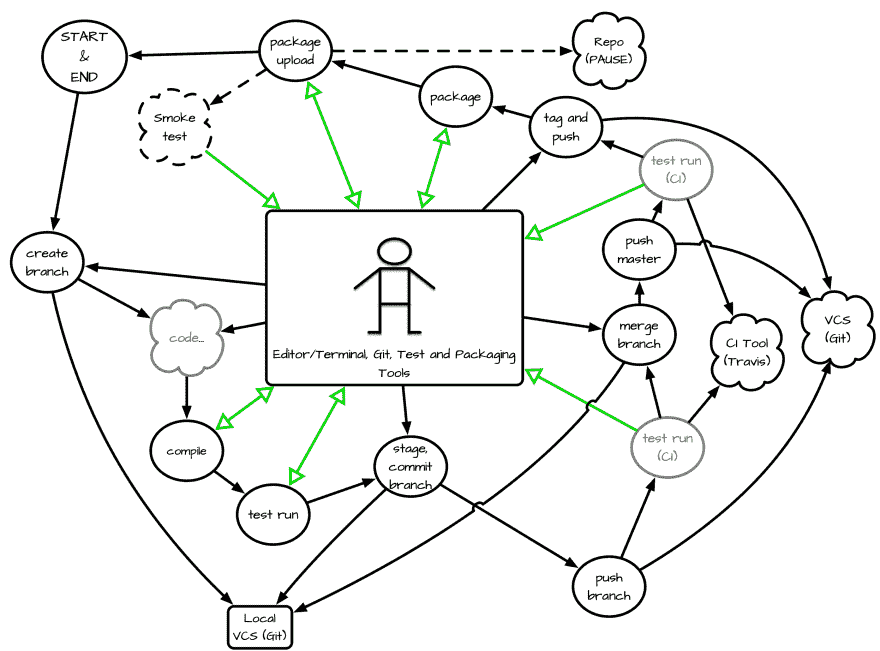

# 博客文章:反馈循环

> 原文：<https://dev.to/jonasbn/blog-post-feedback-loops-1gm5>

我经常听说，在开发软件时，反馈循环是最有价值的东西，因此对于我们这些软件专业人士(或者忙碌的业余爱好者)来说，反馈循环也是不可或缺的。

这让我开始思考

> 我的反馈回路实际上是什么？

我在想工作。

我没有决定在业余时间对编码的反馈循环进行试验，而是决定将我的反馈循环绘制在图纸上——这是你必须容忍我的地方，因为我不是艺术家。我来自一个非常艺术的家庭，但我是最不艺术的。相反，在谈到系统思考的*时，我比家里的其他成员更好。*

因为在我决定从我非常熟悉的东西开始之前，我从来没有概述过反馈循环，尽管它有时仍然会失败，这使得看看反馈循环是否有效和充分或者它是否都归结为`Error 40`，意思是反馈循环的消费者，用户-我:-)

无论如何，运用系统的思维和我有限的图形技能，我已经想出了这个*粗略的*草稿，它并不完美，也没有完全传达版本控制系统部分，但是由于这并不重要(*现在*)，我希望你能从中抽象出来。

该图描述了我的一个 **Perl** 发行版的开发过程，但它应该在某种程度上适用于其他编程语言，并且它是一个有趣的开始过程，其次是工具，然而我还没有评估其他工具链的过程，但至少现在你会得到图片。

如上所述，这是**我的**反馈回路，与你的或其他反馈回路的任何相似之处纯属巧合，使用相同的反馈回路所造成的任何伤害、代码丢失或睡眠时间由你自担风险。反馈回路就是反馈回路——简单的事件，最糟糕的事情是你忽视它们并承担后果。

[T2】](https://res.cloudinary.com/practicaldev/image/fetch/s--bIqYwy1k--/c_limit%2Cf_auto%2Cfl_progressive%2Cq_auto%2Cw_880/https://thepracticaldev.s3.amazonaws.com/i/tytekzgazua52i0zeh8q.png)

这个过程从左上角的 start 开始，也是我们结束的地方。因为这是一个不断重复的过程。

1.  我在编辑器中创建了一个分支，并开始编写代码。这有时是在终端中完成的，或者我选择一个现有的分支。

2.  我的编译步骤是我的第一次反馈，我可能会在我的编辑器中得到歪歪扭扭的线条，或者我的编译器或解释器发出错误消息或警告，这取决于我如何再次执行这个步骤。这有所不同，但反馈循环是存在的——工具链的这一部分使用得越有规律和越可靠，这是至关重要的。

3.  下一个反馈看起来是我的单元测试，这也可能是从编辑器或类似的地方触发的，或者如果你有对你的项目运行的监控，那么你可以不断地得到你的反馈。对我来说，后者已经被证明是最好的方法，因为忘记运行单元测试是我经常做的事情——你们都知道:*它编译——发布！*，这是我们想要避免的。对于 **Perl** ，我使用`provewatcher`(参见: [MetaCPAN](https://metacpan.org/pod/distribution/App-Prove-Watch/bin/provewatcher) )并且我知道其他语言和框架有类似的工具，当我开始在我的 **Perl** 工具链之外进行开发时，我已经开始寻找这种工具。与此同时，我通过 **Docker** 完成了这一步，取得了巨大的成功。

4.  完成后，我准备并提交我的分支。你可能在这里有钩子为你提供基于棉绒等的反馈。通过预提交挂钩或类似方式执行。我仍然在试验这个，所以我不想在这里描述它，因为这不是我在所有项目中做的事情。

5.  然后我按下 **GitHub** ，这触发了持续集成(CI ),这是我的下一个反馈循环。 **Travis** 也许能告诉我，我的代码是否在我的机器之外工作——同样，让我来说明:*它在我的机器上工作！？*。Travis 提供了一组有限的不同 Perl 解释器版本，甚至是操作系统，但是在这里我将自己限制在我决定支持的 Perl**版本上，在操作系统方面，我只坚持使用一个版本，稍后会详细介绍。**

6.  如果我发现结果令人满意，一切都通过了，我重复这一步，合并到主分支，Travis 拿起它，再次向我提供反馈循环。我经常不等待来自 **Travis** 的反馈，这让我痛苦了好几次，我希望我能阻止自己或鼓起耐心等待 **Travis** 的工作完成。限制操作系统和解释器版本的作业配置当然会加快速度。

7.  然后我进行标记和推送——这将导致另一个 **Travis** 作业正在运行，但是您会看到这对于整个过程并不重要。

8.  接下来是打包，这一步在 **Perl** 上下文中很有趣，因为根据您的工具箱，这一步可能会提供一个严重的反馈循环。我使用 [Dist::Zilla 的](http://dzil.org/) `dzil`，它可以运行冒烟测试，检查文档覆盖，代码和文档林挺和依赖检查(*到可能的程度*)，这大部分是我的单元测试的一部分(见前面的步骤)，但是如果`dzil`配置正确，我可以确保它在这里完成，并且我的包的完整性得到保证。

9.  然后，我将我新打包的发行版上传到 CPAN(暂停)，几分钟后，我得到了包的索引是否顺利的反馈。我在这一步观察到了一些问题，由于名称空间和元数据的一些问题，但不是破坏性的，但它确实需要一个新的版本。

10.  最后，如果我幸运的话，了不起的 [CPAN 测试人员](http://www.cpantesters.org/)可能会拿起我的贡献做一些冒烟测试，这意味着我的发行版可能会在更多我自己或 **Travis** 无法使用的操作系统上进行测试，并且会使用其他 **Perl** 解释器版本，而不是我在上述步骤中使用的版本。

为这个过程建立了大量的反馈循环——对我来说，下一步将是制定工作中的开发过程，看看我们是否有任何漏洞或明显的问题，这些都可以很容易地解决。

如果您有反馈、改进或问题，请发表评论-并尝试概述您自己的反馈循环，我发现后退一步并尝试从上面看问题有点刺激。