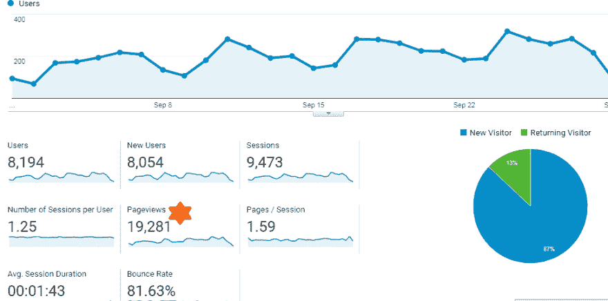

# 博客报告

> 原文：<https://dev.to/ajaydeveloper/blogging-report-5g6l>

你好，dev，我正在分享我的 9 月份分析报告，我不知道在这里分享是否正确，但我分享是因为我很开心，我想分享我的快乐。

[T2】](https://res.cloudinary.com/practicaldev/image/fetch/s--luuW4qSy--/c_limit%2Cf_auto%2Cfl_progressive%2Cq_auto%2Cw_880/https://thepracticaldev.s3.amazonaws.com/i/omg7l8z74dgsdqp0xbfi.png)

[九月月度分析报告-富人邮报](https://therichpost.com/september-month-analytics-report)

这是我努力工作的结果。今天写博客不是一件容易的事，但是如果你努力工作并对工作充满热情，那么写博客对实现生活中的某些目标是非常有益的

谢谢你的邮件