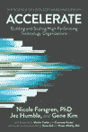

# 书评:加速

> 原文：<https://dev.to/wiredferret/book-review-accelerate-48el>

 [ Accelerate:精益软件和开发的科学:构建和扩展高性能技术组织](https://www.goodreads.com/book/show/39080433-accelerate)作者[Nicole Forsgren](https://www.goodreads.com/author/show/17037914.Nicole_Forsgren)
T8】我的评分: [5 颗星中的 5 颗](https://www.goodreads.com/review/show/2544581177)

这本书很好地总结了 DevOps 报告的总体发现，以及对试图说服自己进行 DevOps 转型的组织的启示。

当我读它的时候，我意识到如果你去几个 DevOps 日，听所有的转变故事，你会学到所有的东西，它可以总结为:

走得更快，更安全。

这是一件违反直觉的事情，但我有一个类比给你:当你试图教一个孩子骑自行车时，他们就像“你把我扔向柏油路，并大声叫我开快点？！？!"。你知道，即使他们不认为如果他们走得更快会更安全，但他们觉得这很危险。增加你的发布节奏就是这种感觉——你信任的人告诉你要做得更快，但改变你对沥青的想法是非常可怕的。

Forsgren、Humble 和 Kim 从科学的角度分析了为什么会这样，但我发现研究速度、心理安全和商业价值之间的相关性确实令人信服。

这本书的第二部分是对学术方法的非常不靠谱、书呆子式的分析，这给了其余部分很大的有效性，但我允许你跳过它，如果你只是想相信他们的话，数学是合理的。

第 3 部分是一家公司的案例研究，该公司目前正在实践书中提到的许多原则。它可能与每个人都不相关，但它很好地解释了它是如何工作的。

如果你正试图说服你的组织变得更加 devops-y，或者如果你想了解这样做的好处是什么，请阅读。同样，如果你想在论点中使用一些眉大相关数。

跳过 if:

你只会松，因为你做不到这种转化。

也看过:

凤凰计划

devo PS 手册

[查看我的所有评论](https://www.goodreads.com/review/list/19026-heidi)