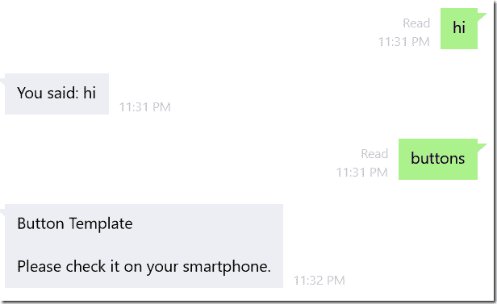
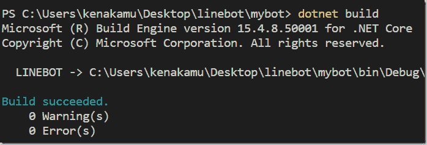
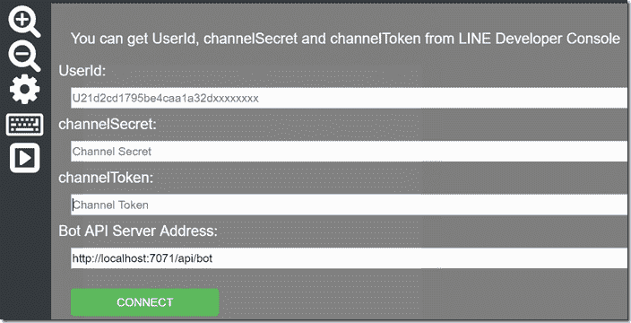
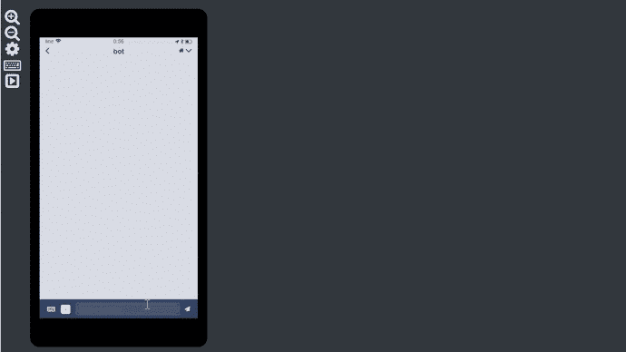

# 使用线路客户端模拟器提高线路机器人开发效率

> 原文：<https://dev.to/kenakamu/boost-line-bot-development-productivity-by-using-line-client-simulator--12o2>

作为开发人员，生产力是一个关键，这也是我使用 Visual Studio 等 IDE 的原因。当谈到线机器人开发，瓶颈是我需要使用物理设备来测试机器人。

# Windows 和 MacOS 的 LINE 客户端

当然，LINE 为非移动平台发布了客户端应用，但当我与 bot 交互时，它受到了限制。

[T2】](https://res.cloudinary.com/practicaldev/image/fetch/s--YUotD8bD--/c_limit%2Cf_auto%2Cfl_progressive%2Cq_auto%2Cw_880/https://msdnshared.blob.core.windows.net/media/2017/12/image_thumb78.png)

# 模拟器

现在怎么办？我开发了一个模拟器来解决这个问题。

NPM:[https://www.npmjs.com/package/line-simulator](https://www.npmjs.com/package/line-simulator)T2】GitHub:[https://github.com/kenakamu/LINESimulator](https://github.com/kenakamu/LINESimulator)

要尝试这一点，你当然需要自己的线机器人。如果你没有的话，你可以参考我的前一篇文章来构建一个，但是它可以与任何线机器人一起工作，不管你使用什么语言。

# 更新 LINE Bot 以使用模拟器

要使用模拟器，你需要让你的机器人知道它。以下步骤是 C#函数应用程序的示例。如果您使用其他语言，请参考 GitHub 中的[自述文件](https://github.com/kenakamu/Linesimulator#how-to-specify-the-simulator-url-for-bot-application)

1.打开 run.cs

2.将模拟器地址传递给 LineMessageClinet 构造函数。

```
static HttpTriggerFunction()
{
    lineMessagingClient = new LineMessagingClient(
        Environment.GetEnvironmentVariable("ChannelAccessToken"),  
        "http://localhost:8080");
    var sp = ServicePointManager.FindServicePoint(new Uri("https://api.line.me"));
    sp.ConnectionLeaseTimeout = 60 * 1000;
} 
```

Enter fullscreen mode Exit fullscreen mode

3.在综合终端运行

`dotnet build`

。

[T2】](https://res.cloudinary.com/practicaldev/image/fetch/s--BXL9gTJV--/c_limit%2Cf_auto%2Cfl_progressive%2Cq_auto%2Cw_880/http://msdnshared.blob.core.windows.net/media/2017/12/image_thumb284.png)

4.移到。\bin\Debug\netstandard2.0\并运行

`func host start`

来运行函数。

[T2】](https://res.cloudinary.com/practicaldev/image/fetch/s--rvl8wE1L--/c_limit%2Cf_auto%2Cfl_progressive%2Cq_auto%2Cw_880/https://msdnshared.blob.core.windows.net/media/2017/12/image_thumb285.png)

5.确认它运行没有任何错误。

[T2】](https://res.cloudinary.com/practicaldev/image/fetch/s--afdf_Jnh--/c_limit%2Cf_auto%2Cfl_progressive%2Cq_auto%2Cw_880/https://msdnshared.blob.core.windows.net/media/2017/12/image_thumb286.png)

6.输入 F5 并连接到 dotnet.exe

# 使用模拟器

1.运行以下命令安装模拟器

```
npm install -g line-simulator 
```

Enter fullscreen mode Exit fullscreen mode

2.然后，运行以下命令来运行它。

```
line-simulator 
```

Enter fullscreen mode Exit fullscreen mode

3.您会看到连接屏幕。输入必要的信息，然后单击连接。您可以从 LINE Developer Portal 获取密钥或用户 Id。

[T2】](https://res.cloudinary.com/practicaldev/image/fetch/s--0543ewBE--/c_limit%2Cf_auto%2Cfl_progressive%2Cq_auto%2Cw_880/https://msdnshared.blob.core.windows.net/media/2017/12/image_thumb287.png)

4.一旦连接上，你就可以看到模拟器。使用聊天栏与您的机器人交谈。

[T2】](https://msdnshared.blob.core.windows.net/media/2017/12/basic.gif)

5.那么，您可以根据需要进行调试。

查看[GitHub README([https://GitHub . com/kena kamu/line simulator # how-to-use-the-simulator](https://github.com/kenakamu/Linesimulator#how-to-use-the-simulator))了解其他特性。

# 概念

模拟器的目的是帮助开发者快速调试机器人，因此我没有实现与机器人开发无关的功能，如真正的贴纸或打电话。无论如何，使用你的物理设备进行最终测试。

# 总结

我个人在开发一个 bot 的时候还是挺乐意用的。但是我仍然需要努力改进它。非常感谢任何反馈或合作！

肯恩(男名)