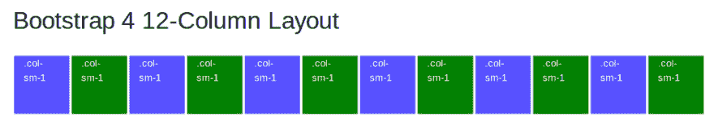
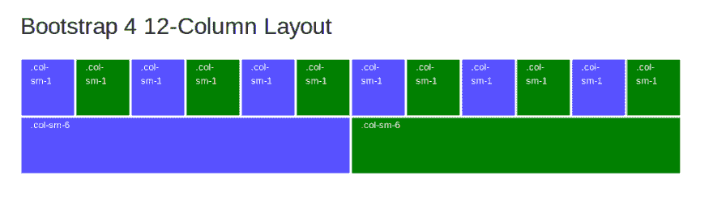
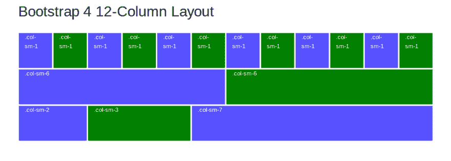
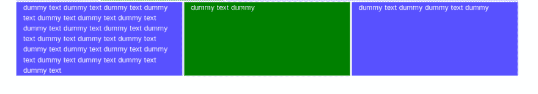

# Bootstrap 4 Flexbox 解释

> 原文：<https://dev.to/techiediaries/bootstrap-4-flexbox-explained-5gb4>

本教程是对 Bootstrap 网格系统的介绍，考虑到了 Flexbox，因为 Bootstrap 4 现在使用 Flexbox 作为网格布局的默认显示系统，这为您如何使用 Bootstrap 4 网格构建网站布局带来了许多新的强大功能。

Flexbox 是一个 CSS 3 显示系统，旨在通过允许容器对元素的大小有更多的控制，然后适应不同的视图端口，使创建动态或未知屏幕大小的布局变得简单明了。

没有进一步的介绍，让我们使用 Bootstrap 4 grid 系统创建并解读一个简单的页面布局。

首先，您需要创建一个 HTML 页面并链接 Bootstrap 4 资产。你可以简单地使用官方自举 4 [文档](https://getbootstrap.com/docs/4.0/getting-started/introduction/)
中的这个模板

```
<!doctype html>
<html lang="en">
  <head>
    <!-- Required meta tags -->
    <meta charset="utf-8">
    <meta name="viewport" content="width=device-width, initial-scale=1, shrink-to-fit=no">

    <!-- Bootstrap CSS -->
    <link rel="stylesheet" href="https://maxcdn.bootstrapcdn.com/bootstrap/4.0.0/css/bootstrap.min.css" integrity="sha384-Gn5384xqQ1aoWXA+058RXPxPg6fy4IWvTNh0E263XmFcJlSAwiGgFAW/dAiS6JXm" crossorigin="anonymous">

    BS 4 Flexbox Examples
  </head>
  <body>
    Add Content Here

    <!-- Optional JavaScript -->
    <!-- jQuery first, then Popper.js, then Bootstrap JS -->
    <script src="https://code.jquery.com/jquery-3.2.1.slim.min.js" integrity="sha384-KJ3o2DKtIkvYIK3UENzmM7KCkRr/rE9/Qpg6aAZGJwFDMVNA/GpGFF93hXpG5KkN" crossorigin="anonymous"></script>
    <script src="https://cdnjs.cloudflare.com/ajax/libs/popper.js/1.12.9/umd/popper.min.js" integrity="sha384-ApNbgh9B+Y1QKtv3Rn7W3mgPxhU9K/ScQsAP7hUibX39j7fakFPskvXusvfa0b4Q" crossorigin="anonymous"></script>
    <script src="https://maxcdn.bootstrapcdn.com/bootstrap/4.0.0/js/bootstrap.min.js" integrity="sha384-JZR6Spejh4U02d8jOt6vLEHfe/JQGiRRSQQxSfFWpi1MquVdAyjUar5+76PVCmYl" crossorigin="anonymous"></script>
  </body>
</html> 
```

Enter fullscreen mode Exit fullscreen mode

为了创建一个网格，你必须使用一些预定义的 BS 类(`.container`、`.row`、`col-*-*`)

网格应该有一个容器、行和列。

容器只是一个带有`.container`或`.container-fluid`类的`<div>`。为什么需要容器，这两个类有什么区别？

容器只是为网格的所有其他元素提供一个宽度或最大宽度。不同的是，`.container`允许你创建固定宽度的集装箱，而`.container-fluid`允许你创建一个装满的 *100%* 集装箱。

行为列提供了家。行数理论上可以是无限的。

柱是网格系统的单元。每行最多只能容纳 12 列(每列跨越可用宽度的 *1/12* )。实际上，一个列跨越不止一个单元，但是有一个重要的规则**所有列加起来应该是 12 个**

[T2】](https://res.cloudinary.com/practicaldev/image/fetch/s--i_-DskPg--/c_limit%2Cf_auto%2Cfl_progressive%2Cq_auto%2Cw_880/https://screenshotscdn.firefoxusercontent.cimg/999e8047-b1e5-409f-b97e-2c6f3c5a68f7.png)

要创建一个列，您只需将`<div>`与类`col-*-*`一起使用

屏幕断点的第一个星号(`xs, sm, md, lg, xl`)和列大小的第二个星号( *1..12* 。

```
<div class="row">
    <div class="col-sm-1 first-column">
      <p>.col-sm-1</p>
    </div>
    ...
    <div class="col-sm-1 second-column">
      <p>.col-sm-1</p>
    </div>   
  </div> 
```

Enter fullscreen mode Exit fullscreen mode

看到这个[码笔](https://codepen.io/techiediaries/pen/BYJOrL)

现在让我们创建第二行，包含两列

```
<div class="row">
    <div class="col-sm-6 first-column">
      <p>.col-sm-6</p>
    </div>
    <div class="col-sm-6 second-column">
      <p>.col-sm-6</p>
    </div>   
  </div> 
```

Enter fullscreen mode Exit fullscreen mode

注意，`.col-sm-6` + `.col-sm-6` === `.col-sm-12`

还要注意，您不需要显式地添加更高的断点类，即`col-md-6`到`col-xl-6`，因为`.col-sm-6`意味着列的大小应该是从小断点开始的 6 个单位

[T2】](https://res.cloudinary.com/practicaldev/image/fetch/s--qoPocEI5--/c_limit%2Cf_auto%2Cfl_progressive%2Cq_auto%2Cw_880/https://screenshotscdn.firefoxusercontent.cimg/f49f364d-d656-4eb7-97a6-fba568167a08.png)

接下来让我们添加一个包含三列的第三行

[T2】](https://res.cloudinary.com/practicaldev/image/fetch/s--tsaxmaaO--/c_limit%2Cf_auto%2Cfl_progressive%2Cq_auto%2Cw_880/https://screenshotscdn.firefoxusercontent.cimg/f4dc6a62-bde7-4f5f-8cc4-f4ce79f203c8.png)

第一列跨越两个单位，第二列跨越三个单位，第三列跨越其余 7 个单位。所有列的大小加起来是 12

`.col-sm-2` + `.col-sm-3` + `.col-sm-7` === `.col-sm-12`

如果你以前在版本 4 之前使用过 Bootstrap，你应该熟悉所有这些概念，那么 Bootstrap 4 带来了什么新特性呢？

如果你需要创建一个具有自动宽度列的布局，你只需要使用`.col-*`或者只使用`.col`而不需要指定大小，Bootstrap 会在这些列中平均分配可用宽度

```
<div class="row">
    <div class="col first-column"></div>
    <div class="col second-column"></div>
    <div class="col first-column"></div>
  </div> 
```

Enter fullscreen mode Exit fullscreen mode

[T2】](https://res.cloudinary.com/practicaldev/image/fetch/s--RXqzgZbo--/c_limit%2Cf_auto%2Cfl_progressive%2Cq_auto%2Cw_880/https://screenshotscdn.firefoxusercontent.cimg/8f78ec06-4814-4dfc-8bfc-2c373fb5a3f0.png)

现在，如果您在每一列中添加一串文本，以改变它们的高度，您将会看到这样的结果

[T2】](https://res.cloudinary.com/practicaldev/image/fetch/s--hLKIvCI6--/c_limit%2Cf_auto%2Cfl_progressive%2Cq_auto%2Cw_880/https://screenshotscdn.firefoxusercontent.cimg/811687b8-1d1b-4a6e-94d1-a678a98c4278.png)

可以看出，与 Bootstrap 3 不同，所有列都具有相同的高度，而不管它们的内容，这给出了网格系统的更好的感觉。

## Bootstrap 4 Flex 工具

BS 4 默认使用 Flexbox，但是它也提供了一组类工具，允许你使用 Flexbox 而不需要借助定制的 CSS。

如果你想让一个 div 元素成为一个 flex 容器，你可以简单地将`.d-flex`类添加到`<div>`
中

```
<div class="d-flex">
This is now a flex container
</div> 
```

Enter fullscreen mode Exit fullscreen mode

或者你可以使用`d-inline-flex`来创建一个内嵌的 flex 容器。

这两个类也有响应版本，即你可以使用`d-d-*-flex`和`d-*-inline-flex`，其中开始可以是这些断点值`xs, sm, md, lg and xl`中的一个。

Flexbox 的一个重要方面是能够轻松设置 flex 容器中项目的方向。

默认情况下，方向是从左到右水平，但是可以通过`.flex-row-reverse`设置为从右到左水平，或者通过`.flex-row`再次设置为从左到右(默认)。

你也可以使用`.flex-column`类设置从上到下的垂直方向，或者使用`.flex-column-reverse`类改变从下到上的垂直方向。

参见[文档](https://getbootstrap.com/docs/4.0/utilities/flex/)中控制 flex 属性的其他可用类。

## 引导程序 4 显示实用程序

Bootstrap 4 提供了一组实用程序，可以很容易地设置元素的显示属性，例如，您可以更改特定断点或屏幕大小的显示属性。更多[细节](https://getbootstrap.com/docs/4.0/utilities/display/)见文档

> 使用我们的显示实用程序，快速、灵敏地切换组件的显示值及更多。包括对一些更常见值的支持，以及一些用于控制打印时显示的额外功能。

简单地使用`.d-{type}`作为`xs`断点，或者使用`.d-{breakpoint}-{type}`作为`sm, md, lg, and xl`断点，其中类型可以是这些显示类型之一

*   没有人
*   在一条直线上的
*   内嵌块
*   街区
*   桌子
*   表格单元格
*   表格行
*   弯曲
*   内嵌-柔性

## 结论

Bootstrap 一直是一个强大的 CSS 框架，用于开发人员在团队中没有 CSS 设计师的情况下构建他们的网站，现在有了新的功能，如默认支持 Flexbox，作为 CSS 专家，您可以拥有很好的工具来构建响应性布局。