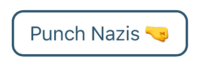
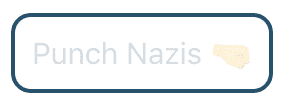
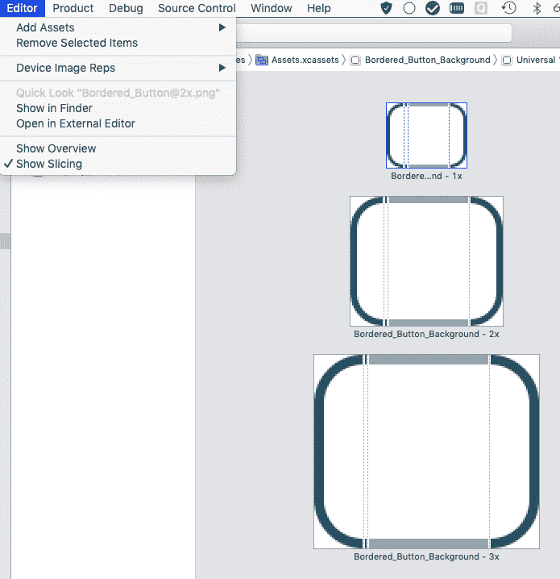
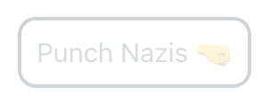

# Xcode 中的边界切片

> 原文：<https://dev.to/zeitschlag/bordered-slicing-in-xcode-1c6i>

这是另一篇关于我如何解决一个小问题的小博文。这次是关于带边框的纽扣、圆角和切片。

首先，我得到了一份新工作，这是一个惊喜🎉— iOS developer 而且比上一个好很多很多。让我们希望它能持续六周以上。

现在回到正题:在我难得的空闲时间里，我还在做我上次提到的那个小 app。这个应用程序具有一些按钮，我希望他们有一个圆角边框。它们应该看起来像这样:

[T2】](https://res.cloudinary.com/practicaldev/image/fetch/s--wk9dDYMN--/c_limit%2Cf_auto%2Cfl_progressive%2Cq_auto%2Cw_880/https://zeitschlag.net/conteimg/2018/10/Bildschirmfoto-2018-10-05-um-18.56.40.png)

相当标准的方法在代码中应该是这样的，因为故事板不支持圆角边框，不需要额外的工作:

```
self.punchNazisButton.layer.borderWidth =2;
self.punchNazisButton.layer.cornerRadius = 10;
self.punchNazisButton.layer.borderColor = [UIColor fancyBlueColor].CGColor; 
```

我走了那条路，但是出现了一个问题:当用户点击这个按钮时，标题颜色改变，但是边框颜色保持不变。这看起来很奇怪:

[T2】](https://res.cloudinary.com/practicaldev/image/fetch/s--bRmqdsgU--/c_limit%2Cf_auto%2Cfl_progressive%2Cq_auto%2Cw_880/https://zeitschlag.net/conteimg/2018/10/Simulator-Screen-Shot---iPhone-SE---2018-10-05-at-19.19.28.png)

不久前我看了一个“Xcode 的新特性”的视频或者类似的东西，在这个视频中，切片被引入了。不知何故，我想起了这个视频和切片。

切片意味着，基本上，你告诉 iOS 使用图像的某些部分，就像他们一样，并调整它们之间的大小。你可以很容易地制作圆角的边框按钮:你想要圆角，但是在这些角之间要有直线。所以你告诉 iOS 使用角，但是要拉伸/调整大小/...中间的直线。贝基·汉斯迈尔不久前写了一篇关于它的短文。

所以我尝试了一下:我将草图文件中的边界导出为 1x、2x 和 3x 资产，并立即将它们导入到我的 Xcode 资产目录中。导出/导入的资产如下所示:

[T2】](https://res.cloudinary.com/practicaldev/image/fetch/s--qubJ4z6M--/c_limit%2Cf_auto%2Cfl_progressive%2Cq_auto%2Cw_880/https://zeitschlag.net/conteimg/2018/10/Bildschirmfoto-2018-10-05-um-19.02.12.png)

然后，我不得不告诉 iOS，每个区域该怎么处理。我选择了一个图像，在“属性检查器”中向下滚动，直到我看到“切片”区域。我必须分别为 1x、2x 和 3x 设置左值和右值:

[T2】](https://res.cloudinary.com/practicaldev/image/fetch/s--TJQ70sKh--/c_limit%2Cf_auto%2Cfl_progressive%2Cq_auto%2Cw_880/https://zeitschlag.net/conteimg/2018/10/Bildschirmfoto-2018-10-05-um-19.06.30-1.png)

Xcode 还有一个用于分割的 [GUI，你可以用它来直观地设置`left`、`right`和`width`:](https://help.apple.com/xcode/mac/current/#/deve65bd8d0d)

[T2】](https://res.cloudinary.com/practicaldev/image/fetch/s--sjUSTg_B--/c_limit%2Cf_auto%2Cfl_progressive%2Cq_auto%2Cw_880/https://zeitschlag.net/conteimg/2018/10/Bildschirmfoto-2018-10-05-um-19.45.50.png)

之后，我在我的故事板中将这张图片设置为`backgroundImage`——很惭愧，在这个项目中我使用了一个单独的`Main.storyboard`——仅此而已。如果我现在点击“打纳粹”按钮，边框会变成标题的颜色:

[T2】](https://res.cloudinary.com/practicaldev/image/fetch/s--cGcdINhB--/c_limit%2Cf_auto%2Cfl_progressive%2Cq_auto%2Cw_880/https://zeitschlag.net/conteimg/2018/10/Simulator-Screen-Shot---iPhone-SE---2018-10-05-at-19.14.42-1.png)