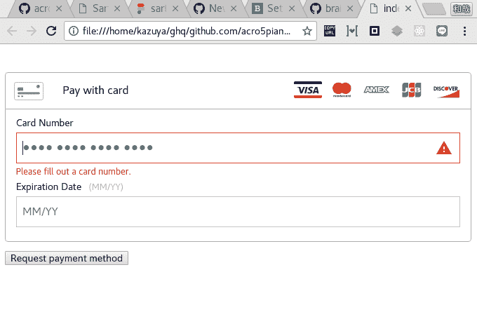

# 布伦特里最小示例

> 原文：<https://dev.to/acro5piano/braintree-minimum-example-3b2m>

[T2】](https://res.cloudinary.com/practicaldev/image/fetch/s--EZs7UUTE--/c_limit%2Cf_auto%2Cfl_progressive%2Cq_auto%2Cw_880/https://thepracticaldev.s3.amazonaws.com/i/npiu494797ky06ir4nz0.png)

# TL；博士；医生

我为我的朋友创建了一个知识库，展示 Paypal 的 Braintree 是如何工作的。我想在这里分享它！

# 储存库

这个库展示了 braintree SDK + express.js 是如何工作的。

[https://github . com/acro 5 钢琴/学习-paypal-braintree](https://github.com/acro5piano/learn-paypal-braintree)

# 为什么

大脑树有官方教程，但是它包含了很多隐含的依赖。
举例来说，`app`是针对 express 实例的，但是 JavaScript 初学者往往有后台的运气，所以很难实现教程。

[https://developers . braintreepayments . com/start/hello-server/node](https://developers.braintreepayments.com/start/hello-server/node)

Braintree 也有使用 express.js 的官方示例库，但它有很多东西，如模板、样式表等。

[https://github.com/braintree/braintree_express_example](https://github.com/braintree/braintree_express_example)

初学者应该从最小起点开始。所以我创建了这个知识库。

# 设置

安装 Node.js > 8.1.x，安装 Yarn。

然后运行:

```
git clone https://github.com/acro5piano/learn-paypal-braintree.git
cd learn-paypal-braintree
yarn install
yarn dev 
```

Enter fullscreen mode Exit fullscreen mode

可选:编辑`server.js`并填写您的 SDK 令牌。

然后打开`index.html`就可以看到 braintree 屏幕。

[https://github . com/acro 5 piano/learn-paypal-brain tree](https://github.com/acro5piano/learn-paypal-braintree)

谢谢！