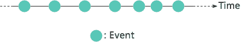

# 突发新闻:一切都是事件！(溪流、卡夫卡和你)

> 原文：<https://dev.to/florimondmanca/breaking-news-everything-is-an-event-streams-kafka-and-you-2n9j>

欢迎回来！这是我用 Apache Kafka 构建流媒体应用系列的第三篇文章。

前一篇文章让我们构建了我们的第一个现实世界的流媒体应用程序——一个实时欺诈检测系统。

这一次，我们将深入了解阿帕奇卡夫卡背后的一些核心概念。

更具体地说，我们将尝试**进行思维转变**。我们习惯于根据状态来思考，但是根据**事件**来思考允许我们进入**流数据**的领域。

然后，在更详细地介绍了**流**和**流数据范式**之后，我们将花一点时间来思考为什么了解它可能很重要。

剧透警告:因为它学习起来很有趣，可重复使用，有市场，对建立反应式应用业务很有用。

事不宜迟，让我开始为您介绍**流数据**。

## 状态和请求

作为构建应用程序、数据管道和数据驱动系统的开发人员，我们习惯于按照**状态**来思考。我们经常问这样的问题:

*   “嗨，梅勒微服务！我是前端应用。您能否将用户 A 的已处理电子邮件列表发送给我，以便我更新他们的仪表板？”
*   “嗨，REST API！我是梅勒微服务。你能把当前的帖子列表发给我吗，这样我就可以把它和上周的列表区别开来，并给时事通讯的订阅者发送一个更新信息。”
*   “嗨，SQL 数据库！我是应用服务器。我在`posts`表中有哪些行？”

我们构建由许多不同组件组成的复杂系统，并试图通过**请求**(或查询，或任何符合请求/响应范例的通信)将它们连接起来。

即使当我们使用最新和最闪亮的架构设计原则(提示:微服务)时，我们也冒着以**紧密耦合架构**告终的风险，因为组件需要非常详细地了解彼此的 API，或者需要不断轮询彼此以检测**变化**。

<figure>

[T2】](https://res.cloudinary.com/practicaldev/image/fetch/s--wTPfoOLI--/c_limit%2Cf_auto%2Cfl_progressive%2Cq_auto%2Cw_880/https://florimondmanca-personal-website.s3.amazonaws.com/media/markdownx/microservice-blog.png)

<figcaption>Your typical microservices web application. See that soup of requests? Can we do better?</figcaption>

</figure>

## 介绍事件

### 一定有更好的办法

数据库查询、API HTTP 请求、缓存查找——就本文而言，所有这些都是旨在检索状态的**请求**。但是你认为下面是什么？

```
User created
Tag followed
Post published
Email processed
Draft submitted
Profile updated 
```

Enter fullscreen mode Exit fullscreen mode

这些不是请求。这些也与国家无关。

这是一个简单明了的**事件**列表——仅仅是关于我们的应用程序或外部世界中刚刚发生的事情的**事实**。🏷

我们并不总是意识到我们从存储器(如数据库或缓存)中获取的数据之所以存在，是因为最初发生了一些事情。

某件事是一个事件。但是我们一会儿就会谈到它。

### 一个事件长什么样？

事件是一个一般的抽象概念。一个有用的字典定义是:

> 事件:发生或发生的事情，尤指重要的事情。

此时给你一个**具体的直觉**可能会有用。

在软件中，事件本质上由两部分组成:

1.  一个**动作**(或标签、名称、代码……)用来清楚地识别发生了什么。比如`'user_created'`或者`'email_processed'`。
2.  **提供**细节**并完全决定事件的背景**。例如，新创建用户的名字和姓氏，或者已处理电子邮件的 ID。

例如，下面是一个事件的许多可能的表示(在 JSON 中)之一，表示“用户 1343 的名字被更新为‘Bob’”:

```
{  "action":  "user_updated",  "context":  {  "id":  1343,  "field":  "first_name",  "previous":  "Robert",  "new":  "Bob"  }  } 
```

Enter fullscreen mode Exit fullscreen mode

如你所见，一个事件仅仅是描述宇宙中发生的事情的事实。

虽然看起来微不足道，但这个想法是一个全新的**范式**的核心。

### 残酷的真相

关于事件以及它们如何意味着和暗示不同的事情，取决于你所从事的计算领域，有很多要说的。

但在我看来，这是一个残酷的事实。

> **一切都是事件**，我们驾驭它们的能力对于构建反应式和高性能的应用程序至关重要。

如果你还不相信，让我给你一些基于你可能已经知道的真实应用的例子。

### 来自现实世界的论点

你认为 LinkedIn 和 T2 Slack 这两个应用程序有什么共同点？

**它们都产生、利用和处理事件**。

以 LinkedIn 为例:

*   新工作邀请？那是一个事件。
*   一个通知？那也是一个事件。
*   侧面图？仍然是一个事件。
*   你更新了一项技能还是你的简历？又一个事件！

Slack 怎么样？嗯…

*   新的直接信息？是的，那是一个事件。
*   有人在工作区创建了一个频道？另一个事件。
*   登录到 Slack？见鬼——即使那也是一个事件！

LinkedIn 或 Slack 所做的任何事情都是处理这些事件，以便为他们的用户创造价值(不管这意味着什么)。注意事件是如何形成一个**链**的:例如，一个`'direct_message_received'`事件可能会触发一个`'notification_created'`事件。

无论如何，核心思想是:应用程序中发生的每一件事都是一个事件。

在本文的开始，我告诉过你请求(在一般意义上)允许检索状态。那么如果一切都是事件，状态从何而来？

### 状态，又称持续事件

事件在给定的时间点发生。它们天生是短暂的。

这意味着事件需要被**持久化**，这样你就可以稍后访问它们，也就是在它们发生之后。

例如，通知需要存储在数据库中，以便您可以通过单击菜单再次阅读它们。

原来**一旦事件被处理和持久化，它们就变成了状态**。从那时起，您可以使用常规请求来检索它们(或者它们的某种转换或聚合)。

我们举个例子。对于那些使用 Twitter 的人来说，你有没有注意到，你通过通知收到的一个“赞”可能在几秒钟后才会被计入推文页面？这是一个持续进入状态的`'tweet_liked'`事件——tweet 的点赞计数器！

此时，你可能开始意识到，在某种意义上，**状态是事件**的结果。一个事件发生，你捕捉它，处理它，存储它并更新状态。仅此而已。

## 向流式数据打招呼！

当我接受了这样一个事实，即一切都可以被认为是一个事件，状态只是从它们衍生出来的，我开始意识到这里有一个**完全不同的范例**在起作用。

这个范例就是**流数据**的范例。

我不再考虑系统通过请求和响应来交换状态，而是开始考虑系统通过事件流来交换**状态变化。**

### 什么是流？

流在计算中有一个特殊的定义:

> 数据流:数据或指令的连续流动，尤指具有恒定或可预测速率的。

但是，我觉得这个定义太笼统了。在**事件流**的上下文中，我们可以将其归结为更具体、更简洁的形式。这是我最后得到的结果:

> 一个**流**是一个无界的、时间有序的事件集合。

图形表示总是有帮助的，不是吗？以下是如何将事件流表示为时间线中排列的一组点:

<figure>

[T2】](https://res.cloudinary.com/practicaldev/image/fetch/s--cZoQH91f--/c_limit%2Cf_auto%2Cfl_progressive%2Cq_auto%2Cw_880/https://florimondmanca-personal-website.s3.amazonaws.com/media/markdownx/stream.png)

<figcaption>Simple representation of a stream.</figcaption>

</figure>

为了让你对什么是流以及你可以用它们做什么有更好的直觉，我想带你做一个类比。

### 比喻河水

虽然 streams 在计算机科学中有自己的定义，但在日常语言中，streams 一般指一条小河，或者至少是一股液体。

<figure>

[T2】](https://res.cloudinary.com/practicaldev/image/fetch/s--O_ZIBzzp--/c_limit%2Cf_auto%2Cfl_progressive%2Cq_auto%2Cw_880/https://images.unsplash.com/photo-1527489377706-5bf97e608852%3Fixlib%3Drb-0.3.5%26ixid%3DeyJhcHBfaWQiOjEyMDd9%26s%3D30e71ee8757d4448721e27ea96208156%26auto%3Dformat%26fit%3Dcrop%26w%3D1127%26q%3D80)

<figcaption>Time-lapse photography of river. @the_bracketeer, unsplash.com</figcaption>

</figure>

想象你走在河边。你在某个地方停下来，看着水流过你。您可以进行许多观察，这些观察具有等同的事件流:

*   水以相当稳定的速度流动→溪流是事件的**连续流。**
*   然而，岩层可能会局部改变流速→ **处理速率可能会在流处理管道的不同阶段发生变化**。
*   可以数一数河里游的鱼的数量→事件可以**持久化**成为状态。
*   这条河是由多条上游小河流汇集而成的→河流可以有**多条输入和输出**。
*   大树干保留碎片，留下干净的水在下游→溪流可以通过**转换**(如过滤、映射等)进行处理。).
*   等等。

我喜欢这个类比，因为它给出了事件流的一个总体的、生动的概述。

但是等一下。到目前为止，我们一直在谈论流，但没有说太多关于它如何适应阿帕奇卡夫卡生态系统。

### 流在阿帕奇卡夫卡中是如何实现的？

Kafka 自称为**分布式流媒体平台**，完美实现了流媒体数据范式。它提供了简单却极其强大的**抽象**，以可靠、容错的方式处理事件流。

在 Kafka 中，事件流的等价物是包含消息的**主题。就像事件流一样，主题是一个按时间顺序排列的消息集合**，几乎没有未来和过去的界限——尽管主题中总是有第一条消息，并且通常在一段时间后会被清除。****

 **Kafka 还提供了两个 API 来实现发布/订阅(也称为可观察/观察者)设计模式。它们允许主题有多个“输入”和“输出”:

*   **生产者 API** 用于将事件发布到主题。
*   **消费者 API** 用于订阅主题并动态处理它们的消息。

如果你喜欢方便的比较表格，你可以这样做:

| 通称 | 卡夫卡对等物 |
| --- | --- |
| 事件 | 消息 |
| 溪流 | 主题 |
| 出版者 | 生产者 |
| 订户 | 消费者 |

就流转换(又名流处理)而言，在卡夫卡中有很多方法可以做到这一点。🎉至少有两种工具可以做到这一点:

*   [Kafka Streams](https://kafka.apache.org/documentation/streams/) :这个 API 提供了高级的流处理能力，包括映射、过滤、缩减、窗口、分支等等。不幸的是，它只适用于 Java 和 Scala(目前)。
*   [KSQL by Confluent](https://www.confluent.io/product/ksql/) :使用普通的 SQL(没有其他的)来实时地连接、聚合和做窗口操作。

然而，流处理是一个相当广泛的领域。在以后的文章中，我们可能会深入研究 Kafka 中的流处理。我认为对于本文来说，坚持高水平的概述可能就足够了。

## 我为什么要在乎？

我们已经讨论了状态和请求与事件和流的关系，什么是事件，什么是流，以及 Kafka 如何实现流数据范式。

对于你，开发者，以及团队和企业来说，**为什么这些都很重要呢？**

### 新的可能性

流式数据是一种新的范式，可以为新的系统、概念和架构打开思路。它支持**异步、事件驱动的流方法**，这与更经典的同步、请求驱动的批处理方法完全不同。

我也相信这是一个令人兴奋的机会去学习新的东西和提升你的技能。当我了解 Apache Kafka 并开始用它构建软件时，我被它的强大震惊了——我喜欢它允许我构建通过 REST APIs 和严格的消息队列之外的东西进行通信的系统。

### 可重用的核心概念

流式数据和事件流是您可以——并且最终可能不得不——在软件开发的其他领域中重新应用的概念。

例如，前端开发目前对事件流非常着迷。整个 [Redux](https://medium.freecodecamp.org/understanding-redux-the-worlds-easiest-guide-to-beginning-redux-c695f45546f6) 生态系统(在 React 开发者中似乎非常流行)基于触发连锁反应的事件，最终更新状态。

您还可以在前端开发之外重新应用流数据概念。例如，[react vex API](http://reactivex.io)及其在各种语言中的实现 JavaScript 的 [RxJS](https://github.com/ReactiveX/rxjs) ，Python 的 [RxPy](https://github.com/ReactiveX/RxPY) ，以及[more](http://reactivex.io/languages.html)——将**流和事件以“可观察流”的形式带到许多流行语言**。虽然 Rx 主要用于 web 开发，但是你也可以在其他领域的项目中自由使用它。

<figure>

[T2】](https://res.cloudinary.com/practicaldev/image/fetch/s--nvuJ_cJR--/c_limit%2Cf_auto%2Cfl_progressive%2Cq_auto%2Cw_880/https://www.thedroidsonroids.com/wp-content/uploads/2018/06/Rx-java-750x253.png)

<figcaption>The ReactiveX logo. What a cute… eel?</figcaption>

</figure>

总之，用可引用的形式:

> 随着工具和框架的变化越来越快，核心概念会一直存在；流式数据就是这样一个核心概念。

### 推进你的事业

了解分布式流媒体平台实际上非常有市场。

2018 年 1 月 2 日，领英发布了一份名为《2018 年公司最需要的技能》的[报告](https://learning.linkedin.com/blog/top-skills/the-skills-companies-need-most-in-2018--and-the-courses-to-get-t)。根据招聘活动，他们将“云和分布式计算”以及“中间件和集成软件”分别列为公司最需要的技能的前 1 名和前 3 名。

你猜怎么着？像 Apache Kafka 这样的分布式流媒体平台就属于这两个顶级技能类别。

更随意地说，阿帕奇·卡夫卡可以帮你找到一份工作。

我还认为，知道如何使用、部署和设计与 Apache Kafka 这样的分布式流媒体平台交互的系统是一项很好的技能。你将能够跨越多个项目和许多不同的人一起工作，我一直觉得这是彻头彻尾的**刺激**。🔥

### 可扩展系统*和团队*

Kafka 的流应用程序是多租户的，因为一个 Kafka 主题可以有多个生产者和多个消费者。

特别是，这意味着增加产量通常归结为 a)增加生产者的数量和/或 b)增加消费者的数量。**流媒体应用天生具有水平可扩展性**。

但是还有更多。

你有没有注意到生产者不需要知道下游消费者是谁？生产者只需将消息推送至主题，任何对其感兴趣的人都可以订阅并自行处理。

这意味着您可以让**松散耦合的团队**在应用程序的不同部分工作。它们的接口完全由消息的内容定义— **数据是契约**。

<figure>

[T2】](https://res.cloudinary.com/practicaldev/image/fetch/s--s6N497HC--/c_limit%2Cf_auto%2Cfl_progressive%2Cq_auto%2Cw_880/https://florimondmanca-personal-website.s3.amazonaws.com/media/markdownx/kafka-octopus.png)

<figcaption>Scaling systems and teams with Kafka Octopus! (I've been waiting for this moment for too long.)</figcaption>

</figure>

更好的是，一个新的应用程序(比如说，由 BI 团队开发的)可以进入一个现有的主题**，而不会中断其他流处理器的流程**。除了鼓励松散耦合，这一特性意味着**流应用程序允许团队更好地扩展**。

对人类组织来说，流式数据还有更多这样的好处。在我们结束之前，这是最后一个。

### 无功业务

作为一家公司，你希望你的产品或服务能够对环境的变化做出反应。

这样做的典型方式是**批处理**。您在缓冲应用程序中构建更改，这些应用程序的任务是准备批处理以供其他系统处理。然而，这种方式通常在持续时间(几个小时处理一批)和频率(一天处理一批两到三次，但不会更多)上都很慢。

相比之下，流式数据允许您处理连续的数据流。无论你的系统中发生了什么，你都可以捕捉到它并迅速做出反应。这样就很容易实现**分钟级反应**。最后，流式数据减少了您的响应时间，让您可以挥动实时处理的杀手锏。嘣！💥

## 欢迎来到一个充满溪流和事件的世界

随着我们构建越来越复杂的系统，通常的基于请求的方法不足以**驾驭事件**。相反，**流是按时间顺序排列的事件集合**，是构建**反应式应用**的直观而有效的方式。

**流数据范例**在**阿帕奇卡夫卡**中通过一组简单而**强大的抽象**实现，我坚信**你需要了解它**。

## 包装完毕

*2018 年 12 月 15 日更新。*

我最初计划写一篇关于 Apache Kafka 的 API 的最后一篇博文(也许更多的是关于集群部署的)，但是由于各种原因，我很遗憾没有时间发表它们。

这意味着这个系列要结束了！当然，关于卡夫卡还有比我在这里讲述的更多的东西！我们只是触及了表面。为了继续您的旅程，我收集了一些很棒的资源供您欣赏:

*   [如何使用 Apache Kafka 将批处理管道转换为实时管道](https://medium.com/@stephane.maarek/how-to-use-apache-kafka-to-transform-a-batch-pipeline-into-a-real-time-one-831b48a6ad85):设计流式管道的完整示例，同时提供欺诈检测示例。
*   Apache Kafka 中的模式介绍，带有融合模式注册表:使用 Avro 作为事件格式的保护措施。
*   [带有 Apache Kafka 快速数据流分析和服务器推送的实时用户界面](https://www.youtube.com/watch?v=-GBk0en6dck):使用 Kafka 的实时用户界面示例。
*   [Kafka 在生产中的经验教训](https://www.youtube.com/watch?v=1vLMuWsfMcA):配置一个实时生产 Kafka 集群的有用建议和经验法则。
*   [ETL 已死，流万岁](https://www.youtube.com/watch?v=I32hmY4diFY):从批处理转移到流处理的案例，以及构建和扩展流平台的经验报告。

我也强烈推荐你奥莱利的《阿帕奇卡夫卡:权威指南》。它在开始时对我帮助很大，因为它包含了许多有用的背景知识和关于如何设置和配置集群、如何监控 Kafka 以及关于消费者和生产者的更多配置细节的重要指导。

花些时间看看流处理如何应用到您所知道的或您已经构建的系统中，我很乐意听到结果！🖖💻

我们现在已经讨论了 Apache Kafka 中流背后的一些核心概念。下一篇博文将更具技术性，因为我们将通过查看 Apache Kafka 的实际实现来理解它们的 API 和抽象。

在此之前，花些时间看看流处理如何应用到您所知道的或您已经构建的系统中，我很乐意听到结果！敬请期待更多卡夫卡式的美好。🖖💻

## 保持联系！

如果你喜欢这篇文章，你可以在 Twitter 上找到我，获取更新、公告和新闻。🐤**