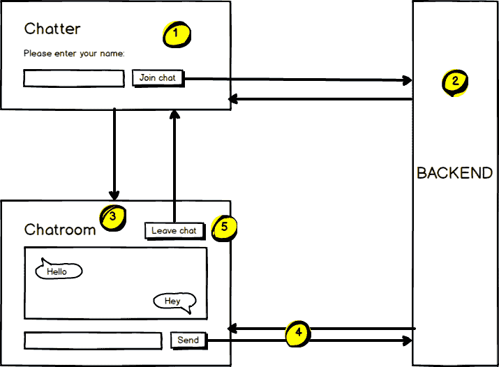
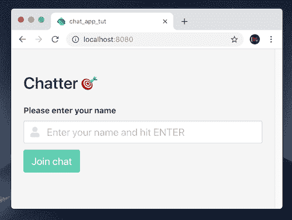
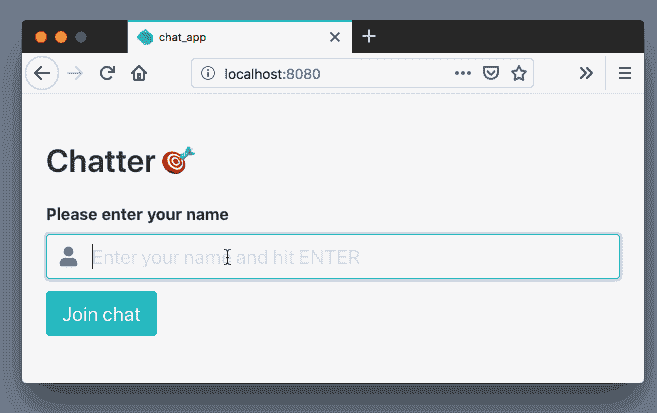

# 在 Dart 2 中构建一个聊天应用程序(第 2 部分)

> 原文：<https://dev.to/graphicbeacon/build-a-chat-application-in-dart-2-part-2-48df>

在[第 1 部分](https://dev.to/graphicbeacon/build-a-basic-chat-application-in-dart-2-part-1-4ekj)中，我们为我们的聊天登录屏幕构建了 UI，并编写了一个基本流程，一旦用户名成功验证，就转换到聊天室 UI。

在这一部分中，我们将重构我们的工作解决方案，并实现一个基本的路由器来处理视图之间的转换。这是聊天流程的示意图:

[T2】](https://res.cloudinary.com/practicaldev/image/fetch/s--PYzJqyQh--/c_limit%2Cf_auto%2Cfl_progressive%2Cq_auto%2Cw_880/https://thepracticaldev.s3.amazonaws.com/i/l1s6n4fkcpur4hy7xwe2.png)

我们还有一点要讲，所以不再多说，让我们开始吧！

* * *

## 1。封装登录 UI 的逻辑

目前我们在`web/main.dart`中有我们的应用程序逻辑，如果我们继续在那个逻辑上构建，它将是一个维护夜件！所以我们将在一个`View`类中管理每个屏幕的逻辑。

在下面的`web`文件夹中创建包含下列文件的目录:

```
views/
  chat_room.dart
  chat_signin.dart
  view.dart 
```

Enter fullscreen mode Exit fullscreen mode

现在在`view.dart`中，创建一个接口，它将被用作我们视图类的蓝图:

```
abstract class View {
  void onEnter(); // Run this when the view is loaded in
  void onExit();  // Run this when we exit the view
  void prepare(); // Prepare the view template, register event handlers etc... before mounting on the page
  void render();  // Render the view on the screen
} 
```

Enter fullscreen mode Exit fullscreen mode

*在这一点上，你们中的一些人可能想知道为什么我们使用`abstract class`而不是`interface`关键字？**回答:**飞镖队做到了！基本原理是类是隐式接口，所以为了简化，他们坚持使用抽象类。这意味着我们可以**扩展**或者**实现**一个抽象类。*

让我们使用这个接口来实现我们在`chat_signin.dart` :
中的视图

```
// Absolute imports
import 'dart:html';

// Relative imports
import './view.dart';

class ChatSigninView implements View {
  ChatSigninView() : _contents = DocumentFragment() {
    onEnter();
  }

  /// Properties
  DocumentFragment _contents;
  DivElement chatSigninBox;
  ParagraphElement validationBox;
  InputElement nameField;
  ButtonElement submitBtn;
  HttpRequest _response;

  @override
  void onEnter() {
    prepare();
    render();
  }

  @override
  void onExit() {}

  @override
  void prepare() {}

  @override
  void render() {}
} 
```

Enter fullscreen mode Exit fullscreen mode

在运行构造函数体之前，我们用一个新的`DocumentFragment`初始化`_contents`。我们将用我们的模板填充它，并在插入页面之前定义我们的事件处理程序。

让我们实现使用`_contents` :
的`prepare()`方法

```
@override
void prepare() {
  _contents.innerHtml = '''
  <div id="ChatSignin">
      <h1 class="title">Chatter 🎯</h1>
      <div class="columns">
        <div class="column is-6">
          <div class="field">
            <label class="label">Please enter your name</label>
            <div class="control is-expanded has-icons-left">
              <input class="input is-medium" type="text" placeholder="Enter your name and hit ENTER" />
              <span class="icon is-medium is-left">
                <i class="fas fa-user"></i>
              </span>
            </div>
            <p class="help is-danger"></p>
          </div>
          <div class="field">
            <div class="control">
              <button class="button is-medium is-primary">
                Join chat
              </button>
            </div>
          </div>
        </div>
      </div>
    </div>
    ''';

  chatSigninBox = _contents.querySelector('#ChatSignin');
  validationBox = chatSigninBox.querySelector('p.help');
  nameField = chatSigninBox.querySelector('input[type="text"]');
  submitBtn = chatSigninBox.querySelector('button');

  _addEventListeners(); // TODO: Implement this method
} 
```

Enter fullscreen mode Exit fullscreen mode

现在来实现`_addEventListeners()`及其相关方法:

```
class ChatSigninView implements View {
  ...
  ...
  void _addEventListeners() {
    // Event listeners on form controls
    nameField.addEventListener('input', _inputHandler);
    submitBtn.addEventListener('click', _clickHandler);
  }

  void _inputHandler(evt) {
    if (nameField.value.trim().isNotEmpty) {
      nameField.classes
        ..removeWhere((className) => className == 'is-danger')
        ..add('is-success');
      validationBox.text = '';
    } else {
      nameField.classes
        ..removeWhere((className) => className == 'is-success')
        ..add('is-danger');
    }
  }

  void _clickHandler(evt) async {
    // Validate name field
    if (nameField.value.trim().isEmpty) {
      nameField.classes.add('is-danger');
      validationBox.text = 'Please enter your name';
      return;
    }

    submitBtn.disabled = true;

    // Submit name to backend via POST
    try {
      _response = await HttpRequest.postFormData(
        'http://localhost:9780/signin',
        {
          'username': nameField.value,
        },
      );

      // Handle success response and switch view
      onExit();
    } catch (e) {
      // Handle failure response
      submitBtn
        ..disabled = false
        ..text = 'Failed to join chat. Try again?';
    }
  }
} 
```

Enter fullscreen mode Exit fullscreen mode

上面的大部分逻辑都是从本系列第 1 部分的`web/main.dart`移过来的。

`_inputHandler()`私有方法负责验证输入文本字段并添加适当的类。`_clickHandler()`私有方法将验证并提交表单，提交到位于`http://localhost:9780/signin`的端点。结果被分配给`_response`实例变量。然后我们调用`onExit()`方法，它将把响应数据传递给下一个视图。

让我们将准备好的文档片段呈现到屏幕上:

```
@override
void render() {
  querySelector('#app')
    ..innerHtml = ''
    ..append(_contents);
} 
```

Enter fullscreen mode Exit fullscreen mode

并确定我们的退出策略:

```
@override
void onExit() {
  nameField.removeEventListener('input', _inputHandler);
  submitBtn.removeEventListener('click', _clickHandler);

  // Swap view to chat room
  // TODO: Transition to Chat room screen
} 
```

Enter fullscreen mode Exit fullscreen mode

要在浏览器中查看该视图，请更新`web/main.dart` :

```
import './views/chat_signin.dart';

void main() {
  ChatSigninView();
} 
```

Enter fullscreen mode Exit fullscreen mode

将`web/index.html`的`<body>`标记更改如下:

```
<section class="section">
  <div class="container" id="app">
    <!-- Views will be rendered here -->
  </div>
</section> 
```

Enter fullscreen mode Exit fullscreen mode

运行`webdev`服务器，在浏览器
中访问`http://localhost:8080`

```
webdev serve --live-reload 
```

Enter fullscreen mode Exit fullscreen mode

[T2】](https://res.cloudinary.com/practicaldev/image/fetch/s--XvIGz480--/c_limit%2Cf_auto%2Cfl_progressive%2Cq_auto%2Cw_880/https://thepracticaldev.s3.amazonaws.com/i/vgzc4i81sv7hkibzgk8c.png)

## 2。聊天室 UI 的封装逻辑

在`web/views/chat_room.dart` :
中定义一个`ChatRoomView`类

```
// Absolute imports
import 'dart:html';

// Relative imports
import './view.dart';

class ChatRoomView implements View {
  ChatRoomView(this.params)
      : _contents = DocumentFragment() {
    onEnter();
  }

  /// Properties
  Map params;
  DocumentFragment _contents;
  DivElement chatRoomBox;
  DivElement chatRoomLog;
  InputElement messageField;
  ButtonElement sendBtn;

  @override
  void onEnter() {
    prepare();
    render();
  }

  @override
  void onExit() {
    _removeEventListeners(); // TODO: Implement this method

    // TODO: Transition to chat sign in screen
  }

  @override
  void prepare() {
  _contents.innerHtml = '''
    <div id="ChatRoom">
        <h1 class="title">Chatroom</h1>
        <div class="tile is-ancestor">
          <div class="tile is-8 is-vertical is-parent">
            <div class="tile is-child box">
              <div id="ChatRoomLog"></div>
            </div>
            <div class="tile is-child">
              <div class="field has-addons">
                <div class="control is-expanded has-icons-left">
                  <input id="ChatRoomMessageInput" class="input is-medium" type="text" placeholder="Enter message" />
                  <span class="icon is-medium is-left">
                    <i class="fas fa-keyboard"></i>
                  </span>
                </div>
                <div class="control">
                  <button id="ChatRoomSendBtn" class="button is-medium is-primary">
                    Send&nbsp;&nbsp;
                    <span class="icon is-medium">
                      <i class="fas fa-paper-plane"></i>
                    </span>
                  </button>
                </div>
              </div>
            </div>
          </div>
        </div>
      </div>
      ''';

    chatRoomBox = _contents.querySelector('#ChatRoom');
    chatRoomLog = chatRoomBox.querySelector('#ChatRoomLog');
    messageField = chatRoomBox.querySelector('#ChatRoomMessageInput');
    sendBtn = chatRoomBox.querySelector('#ChatRoomSendBtn');

    _addEventListeners(); // TODO: Implement this method next
  }

  @override
  void render() {
    querySelector('#app')
      ..innerHtml = ''
      ..append(_contents);
  }
} 
```

Enter fullscreen mode Exit fullscreen mode

现在来实现`_addEventListeners()`和`_removeEventListeners()` :

```
void _addEventListeners() {
  sendBtn.disabled = true;

  /// Event listeners
  messageField.addEventListener('input', _messageFieldInputHandler);
  sendBtn.addEventListener('click', _sendBtnClickHandler);
}

void _removeEventListeners() {
  messageField.removeEventListener('input', _messageFieldInputHandler);
  sendBtn.removeEventListener('click', _sendBtnClickHandler);
}

void _messageFieldInputHandler(e) {
  // Disable the send button if message input is empty
  sendBtn.disabled = messageField.value.isEmpty;
}

void _sendBtnClickHandler(e) {
  // TODO: Broadcast message to other chat users
  messageField.value = '';
} 
```

Enter fullscreen mode Exit fullscreen mode

既然封装了两个视图的逻辑，我们需要能够在两者之间转换。现在，您可以很容易地做到这一点，用实例化您想要启动的视图的类来替换`TODO: Transition to * screen`，因此使用`ChatRoomView()`或`ChatSigninView()`。

我不太喜欢这种方法，因为这意味着将一个类导入另一个类，反之亦然。我宁愿将此委托给一个单独的类来处理这个问题。

这将我们带到下面的第 3 步...

## 3。实现一个`Router`类来处理视图转换

在`web/router.dart`中定义一个`Router`类:

```
import './views/view.dart';

// Type definition to label a Function that returns a `View` type
typedef ViewInstantiateFn = View Function(Map data);

class Router {
  Router() : _routes = [];

  List<Map<String, ViewInstantiateFn>> _routes;

  register(String path, ViewInstantiateFn viewInstance) {
    // The key `path` is a computed property
    // It could also be written as {'$path': viewInstance}
    _routes.add({path: viewInstance});
  }

  go(String path, {Map params = null}) {
    // Find the matching `Map` object in _routes
    // and invoke it's `View` object instance
    _routes.firstWhere(
      (Map<String, ViewInstantiateFn> route) => route.containsKey(path),
      orElse: () => null,
    )[path](params ?? {});
  }
}

Router router = Router(); 
```

Enter fullscreen mode Exit fullscreen mode

`Router`类在`_routes`实例变量下包含一个路由列表。每个路由都是一个`Map`,包含一个作为路径的关键字名称，该关键字的值是一个返回`View`对象的函数。我们已经创建了一个名为`ViewInstantiateFn`的类型定义来表示这个函数的结构。

要添加路由，我们将调用`register()`方法，向其传递一个路径和一个函数来实例化我们的`View`。为了转换到视图，我们将调用`go()`方法，传递给它一个路径和一个由`View`使用的参数映射。

文件的最后一行导出了一个`Router`实例。

让我们在`web/main.dart` :
中使用这个类

```
import './router.dart';
import './views/chat_room.dart';
import './views/chat_signin.dart';

void main() {
  router
    ..register('/', (_) => ChatSigninView())
    ..register('/chat-room', (params) => ChatRoomView(params))
    ..go('/');
} 
```

Enter fullscreen mode Exit fullscreen mode

转到`web/views/chat_signin.dart`，用对`router.go()` :
的调用替换`// TODO: Transition to Chat room screen`

```
import '../router.dart'; // <-- Remember to import this
..
..

  @override
  void onExit() {
    nameField.removeEventListener('input', _inputHandler);
    submitBtn.removeEventListener('click', _clickHandler);

    // Swap view to chat room
    router.go('/chat-room', params: {'username': _response.responseText}); // <-- Added this line
  } 
```

Enter fullscreen mode Exit fullscreen mode

转到`web/views/chat_room.dart`，替换`onExit()`方法中的`// TODO: Transition to chat sign in screen`:

```
import '../router.dart'; // <-- Remember to import this
..
..

  @override
  void onExit() {
    _removeEventListeners();

    router.go('/'); // <-- Added this line
  } 
```

Enter fullscreen mode Exit fullscreen mode

现在在单独的终端中运行后端服务器:

```
dart bin/server.dart 
```

Enter fullscreen mode Exit fullscreen mode

以下是我们现在应该拥有的:

[T2】](https://res.cloudinary.com/practicaldev/image/fetch/s--StJPwMDw--/c_limit%2Cf_auto%2Cfl_progressive%2Cq_66%2Cw_880/https://thepracticaldev.s3.amazonaws.com/i/89vqkr7i0647hc5rmyer.gif)

将`web/styles.css`中的 css 规则添加到聊天室消息日志更大:

```
#ChatRoomLog {
  height: 300px;
  overflow-y: scroll;
} 
```

Enter fullscreen mode Exit fullscreen mode

## 结论

本系列的第 2 部分到此结束。在第 3 部分中，我们将实现聊天对话逻辑并完成这个系列。

一如既往，我希望这是有见地的，你今天学到了一些新的东西。而工作方案就是这里的[这里的](https://github.com/graphicbeacon/dart-bulma-chat-app)。

**喜欢，分享，关注我**😍有关 Dart 的更多内容。

## 进一步阅读

1.  [dart:html 库](https://api.dartlang.org/stable/2.0.0/dart-html/dart-html-library.html)
2.  [如何在您的 Dart 应用程序中使用 JavaScript 库](https://dev.to/graphicbeacon/how-to-use-javascript-libraries-in-your-dart-applications--4mc6)
3.  [**用 Dart 进行全栈 Web 开发**](http://bit.ly/2P2N1jC)