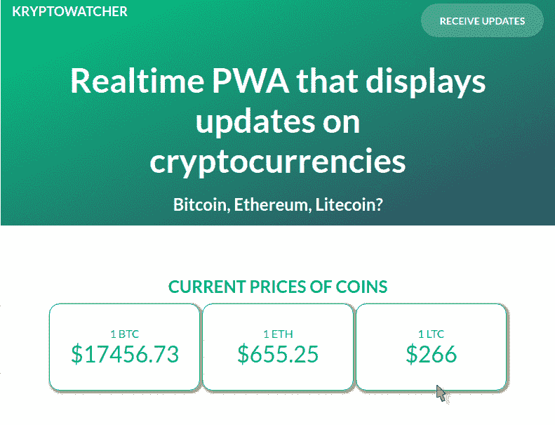
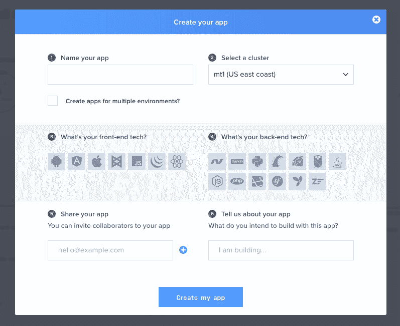
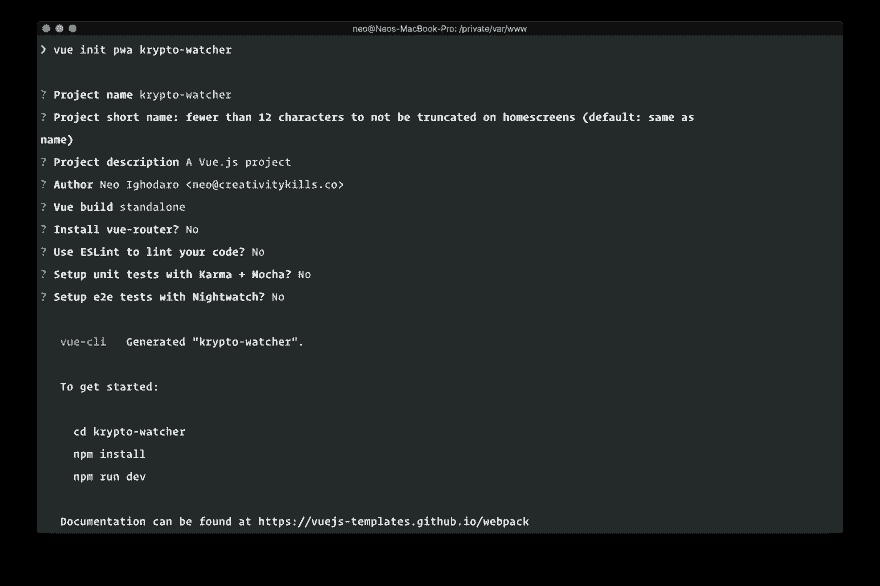
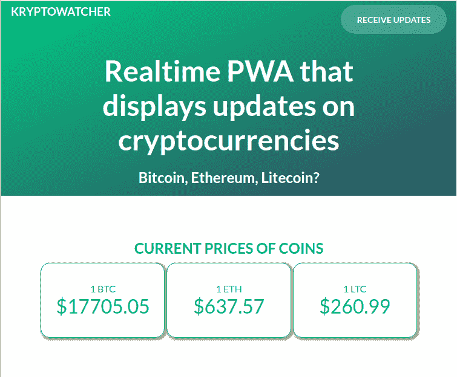
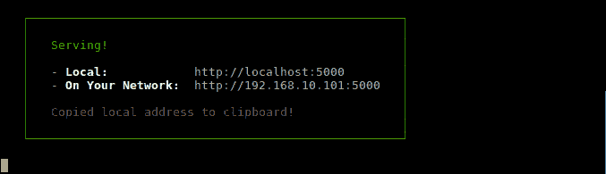
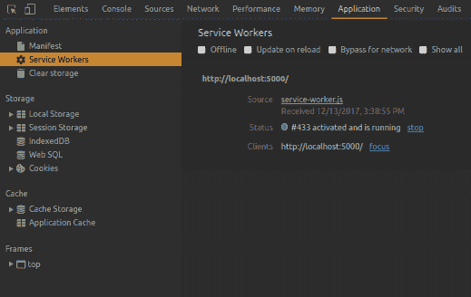

# 使用 Vue.js 构建加密货币跟踪器

> 原文：<https://dev.to/neo/build-a-cryptocurrency-tracker-using-vuejs-4a5n>

> 遵循本教程需要对 Vue.js、Node.js 和 PWA 有基本的了解。

PWAs(Progressive Web Applications)已经被认为是 Web 应用的未来，原因很明显。PWAs 允许您构建能够向用户提供类似本地应用程序的体验的 web 应用程序。

从发送推送通知，到缓存数据以供离线检索，再到后台同步，渐进式网络应用已经完全覆盖了你。PWAs 还可以确保用户即使在网络连接非常差的情况下也能参与进来并获得最新的动态数据。

> 渐进式 web 应用程序(PWA)是一个术语，用来表示使用最新 web 技术的 Web 应用程序。渐进式 Web 应用程序，也称为可安装 Web 应用程序或混合 Web 应用程序，是常规的网页或网站，但可以像传统应用程序或原生移动应用程序一样出现在用户面前。应用程序类型试图将大多数现代浏览器提供的功能与移动体验的优势结合起来。——[维基百科](https://en.wikipedia.org/wiki/Progressive_web_app)

本文演示了如何用 Vue.js 和 Pusher 构建一个简单的实时 PWA。Vue.js 是一个用于 JavaScript 的渐进式 Web 框架，它易于使用，并且需要相对较少的代码来产生令人惊叹的结果。

对于这个应用程序的实时部分，我们将插入 Pusher 的 JavaScript 库。Pusher 是一个实时引擎，可以很容易地将实时功能添加到应用程序中。

## 我们将会建造什么

在本文中，我们将构建一个名为“KryptoWatcher”的加密货币应用程序。它的功能是实时显示三种加密货币(比特币、以太币和莱特币)的价格更新。价格更新将从 Cryptocompare API 获得。

氪星守望者也将能够穿越到过去五天，并检索那些日子的硬币数据。这是最终应用程序的视觉展示:

[T2】](https://res.cloudinary.com/practicaldev/image/fetch/s--9_HPGEYK--/c_limit%2Cf_auto%2Cfl_progressive%2Cq_66%2Cw_880/https://images.contentful.com/1es3ne0caaid/70YNXoNPl6cuAOAmS0SW8a/3b318c61b0a19378604ac5607a3201eb/cryptocurrency-tracker-vue-demo.gif)

最棒的是，这个应用程序运行一次后，即使没有互联网连接，它也可以再次运行并显示硬币数据。这是可能的，因为我们将构建`KryptoWatcher`来在第一次运行时缓存硬币数据。

让我们开始把碎片拼在一起。

## 要求

要学习本教程，您需要具备以下条件:

*   [Vue.js](https://vuejs.org/) 的知识。
*   安装在您机器上的 Vue CLI 。
*   [节点和 NPM](https://docs.npmjs.com/getting-started/installing-node) 安装在您的机器上。
*   Node.js 和 Express 框架的知识。
*   JavaScript 知识。
*   推送应用程序。[在这里创建一个](https://pusher.com/)。

一旦您有了需求，我们就可以继续设置我们的应用程序。

## 设置 Pusher 应用程序

创建一个[卖家账户](https://pusher.com/)，如果你还没有的话，然后设置你的应用程序，如下图所示。

[T2】](https://res.cloudinary.com/practicaldev/image/fetch/s--kiuUMe8G--/c_limit%2Cf_auto%2Cfl_progressive%2Cq_auto%2Cw_880/https://images.contentful.com/1es3ne0caaid/4dQB7DXuQEyecCwE06AuSy/3d775f17a03b1895f67c6e8b80e65e2f/cryptocurrency-tracker-vue-create-app.png)

完成设置后，记下您的 Pusher 应用程序密钥，因为我们稍后会用到它们。

## 设置我们的 Vue.js PWA 应用程序

您可以将 Vue CLI 工具视为搭建 Vue.js 项目的轻量级工具。为了开始构建我们的应用程序，我们将使用 Vue CLI 工具引入我们将要使用的 [Vue PWA 模板](https://github.com/vuejs-templates/pwa)。

要创建我们的应用程序，请在您的终端上运行以下命令:

```
$ vue init pwa krypto-watcher 
```

您将看到提示和一些“是”或“否”的问题。不过，对于“Y”或“N”提示，您可以选择自己认为合适的答案，因为我们不需要额外的功能和特性，所以让我们用“N”来回答所有的问题。

[T2】](https://res.cloudinary.com/practicaldev/image/fetch/s---C-c1Cq5--/c_limit%2Cf_auto%2Cfl_progressive%2Cq_auto%2Cw_880/https://images.contentful.com/1es3ne0caaid/64HwW3fkUouk2OuuGMkmeC/d7b56613d14ecc9f66bb25b55b3e248a/cryptocurrency-tracker-vue-project-details.png)

该模板为我们提供了开箱即用的强大 PWA 功能。其中一个特征是服务人员。服务人员允许我们的应用程序脱机工作。

> 💡服务人员是您的浏览器在后台运行的脚本，独立于网页，为不需要网页或用户交互的功能打开了大门。

要安装依赖项，请转到您的终端窗口并运行以下命令:

```
$ cd krypto-watcher && npm install 
```

如果你看一下你的项目目录，你会发现它包含几个子文件夹:`build`、`config`、`src`、`static`、`test`。让我们打开`build/webpack.prod.conf.js`文件，快速浏览一下`SWPrecacheWebpackPlugin`对象:

```
new SWPrecacheWebpackPlugin({ 
    cacheId: 'krypto-watcher', 
    filename: 'service-worker.js', 
    staticFileGlobs: ['dist/**/*.{js,html,css}'], 
    minify: true, stripPrefix: 'dist/' 
}) 
```

这是在构建应用程序时生成一个新的服务工作者(使用`npm run build`命令)。

服务工作者将在当前指向不存在的`dist`文件夹的`staticFileGlobs`中缓存所有匹配 glob 表达式的文件，用于离线访问。在我们构建应用程序时，将会创建`dist`目录。

让我们开始一个组件一个组件地构建我们的应用程序。

### Vue.js 组件

与 React 等其他现代 JavaScript 库和框架类似，Vue 允许我们在构建应用程序时创建组件。组件帮助我们保持应用程序的模块化，并确保应用程序可以分成可重用的模块。

让我们通过创建三个可重用组件来构建`KryptoWatcher`:

1.  将保存应用程序的介绍性标记和样式的组件。
2.  将实时显示硬币价格的组件。
3.  将显示“x 天前”硬币价格的`Previous`组件。

让我们开始创建组件。我们将手动完成它们，但是你可以随时使用像[这个](https://www.npmjs.com/package/vue-generate-component)这样的 NPM 包来更容易地创建组件。创建一个`src/components`目录，并在该目录下创建以下文件:`Intro.vue`、`Current.vue`和`Previous.vue`。

### 简介组件

这个组件没有特殊的功能，因为它只是持有的介绍标记和风格，将使应用程序像样。HTML 放在`template`标签之间，样式放在`styles`标签中。

在`Intro.vue`文件中粘贴以下内容:

```
<template>
  <header class="hero">
    <div class="bar logo">
      <h3>KryptoWatcher</h3>
      <span class="monitor"><span class="monitorText">receive updates</span></span>
    </div>
    <h1>Realtime PWA that displays updates on cryptocurrencies</h1>
    <h2>Bitcoin, Ethereum, Litecoin?</h2>
  </header>
</template>
<script>export default { name: 'app' }</script>

<style scoped>
header {
    background: linear-gradient(to bottom right, rgb(0, 193, 131),rgb(50, 72, 95));
    padding: 1em;
    margin-bottom: 1em;
    text-align: center;
    height: 300px;
    color: #fff;
}
header h3 {
    color: white;
    font-weight: bold;
    text-transform: uppercase;
    float: left;
}
bar { padding: 20px; height: 48px; }
.monitor{
    text-transform: uppercase;
    float:right;
    background-color: rgba(255, 255, 255, 0.2);
    line-height: 23px;
    border-radius: 25px;
    width: 175px;
    height: 48px;
    margin: auto;
}
.monitor:hover, monitorText:hover { cursor:pointer; }
.monitorText{
    width: 104px;
    height: 23px;
    font-weight: bold;
    line-height: 50px;
    font-size: 14px;
}
header h1 { padding-top: 80px; width: 80%; margin: auto; }
header h2{ padding-top:20px; }
</style> 
```

这就是介绍部分的全部内容。

### 当前组件

在`Current.vue`组件中，我们将编写一些 HTML，在价格更新时实时显示价格。打开文件并将以下内容粘贴到文件中:

```
<template>
  <div>
    <h2>Current prices of coins</h2>
    <div id="btc" class="currency">
      <label>1 BTC</label>
      <p>$</p>
    </div>
    <div id="eth"class="currency">
      <label>1 ETH</label>
      <p>$</p>
    </div>
    <div id="ltc"class="currency">
      <label>1 LTC</label>
      <p>$</p>
    </div>
  </div>
</template> 
```

在`template`标签下面，我们将有`script`标签。这将是我们处理组件脚本的地方。在同一个文件的`template`标签下面，粘贴以下代码:

```
<script> 
export default { 
    name: 'app', 
    props: { 
        currentCurrency: { type: Object } 
    }, 
    data () { 
        return {} 
    } 
}
</script> 
```

上面的脚本指定了`Current`组件应该期望的`props`。它将从父组件`App.vue`中获取`currentCurrency`。

最后，在`script`标签下面，让我们包含组件的`style`。在`script`标签后粘贴以下代码:

```
<style scoped>
.currency {
  border: 1px solid #F5CE00;
  border-radius: 15px;
  padding: 2em 0em;
  display: inline-block;
  width: 30%;
}
div p { font-size: 2rem; }
h2 { font-size: 1.5em; }
</style> 
```

`Current`组件到此为止。

### 前一个组件

这个组件应该显示过去最多五天的硬币价格。我们还将显示每一天的日期。

在`Previous.vue`文件中粘贴以下代码:

```
<template>
  <div>
    <h2>Previous prices of coins</h2>
    <div id="first">
      <h2>Date:   </h2>
      <p><label>1 BTC:</label> </p>
      <p><label>1 ETH:</label> </p>
      <p><label>1 LTC:</label> </p>
    </div>
    <div id="second">
      <h2>Date:   </h2>
      <p><label>1 BTC:</label> </p>
      <p><label>1 ETH:</label> </p>
      <p><label>1 LTC:</label> </p>
    </div>
    <div id="third">
      <h2>Date:   </h2>
      <p><label>1 BTC:</label> </p>
      <p><label>1 ETH:</label> </p>
      <p><label>1 LTC:</label> </p>
    </div>
    <div id="fourth">
      <h2>Date:   </h2>
      <p><label>1 BTC:</label> </p>
      <p><label>1 ETH:</label> </p>
      <p><label>1 LTC:</label> </p>
    </div>
    <div id="fifth">
      <h2>Date:   </h2>
      <p><label>1 BTC:</label> </p>
      <p><label>1 ETH:</label> </p>
      <p><label>1 LTC:</label> </p>
    </div>
  </div>
</template> 
```

在`script`部分，我们将从父组件`App.vue`接收`previousCurrency`对象。在同一个文件中，将以下代码粘贴在`template`标记之后:

```
<script>
export default {
  name: 'app',
  props: {
    previousCurrency: { type: Object }
  },
  data () {
    return {}
  }
}
</script> 
```

最后，一些有助于保持美观的风格:

```
<style scoped>
#first, #second, #third, #fourth, #fifth {
  border: 1px solid #F5CE00;
  padding: 2em 0em;
  max-width: 90%;
  margin: 3px auto;
}
#first p, #second p, #third p, #fourth p, #fifth p {
  display: inline-block;
  padding: 0em 1.5em;
  font-size: 1.5rem;
}
h2 { font-size: 1.5em; }
</style> 
```

这就是我们关于这三个组件的所有业务，它们非常简单。大多数复杂性和应用程序逻辑都隐藏在根组件`App.vue`中。接下来让我们来探索一下。

### 设置根组件

根组件默认包含在每个新 Vue 安装的`src/App.vue`文件中，所以我们不需要创建它。与我们之前创建的其他组件不同，根组件包含逻辑，并且比它们更复杂。

我们将保持根组件的`template`标签简单。我们包含了早期的组件，`Intro.vue`、`Current.vue`和`Previous.vue`，作为定制标签，并传入适当的`props`。

在`App.vue`文件中，用以下内容替换内容:

```
<template>
  <div>
    <intro></intro>
    <div id="body">
      <div id="current">
        <current v-bind:currentCurrency="currentCurrency"></current>
      </div>
      <div id="previous">
        <previous v-bind:previousCurrency="previousCurrency"></previous>
      </div>
    </div>
  </div>
</template> 
```

接下来，我们添加一些`script`，开始在`script`部分添加逻辑。在`template`标签下粘贴以下内容:

```
<script>
import Intro from './components/Intro.vue';
import Current from './components/Current.vue';
import Previous from './components/Previous.vue';

export default {
  name: 'app',
  components: {Intro, Current, Previous},
  data() {
    return {
      currentCurrency: {BTC: '', ETH: '', LTC: ''},
      previousCurrency: {
        yesterday: {}, twoDays: {}, threeDays: {}, fourDays: {}, fiveDays: {}
      }
    }
  },
  methods: {
    // Stub
  },
  created() {
    // Stub
  }
}
</script> 
```

上面的脚本没有做太多，但是它为我们的逻辑搭建了舞台。我们已经为将在应用程序中使用的`data`设置了所有默认值，并且我们已经定义了在 Vue 的组件生命周期中自动调用的`created`方法。我们还导入了将在应用程序中使用的组件。

在我们开始添加脚本逻辑之前，让我们为根组件添加一些样式。在`script`标签下，粘贴以下代码:

```
<style>
@import url('https://fonts.googleapis.com/css?family=Lato');
* {
  margin : 0px;
  padding : 0px;
  font-family: 'Lato', sans-serif;
}
body { height: 100vh; width: 100%; }
.row { display: flex; flex-wrap: wrap; }
h1 { font-size: 48px; }
a { color: #FFFFFF; text-decoration: none; }
a:hover { color: #FFFFFF; }
a:visited { color: #000000; }
.button {
  margin: auto;
  width: 200px;
  height: 60px;
  border: 2px solid #E36F55;
  box-sizing: border-box;
  border-radius: 30px;
}
#body {
  max-width: 90%;
  margin: 0 auto;
  padding: 1.5em;
  text-align: center;
  color:rgb(0, 193, 131);
}
#current { padding: 2em 0em; }
#previous { padding: 2em 0em; }
</style> 
```

### 向我们的根组件添加方法

我们需要用实际的方法填充`method`对象。我们将从定义检索前几天硬币价格的方法开始。

### 拉入依赖项

因为我们从远程 API 获取数据，所以我们需要一个 HTTP 客户端来获取数据。在本文中，我们将使用基于 promise 的 HTTP 客户端`[axios](https://github.com/axios/axios)`来发出 HTTP 请求。我们还需要`[moment](https://momentjs.com/)`来轻松处理日期。

要将 Axios 和 Moment.js 添加到我们的项目中，请在您的终端中运行以下命令:

```
$ npm install --save vue-axios axios vue-momentjs moment 
```

> 💡`vue-axios`和`vue-momentjs`是 Axios 和 Moment.js 包周围的 Vue 包装器。

当安装完成时，我们将全局地将包导入到我们的应用程序中。打开`src/main.js`文件，在其中替换:

```
import App from './App' 
```

使用:

```
import App from './App'
import moment from 'moment';
import VueMomentJS from 'vue-momentjs';
import axios from 'axios'
import VueAxios from 'vue-axios'

Vue.use(VueAxios, axios)
Vue.use(VueMomentJS, moment); 
```

### 构建方法逻辑

接下来，我们想回到我们的根组件，构建出`methods`对象。在`methods`对象中，让我们创建第一个方法。将以下代码粘贴到`App.vue`文件中的`methods`对象内:

```
_fetchDataFor: (key, daysAgo) => {
  var date = this.$moment().subtract(daysAgo, 'days').unix()
  let fetch = (curr, date) => this.axios.get(`https://min-api.cryptocompare.com/data/pricehistorical?fsym=${curr}&tsyms=USD&ts=${date}`)

  this.axios
      .all([fetch('BTC', date), fetch('ETH', date), fetch('LTC', date)])
      .then(this.axios.spread((BTC, ETH, LTC) => {
          this.previousCurrency[key] = {
              BTC: BTC.data.BTC.USD,
              LTC: LTC.data.LTC.USD,
              ETH: ETH.data.ETH.USD,
              DATE: this.$moment.unix(date).format("MMMM Do YYYY"),
          }

          localStorage.setItem(`${key}Prices`, JSON.stringify(this.previousCurrency[key]));
      }))
}, 
```

上面的方法是一个 helper 方法，用于取出指定时间段内的硬币汇率，并将响应保存在`localStorage`和`this.previousCurrency`对象中。我们将在后面的代码中使用它。

接下来，将下面的函数粘贴到我们在上面添加的函数旁边的`methods`对象中:

```
_fetchDataForToday: () => {
  let url = 'https://min-api.cryptocompare.com/data/pricemulti?fsyms=BTC,ETH,LTC&tsyms=USD'

  this.axios.get(url).then(res => {
    localStorage.setItem('BTC', this.currentCurrency.BTC = res.data.BTC.USD),
    localStorage.setItem('ETH', this.currentCurrency.ETH = res.data.ETH.USD),
    localStorage.setItem('LTC', this.currentCurrency.LTC = res.data.LTC.USD)
  })
}, 
```

上面的方法只是获取当前日期的硬币数据，并保存对`localStorage`和`this.currentCurrency`对象的响应。

接下来，在根组件的`created()`方法中，粘贴以下代码:

```
if ( ! navigator.onLine) {
  this.currentCurrency = {
    BTC: localStorage.getItem('BTC'),
    ETH: localStorage.getItem('ETH'),
    LTC: localStorage.getItem('LTC'),
  }

  this.previousCurrency = {
    yesterday: JSON.parse(localStorage.getItem('yesterdayPrices')),
    twoDays:   JSON.parse(localStorage.getItem('twoDaysPrices')),
    threeDays: JSON.parse(localStorage.getItem('threeDaysPrices')),
    fourDays:  JSON.parse(localStorage.getItem('fourDaysPrices')),
    fiveDays:  JSON.parse(localStorage.getItem('fiveDaysPrices'))
  }
} else {
  this._fetchDataFor('yesterday', 1)
  this._fetchDataFor('twoDays', 2)
  this._fetchDataFor('threeDays', 3)
  this._fetchDataFor('fourDays', 4)
  this._fetchDataFor('fiveDays', 5)
  this._fetchDataForToday()
} 
```

在上面的代码中，我们定义了在客户端离线时从`localStorage`获取当前货币的代码。如果客户端在线，它会从 API 获取数据。

除了实时功能，现在一切都应该正常工作了。

[T2】](https://res.cloudinary.com/practicaldev/image/fetch/s--fAJ0_jjk--/c_limit%2Cf_auto%2Cfl_progressive%2Cq_auto%2Cw_880/https://images.contentful.com/1es3ne0caaid/70EsAUqmNqSogEYYgwg640/c70439aeb26fd7963309b4cfb39dce7f/cryptocurrency-tracker-vue-draft.png)

### 使用 Pusher 集成实时功能

现在我们有了一个功能应用程序，我们想添加一些实时功能，这样我们就可以在更新发生时看到它们。

我们将使用 Pusher 来提供此功能，如果您还没有，请从 Pusher 仪表板创建您的 Pusher 应用程序，因为您将需要:`app_id`、`key`、`secret`和`cluster`。

#### 为我们的应用程序构建 Node.js 后端

我们需要一个后端服务器来触发 Pusher 事件，我们将使用 Node.js 来构建本文的后端。

首先，在应用程序的根目录下创建一个新文件，并将其命名为`server.js`。在这个`server.js`文件中，我们将使用`Express`作为 web 框架，所以我们需要把它放进去。我们还将引入`axios`、`Pusher`和`body-parser`，因为我们会在代码中引用它们。

在您的终端中键入以下命令:

```
$ npm install --save express axios body-parser pusher 
```

安装完成后，打开`server.js`文件，在文件中粘贴以下代码:

```
const express = require('express');
const path = require('path');
const bodyParser = require('body-parser');
const app = express();
const Pusher = require('pusher');
const axios = require('axios');

// Initialise Pusher
var pusher = new Pusher({
  appId: 'PUSHER_APP_ID',
  key: 'PUSHER_APP_KEY',
  secret: 'PUSHER_APP_SECRET',
  cluster: 'PUSHER_APP_CLUSTER',
  encrypted: true
});

// Body parser middleware
app.use(bodyParser.json());
app.use(bodyParser.urlencoded({ extended: false }));

// CORS middleware
app.use((req, res, next) => {
    res.setHeader('Access-Control-Allow-Origin', '*')
    res.setHeader('Access-Control-Allow-Credentials', true)
    res.setHeader('Access-Control-Allow-Methods', 'GET, POST, OPTIONS')
    res.setHeader('Access-Control-Allow-Headers', 'X-Requested-With,content-type')
    next()
});

// Routes
app.get('/', _ => res.send('Welcome'));

// Simulated Cron
setInterval(_ => {
  let url = 'https://min-api.cryptocompare.com/data/pricemulti?fsyms=BTC,ETH,LTC&tsyms=USD';

  axios.get(url).then(res => {
    pusher.trigger('price-updates', 'coin-updates', {coin: res.data})
  })
}, 5000)

// Start app
app.listen(8000, () => console.log('App running on port 8000!')); 
```

> 💡您需要将`PUSHER_APP_ID`、`PUSHER_APP_KEY`、`PUSHER_APP_SECRET`和`PUSHER_APP_CLUSTER`替换为您的 Pusher 应用仪表板中的详细信息。

在上面的 Express 应用程序中，我们导入依赖项，然后实例化 Pusher。然后我们注册一些中间件，包括 [CORS](https://developer.mozilla.org/en-US/docs/Web/HTTP/CORS) 中间件，这样我们就不会出现跨源请求错误。

接下来，我们有一个在 5 秒钟后运行的“模拟 Cron”。工作是从服务器获取更新，并将更新发送给 Pusher。然后，我们的 Vue 应用程序可以订阅推送通道，提取更改并显示它们。

最后，我们告诉节点应用程序监听端口 **8000** 。要启动节点服务器，请运行以下命令:

```
$ node server.js 
```

这将启动一个节点服务器，模拟的 cron 将开始运行并向 Pusher 发送事件。

## 创建 API 代理

为了从 Vue 应用程序访问我们的 API 服务器，我们可以在`config/index.js`中创建一个代理，并并行运行 dev 服务器和 API 后端。我们前端代码中对`/api`的所有请求都将被代理到后端服务器。

打开`config/index.js`并进行以下修改:

```
// config/index.js
module.exports = {
  // ...
  dev: {
    // ...
    proxyTable: {
        '/api': {
        target: 'http://localhost:8000',
        changeOrigin: true,
        pathRewrite: {
          '^/api': ''
        }
      }
    },
    // ...
  }
} 
```

在`proxyTable`中，我们试图代理从`/api`到`localhost:8000`的请求。

### 在我们的 Vue.js 应用程序中使用 Pusher

为了在我们应用程序的客户端使用`Pusher`，我们需要引入`pusher-js`。在您的终端中运行以下命令:

```
$ npm install --save pusher-js 
```

安装完成后，我们将把`pusher-js`导入到根组件中。在`script`标签的顶部添加以下内容:

```
import Pusher from 'pusher-js' 
```

接下来，我们将使用 Pusher 仪表盘中的应用凭证初始化 Pusher，并订阅`created()`生命周期挂钩中的一个频道。打开`App.vue`并将它添加到`else`块中`created()`方法的底部:

```
let pusher = new Pusher('PUSHER_APP_KEY', {
  cluster: 'PUSHER_APP_CLUSTER',
  encrypted: true
});

let channel = pusher.subscribe('price-updates');

channel.bind('coin-updates', data => {
  this.currentCurrency = {
    BTC: data.coin.BTC.USD, 
    ETH: data.coin.ETH.USD, 
    LTC: data.coin.LTC.USD
  }
}); 
```

在上面的代码中，我们订阅了在`price-updates`通道上接收更新。然后我们绑定到通道上的`coin-updates`事件。当事件被触发时，我们获取数据并更新`currentCurrency`。

现在就这些了。您可以通过运行以下命令来构建应用程序:

```
$ npm run dev 
```

这将在您的浏览器上启动并打开 Vue PWA。要确保您收到更新，请确保您的节点服务器正在运行。

[T2】](https://res.cloudinary.com/practicaldev/image/fetch/s--tkDeKEku--/c_limit%2Cf_auto%2Cfl_progressive%2Cq_66%2Cw_880/https://images.contentful.com/1es3ne0caaid/4beBtBCJjqiWK4GKa0Mw0i/13f64db1b24726b8b3e19ccb17aa92a6/cryptocurrency-watcher-vue-demo.gif)

## 使用服务人员和离线功能

实际上，该应用程序已经运行，但不是真正意义上的 PWA。因此，让我们努力使应用程序成为具有离线存储的 PWA。在构建应用程序时，构建过程已经自动生成了服务工作者，所以让我们来构建应用程序。运行以下命令来构建应用程序:

```
$ npm run build 
```

这个命令在我们的工作目录中创建一个`dist`文件夹，并注册一个新的服务工作者。让我们为这个`dist`目录提供服务，并在 Chrome web 浏览器中查看生成的服务工人。

我们将使用名为 [Serve](https://www.npmjs.com/package/serve) 的 NPM 包来服务这个应用程序。运行以下命令进行安装:

```
$ npm i serve -g 
```

安装完成后，我们将使用这个包来服务应用程序。运行以下命令为应用程序提供服务:

```
$ serve dist 
```

我们应该得到如下所示的输出:

[T2】](https://res.cloudinary.com/practicaldev/image/fetch/s--mvNCD5qX--/c_limit%2Cf_auto%2Cfl_progressive%2Cq_auto%2Cw_880/https://images.contentful.com/1es3ne0caaid/5D35dFM7PGssemAeMO0IcS/2563dfc1d3b90732117be8babc5ae2d0/cryptocurrency-tracker-vue-output.png)

如果我们在网络浏览器上导航到这个地址`http://localhost:5000`,我们会看到我们的应用程序和上次一样，除了应用程序现在是 PWA 之外，没有明显的变化。

我们可以通过打开浏览器的开发工具并单击“应用程序”选项卡来检查该功能。下面是我们应该看到的:

[T2】](https://res.cloudinary.com/practicaldev/image/fetch/s--AWngsFPZ--/c_limit%2Cf_auto%2Cfl_progressive%2Cq_auto%2Cw_880/https://images.contentful.com/1es3ne0caaid/1V3EsE6wwoicCOo6KQgiG0/35da6aa92c35a46419c58dacb08b7a3a/cryptocurrency-tracker-vue-service-workers.png)

由于 Vue PWA 模板，我们的应用程序注册了一个服务工作者，在第一次运行时缓存应用程序外壳。

> 💡应用程序外壳(或应用程序外壳)指的是 web 应用程序加载用户界面(UI)框架所需的本地资源。将您的应用程序外壳想象成您在构建本机应用程序时将发布到本机应用程序商店的代码包。

## 结论

在本教程中，我们看到了如何用 Vue.js、Pusher 和 Service Workers 编写一个简单的实时 PWA。我们还看到了如何使用 Web 存储 API 的存储对象缓存来自远程 API 的动态值。使用 PWAs 和 Vue 可以做更多的事情，但这是目前为止一个很好的介绍。

这篇文章最初出现在 [Pusher 博客](https://pusher.com/tutorials/cryptocurrency-tracker-vue/)上。