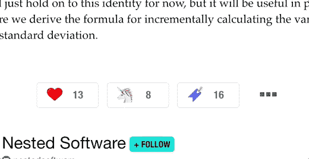
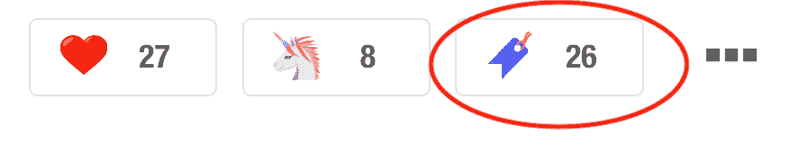

# 逐步构建 Firefox 扩展

> 原文：<https://dev.to/scleriot/build-a-firefox-extension-step-by-step-5dbl>

最近我一直在用[dev .](https://dev.to/)上的阅读清单。这是一个很好的工具，但我习惯于将文章保存在[的口袋里](https://getpocket.com/)。
在本文中，我们将创建一个 Firefox 扩展，同时自动将一篇文章添加到你的开发者阅读列表和你的口袋账户中。

下面是它的样子(扩展文件可在本文末尾找到):

[T2】](https://res.cloudinary.com/practicaldev/image/fetch/s--QuAozyLZ--/c_limit%2Cf_auto%2Cfl_progressive%2Cq_66%2Cw_880/https://thepracticaldev.s3.amazonaws.com/i/wy5hu5jmgrjt9bt5tfk7.gif)

该扩展要求您已经在浏览器中连接到 Pocket 帐户(因此我们不必处理 API 认证)。

## 什么是浏览器扩展？

浏览器扩展是 Firefox 浏览特定页面时执行的脚本集合。这些脚本可以改变页面的 HTML、CSS 和 JavaScript，并访问特定的[JavaScript API](https://developer.mozilla.org/fr/Add-ons/WebExtensions/prise_en_charge_du_navigateur_pour_les_api_javascript)(书签、身份等)...).

剧本分两种:[内容](https://developer.mozilla.org/fr/Add-ons/WebExtensions/manifest.json/content_scripts)和[背景](https://developer.mozilla.org/en-US/Add-ons/WebExtensions/manifest.json/background)。内容脚本在页面中执行，而后台脚本执行长期操作并维护长期状态。后台脚本也可以访问所有的 WebExtension API。

以下是该项目的最终文件结构:

*   manifest.json *(配置文件)*
*   background.js *(我们的后台脚本)*
*   devtopocket.js *(在 dev.to 页面上执行的内容脚本)*
*   图片/

## 内容和后台脚本

我们的项目中有两个脚本:一个处理后台工作(发送 Ajax 请求),另一个(内容脚本)注册“阅读列表”Dev.to 按钮上的点击事件:

[T2】](https://res.cloudinary.com/practicaldev/image/fetch/s--W6qMK2UW--/c_limit%2Cf_auto%2Cfl_progressive%2Cq_auto%2Cw_880/https://thepracticaldev.s3.amazonaws.com/i/rhgi2mdhfvntunhj37mp.png)

### 内容脚本

内容脚本( *devtopocket.js* )注册点击并将请求发送给我们的后台脚本。

devtopket . js〔t0〕

```
document.getElementById("reaction-butt-readinglist").addEventListener("click", function() {
    if(window.confirm("Do you want to save this article in Pocket?")) {
        sendBackgroundToPocket();
    }
}); 
```

Enter fullscreen mode Exit fullscreen mode

`sendBackgroundToPocket`方法需要与后台脚本通信，让它发送 Ajax 请求。

在我们的扩展脚本之间给我们一个双向的通信通道。`browser.runtime.sendMessage`在该通道上发送消息，并返回一个承诺，等待另一端的响应。一旦我们得到答案(意味着 Ajax 请求已经完成)，就会向用户显示一条消息(参见上面的 gif):

devtopket . js〔t0〕

```
function sendBackgroundToPocket(){
    browser.runtime.sendMessage({"url": window.location.href}).then(function(){
        document.getElementById("article-reaction-actions").insertAdjacentHTML("afterend", "<div id='devtopocket_notification' style='text-align: center;padding: 10px 0px 28px;'>This article has been saved to Pocket!</div>")
        setTimeout(function(){
            document.getElementById("devtopocket_notification").remove()
        }, 2000)
    });  
} 
```

Enter fullscreen mode Exit fullscreen mode

### 后台脚本

后台脚本用于编写不依赖于正在打开的特定网页的耗时操作。

这些脚本随扩展一起加载，并一直执行，直到扩展被禁用或卸载。

我们的后台脚本( *background.js* )有两个角色:

*   发送 Ajax 请求
*   通过历史 API 对 URL 更改做出反应

> 在扩展配置中(下面是 manifest.json ),我们会说“在匹配 url 模式的页面上加载 devtopocket.js ”,当我们直接浏览到一个文章页面时，它会起作用。
> 
> dev.to 网站的“问题”是它使用 HTML5 历史 api 来浏览页面(每个网页 webapp 都是如此)。如果页面没有完全重新加载，Firefox 不会监听 url 的变化，因此不会执行我们的内容脚本。这就是为什么我们需要一个后台脚本来通过历史 API 监听 url 的变化，并在需要时手动执行前端脚本。

我们通过使用 [webNavigation API](https://developer.mozilla.org/en-US/Add-ons/WebExtensions/API/webNavigation) 来监听 url 的变化:

background.js

```
browser.webNavigation.onHistoryStateUpdated.addListener(function(details) {
    browser.tabs.executeScript(null,{file:"devtopocket.js"});
}, {
    url: [{originAndPathMatches: "^.+://dev.to/.+/.+$"}]
}); 
```

Enter fullscreen mode Exit fullscreen mode

`{originAndPathMatches: "^.+://dev.to/.+/.+$"}`将监听器限制到一个特定的目标 url 模式(与我们将在`manifest.json`中定义的模式相同)。

`browser.tabs.executeScript`方法在当前选项卡中加载内容脚本。

后台脚本期待来自我们的内容脚本的消息(当点击“阅读列表”按钮时):

background.js

```
function handleMessage(message, sender, sendResponse) {
    if(message.url) {
        sendToPocket(message.url, sendResponse)
        return true;
    }
}
browser.runtime.onMessage.addListener(handleMessage) 
```

Enter fullscreen mode Exit fullscreen mode

接收消息时调用`sendToPocket`方法。
为了在 Pocket 中保存我们的 url，我们将调用 Pocket 提供的现有保存页面(【https://getpocket.com/save】T2)。一个经典的 Ajax 请求就可以了:

```
function sendToPocket(url, sendResponse) {
    var xhr = new XMLHttpRequest();
    xhr.onreadystatechange = function(){
        if(xhr.readyState === XMLHttpRequest.DONE && xhr.status === 200) {
            sendResponse();
        }
    };
    xhr.open("GET", "https://getpocket.com/save?url="+url, true);
    xhr.send();
} 
```

Enter fullscreen mode Exit fullscreen mode

你可能会看到跨源请求的问题，我们将在后面的扩展权限中解决这个问题。

## 载货单

`manifest.json`是我们的扩展配置文件。这就像 javascript webapp 中的`package.json`或者 Android 应用中的 AndroidManifest.xml。您可以定义项目的版本和名称、所需的权限以及组成扩展的 JavaScript 源文件。

首先我们编写应用程序定义:

```
{  "manifest_version":  2,  "name":  "DevToPocket",  "version":  "1.0.0",  "description":  "Send your DEV.to reading list to Pocket",  "icons":  {  "48":  "icons/devtopocket-48.png"  },  ...  } 
```

Enter fullscreen mode Exit fullscreen mode

至少提供一个 48x48 的图标，如果你提供更多的尺寸，Firefox 会根据你的屏幕分辨率尝试使用最好的图标尺寸。我们将使用这个图标:

icons/devtopket-48 . png[](https://res.cloudinary.com/practicaldev/image/fetch/s--kqzqVp3N--/c_limit%2Cf_auto%2Cfl_progressive%2Cq_auto%2Cw_880/https://thepracticaldev.s3.amazonaws.com/i/8hwqcocltuyxoki8nd5x.png)

然后我们定义我们的权限:

```
{  ...  "permissions":  [  "storage",  "cookies",  "webNavigation",  "tabs",  "*://dev.to/*/*",  "*://getpocket.com/*"  ]  } 
```

Enter fullscreen mode Exit fullscreen mode

您可以在 Mozilla 文档的[中找到权限列表。](https://developer.mozilla.org/fr/Add-ons/WebExtensions/manifest.json/permissions)

权限中的 URL 赋予了我们的分机扩展权限。在我们的例子中，它允许我们从 dev.to 访问 getpocket.com，没有跨源限制，我们可以通过`tabs.executeScript`在 dev.to 中注入一个脚本，我们可以访问 getpocket.com cookie，因此 Ajax 请求得到了认证。完整的主机权限列表可在[这里](https://developer.mozilla.org/en-US/Add-ons/WebExtensions/manifest.json/permissions#Host_permissions)获得。

完整的`manifest.json`文件:

```
{  "manifest_version":  2,  "name":  "DevToPocket",  "version":  "1.0.0",  "description":  "Send your DEV.to reading list to Pocket",  "icons":  {  "48":  "icons/devtopocket-48.png"  },  "content_scripts":  [  {  "matches":  ["*://dev.to/*/*"],  "js":  ["devtopocket.js"]  }  ],  "background":  {  "scripts":  ["background.js"]  },  "permissions":  [  "storage",  "cookies",  "webNavigation",  "tabs",  "*://dev.to/*/*",  "*://getpocket.com/*"  ]  } 
```

Enter fullscreen mode Exit fullscreen mode

## 运行分机

为了运行您的扩展，我们将使用 *web-ext* 命令行:【https://github.com/mozilla/web-ext】的

> 这是一个命令行工具，用于帮助构建、运行和测试 WebExtensions。

```
npm install --global web-ext 
```

Enter fullscreen mode Exit fullscreen mode

然后在您的终端中，在您的项目文件夹中运行以下命令:

```
web-ext run 
```

Enter fullscreen mode Exit fullscreen mode

它将启动一个浏览器，暂时加载您的扩展。当您进行一些更改时，扩展会自动重新加载。

## 标志分机

要在其他人的浏览器中安装您的扩展，您需要对该扩展进行打包和签名。

首先在 [Mozilla 开发者中心](https://addons.mozilla.org/en-US/developers/)创建一个开发者账户，然后在这里检索你的 API 证书:【https://addons.mozilla.org/en-US/developers/addon/api/key/ T2】

运行 *web-ext* sign 命令:

```
web-ext sign --api-key=user:XXX --api-secret=YYY 
```

Enter fullscreen mode Exit fullscreen mode

您的扩展文件将在*we b-ext-artifacts/devtopocket-X . X . X-an+FX . xpi*中提供。在 Firefox 中打开文件进行安装。

* * *

完整的源代码可以在 GitHub 上找到:[https://github.com/scleriot/devtopocket](https://github.com/scleriot/devtopocket)
你可以下载并安装最新版本:[https://github.com/scleriot/devtopocket/releases/latest](https://github.com/scleriot/devtopocket/releases/latest)

这个扩展也适用于 Android 的 Firefox！