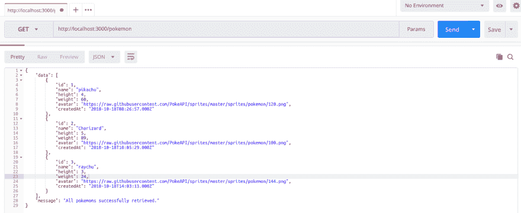

# 用无服务器框架构建 RESTful API

> 原文：<https://dev.to/sagar/build-a-restful-api-with-the-serverless-framework-ene>

今天，我们将使用“无服务器框架”来实现无服务器 RESTful API 服务。有许多云服务提供商提供无服务器功能，如 AWS Lambda、Azure Functions 和 Google CloudFunctions，但在本文中，我坚持使用 AWS Lambda 作为云服务提供商。

如果你不知道无服务器的想法，那么我强烈建议你先看看这个[视频](https://www.youtube.com/watch?v=wWEID0d6wfo)，看完之后再回来。

### 无服务器框架

无服务器框架是一个开源 CLI 工具，它允许我们构建、配置和部署无服务器功能(在我们的例子中，是 AWS Lambda 功能)。

如果没有“无服务器框架”，我们必须在控制台上手动创建和配置必要的资源。当项目很小并且功能有限时，这没什么，但是一旦项目增长，那么创建和配置资源就是一项具有挑战性的任务，并且在很多情况下是不可维护的。在控制台上编写代码和管理团队工作流变成了一项单调乏味的工作。

有了“无服务器框架”，我们可以在几个命令内快速构建、配置和部署资源。我们可以将我们的代码和配置存储到一个集中的存储库中，这样我们就可以设计适当的工作流，开发人员可以在以后编写、重用和参考其他开发人员的代码库。

使用无服务器框架代替手工工作有很多显著的优势。

在本文中，我们将使用“无服务器框架”构建一个无服务器 Pokemon RESTful API 服务。在桌子下面结帐以供参考。

这篇文章的代码可以在这里找到:[https://github.com/sagar-gavhane/pokemon-app](https://github.com/sagar-gavhane/pokemon-app)

| # | 端点 | 方法 | 描述 |
| --- | --- | --- | --- |
| one | 口袋妖怪/ | 得到 | 从数据库中获取所有口袋妖怪的列表 |
| Two | 口袋妖怪/{id} | 得到 | 得到一个特定的口袋妖怪。 |
| three | 口袋妖怪/ | 邮政 | 向数据库添加新的口袋妖怪。 |
| four | 口袋妖怪/{id} | 放 | 更新现有的口袋妖怪。 |
| five | 口袋妖怪/{id} | 删除 | 删除现有的口袋妖怪。 |

### 先决条件

安装以下工具和框架:

1.  Node.js 8.10 或以上
2.  关系型数据库
3.  Visual Studio 代码(首选)或任何代码编辑器
4.  邮递员

接下来，创建项目文件夹，并使用 npm 初始化它。

```
mkdir pokemon-app
cd pokemon-app
npm init -f 
```

Enter fullscreen mode Exit fullscreen mode

### 依赖关系

安装以下软件包以使用“无服务器框架”

*   快速的、非个性化的、极简的 web 框架。
*   [body-parser](https://www.npmjs.com/package/body-parser)——在您的处理程序之前解析中间件中的传入请求体，在 req.body 属性下可用。
*   mysql -一个实现 mysql 协议的纯 node.js JavaScript 客户端。
*   无服务器开发框架。
*   插件允许你包装 express API 以供无服务器使用。
*   [无服务器-离线](https://www.npmjs.com/package/serverless-offline) -模拟 AWS Lambda 和 API 网关的插件，用于加速本地开发。

首先，我们将安装无服务器 CLI:

```
npm install -g serverless 
```

Enter fullscreen mode Exit fullscreen mode

现在，让我们一步一步地安装插件和库。

```
npm install express body-parser mysql serverless-http --save # app dependancies
npm install serverless-offline --save-dev # development dependancies 
```

Enter fullscreen mode Exit fullscreen mode

### App 结构

在我们开始编写处理程序代码之前，我们将构建项目文件夹并配置我们的工具。

在根级别创建以下结构:

```
/pokemon-app/
|--/configs
|----/dbConfig.js
|--/node_modules
|--.gitignore
|--index.js
|--package.json
|--serverless.yml 
```

Enter fullscreen mode Exit fullscreen mode

确保将私有文件列在`.gitignore`文件中，这样我们就不会意外地将它提交给公共存储库。将粘贴原材料从 https://www.gitignore.io/api/node[的](https://www.gitignore.io/api/node)文件复制到`.gitignore`文件。

文件充当我们的 RESTful api 服务的清单。在那里我们定义我们的功能、事件和必要的资源。稍后，通过无服务器 CLI，我们可以将我们的服务配置和部署到 AWS 基础设施。

```
# serverless.yml
service: pokemon-service

provider:
  name: aws
  runtime: nodejs8.10
  stage: dev
  region: us-east-1
  memorySize: 512

functions:
  pokemonFunc:
    handler: index.handler
    events:
      - http:
          path: pokemon
          method: get
      - http:
          path: pokemon/{id}
          method: get
      - http:
          path: pokemon
          method: post
      - http:
          path: pokemon/{id}
          method: put
      - http:
          path: pokemon/{id}
          method: delete

plugins:
  - serverless-offline 
```

Enter fullscreen mode Exit fullscreen mode

我们正在做几件事:

1.  **服务** : `pokemon-service`是服务的名称。您可以为您的服务指定任何类型名称。
2.  **提供商**:这是我们指定正在使用的`provider`的名称(作为云服务提供商的 AWS)以及特定于它的配置。在我们的例子中，我们将运行时(Node.js)配置为 8.10 版本，并将区域配置为`us-east-1`。
3.  **函数**:我们指定我们的服务提供的函数，这里我指定`pokemonFunc`为带有`http`事件的函数名。我们也可以说这是我们的 AWS Lambda 函数。

我们必须在某个地方存储我们的口袋妖怪，为了简单起见，我选择了 MySQL，但你也可以使用另一种类型的数据库。我已经创建了一个名为 pokemon_db 的数据库，并在数据库中创建了一个包含 id、名称、身高、体重、头像和 createAt 列的表 pokemon_tb。

```
CREATE TABLE `pokemon_tb` (
  `id` int(11) NOT NULL,
  `name` varchar(255) NOT NULL,
  `height` float NOT NULL,
  `weight` float NOT NULL,
  `avatar` varchar(255) NOT NULL,
  `createdAt` timestamp NOT NULL DEFAULT CURRENT_TIMESTAMP
) ENGINE=InnoDB DEFAULT CHARSET=latin1;

ALTER TABLE `pokemon_tb` ADD PRIMARY KEY (`id`);

ALTER TABLE `pokemon_tb` MODIFY `id` int(11) NOT NULL AUTO_INCREMENT, AUTO_INCREMENT=1; 
```

Enter fullscreen mode Exit fullscreen mode

我们不再每次都创建和管理连接，而是在`dbConfig.js`文件中配置一次池连接，并多次重用它。

```
// dbConfig.js
const mysql = require('mysql')
const pool  = mysql.createPool({
  host            : 'localhost',
  user            : 'root',
  password        : '12345',
  database        : 'pokemon_app_db',
})

module.exports = pool 
```

Enter fullscreen mode Exit fullscreen mode

### 编写处理函数

让我们重点关注用 express 处理 index.js 文件内部的 RESTful api 路由。首先，我们在顶部导入了`serverless-http`包。其次，我们导出了一个 handler 函数，它是包装在无服务器包中的应用程序。

这里，我们实现了用口袋妖怪处理`crud`操作的五个基本路线(没有任何验证)。

```
const express = require('express')
const serverless = require('serverless-http')
const bodyParser = require('body-parser')
const pool = require('./configs/dbConfig')

const app = express()

app.use(bodyParser.json())
app.use(bodyParser.urlencoded({ extended: true }))

// Handle pokemon GET route for all pokemon
app.get('/pokemon/', (req, res) => {
  const query = 'SELECT * FROM pokemon_tb'
  pool.query(query, (err, results, fields) => {
    if (err) {
      const response = { data: null, message: err.message, }
      res.send(response)
    }

    const pokemons = [...results]
    const response = {
      data: pokemons,
      message: 'All pokemons successfully retrieved.',
    }
    res.send(response)
  })
})

// Handle pokemon GET route for specific pokemon
app.get('/pokemon/:id', (req, res) => {
  const id = req.params.id
  const query = `SELECT * FROM pokemon_tb WHERE id=${id}`
  pool.query(query, (err, results, fields) => {
    if (err) {
      const response = { data: null, message: err.message, }
      res.send(response)
    }

    const pokemon = results[0]
    const response = {
      data: pokemon,
      message: `Pokemon ${pokemon.name} successfully retrieved.`,
    }
    res.status(200).send(response)
  })
})

// Handle pokemon POST route
app.post('/pokemon/', (req, res) => {
  const { name, height, weight, avatar } = req.body

  const query = `INSERT INTO pokemon_tb (name, height, weight, avatar) VALUES ('${name}', '${height}', '${weight}', '${avatar}')`
  pool.query(query, (err, results, fields) => {
    if (err) {
      const response = { data: null, message: err.message, }
      res.send(response)
    }

    const { insertId } = results
    const pokemon = { id: insertId, name, height, weight, avatar }
    const response = {
      data: pokemon,
      message: `Pokemon ${name} successfully added.`,
    }
    res.status(201).send(response)
  })
})

// Handle pokemon PUT route
app.put('/pokemon/:id', (req, res) => {
  const { id } = req.params
  const query = `SELECT * FROM pokemon_tb WHERE id=${id} LIMIT 1`
  pool.query(query, (err, results, fields) => {
    if (err) {
      const response = { data: null, message: err.message, }
      res.send(response)
    }

    const { id, name, height, weight, avatar } = { ...results[0], ...req.body }
    const query = `UPDATE pokemon_tb SET name='${name}', height='${height}', weight='${weight}', avatar='${avatar}' WHERE id='${id}'`
    pool.query(query, (err, results, fields) => {
      if (err) {
        const response = { data: null, message: err.message, }
        res.send(response)
      }

      const pokemon = {
        id,
        name,
        height,
        weight,
        avatar,
      }
      const response = {
        data: pokemon,
        message: `Pokemon ${name} is successfully updated.`,
      }
      res.send(response)
    })
  })
})

// Handler pokemon DELETE route
app.delete('/pokemon/:id', (req, res) => {
  const { id } = req.params
  const query = `DELETE FROM pokemon_tb WHERE id=${id}`
  pool.query(query, (err, results, fields) => {
    if (err) {
      const response = { data: null, message: err.message }
      res.send(response)
    }

    const response = {
      data: null,
      message: `Pokemon with id: ${id} successfully deleted.`,
    }
    res.send(response)
  })
})

// Handle in-valid route
app.all('*', function(req, res) {
  const response = { data: null, message: 'Route not found!!' }
  res.status(400).send(response)
})

// wrap express app instance with serverless http function
module.exports.handler = serverless(app) 
```

Enter fullscreen mode Exit fullscreen mode

**终端快照:**

[T2】](https://res.cloudinary.com/practicaldev/image/fetch/s--6zahfl5f--/c_limit%2Cf_auto%2Cfl_progressive%2Cq_auto%2Cw_880/https://thepracticaldev.s3.amazonaws.com/i/aq687tnep6b1r4foe0ok.png)

**获得所有口袋妖怪:**

[T2】](https://res.cloudinary.com/practicaldev/image/fetch/s--v207hjy---/c_limit%2Cf_auto%2Cfl_progressive%2Cq_auto%2Cw_880/https://thepracticaldev.s3.amazonaws.com/i/rm9p406vuzo4owbd8rdm.png)

**通过 id 获得口袋妖怪:**

[T2】](https://res.cloudinary.com/practicaldev/image/fetch/s--K8FW_X2p--/c_limit%2Cf_auto%2Cfl_progressive%2Cq_auto%2Cw_880/https://thepracticaldev.s3.amazonaws.com/i/qvri39i4itioieox3fjw.png)

**添加新口袋妖怪:**

[T2】](https://res.cloudinary.com/practicaldev/image/fetch/s--RRZYJHUX--/c_limit%2Cf_auto%2Cfl_progressive%2Cq_auto%2Cw_880/https://thepracticaldev.s3.amazonaws.com/i/6sthaflagvclef6f2hol.png)

**更新现有口袋妖怪:**

[T2】](https://res.cloudinary.com/practicaldev/image/fetch/s--QGX_5htz--/c_limit%2Cf_auto%2Cfl_progressive%2Cq_auto%2Cw_880/https://thepracticaldev.s3.amazonaws.com/i/ogopnd776x0wx0b63679.png)

**删除现有口袋妖怪:**

[T2】](https://res.cloudinary.com/practicaldev/image/fetch/s--f7EeWRF0--/c_limit%2Cf_auto%2Cfl_progressive%2Cq_auto%2Cw_880/https://thepracticaldev.s3.amazonaws.com/i/ktbormln4t88bahr7b2s.png)

### 部署

使用无服务器框架部署服务非常简单，我们只需点击部署命令。

```
serverless deploy 
```

Enter fullscreen mode Exit fullscreen mode

我还没有在我的 AWS 帐户上设置 MySQL 数据库，因此 RESTful 服务无法在我的 AWS 基础设施上运行。稍后，我将把 RESTful 服务部署到 AWS 基础设施。

### 结论

用无服务器框架创建 RESTful API 非常简单。对于无服务器，我们必须转换我们的开发工作流程。我发现许多公司正在转向创建和管理微服务架构，而不是单一的应用程序。听起来不错。

### 关闭注释

感谢阅读。我希望你喜欢这篇文章，请随意喜欢、评论或与你的朋友分享这篇文章。为了更深入地了解无服务器框架签出官方文件和 serverless 的博客。