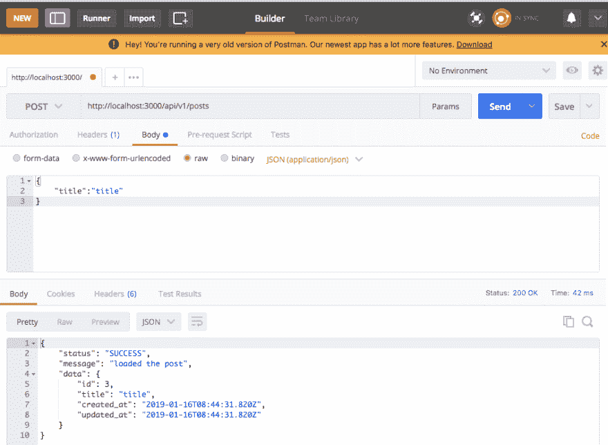

# 使用 RoR5 构建一个简单的 API

> 原文：<https://dev.to/k_penguin_sato/build-a-simple-api-using-ror5-38ap>

# 概述

下面是用 RoR5 创建简单 API 的简单指南。在这篇文章中，我将创建一个简单的类似博客的应用程序，用户可以在上面阅读、创建、更新和删除文章。
完整的代码可从[这里](https://github.com/K-Sato1995/MyApi)获得

# 目录

1.  [创建应用程序](#create-the-application)
2.  [为 Post](#create-the-controller-and-model-for-post) 创建控制器和模型
3.  [用名称空间设置路线](#set-up-routes-with-namespaces)
4.  [设置岗位控制器](#set-up-the-post-controller)
5.  [使用 postman 测试 API](#test-the-api-using-postman)

# 概述

下面是用 RoR5 创建简单 API 的简单指南。在这篇文章中，我将创建一个简单的类似博客的应用程序，用户可以在上面阅读、创建、更新和删除文章。

# 创建申请

您可以通过在`rails new`命令的末尾添加`--api`来创建一个纯 API 的 RoR 应用程序。

```
$  rails new blog --api 
```

Enter fullscreen mode Exit fullscreen mode

# 为 Post 创建控制器和模型

您可以通过运行下面的命令来生成`Post Controller`和`Post Model`。

```
$  rails g model post title:string
$  rails g controller posts
$  rake db:migrate 
```

Enter fullscreen mode Exit fullscreen mode

# 用名称空间设置路线

`Namespaces`使您能够轻松控制 API 的版本。

```
Rails.application.routes.draw do
  namespace 'api' do
    namespace 'v1' do
      resources :posts
    end
  end
end 
```

Enter fullscreen mode Exit fullscreen mode

上面的代码创建了这样的路线。(您可以使用`rake routes`命令检查您的应用程序的路线。)

```
$  rake routes
api_v1_posts GET    /api/v1/posts(.:format)     api/v1/posts#index
 POST   /api/v1/posts(.:format)     api/v1/posts#create
 api_v1_post GET    /api/v1/posts/:id(.:format) api/v1/posts#show
 PATCH  /api/v1/posts/:id(.:format) api/v1/posts#update
 PUT    /api/v1/posts/:id(.:format) api/v1/posts#update
 DELETE /api/v1/posts/:id(.:format) api/v1/posts#destroy 
```

Enter fullscreen mode Exit fullscreen mode

# 设置岗位控制器。

在您的*控制器目录*下创建`api`和`v1`目录。你的*控制器目录*应该是这样的。

```
---- controllers

      --- api

        -- v1

         - posts_controller.rb 
```

Enter fullscreen mode Exit fullscreen mode

创建获取、创建、更新和删除文章的方法，如下面的代码。

```
module Api
  module V1
    class PostsController < ApplicationController
      def index
        posts = Post.order(created_at: :desc)
        render json: { status: 'SUCCESS', message: 'loaded posts', data: posts }
      end

      def show
        post = Post.find(params[:id])
        render json: { status: 'SUCCESS', message: 'loaded the post', data: post }
      end

      def create
        post = Post.new(post_params)
        if post.save
          render json: { status: 'SUCCESS', message: 'loaded the post', data: post }
        else
          render json: { status: 'ERROR', message: 'post not saved', data: post.errors }
        end
      end

      def destroy
        post = Post.find(params[:id])
        post.destroy
        render json: { status: 'SUCCESS', message: 'deleted the post', data: post }
      end

      def update
        post = Post.find(params[:id])
        if post.update(post_params)
          render json: { status: 'SUCCESS', message: 'updated the post', data: post }
        else
          render json: { status: 'SUCCESS', message: 'loaded the post', data: post }
        end
      end

      private

      def post_params
        params.require(:post).permit(:title)
      end
    end
  end
end 
```

Enter fullscreen mode Exit fullscreen mode

# 使用[邮递员](https://www.getpostman.com/)测试 api

让我们创建一些可以在`rails console`上使用的数据。

```
$ rails c 
2.4.4 :001 > Post.create(title:'title1')
2.4.4 :001 > Post.create(title:'title2') 
```

Enter fullscreen mode Exit fullscreen mode

接下来，运行 api！

```
$  rails s 
```

Enter fullscreen mode Exit fullscreen mode

打开 [postman](https://www.getpostman.com/) 并测试以下请求。

### Get([http://localhost:3000/API/v1/posts](http://localhost:3000/api/v1/posts))

您可以检索您在控制台上创建的 2 组数据。

[T2】](https://res.cloudinary.com/practicaldev/image/fetch/s--i5B4WzOE--/c_limit%2Cf_auto%2Cfl_progressive%2Cq_auto%2Cw_880/https://qiita-image-store.s3.amazonaws.com/0/258219/bd494dc7-7303-c48b-f0d5-a784331f1c50.png)

### GET([http://localhost:3000/API/v1/posts/:id](http://localhost:3000/api/v1/posts/:id)

您可以检索一个具有`id = 1`的特定数据。

[T2】](https://res.cloudinary.com/practicaldev/image/fetch/s--vaxpSqWA--/c_limit%2Cf_auto%2Cfl_progressive%2Cq_auto%2Cw_880/https://qiita-image-store.s3.amazonaws.com/0/258219/0f35b92e-f51c-4bba-1db4-69ac07035b19.png)

### 帖子([http://localhost:3000/API/v1/posts](http://localhost:3000/api/v1/posts))

让我们创造数据！
当你创建数据时，你必须发送一个`POST`请求。

所以把右边框中选中的选项从`GET`改为`POST`，并在主体中传递 json 数据。

[T2】](https://res.cloudinary.com/practicaldev/image/fetch/s--BL02ph49--/c_limit%2Cf_auto%2Cfl_progressive%2Cq_auto%2Cw_880/https://qiita-image-store.s3.amazonaws.com/0/258219/0fb6d53a-f0f8-fdef-170e-3ca79d7457b7.png)

### PUT([http://localhost:3000/API/v1/posts/:id](http://localhost:3000/api/v1/posts/:id)

我们来更新数据吧！
将选中的选项改为`PUT`，传递 json 数据。

[T2】](https://res.cloudinary.com/practicaldev/image/fetch/s--cu3lxBaz--/c_limit%2Cf_auto%2Cfl_progressive%2Cq_auto%2Cw_880/https://qiita-image-store.s3.amazonaws.com/0/258219/76d01d80-99ea-0980-2042-b52971dd2a05.png)

### 删除([http://localhost:3000/API/v1/posts/:id](http://localhost:3000/api/v1/posts/:id)

最后，让我们尝试删除数据。
将选中的选项改为`DELETE`，传递 json 数据。

[T2】](https://res.cloudinary.com/practicaldev/image/fetch/s--7FvWArXq--/c_limit%2Cf_auto%2Cfl_progressive%2Cq_auto%2Cw_880/https://qiita-image-store.s3.amazonaws.com/0/258219/d37392ff-eb77-14fc-17d1-86a42a9adcd6.png)

我在这篇文章中使用了`postman`，但是你当然可以使用 [curl 命令](https://curl.haxx.se/docs/manpage.html)来做同样的事情。