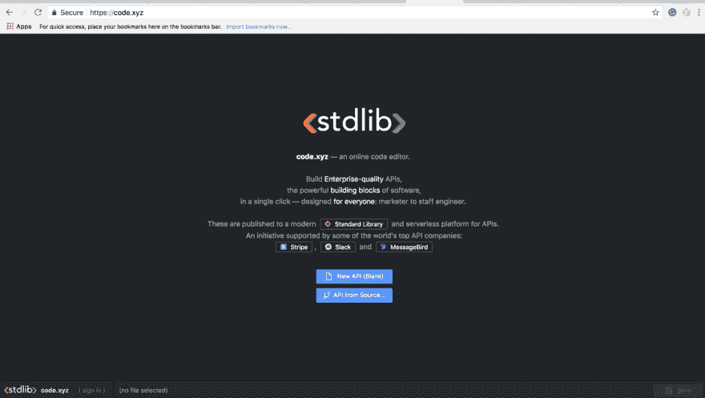

# 使用 Node.js 和 Code.xyz 构建一个 Slack 应用程序来监控您的 Atlassian 应用程序

> 原文：<https://dev.to/janeth/build-a-slack-application-to-monitor-your-atlassian-apps-with-nodejs-and-codexyz-4152>

在为我们的一个名为 Levente 的用户创建了一个方便的服务之后，我决定写这篇教程。莱文特是美岛莉公司的营销人员，该公司为吉拉和 Atlassian Marketplace 上的 Confluence 开发和销售应用程序。Levente 在 Product Hunt 上寻找产品，这将有助于他在工作中使用 Atlassian Marketplace API，而不涉及他们任何总是超级忙碌的开发人员。在了解了 Standard Library 和 Code.xyz 之后，他伸出手来，询问为美岛莉提供一个 Slack 服务来监控他们的应用程序的最新指标会有多复杂。

我给莱文特和他在美岛莉的团队带来了好消息！标准库使这样的项目变得轻而易举，即使对于经验不足的开发人员也是如此。我们需要的只是 Atlassian Marketplace 发布的 API，供供应商管理他们的应用程序。

**所以我们把这个:**

[T2】](https://res.cloudinary.com/practicaldev/image/fetch/s--Jjqi_4fe--/c_limit%2Cf_auto%2Cfl_progressive%2Cq_auto%2Cw_880/https://community.atlassian.com/t5/image/serverpage/image-id/29745i8702575071B26735/image-size/large%3Fv%3D1.0%26px%3D-1)

**进本:**

[T2】](https://res.cloudinary.com/practicaldev/image/fetch/s--e-bPeRDM--/c_limit%2Cf_auto%2Cfl_progressive%2Cq_auto%2Cw_880/https://cdn-images-1.medium.com/max/1600/1%2AytjynhYSV65Kjy9fz3F6SA.png)

Atlassian Marketplace 上销售的 Confluence 问题的衡量标准

我将向大家介绍我如何为 Levente 创建一个 Slack 应用程序，它使用 Slack slash 命令获取应用程序的指标。你可以很容易地复制这些步骤！如果你需要帮助设置你的应用程序，我会在标准库开发者的 Slack workspace 上回答你的问题。:)

[T2】](https://res.cloudinary.com/practicaldev/image/fetch/s--AsveOCfK--/c_limit%2Cf_auto%2Cfl_progressive%2Cq_auto%2Cw_880/https://cdn-images-1.medium.com/max/1600/1%2Ar5ZJD528yFTXqGKBffTpYg.png)

如果您不熟悉标准库，您将会大开眼界！Standard Library 通过 Code.xyz 将您组织中的每个人都变成了开发人员，code . XYZ 是一个用于轻松构建 API、webhooks 和工作流自动化任务的嵌入式开发环境。

**你事先需要什么**

**1x 松弛队**
**1x 标准库账号**

**第一步:准备你的 Slack 应用**
确保你已经登录 Slack 并访问你在[https://api.slack.com/apps](https://api.slack.com/apps)的 Slack 应用页面。您将看到如下所示的屏幕:

[T2】](https://res.cloudinary.com/practicaldev/image/fetch/s--lNMoOoqi--/c_limit%2Cf_auto%2Cfl_progressive%2Cq_auto%2Cw_880/https://cdn-images-1.medium.com/max/1600/1%2AuCcRB20AOnwQzUONRrBOCA.png)

点击**创建新应用**。您将看到一个输入您的应用程序名称和您想要添加它的开发 Slack 工作空间的模式(我将我的命名为“美岛莉”)。

[T2】](https://res.cloudinary.com/practicaldev/image/fetch/s--lIDtAbpT--/c_limit%2Cf_auto%2Cfl_progressive%2Cq_auto%2Cw_880/https://cdn-images-1.medium.com/max/1200/1%2AzkClbjOJruCBdANSzZ4ivA.png)

从这里，点击**创建应用**，你会发现自己在一个**的基本信息页面**。

向下滚动到**显示信息。**你可以在这里为你的 Slack 应用程序命名、描述和图片。

[T2】](https://res.cloudinary.com/practicaldev/image/fetch/s--ypgfxo_d--/c_limit%2Cf_auto%2Cfl_progressive%2Cq_auto%2Cw_880/https://cdn-images-1.medium.com/max/1200/1%2Atb3J7lWP2qEL2Vb6lkR3UA.png)

在浏览器中保持**基本信息**页面打开；我们将立即使用它来检索您的 Slack 应用凭据。

**第二步:使用 Code.xyz**
创建一个免费的标准图书馆账户接下来，我们需要创建一个标准图书馆服务来托管你的 Slack 应用。前往[https://code.xyz/and](https://code.xyz/and)创建一个免费账户。Code.xyz 是由 Standard Library 的团队构建的在线 API 编辑器，这是一个可嵌入的开发环境，用于轻松构建 API、web 挂钩和工作流自动化任务。

[T2】](https://res.cloudinary.com/practicaldev/image/fetch/s--LBe6whez--/c_limit%2Cf_auto%2Cfl_progressive%2Cq_auto%2Cw_880/https://cdn-images-1.medium.com/max/1440/1%2Aql_HL0-jHwQINyab-NaJVw.png)

在 Code.xyz 的左下角点击**(签到)**。如果您有一个标准图书馆帐户，点击**已经注册**并使用您的标准图书馆凭证登录。将弹出一个模块，提示您声明一个名称空间(这是您的用户名)。输入您的电子邮件并选择密码。

创建帐户后，将出现一个不同的模块，列出订购计划。你只需要一个免费账户就可以开始了。一旦你点击**订阅+赚取积分**，你应该会看到一个确认消息弹出。单击继续返回 Code.xyz 登录页面。

**第三步:选择@ Janet HL/atlassianpssmetrics 源代码**

[T2】](https://res.cloudinary.com/practicaldev/image/fetch/s--EGuLkCcX--/c_limit%2Cf_auto%2Cfl_progressive%2Cq_auto%2Cw_880/https://cdn-images-1.medium.com/max/1200/1%2AmLuj-oXTJZu9sMOMZRjeRA.png)

我已经在标准库上发布了我的 Slack 应用程序的代码，这样任何人都可以很容易地复制和修改它。

点击 **API from Sourcecode** 你将派生我的代码并创建你自己的、个人的 API 来驱动你的 Slack 应用！

查找并选择**@ Janet HL/atlassianpssmetrics。**

确保为您的 API 输入一个唯一的名称，并点击**ok**(或按 enter)。

[T2】](https://res.cloudinary.com/practicaldev/image/fetch/s--x7RIuuxC--/c_limit%2Cf_auto%2Cfl_progressive%2Cq_auto%2Cw_880/https://cdn-images-1.medium.com/max/1600/1%2AJfKREidBjiGvrwGfyWLomw.png)

一旦您点击 enter，您将在左侧栏(一个文件夹树视图)看到一个已经自动生成的 API 项目框架。

**源代码的简要说明:**

[T2】](https://res.cloudinary.com/practicaldev/image/fetch/s--C6dqyXqu--/c_limit%2Cf_auto%2Cfl_progressive%2Cq_auto%2Cw_880/https://cdn-images-1.medium.com/max/1200/1%2AZlnnT-0u1GYEOEsYsg8E7g.png)

Slack 应用程序的源代码包含四个目录(文件夹)。对于本教程，我们将只在带有`actions/commands/ events/__main__.js.`的函数目录中工作

当您部署 API 时，标准库将自动为每个函数生成 https 端点。由此产生的 URL 允许 Slack 用户配置 web 挂钩来监听和响应 Slack 的动作、slash 命令和事件。

所有五个功能都通过一个**主**进行设置。js 文件(或函数的主端点)。这些`__main__.js`端点在从 Slack 收到消息时会分派适当的功能。关于函数如何工作的更深入的解释，请访问我们的文档页面。

对于本教程，我们只需要`commands`目录。您应该使用命令目录作为所有松弛斜线命令的端点。要创建任何额外的命令，你所要做的就是在`/functions/commands/`下添加另一个`.js`文件作为`name.js`，其名称与你的 Slack slash 命令的名称相匹配。

**步骤 4:添加你的标准库和 Slack 应用凭证**

[T2】](https://res.cloudinary.com/practicaldev/image/fetch/s--CiDJ93eA--/c_limit%2Cf_auto%2Cfl_progressive%2Cq_auto%2Cw_880/https://cdn-images-1.medium.com/max/1200/1%2AIaCgUo3h5izDvpzg7z2wiw.png)

我们快到了！是时候打开你的 env.json(环境变量)了。我们将对“dev”环境变量进行修改— **确保您正在修改正确的设置！**请注意,“dev”值是针对您的开发环境的,“release”值只应在您准备发布应用程序时填充。从 code.xyz 部署时,“本地”变量可以留空，从本地 CLI 测试服务时应填充这些变量。

将光标放在引号之间(见屏幕)，右键单击并选择**插入库令牌**或使用快捷键 **⌘ + K.**

[T2】](https://res.cloudinary.com/practicaldev/image/fetch/s--tQrc_hwt--/c_limit%2Cf_auto%2Cfl_progressive%2Cq_auto%2Cw_880/https://cdn-images-1.medium.com/max/1600/1%2A_ag63zSwWkqTyaIFz0IL7A.png)

**选择您的库令牌**

选择库令牌以填写“开发”和环境。

现在回到你的 Slack 应用的**基本信息**页面，向下滚动到**应用证书**:

[T2】](https://res.cloudinary.com/practicaldev/image/fetch/s--yrnaed0S--/c_limit%2Cf_auto%2Cfl_progressive%2Cq_auto%2Cw_880/https://cdn-images-1.medium.com/max/1200/1%2AZtXxjaf3NMbj31-hZeYRQQ.png)

复制您的**客户端 ID、客户端密码和验证令牌**。将它们粘贴到 env . JSON 文件的“dev”部分中各自的字段中。

在 env.json 中添加您给 Slack 应用程序起的名字。

在“SLACK_REDIRECT”中填入
`https://username.lib.id/servicename@dev/auth/` —包含您的用户名和服务名的 https URL。

使用以下范围设置您的 Slack 应用的功能和权限:

" SLACK_OAUTH_SCOPE ":

`bot,commands,chat:write:bot,chat:write:user,files:write:user,channels:history`

[T2】](https://res.cloudinary.com/practicaldev/image/fetch/s--zfEErX5I--/c_limit%2Cf_auto%2Cfl_progressive%2Cq_auto%2Cw_880/https://cdn-images-1.medium.com/max/1600/1%2AMytr70U6NXrm6QvY4kJyaA.png)

确保用'⌘ + s 保存更改(或点击右下角的保存)。

在侧边栏上，浏览函数/命令以打开 atlassianmetrics.js 文件，并通过单击“运行”部署函数

[T2】](https://res.cloudinary.com/practicaldev/image/fetch/s--O5GGWI6D--/c_limit%2Cf_auto%2Cfl_progressive%2Cq_auto%2Cw_880/https://cdn-images-1.medium.com/max/1600/1%2AAfKoo5fvvKEMES01NCFXtg.png)

*当您部署服务时，看到“无效的应用程序名称”错误消息是正常的，因为端点旨在通过 Slack slash 命令调用。

**第五步:创建一个新的 Slash 命令**
接下来，我们需要创建我们的/atlassianmetrics Slack 命令。在侧边栏菜单上查找并单击斜杠命令。

[T2】](https://res.cloudinary.com/practicaldev/image/fetch/s--9N7LVoTQ--/c_limit%2Cf_auto%2Cfl_progressive%2Cq_auto%2Cw_880/https://cdn-images-1.medium.com/max/1600/1%2ACqcOIZ1tZsrIeVed07Yy6Q.png)

单击“创建新命令”后，系统会要求您输入一些命令详细信息，例如:

[T2】](https://res.cloudinary.com/practicaldev/image/fetch/s--g9spb5Q3--/c_limit%2Cf_auto%2Cfl_progressive%2Cq_auto%2Cw_880/https://cdn-images-1.medium.com/max/1200/1%2A18peJFLMF4El8fgmS6Pevw.png)

命令:`/atlassianmetrics`

RequestURL: `https://username.lib.id/servicename@dev/commands/:bg`

填写您的用户名和服务名。

简短描述:`fetches latest metrics`

用法提示:[app_name]

完成后点击“保存”

**第六步:启用 OAuth &权限**

[T2】](https://res.cloudinary.com/practicaldev/image/fetch/s--TCkUZO2f--/c_limit%2Cf_auto%2Cfl_progressive%2Cq_auto%2Cw_880/https://cdn-images-1.medium.com/max/1200/1%2AFC0tUIChrajb5GPWaADj5g.png)

回到你的 Slack App 我们需要启用 OAuth。在侧边栏菜单上，点击 **OAuth &权限**。

在那里，您将需要输入一个**重定向 URL** ，如下所示:

`https://username.lib.id/servicename@dev/auth/`

其中 username 是您的标准库用户名，servicename 是您为部署的标准库服务指定的名称。

点击“添加”和“保存网址”

**第七步:给你的 Slack 应用添加一个机器人**

回到你的 Slack 应用页面，点击左侧边栏的 Bot 用户。单击添加 Bot 用户。保留默认设置。

[T2】](https://res.cloudinary.com/practicaldev/image/fetch/s--1OsRDeLc--/c_limit%2Cf_auto%2Cfl_progressive%2Cq_auto%2Cw_880/https://cdn-images-1.medium.com/max/1600/1%2AlxOvJ_tsPIShlmHLXqIUjg.png)

**最后一步**是授权 app。在你的浏览器中，输入:【https://username.lib.id/servicename@dev/】T2

[T2】](https://res.cloudinary.com/practicaldev/image/fetch/s--aA8lC2cO--/c_limit%2Cf_auto%2Cfl_progressive%2Cq_auto%2Cw_880/https://cdn-images-1.medium.com/max/1600/1%2Ayp6iweYbcOSA9CiJjZ6_Qw.png)

单击“添加到时差”按钮。您将被带到另一个授权屏幕。
[https://cdn-images-1 . medium . com/max/1200/1 * MBM 2 juh 7s _ 3g mwr-tk 12 za . png](https://cdn-images-1.medium.com/max/1200/1*mBM2juH7s_3gmwr-Tk12ZA.png)

单击授权。您应该会看到一条成功消息！

[T2】](https://res.cloudinary.com/practicaldev/image/fetch/s--nN5P7y25--/c_limit%2Cf_auto%2Cfl_progressive%2Cq_auto%2Cw_880/https://cdn-images-1.medium.com/max/1600/1%2AhNNkRmEsXWsTfsNKnGJzSQ.png)

**步骤 8:测试您的应用度量跟踪器**

你们都完了。试试吧！您的 Slack 应用程序现在可以在您授权的 Slack 工作区中使用。你的 Slack 应用程序应该响应 a /atlassianmetrics 的问题，如我在上面的截图中所示。

**步骤 9:返回并添加应用程序的唯一标识符**
返回到 Code.xyz 上的 API，在侧栏上浏览函数/命令，打开 atlassianmetrics.js。文件中的代码应该如下所示:

[T2】](https://res.cloudinary.com/practicaldev/image/fetch/s--lodsDd07--/c_limit%2Cf_auto%2Cfl_progressive%2Cq_auto%2Cw_880/https://cdn-images-1.medium.com/max/1600/1%2AmpKFGtFh46W7kLkKmotskA.png)

我发布了源代码和一个示例`APP_DETAILS`，包括`addonKey,` `imageUrl,`和`appLink`，用于回答当前在 Atlassian 市场上销售的 Confluence 应用程序的问题。当您在可宽延时间消息域中键入/atlassianmetrics 问题时，将触发此功能。

当您准备好时，请在`APP_DETAILS`中填写您自己的申请信息。将默认名称`APP2`更改为应用的简短名称描述。添加你独特的`addonKey,`提供一个`image Url`来显示你的应用程序的图像，如果你愿意，可以添加一个`appLink`来从 Slack 重定向到你的应用程序的网站。确保通过选择右下角的橙色“save”按钮保存更改，并通过再次单击“Run”按钮重新部署 API。

下面是我为美岛莉创建的 Slack 应用服务的截图。我配置了服务，这样一个 Slack slash 命令可以返回四个不同应用的指标。

[T2】](https://res.cloudinary.com/practicaldev/image/fetch/s--wDoMXDch--/c_limit%2Cf_auto%2Cfl_progressive%2Cq_auto%2Cw_880/https://cdn-images-1.medium.com/max/1600/1%2A6TspoX57Hyt83oqesxjtVg.png)

你可以在你的标准图书馆服务中添加任意多的应用程序。

**就这样&谢谢！**

我希望这篇教程对你有所帮助。我希望你能在这里发表评论，给我发电子邮件到 Janeth [at] stdlib [dot] com，或者在 Twitter 上关注标准图书馆， [@stdlibhq](https://dev.to/stdlibhq) 。如果您对 Slack 应用程序有其他功能需求，请告诉我，我很乐意为您提供帮助！