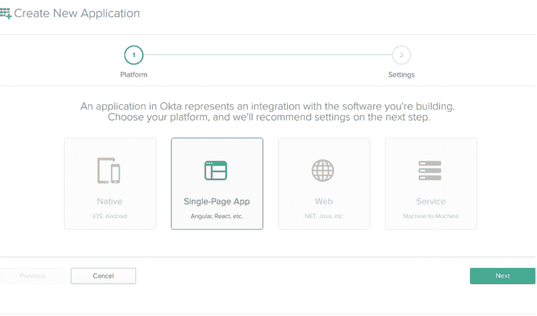
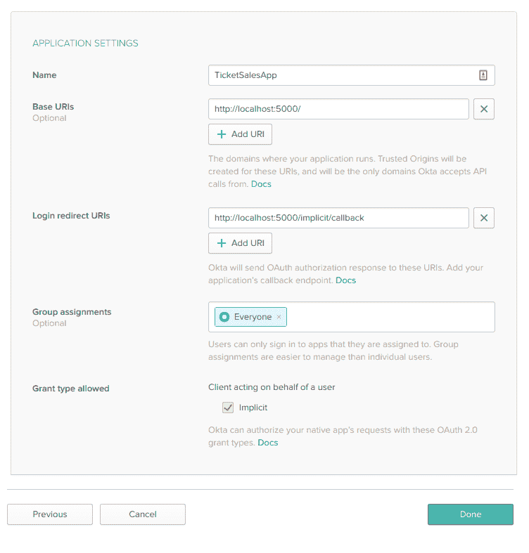
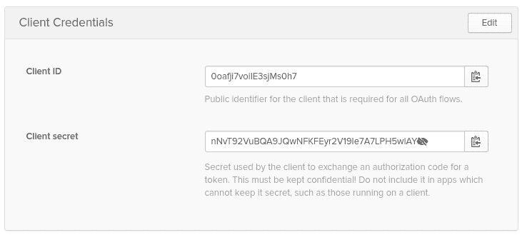
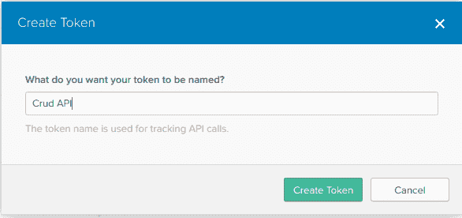
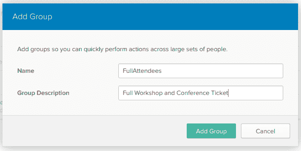
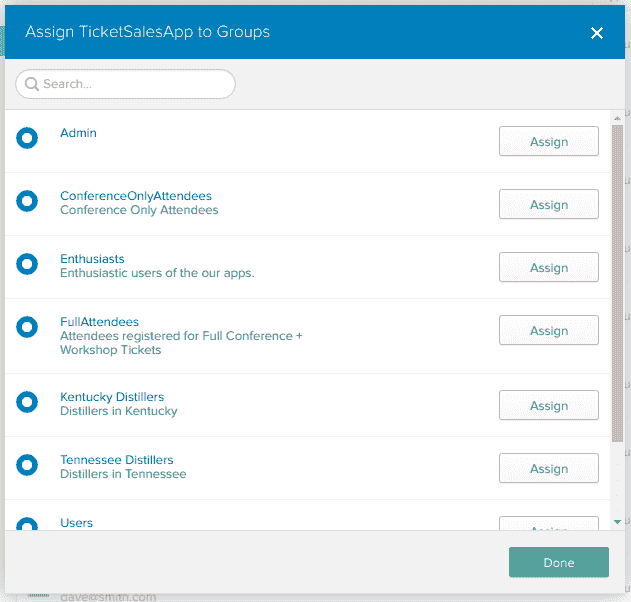
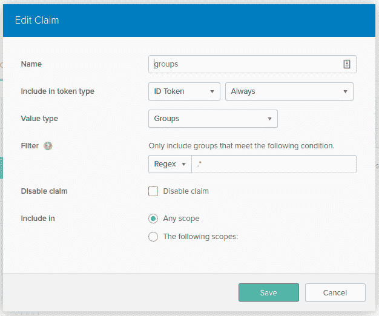

# 使用 ASP.NET 核心 2.1、条纹和棱角 6 构建 SPA

> 原文：<https://dev.to/oktadev/build-a-spa-with-aspnet-core-21-stripe-and-angular-6-582j>

在网上购物已经成为一项日常活动，也是许多新项目需要的一项功能。在本教程中，我将向您展示如何使用 ASP.NET 核心 2.1 后端 API，使用 Angular 6 单页应用程序(SPA)构建一个应用程序来售票。您将构建 Angular 和 ASP.NET 核心应用程序，并在 VS 代码中运行它们。我们开始吧！

## 升级到角 6

当开始一个新项目时，我喜欢使用最新最好的。但是当您使用项目生成器(如 Angular-CLI 或 DotNetCLI)时，您可能会受到这些库的作者添加的最新版本的支配。现在，DotNet CLI 使用`dotnet new angular`生成一个 Angular 应用程序，给你一个大约 4.5 版本的 Angular 应用程序，这比最新版本落后了两个版本。让我向您展示如何升级模板和生成的应用程序，以便您使用 Angular 6，这是本文发表时的最新版本。

### [T1】升级 Angular App 模板](#upgrade-the-angular-app-template)

使用
更新 DotNet 命令行工具

```
dotnet new --install Microsoft.DotNet.Web.Spa.ProjectTemplates::2.1.0 
```

Enter fullscreen mode Exit fullscreen mode

然后运行:

```
dotnet new --install Microsoft.AspNetCore.SpaTemplates::2.1.0-preview1-final 
```

Enter fullscreen mode Exit fullscreen mode

### 生成 ASP.NET 角形 App

现在你可以开始一个新的项目:

```
dotnet new angular -o ticket-sales-example 
```

Enter fullscreen mode Exit fullscreen mode

### 将 Angular App 升级到 6

最接近的版本是 Angular v5.2.0。要将 Angular 更新到 v6.0.9(在撰写本文时),请切换到`ClientApp`目录并运行:

```
ng update --all 
```

Enter fullscreen mode Exit fullscreen mode

这将更新`package.json`文件；那么你需要运行:

```
npm install 
```

Enter fullscreen mode Exit fullscreen mode

如果您收到关于`@angular/cli`的消息，您可以通过运行:
来更新它

```
ng update @angular/cli 
```

Enter fullscreen mode Exit fullscreen mode

你现在可能会看到你的 NPM 包中的一些漏洞。要修复它们，运行:

```
npm audit fix 
```

Enter fullscreen mode Exit fullscreen mode

您可能需要运行几次，因为一些修复会引入新的漏洞。我只能把我的弱点列表降低到 6。我仍然有一个低和五个中等的弱点。如果你想实现零漏洞，你就必须找出每个漏洞并手动修复。

## 创建一个条纹账户

在网上进行支付的最简单方法之一是使用 [Stripe](https://stripe.com/) 。您可以在 [Stripe 的注册页面](https://dashboard.stripe.com/register)创建一个免费的开发者账户。

注册后，请务必转到您的仪表板，在左侧菜单中，单击切换按钮以确保您正在查看测试数据。然后点击**开发者**菜单项，然后点击 **API 键**。复制下**可发布键**在你的 Angular app 中使用。

## 给你的 Angular 6 App 添加条纹

在您的`index.html`文件中，为 Stripe 的 JavaScript 库添加一个脚本标签，就在`app-root`组件的下面。

```
<script type="text/javascript" src="https://js.stripe.com/v2/" /> 
```

Enter fullscreen mode Exit fullscreen mode

还将您的可发布密钥添加到 Stripe 对象:

```
<script type="text/javascript">
  Stripe.setPublishableKey('{yourPublishableKey}');
</script> 
```

Enter fullscreen mode Exit fullscreen mode

> 确保您的可发布密钥以`pk_test_`开头。如果没有，那么您正在使用生产密钥，并且您还不想这样做。

## 创建条纹机票注册页面

您可以使用 Angular CLI 轻松搭建基本注册组件。转到命令行，将目录切换到`src/app`目录。然后运行命令:

```
ng generate component registration 
```

Enter fullscreen mode Exit fullscreen mode

CLI 的简写是:

```
ng g c registration 
```

Enter fullscreen mode Exit fullscreen mode

generate 命令将生成一个名为`registration`的文件夹，在这个文件夹中有一个`registration.compomnent.css`、`registration.component.html`、`registration.component.spec.ts`和`registration.component.ts`文件。这些都是 Angular 6 组件的基本文件。我不会在本教程中讨论测试，所以你可以忽略或删除`registration.component.spec.ts`文件。

首先，在您的`registration.component.html`文件中添加一些基本的 HTML 来显示门票。所以最终的文件内容如下:

```
<h1>Register for SuperDuperConf</h1>

<div class="ticket conf-only">
  <span class="title">Conference Only Pass</span>
  <span class="price">$295</span>
  <button (click)="selectTicket('Conference Only', 295)">Register Now!</button>
</div>

<div class="ticket full">
  <span class="title">Full Conference + Workshop Pass</span>
  <span class="price">$395</span>
  <span class="value">Best Value!</span>
  <button (click)="selectTicket('Full Conference + Workshop', 395)">Register Now!</button>
</div>

<div class="ticket work-only">
  <span class="title">Workshop Only Pass</span>
  <span class="price">$195</span>
  <button (click)="selectTicket('Workshop Only', 195)">Register Now!</button>
</div>

<div class="alert alert-success" *ngIf="model.successMessage">{{successMessage}}</div>
<div class="alert alert-danger" *ngIf="model.errorMessage">{{errorMessage}}</div>

<div *ngIf="model.ticket.price">

  <form (submit)="purchaseTicket()" class="needs-validation" novalidate #regForm="ngForm">
    <div class="form-group">
      <label for="firstName">First Name:</label>
      <input type="text" class="form-control" name="firstName" id="firstName" [(ngModel)]="model.firstName" required #firstName="ngModel">
      <div [hidden]="firstName.valid || firstName.pristine" class="text-danger">First Name is required.</div>
    </div>

    <div class="form-group">
      <label for="lastName">Last Name:</label>
      <input type="text" class="form-control" name="lastName" id="lastName" [(ngModel)]="model.lastName" required #lastName="ngModel">
      <div [hidden]="lastName.valid || lastName.pristine" class="text-danger">Last Name is required.</div>
    </div>

    <div class="form-group">
      <label for="email">Email Address:</label>
      <input type="text" class="form-control" name="email" id="email" [(ngModel)]="model.emailAddress" required #email="ngModel">
      <div [hidden]="email.valid || email.pristine" class="text-danger">Email Address is required.</div>
    </div>

    <div class="form-group">
      <label for="password">Password:</label>
      <input type="password" class="form-control" name="password" id="password" [(ngModel)]="model.password" required #password="ngModel">
      <div [hidden]="password.valid || password.pristine" class="text-danger">Password is required.</div>
    </div>

    <div class="form-group">
      <label for="cardNumber">Card Number:</label>
      <input type="text" class="form-control" name="cardNumber" id="cardNumber" [(ngModel)]="model.card.number" required>
    </div>

    <div class="form-group form-inline">
      <label for="expiry">Expiry:</label>
      <br/>
      <input type="text" class="form-control mb-1 mr-sm-1" name="expiryMonth" id="expiryMonth" [(ngModel)]="model.card.exp_month"
        required> /
      <input type="text" class="form-control" name="expiryYear" id="expiryYear" [(ngModel)]="model.card.exp_year" required>
    </div>

    <div class="form-group">
      <label for="cvc">Security Code:</label>
      <input type="text" class="form-control" name="cvc" id="cvc" [(ngModel)]="model.card.cvc" required>
    </div>
    <button type="submit" class="btn btn-success" [disabled]="!regForm.form.valid">Pay ${{model.ticket.price / 100}}</button>
  </form>
</div> 
```

Enter fullscreen mode Exit fullscreen mode

我知道这看起来很多，但这里有很多重复。第一部分列出了用户可以购买注册“SuperDuperConf”的三张门票。第二部分只是一个表单，它收集了注册与会者所需的信息。

这里需要注意的重要事情是代码的`[(ngModel)]="model.some.thing"`行。`ngModel`周围奇怪的字符序列只是方括号内的圆括号。括号告诉 Angular 有一个与该字段相关联的动作。对于点击事件处理程序，您会经常看到这种情况。它通常看起来有点像`(click)="someEventHandler()"`。这是相同的，因为当模型改变时，`ngModel`是事件的处理程序。

方括号用于在模型发生变化时更新 DOM。它通常出现在像你在上面用`[disabled]="!regForm.form.valid"`做的那样禁用一个按钮。它监视表单上的值，当值无效时，按钮被禁用。一旦表单值变为有效，disabled 属性将从 DOM 元素中删除。

现在页面上已经有了所有的字段，您需要将 ticket 部分的样式化一点，使它看起来像 ticket。

```
.ticket {
  text-align: center;
  display: inline-block;
  width: 31%;
  border-radius: 1rem;
  color: #fff;
  padding: 1rem;
  margin: 1rem;
}

.ticket.conf-only,
.ticket.work-only {
  background-color: #333;
}

.ticket.full {
  background-color: #060;
}

.ticket span {
  display: block;
}

.ticket .title {
  font-size: 2rem;
}

.ticket .price {
  font-size: 2.5rem;
}

.ticket .value {
  font-style: italic;
}

.ticket button {
  border-radius: 0.5rem;
  text-align: center;
  font-weight: bold;
  color: #333;
  margin: 1rem;
} 
```

Enter fullscreen mode Exit fullscreen mode

这只是我经常在会议注册中看到的三种基本的门票类型。

现在是注册页面的核心，TypeScript 组件。你需要一些东西来使这个页面工作。您将需要一个模型来存储用户输入的值，一个让用户*选择*一张票的方法，以及一个让用户*为他们选择的票支付*的方法。

```
import { Component, ChangeDetectorRef, Inject } from '@angular/core';
import { HttpClient } from '@angular/common/http';

@Component({
  selector: 'app-registration',
  templateUrl: './registration.component.html',
  styleUrls: ['./registration.component.css']
})
export class RegistrationComponent {
  public model: any;
  public card: any;

  public errorMessage: string;
  public successMessage: string;

  constructor(
    private http: HttpClient,
    private changeDetector: ChangeDetectorRef,
    @Inject('BASE_URL') private baseUrl: string
  ) {
    this.resetModel();
    this.successMessage = this.errorMessage = null;
  }

  resetModel(): any {
    this.model = {
      firstName: '',
      lastName: '',
      emailAddress: '',
      password: '',
      token: '',
      ticket: { ticketType: '', price: 0 }
    };
    this.card = { number: '', exp_month: '', exp_year: '', cvc: '' };
  }

  selectTicket(ticketType: string, price: number) {
    this.model.ticket = { ticketType, price: price * 100 };
  }

  purchaseTicket() {
    (<any>window).Stripe.card.createToken(
      this.card,
      (status: number, response: any) => {
        if (status === 200) {
          this.model.token = response.id;
          this.http
            .post(this.baseUrl + 'api/registration', this.model)
            .subscribe(
              result => {
                this.resetModel();
                this.successMessage = 'Thank you for purchasing a ticket!';
                console.log(this.successMessage);
                this.changeDetector.detectChanges();
              },
              error => {
                this.errorMessage = 'There was a problem registering you.';
                console.error(error);
              }
            );
        } else {
          this.errorMessage = 'There was a problem purchasing the ticket.';
          console.error(response.error.message);
        }
      }
    );
  }
} 
```

Enter fullscreen mode Exit fullscreen mode

即使你熟悉 Angular，其中一些可能看起来很陌生。例如，注入组件的`BASE_URL`值。它来自 Angular CLI 生成的`main.ts`文件。如果您查看该文件，在导入文件的正下方，有一个名为`getBaseUrl()`的函数，下面是一个`providers`部分，提供来自`getBaseUrl()`函数的值，这只是一个将常量值注入组件的简单方法。

另一件看起来奇怪的事情是`purchaseTicket()`函数。如果你以前从未使用过 Stripe，`createToken()`方法创建了一个一次性令牌，你可以将它传递给你的服务器，以便在你的服务器端调用中使用，这样你就不必将信用卡信息发送给你的服务器，并且你可以让 Stripe 处理在线支付的安全性！

## 添加 ASP.NET 注册控制器

现在，您的 Angular 应用程序可以从 Stripe 获得一个令牌，您会希望将该令牌和用户信息发送到服务器，以从他们的卡中收取门票费用。在服务器端应用程序根目录的`Controllers`文件夹中创建一个控制器。文件的内容应该是:

```
using System;
using System.Linq;
using System.Threading.Tasks;
using Microsoft.AspNetCore.Mvc;
using Okta.Sdk;
using Stripe;
using ticket_sales_example.Models;

namespace ticket_sales_example.Controllers
{
  [Produces("application/json")]
  [Route("api/[controller]")]
  public class RegistrationController : ControllerBase
  {
    [HttpPost]
    public async Task<ActionResult<Registration>> CreateAsync([FromBody] Registration registration)
    {
      ChargeCard(registration);
      var oktaUser = await RegisterUserAsync(registration);
      registration.UserId = oktaUser.Id;
      return Ok(registration);
    }

    private async Task<User> RegisterUserAsync(Registration registration)
    {
      var client = new OktaClient();
      var user = await client.Users.CreateUserAsync(
        new CreateUserWithPasswordOptions
        {
          Profile = new UserProfile
          {
            FirstName = registration.FirstName,
            LastName = registration.LastName,
            Email = registration.EmailAddress,
            Login = registration.EmailAddress,
          },
          Password = registration.Password,
          Activate = true
        }
      );

      var groupName = "";
      if (registration.Ticket.TicketType == "Full Conference + Workshop")
      {
        groupName = "FullAttendees";
      }
      if (registration.Ticket.TicketType == "Conference Only")
      {
        groupName = "ConferenceOnlyAttendees";
      }
      if (registration.Ticket.TicketType == "Workshop Only")
      {
        groupName = "WorkshopOnlyAttendees";
      }

      var group = await client.Groups.FirstOrDefault(g => g.Profile.Name == groupName);
      if (group != null && user != null)
      {
        await client.Groups.AddUserToGroupAsync(group.Id, user.Id);
      }

      return user as User;
    }

    private StripeCharge ChargeCard(Registration registration)
    {
      StripeConfiguration.SetApiKey("sk_test_uukFqjqsYGxoHaRTOS6R7nFI");

      var options = new StripeChargeCreateOptions
      {
        Amount = registration.Ticket.Price,
        Currency = "usd",
        Description = registration.Ticket.TicketType,
        SourceTokenOrExistingSourceId = registration.Token,
        StatementDescriptor = "SuperDuperConf Ticket"
      };

      var service = new StripeChargeService();
      return service.Create(options);
    }
  }
} 
```

Enter fullscreen mode Exit fullscreen mode

这里似乎有一点，但是只有`HttpPost`方法`CreateAsync()`是一个`POST`到`/api/registration`的 API 端点。其他方法是端点的助手。

`ChargeCard()`方法顾名思义，它使用 Angular 应用程序从 Stripe 获得并发送给 API 的令牌对用户的信用卡收费。尽管出于演示目的，我在这里用一个简单的字符串来设置 Stripe API 密钥，但您可能希望将密钥存储在环境变量中，存储在不签入源代码控制的配置文件中，或者存储在像 Azure 的 Key Vault 这样的密钥管理服务中。这将减少您意外地将测试键签入到您的源代码控制中并最终部署到生产环境中的机会！

`RegisterUserAsync()`方法处理向 Okta 注册一个用户，并将他们放入一个与用户购买的机票对应的组中。这分两步完成:通过创建用户，然后找到与购买的机票对应的组，并将该组的 ID 添加到新创建的 Okta 用户中。

## 为您的角度和 ASP.NET 核心应用设置 Okta

对于每个开发人员来说，处理 web 应用程序中的用户认证是一个巨大的痛苦。这就是 Okta 的闪光点:它帮助您以最小的努力保护您的 web 应用程序。

### 为什么是 Okta？

在 Okta，我们的目标是让[身份管理](https://developer.okta.com/product/user-management/)比你习惯的更容易、更安全、更可扩展。Okta 是一种云服务，允许开发人员创建、编辑和安全存储用户帐户和用户帐户数据，并将它们与一个或多个应用程序连接。我们的 API 使您能够:

*   [认证](https://developer.okta.com/product/authentication/)和[授权](https://developer.okta.com/product/authorization/)您的用户
*   存储用户数据
*   执行基于密码的[社交登录](https://developer.okta.com/authentication-guide/social-login/)
*   通过[多重身份验证](https://developer.okta.com/use_cases/mfa/)保护您的应用
*   还有更多！查看我们的[产品文档](https://developer.okta.com/documentation/)

### 创建 Okta 应用程序

首先，您需要在 Okta 中创建一个 OpenID Connect 应用程序。注册一个永远免费的开发者账户(或者如果你已经有了的话就登录)。

[T2】](https://res.cloudinary.com/practicaldev/image/fetch/s--RP4I0urX--/c_limit%2Cf_auto%2Cfl_progressive%2Cq_auto%2Cw_880/https://developer.okta.com/assets/blog/ticket-sales-app/OktaSignUp-accab135cb5e7cb06a3446679d6aef0958ea31b3b9444d87ffb2f70e5882d045.png)

一旦您登录并登录到仪表板页面，请复制下图中的 Org URL。你以后会需要这个的。

[T2】](https://res.cloudinary.com/practicaldev/image/fetch/s--nbQDqN2A--/c_limit%2Cf_auto%2Cfl_progressive%2Cq_auto%2Cw_880/https://developer.okta.com/assets/blog/ticket-sales-app/OktaOrgUrl-38ad1e82ab84ae824e053148055d7b7456c5675d3ef3f27e06874ba47904fcc4.png)

然后通过浏览到**应用**选项卡并点击**添加应用**来创建一个新的应用，并从向导的第一页选择**单页应用**。

[T2】](https://res.cloudinary.com/practicaldev/image/fetch/s--4Lnv6_Vw--/c_limit%2Cf_auto%2Cfl_progressive%2Cq_auto%2Cw_880/https://developer.okta.com/assets/blog/ticket-sales-app/CreateSpaAppScreenshot-4ae4c8451214a2329e260c16d0f9f0bd6b36a1a5438b8fa6ab4ccf798314b424.png)

在“设置”页面上，输入以下值:

*   名称:TicketSalesApp
*   基地 URIs:[http://localhost:5000](http://localhost:5000)
*   登录重定向 URIs:[http://localhost:5000/implicit/callback](http://localhost:5000/implicit/callback)

您可以保持其他值不变，并点击 **Done** 。

[T2】](https://res.cloudinary.com/practicaldev/image/fetch/s--zL1N-YbP--/c_limit%2Cf_auto%2Cfl_progressive%2Cq_auto%2Cw_880/https://developer.okta.com/assets/blog/ticket-sales-app/application-settings-9b7640d567f131905f14e462ddd9eacfaf4b6f27f9aac9f99f954109c4287459.png)

现在您的应用程序已经创建好了，请将客户端 ID 和客户端密码值复制到下一页，您很快就会用到它们。

[T2】](https://res.cloudinary.com/practicaldev/image/fetch/s--RRN3olM3--/c_limit%2Cf_auto%2Cfl_progressive%2Cq_auto%2Cw_880/https://developer.okta.com/assets/blog/ticket-sales-app/OktaAppSecrets-04f9ae1d82ab33072a0de5187e16c23eac3752b8fac955e10d4d2d6377358b12.png)

最后，创建一个新的身份验证令牌。这将允许你的应用程序与 Okta 对话，以检索用户信息等。为此，点击页面顶部的 **API** 标签，然后点击**创建令牌**按钮。给你的令牌起个名字，在这种情况下，“Crud API”是个好名字，然后点击**创建令牌**。记下这个令牌值，因为您很快就会用到它。

[T2】](https://res.cloudinary.com/practicaldev/image/fetch/s--ajFS2Yfs--/c_limit%2Cf_auto%2Cfl_progressive%2Cq_auto%2Cw_880/https://developer.okta.com/assets/blog/ticket-sales-app/CrudApiToken-1e8f16398b8899e64b9aa02b9ab180535a3bd27d489cb1e0303212af2914f2bc.png)

即使您有注册用户的方法，您也需要为票创建组，设置您的 API 以使用 Okta，并将其配置为从 Angular 应用程序的用户接收访问令牌以进行授权。

首先，为您将要出售的三张门票分别创建一个小组。在 Okta 仪表板上，将鼠标悬停在**用户**菜单项上，直到出现下拉菜单，然后选择**组**。在群组页面中，点击**添加群组**按钮。

[T2】](https://res.cloudinary.com/practicaldev/image/fetch/s--G4GEt8ck--/c_limit%2Cf_auto%2Cfl_progressive%2Cq_auto%2Cw_880/https://developer.okta.com/assets/blog/ticket-sales-app/groups-listing-f7e41cbcb65825bf6248bfa801a9337e41938709c4e0f2c980bce95ea37898dd.png)

在弹出的添加组模式中，为每种票据类型添加一个组。

[T2】](https://res.cloudinary.com/practicaldev/image/fetch/s--5ML4Eeqh--/c_limit%2Cf_auto%2Cfl_progressive%2Cq_auto%2Cw_880/https://developer.okta.com/assets/blog/ticket-sales-app/add-group-34c4b19eb22f436a30e2c4b1bae4c71810873ed993214825ad8fd7c84c0f5a2b.png)

现在，您需要将这些新创建的组添加到售票应用程序中。点击**应用**菜单项，从应用列表中选择 **TicketSalesApp** 。它应该在**分配**选项卡上打开。点击**分配**按钮，并从按钮的下拉菜单中选择**分配到组**。从这里，将您刚刚创建的每个组分配给售票应用程序。

[T2】](https://res.cloudinary.com/practicaldev/image/fetch/s--He5-TyTo--/c_limit%2Cf_auto%2Cfl_progressive%2Cq_auto%2Cw_880/https://developer.okta.com/assets/blog/ticket-sales-app/assign-groups-c2415fb0e9165efaee501b0ee2d0c7e3cd231b5adb0b0028b92fc1ee49cdd139.png)

### 给 ID 令牌添加组

现在，您只需将这些组添加到令牌中。

*   将鼠标悬停在 **API** 菜单项上，选择**授权服务器**。
*   选择默认授权服务器(它是在您创建 Okta 帐户时为您创建的)。
*   选择索赔选项卡，并单击**添加索赔**。
*   索赔的名称将是“组”，从令牌类型设置中的**包含中选择 **ID 令牌**和**始终**。**
*   从**值类型**设置中选择**组**，从**过滤器**设置中选择**正则表达式**。
*   在文本框中输入`.*`。
*   最后，确保未选中**禁用声明**复选框，并且在设置中的**包含中选择了**任何范围**单选按钮。**

[T2】](https://res.cloudinary.com/practicaldev/image/fetch/s--0p-zV2rA--/c_limit%2Cf_auto%2Cfl_progressive%2Cq_auto%2Cw_880/https://developer.okta.com/assets/blog/ticket-sales-app/AddGroupsToTokenScreenshot-c78196f6d97cb7d76120047046bf9c59468fc758f001e08b175de017db8c58bf.png)

## 将 Okta 添加到您的角度应用

要设置 Angular 应用程序使用 Okta 进行身份验证，您需要安装 Angular SDK 和`rxjs`兼容性包。

```
npm install @okta/okta-angular rxjs-compat@6 --save 
```

Enter fullscreen mode Exit fullscreen mode

将组件添加到`src/app`中的`app.module.ts`文件中，首先导入它们:

```
import {
  OktaCallbackComponent,
  OktaAuthModule,
  OktaAuthGuard
} from '@okta/okta-angular'; 
```

Enter fullscreen mode Exit fullscreen mode

现在，在导入语句的正下方添加一个配置变量:

```
const config = {
  issuer: 'https://{yourOktaDomain}/oauth2/default',
  redirectUri: 'http://localhost:5000/implicit/callback',
  clientId: '{yourClientId}'
}; 
```

Enter fullscreen mode Exit fullscreen mode

将回叫路由添加到`@NgModule`申报的`imports`段中的路由:

```
{ path: 'implicit/callback', component: OktaCallbackComponent } 
```

Enter fullscreen mode Exit fullscreen mode

这就是角度应用的全部内容。现在让我们来设置 ASP.NET 核心应用程序。

## 将 Okta 添加到您的 ASP.NET 核心 API

现在你需要让 API 知道两件事:如何从一个访问令牌中获取用户的身份(当一个被发送的时候)以及如何调用 Okta 进行用户管理。

首先添加 Okta Nuget 包:

```
dotnet add package Okta.Sdk 
```

Enter fullscreen mode Exit fullscreen mode

对于 ASP.NET 核心应用程序，最好的办法是在您的主文件夹中建立一个文件来存储配置。Okta 的 SDK 将为您选择设置，您永远不会意外地将它们签入源代码控制！

在您的主目录中，创建一个. okta 文件夹并添加一个名为 okta.yaml 的文件。您的主文件夹将取决于您的操作系统。对于*nix 变体，如 Linux 或 macOS，它是:

```
~/.okta/okta.yaml 
```

Enter fullscreen mode Exit fullscreen mode

对于 Windows 环境，它是:

```
%userprofile%\.okta\okta.yaml 
```

Enter fullscreen mode Exit fullscreen mode

YAML 只是一种用于配置的文件格式。okta.yaml 文件看起来像:

```
okta:
  client:
    orgUrl: "https://dev-846291.oktapreview.com/"
    token: "{yourApiToken}" 
```

Enter fullscreen mode Exit fullscreen mode

在服务之前的 ConfigureServices()方法中。AddMvc()行，添加:

```
services.AddAuthentication(sharedOptions =>
{
  sharedOptions.DefaultAuthenticateScheme = JwtBearerDefaults.AuthenticationScheme;
  sharedOptions.DefaultChallengeScheme = JwtBearerDefaults.AuthenticationScheme;
})
.AddJwtBearer(options =>
{
  options.Authority = "https://{yourOktaDomain}/oauth2/default";
  options.Audience = "api://default";
}); 
```

Enter fullscreen mode Exit fullscreen mode

以及在 app 之前的 Configure()方法中。UseMvc()行添加:

```
app.UseAuthentication(); 
```

Enter fullscreen mode Exit fullscreen mode

就是这样！现在，您的 ASP.NET 核心应用程序将获取该不记名令牌，从 Okta 获取用户信息，并将它们添加到用户对象中，这样您就可以获取当前请求用户的数据。它还会在注册用户时使用存储在`okta.yaml`文件中的 API 令牌。

## 在你的 Angular App 中显示门票

既然用户可以购买门票，您将希望他们能够登录并看到他们购买的门票。为此，使用 Angular 的 CLI 生成一个配置文件组件。从客户端应用程序的`src/app`文件夹中，运行:

```
ng g c profile 
```

Enter fullscreen mode Exit fullscreen mode

同样，这只是`ng generate component profile`的简写，它将为概要文件组件生成所有的基础文件。`profile.component.ts`文件应该有以下内容:

```
import { Component, OnInit } from '@angular/core';
import { OktaAuthService } from '@okta/okta-angular';
import 'rxjs/Rx';

@Component({
  selector: 'app-profile',
  templateUrl: './profile.component.html',
  styleUrls: ['./profile.component.css']
})
export class ProfileComponent implements OnInit {
  user: any;
  ticket: string;

  constructor(private oktaAuth: OktaAuthService) {}

  async ngOnInit() {
    this.user = await this.oktaAuth.getUser();
    if (this.user.groups.includes('FullAttendees')) {
      this.ticket = 'Full Conference + Workshop';
    } else if (this.user.groups.includes('ConferenceOnlyAttendees')) {
      this.ticket = 'Conference Only';
    } else if (this.user.groups.includes('WorkshopOnlyAttendees')) {
      this.ticket = 'Workshop Only';
    } else {
      this.ticket = 'None';
    }
  }
} 
```

Enter fullscreen mode Exit fullscreen mode

这做了两件事:它获取当前登录的用户，并将组名转换成所购买的票据类型的可显示字符串表示。`profile.component.html`文件很简单:

```
<h1>{{user.name}}</h1>

<p>
  Your Puchased Ticket: {{ticket}}
</p> 
```

Enter fullscreen mode Exit fullscreen mode

最后要做的是在`app.module.ts`中的配置文件页面中添加一个受保护的路由。我在回拨路线的正上方添加了我的:

```
{
  path: 'profile',
  component: ProfileComponent,
  canActivate: [OktaAuthGuard]
}, 
```

Enter fullscreen mode Exit fullscreen mode

你现在可以出售门票，用户可以登录并查看他们购买的门票。您已经准备好举办活动了！

## 了解更多 ASP.NET 信息

看看我们另一个棱角分明的。Okta 开发者博客上的网络帖子:

*   Ibrahim 在他的文章中用 ASP.NET 框架 4.x API 创建了一个 [CRUD 应用](https://developer.okta.com/blog/2018/07/27/build-crud-app-in-aspnet-framework-webapi-and-angular)
*   使用 Angular 和 ASP.NET 内核构建一个基本的 [CRUD 应用](https://developer.okta.com/blog/2018/07/02/build-a-secure-crud-app-with-aspnetcore-and-react)
*   如果你想在你的 CRUD 应用中使用 [React 而不是 Angular，我已经为你准备好了](https://developer.okta.com/blog/2018/08/02/aspnet-core-angular-crud)
*   了解 ASP.NET 核心中[令牌认证的本质](https://developer.okta.com/blog/2018/03/23/token-authentication-aspnetcore-complete-guide)
*   通过正确的方式[将你的项目部署到 Azure，让它走向世界](https://developer.okta.com/blog/2018/06/19/deploy-your-aspnet-core-app-to-azure)

一如既往，如果你有任何意见或问题，请在下面留下你的评论。别忘了在推特[@奥克塔德夫](https://twitter.com/oktadev)和脸书上关注我们！