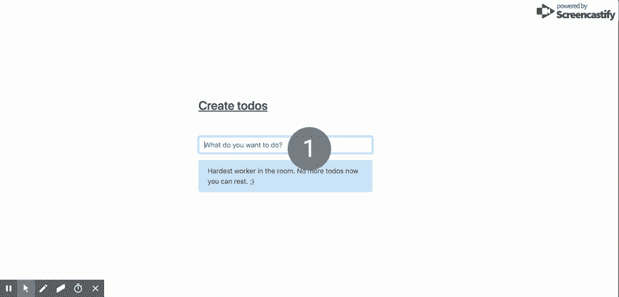

# 使用节点构建 Todo 应用程序。Js、ExpressJs、MongoDB 和 vue js–第 1 部分

> 原文：<https://dev.to/abiodunjames/build-a-todo-app-with-nodejs-expressjs-mongodb-and-vuejs--part-1--29n7>

[T2】](https://res.cloudinary.com/practicaldev/image/fetch/s--2XntgCA3--/c_limit%2Cf_auto%2Cfl_progressive%2Cq_66%2Cw_880/https://res.cloudinary.com/samueljames/image/upload/v1570890498/frontendtest.gif)

在本教程中，我们将使用 Node 构建著名的 todo 应用程序。Js 使用了[ExpressJs](https://expressjs.com/)框架和 [MongoDB](%5Bhttps://MongoDB.com%5D) 。我忘记告诉你了吗？该应用将是以 API 为中心的全栈:)。

简而言之，如果你想学习如何用 Node 构建 API。Js，你来对地方了。

现在你可以拿一瓶啤酒，让我们把手弄脏。

#### 什么是 ExpressJs？

ExpressJs 简单来说，它是一个针对 Node 的 web 框架。从官方文件中窃取。 Taylor Otwell (Laravel 的创造者)曾经说过，“开发者为开发者打造工具”。ExpressJs 是为开发人员简化节点 API 而构建的。

#### 什么是 MongoDB？

MongoDB 是一个 NoSQL 数据库。它完全面向文档。NoSQL 数据库允许您以 JSON 和任何格式存储数据。如果你想了解更多关于 MongoDB 的知识，我也在 MongoDB 上写了一篇帖子[这里](https://samuelabiodun.com/MongoDB-on-GCP-Setting-it-up-and-keeping-it-runnning/)。

#### 定义待办事宜 API

我喜欢从定义我的 API 开始。下表显示了我们需要创建的 API 以及每个 API 的作用。

| 方法 | 小路 | 描述 |
| --- | --- | --- |
| 得到 | /todos | 获取所有待办事项 |
| 得到 | /todos/:id | 获取一个待办事项 |
| 邮政 | /todos | 创建新的待办事项 |
| 放 | /todos/:id | 更新待办事项 |
| 删除 | /todos/:id | 删除新的待办事项 |

定义了我们的 API 之后，让我们深入项目目录。

#### 项目目录

当我告诉你，我们只需要不超过 5 个文件和相对较少的代码行来构建这个后端时，你可能会大吃一惊。是啊！就这么简单。这就是我们如何滚动的人:)。

此时，您应该创建一个项目文件夹来存放该应用程序后端部分的所有源代码。我会打电话给我的后台。请随意使用`backend`作为您的目录。它没有专利。:)

为了让事情简单，当然，我们不应该一看到简单就丢掉灵活性。我们将在您上面创建的目录中创建 4 个文件夹。

1.  *config* :包含应用的配置文件。
2.  *模型*:这容纳了我们的实体(Todo 数据结构)。
3.  *存储库*:存储库在数据访问上增加了一个抽象层。你可以在这里阅读更多关于为什么有这个图层[很重要的信息](http://blog.sapiensworks.com/post/2014/06/02/The-Repository-Pattern-For-Dummies.aspx)
4.  *routes*:route 是应用程序的入口。此文件夹包含一个文件，该文件定义了当用户访问特定路由时应该发生的事情。

```
├── config
├── models
├── respositories
└── routes 
```

#### 你将需要安装什么

1.  您将需要[节点](http://nodejs.org/download)
2.  你需要安装 [MongoDB](http://mongodb.org/)

#### 应用包

这个应用程序依赖于几个软件包，并将使用 npm 来安装它们。导航到您刚刚创建的项目目录，并使用下面的内容创建一个 *package.json* 文件。

```
{  "name":  "node-todo",  "version":  "1.0.0",  "description":  "Simple todo application.",  "main":  "server.js",  "author":  "Samuel James",  "scripts":  {  "build":  "webpack",  "start":  "node app.js"  },  "dependencies":  {  "cookie-parser":  "~1.4.4",  "cors":  "^2.8.5",  "debug":  "~2.6.9",  "express":  "~4.16.1",  "http-errors":  "~1.6.3",  "jade":  "~1.11.0",  "mongoose":  "^5.7.3",  "morgan":  "~1.9.1"  }  } 
```

运行`npm install`来安装依赖项。让我们继续定义我们的应用程序需要的配置参数。

#### 配置文件

我们将在`config/Config.js`文件中定义数据库连接 URL 和应用程序将监听的端口，如下所示:

```
//config/Config.js

module.exports = {
  DB: process.env.MONGO_URL ? process.env.MONGO_URL : 'mongodb://localhost:27017/todos',
  APP_PORT: process.env.APP_PORT ? process.env.APP_PORT : 80,
}; 
```

在`config/Config.js`中，我们将`DB`设置为环境变量`MONGO_URL`(如果已定义)，否则默认为`mongodb://localhost:27017/todos`。我们也对`APP_PORT`做了同样的事情。

#### 待办事宜模型

模型是数据库中数据的对象表示。因此，让我们用内容:
创建一个文件`models/Todo.js`

```
//models/Todo.js

const mongoose = require('mongoose');

const { Schema } = mongoose;

// Define schema for todo items
const todoSchema = new Schema({
  name: {
    type: String,
  },
  done: {
    type: Boolean,
  },
});

const Todo = mongoose.model('Todo', todoSchema);

module.exports = Todo; 
```

如果你注意到，我们使用 mongoose 进行模式定义，对吗？Mongoose 是一个官方的 MongoDB 库，用于在 Node 中操作 MongoDB 数据库。在结构中，我定义了`name`和`done`。

*名称*:这是待办事项的名称。我们将其定义为字符串。例如，“下午三点我要去游泳”
*done* : Todo 项状态为布尔值。如果 todo 项仍处于挂起状态，则其值将为 false。

现在，我们将创建一个待办事项存储库。

#### 储存库

我喜欢将存储库视为抽象数据访问的策略。当我在一个项目中切换到一个新的数据存储时，这种模式使我从繁重的重构中解脱出来，我成了它的忠实粉丝。它帮助您解耦项目并减少代码中的重复。这里有一篇[有趣的文章](https://makingloops.com/why-should-you-use-the-repository-pattern/)我推荐你按照这个模式阅读。

也就是说，创建一个文件*repositories/todorepository . js*为:

```
//repositories/TodoRepository

const Todo = require('../models/Todo');

class TodoRepository {

  constructor(model) {
    this.model = model;
  }

  // create a new todo
  create(name) {
    const newTodo = { name, done: false };
    const todo = new this.model(newTodo);

    return todo.save();
  }

  // return all todos

  findAll() {
    return this.model.find();
  }

  //find todo by the id
  findById(id) {
    return this.model.findById(id);
  }

    // delete todo
  deleteById(id) {
    return this.model.findByIdAndDelete(id);
  }

  //update todo
  updateById(id, object) {
    const query = { _id: id };
    return this.model.findOneAndUpdate(query, { $set: { name: object.name, done: object.done } });
  }
}

module.exports = new TodoRepository(Todo); 
```

定义了`TodoRepository.js`之后，我们开始创建 todo 路线。

#### 路线

每个 web 应用程序都至少有一个入口点。网络应用程序中的路线更像是在说:“嘿，杰克逊，当我问你要这个的时候，给我那个”。我们的应用程序也是如此，我们将定义用户需要访问哪些 URL 来获得特定的结果或触发特定的操作。

在这种情况下，我们希望用户能够对 todo 项目执行创建、读取、更新和删除(CRUD)操作。

现在，您已经知道“routes”是做什么的了，创建 *routes/Routes.js* 文件和下面的代码:

```
const express = require('express');

const app = express.Router();
const repository = require('../respositories/TodoRepository');

// get all todo items in the db
app.get('/', (req, res) => {
  repository.findAll().then((todos) => {
    res.json(todos);
  }).catch((error) => console.log(error));
});

// add a todo item
app.post('/', (req, res) => {
  const { name } = req.body;
  repository.create(name).then((todo) => {
    res.json(todo);
  }).catch((error) => console.log(error));
});

// delete a todo item
app.delete('/:id', (req, res) => {
  const { id } = req.params;
  repository.deleteById(id).then((ok) => {
    console.log(ok);
    console.log(`Deleted record with id: ${id}`);
    res.status(200).json([]);
  }).catch((error) => console.log(error));
});

// update a todo item
app.put('/:id', (req, res) => {
  const { id } = req.params;
  const todo = { name: req.body.name, done: req.body.done };
  repository.updateById(id, todo)
    .then(res.status(200).json([]))
    .catch((error) => console.log(error));
});
module.exports = app; 
```

首先，您可能希望用户获得数据库中现有的所有待办事项的列表，因此我们定义了一个 route ( */all* )，它接受 get 请求并在成功时返回 todo 项的 JSON 对象。

我们的用户喜欢获取项目以及存储新项目，我们添加了一个路由来创建新的待办事项。它接受 post 请求。
当 A 先生向 route ( */add* )发出 post 请求时，数据库中会创建一个新的待办事项。

一旦 todo-item 完成，我们也希望用户能够将其标记为完成。为此，首先必须知道用户打算将哪个项目标记为完成。因此，我们用 route 参数定义了一个“更新路由”,它是要更新的项目的 ID。

#### 服务器文件

定义了我们的应用程序需要的所有路线之后，是时候创建一个条目文件了，它是运行我们的项目的主要文件。

在项目根文件夹中，创建一个 *app.js* 文件，并用这个文件更新它的内容:

```
//app.js

const createError = require('http-errors');
const express = require('express');
const path = require('path');
const mongoose = require('mongoose');
const cookieParser = require('cookie-parser');
const logger = require('morgan');
const cors = require('cors')

const config = require('./config/Config');

const routes = require('./routes/Routes');

const app = express();

mongoose.connect(config.DB, {
  useNewUrlParser: true,
  useUnifiedTopology: true,
});

app.use(cors());  //enable cors

app.use(logger('dev'));
app.use(express.json());
app.use(express.urlencoded({ extended: false }));
app.use(cookieParser());
app.use(express.static(path.join(__dirname, 'public')));

app.use('/todos', routes);

// catch 404 and forward to error handler
app.use((req, res, next) => {
  next(createError(404));
});

// error handler
app.use((err, req, res) => {
  // set locals, only providing error in development
  res.locals.message = err.message;
  res.locals.error = req.app.get('env') === 'development' ? err : {};

  // render the error page
  res.status(err.status || 500);
  res.render('error');
});

app.listen(config.APP_PORT); // Listen on port defined in environment

module.exports = app; 
```

我们要求:

*   快递 Js

*   morgan - *一个用于节点*的日志中间件

*   path - a *包，用于处理文件和目录*

*   mongose-*用于使用 MongoDB 的包*

*   正文解析器- *一个* *正文解析中间件*

我们将我们的应用程序设置为侦听在 *config/Config.js.* 中设置的端口。我们还将其定义为使用在 *routes/Routes.js* 中定义的路由，并以 *todos* 作为前缀。

最后，您的目录结构应该是这样的:

```
├── app.js
├── config
│   └── Config.js
├── models
│   └── Todo.js
├── package-lock.json
├── package.json
├── respositories
│   └── TodoRepository.js
└── routes
    └── Routes.js 
```

要启动应用程序，导航到项目根目录并运行:

```
npm start 
```

让我们创建一个新的待办事项

```
$ curl -H "Content-Type: application/json" -X POST -d '{"name":"Going Shopping"}' http://localhost/todos

{"__v":0,"name":"Going Shopping","done":false,"_id":"5a6365a39a2e56bc54000003"} 
```

获取所有待办事项

```
$ curl  http://localhost/todos

[{"_id":"5a6365a39a2e56bc54000003","name":"Doing Laundry","done":false,"__v":0},{"_id":"5a6366039a2e56bc54000004","name":"Going Shopping","done":false,"__v":0}] 
```

建成了吗？查看第二部分[。](https://dev.to/abiodunjames/build-a-todo-app-with-nodejs-expressjs-mongodb-and-vuejs--part-2--3k11)

[在此获取源代码](https://github.com/abiodunjames/NodeJs-Todo-List)