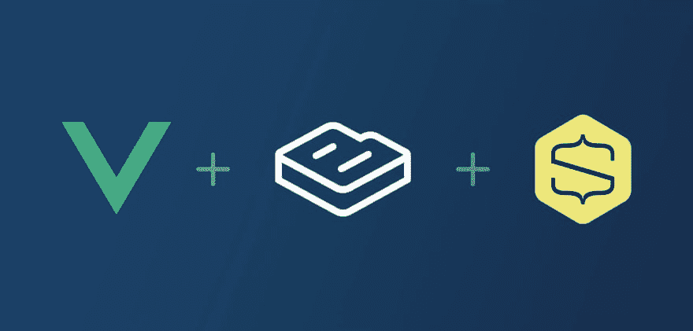

# 建立一个 Vue。Js 电子商务应用与 ButterCMS 无头后端

> 原文：<https://dev.to/couellet/build-a-vuejs-e-commerce-app-with-buttercms-headless-backend-43h3>

[T2】](https://res.cloudinary.com/practicaldev/image/fetch/s--T_dysxd4--/c_limit%2Cf_auto%2Cfl_progressive%2Cq_auto%2Cw_880/https://snipcart.com/media/203610/vuejs-ecommerce-buttercms-snipcart.jpg)

“我是开发者，不是神 d*mn 点击机。”

那是我的开发朋友尼克。我们说的是电子商务。

几品脱酒下肚，他就开始咆哮:

[T2】](https://res.cloudinary.com/practicaldev/image/fetch/s--JugINfeI--/c_limit%2Cf_auto%2Cfl_progressive%2Cq_66%2Cw_880/https://media1.giphy.com/media/oCdScruZnEHfy/giphy.gif)

“你知道我不喜欢什么吗？这里:

1.  在封闭的生态系统中编码
2.  每个人和他们的狗的刚性一体化平台
3.  不选择我的技术堆栈

如果你这么想要 Shopify 网站，你可以自己做，你不需要我(dev)。"

我爱尼克。

他是对的:现在有太多很酷的[框架](https://snipcart.com/blog/reactjs-wordpress-rest-api-example) / [工具](https://snipcart.com/blog/static-forms-serverless-gatsby-netlify)。为什么不用这些来创造一个定制的、刺激的购物体验呢？

今天我想用 Vue.js 向你展示这是可能的。因为是啊，Vue.js 电商*是*一个东西！

如果在后端设置得当，也就是说，无头内容管理会非常酷。

废话少说，下面是这个 Vue 电子商务示例将包括的内容:

*   如何创建一个整洁的前端 Vue 店面
*   如何在 Vue 应用中集成可定制的 HTML/JS 购物车
*   如何将 Vue e-comm. app 与 headless ButterCMS 挂钩

现在让我们让我的朋友尼克感到骄傲，好吗？

→ [继续阅读 snipcart.com](https://snipcart.com/blog/vuejs-ecommerce-headless-buttercms)