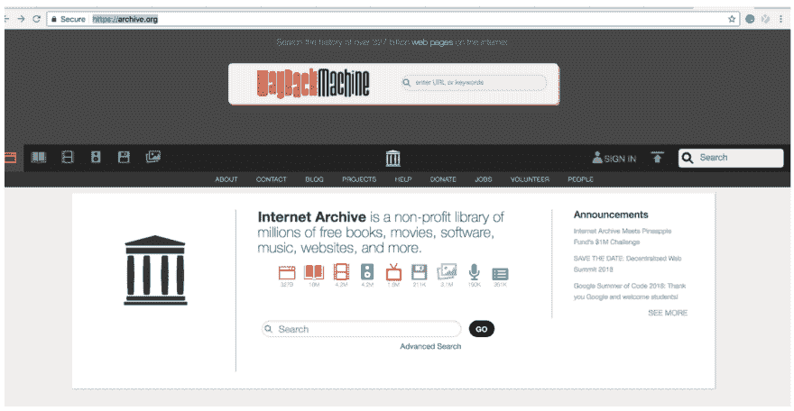

# 用 StdLib 和 Node.js 在 5 分钟内构建一个网站快照服务

> 原文：<https://dev.to/mss_ledezma/build-a-website-snapshot-service-in-5-minutes-with-stdlib-and-nodejs-309j>

[本教程中的](https://medium.com/@janeth_10755/build-a-daily-snapshot-service-in-5-minutes-with-stdlib-and-node-js-36be9b6a9707)。，我将向您展示如何使用 StdLib 来安排网站的快照！如果你想每月、每周、每天甚至每分钟触发一个网站的快照，StdLib 会帮你！最棒的是，你不必用截图填满你的收件箱或存储空间，它们会自动存储在 https://web.archive.org/[的 Wayback 机器里。](https://web.archive.org/)

[T2】](https://res.cloudinary.com/practicaldev/image/fetch/s--mL-Ixr6y--/c_limit%2Cf_auto%2Cfl_progressive%2Cq_auto%2Cw_880/https://thepracticaldev.s3.amazonaws.com/i/8v7ym5nxro393us47l34.png)

跟踪 HTML，CSS，Javascript 的变化对你的网站的影响。截取其他网站的截图，激发你建立自己的网站。监控竞争对手的网站和社交媒体账户。让你当地的政客和总统对他们在社交媒体上发布的内容负责！如果你是开发人员、网页设计师、分析师、政治家、社区组织者、记者、活动家或企业主，你可能会发现这篇文章很有用！

如果你不知道，互联网档案馆是一个非营利组织，自 1996 年以来一直在努力建设互联网的数字图书馆！通过 StdLib 的 snapshot 服务，社区将会有更多重要的关于在 Web Archive 上保存什么的信息！

所以，让我们开始吧！

**你事先需要什么**

-1x 安装了 Node.js 的命令行终端

-5 分钟(或 300 秒)

**第 1 分钟:标准库账户设置**

您将需要一个 [StdLib 帐户](https://www.stdlib.com)来部署您的每日快照服务。开始使用 StdLib 很简单——访问我们的网站，选择用户名并免费注册！

[T2】](https://res.cloudinary.com/practicaldev/image/fetch/s--yiXSiDyV--/c_limit%2Cf_auto%2Cfl_progressive%2Cq_auto%2Cw_880/https://thepracticaldev.s3.amazonaws.com/i/12v0dzi144nsd5rn5wp8.png)

创建帐户后，您的所有服务都将以您的用户名存储和发布。例如，您的快照服务处理程序将被称为:`lib.<username>.DailySnapShot`(或者您决定赋予您的服务的任何创造性名称)。

**第二分钟:安装 StdLib 命令行工具**

在开始向 StdLib 部署服务之前，您需要安装我们的开源命令行工具。如果你没有至少安装 node . js 8 . x 版本，你可以下载最新版本，和 npm 一起，[这里](https://nodejs.org/en/download/)。

完成后，通过打开终端并运行以下命令来安装 StdLib CLI:

`$ npm install lib.cli -g`

这使您可以访问用于服务管理和执行的`lib`命令。接下来，为 StdLib 服务创建一个`stdlib`目录。

`$ mkdir stdlib`
`$ cd stdlib`
T2】

您将被要求使用创建帐户时使用的凭据登录。就这样，您已经准备好构建和部署了！

**第 3 分钟:创建标准库服务**

现在，您需要为快照创建一个 StdLib 服务。我已经提供了一个[@ Janet HL/daily snapshot source(template)](https://stdlib.com/@janethl/src/dailysnapshot/)，这样你就可以不费吹灰之力就让你的服务正常运行。在刚刚创建的`stdlib`目录中，键入:

`$ lib create -s @JanethL/DailySnapShot`

接下来，你会被要求输入一个`Service Name`，我将我的服务命名为`TrumpsTwitterArchive`，因为我已经选择了监控特朗普删除的推文——你应该选择一个与你监控的网站相关的名称。创建服务后，通过运行以下命令进入服务目录:

`$ cd <username>/servicename`

用`$ code .`或类似的东西打开你最喜欢的编辑器文本编辑器，打开目录。

在您的终端上，该过程应该如下所示:

[T2】](https://res.cloudinary.com/practicaldev/image/fetch/s--zlB7Dpzw--/c_limit%2Cf_auto%2Cfl_progressive%2Cq_auto%2Cw_880/https://thepracticaldev.s3.amazonaws.com/i/vwmi87n9r9n9dhela1xs.png)

一旦您的编辑器打开，您将希望在您的服务目录中的`/functions`下输入`/__main__.js`文件，并在第 7 行更改 url 以反映您想要的网站的 url。

[T2】](https://res.cloudinary.com/practicaldev/image/fetch/s--XE9VQoeE--/c_limit%2Cf_auto%2Cfl_progressive%2Cq_auto%2Cw_880/https://thepracticaldev.s3.amazonaws.com/i/qsvd9acl97432rjrn7gm.png)

最后一步，输入您的`/package.json`文件，并给你的服务一个简短的描述。我的服务描述是:“给川普的推特拍个快照，然后把它保存在 https://webarchives.org 的 T2。”创建您的服务并不需要这一步，但我推荐这一步，因为它将帮助您保持有序，并帮助其他人了解您的服务是做什么的。

[T2】](https://res.cloudinary.com/practicaldev/image/fetch/s--wnz2PSZ---/c_limit%2Cf_auto%2Cfl_progressive%2Cq_auto%2Cw_880/https://thepracticaldev.s3.amazonaws.com/i/3gf3v06gos5jgipvai2u.png)

确保保存更改，返回到您的终端并通过运行以下命令部署您的功能:

`$ lib up dev`

为了运行一个调度的任务，您需要用`$ lib release`推送一个不可变的发布版本:

`$ lib release`

厉害！您现在可以在以下位置获得服务:

`<username>.stdlib.com/<service name>`

**第 4 分钟:在 StdLib 上设置一个任务来触发您的快照服务**

我们快完成了！前往位于[https://dashboard.stdlib.com/dashboard/#/](https://dashboard.stdlib.com/dashboard/#/)的 StdLib 仪表盘，向下滚动左侧边栏菜单，点击“预定任务”在这里你可以搜索到你发布的服务。

[T2】](https://res.cloudinary.com/practicaldev/image/fetch/s--qOknkfPn--/c_limit%2Cf_auto%2Cfl_progressive%2Cq_auto%2Cw_880/https://thepracticaldev.s3.amazonaws.com/i/khulk2za0tix6h63ld0s.png)

一旦找到并选择了要作为任务运行的服务，请选择要在服务中执行的功能。您可以为任务命名，并选择希望服务触发快照的频率，从一分钟一次到一周一次。填写完函数参数后，您可以轻松地运行一个测试执行，以确保您的任务完成您想要它做的事情。屏幕截图将立即存储在 Wayback 机器中。要检查它是否被存储，只需将结果 URL 复制并粘贴到您的浏览器中，您应该会看到所选网站的快照。

[T2】](https://res.cloudinary.com/practicaldev/image/fetch/s--qj_47tPW--/c_limit%2Cf_auto%2Cfl_progressive%2Cq_auto%2Cw_880/https://thepracticaldev.s3.amazonaws.com/i/0pq5ndl8f26dpp1u2sky.png)

就是这样！您应该看到您的计划任务列在“我的任务”下！

**第 5 分钟:探索时光倒流机**

无论何时你需要得到你的快照，你所要做的就是进入[https://archive.org/](https://archive.org/)并搜索网站的网址。您将能够找到您的服务拍摄快照的准确日期和时间。

[T2】](https://res.cloudinary.com/practicaldev/image/fetch/s--3mTtClK2--/c_limit%2Cf_auto%2Cfl_progressive%2Cq_auto%2Cw_880/https://thepracticaldev.s3.amazonaws.com/i/883x6q2gedt2slq4h3n6.png)

**感谢阅读！**我希望这篇文章对您有所帮助，向您展示了使用标准库安排任务是多么容易！

我希望您能在这里发表评论，或者给我发电子邮件至 Janeth [at] stdlib [dot] com，或者在 Twitter 上关注 stdlib， [@StdLibHQ](https://twitter.com/stdlibhq?lang=en) 或 [@mss_ledezma](https://twitter.com/mss_ledezma?lang=en) ！请让我知道，如果你已经建立了任何令人兴奋的，你希望 StdLib 团队的功能或分享！

Janeth Ledezma 是 StdLib 的社区经理，刚刚从加州大学伯克利分校——go bears 毕业。当她不学习阿拉伯语或健身时，你会发现她骑着穆尔伍德环或和一群骑手一起探索马林县。