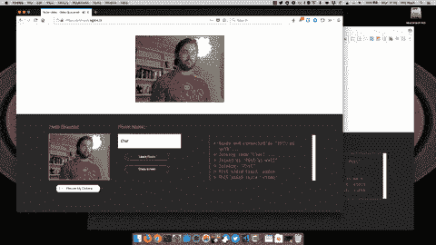
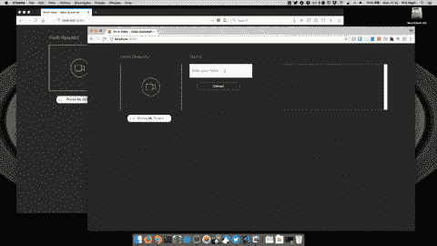

# 使用 Twilio Video 通过屏幕共享建立浏览器内视频聊天

> 原文：<https://dev.to/twilio/build-an-in-browser-video-chat-with-screen-sharing-using-twilio-video--2m1i>

在最近的帖子中，我们看到了如何在 [Chrome](https://dev.to/philnash/screen-capture-in-google-chrome-bjo) 和 [Firefox](https://dev.to/philnash/screen-capture-in-firefox-bma) 中捕捉用户的屏幕。现在是时候将它与真正的视频聊天应用程序结合起来，并将屏幕共享作为视频聊天的一部分。

## 我们在建造什么

在本帖中，我们将采用 [Twilio 视频快速入门应用](https://github.com/twilio/video-quickstart-js)并为其添加屏幕共享。当我们完成后，您的应用程序将允许您在浏览器之间进行呼叫，并在浏览器之间共享屏幕。

[T2】](https://res.cloudinary.com/practicaldev/image/fetch/s--7eZdFyQB--/c_limit%2Cf_auto%2Cfl_progressive%2Cq_66%2Cw_880/https://twilioinc.wpengine.com/wp-content/uploads/2018/01/screen-share2.gif)

## 你需要什么

要构建这个应用程序，您需要一些东西:

*   Twilio 账户-你可以[在这里免费注册](https://www.twilio.com/try-twilio)
*   我们需要运行一个服务器来为 Twilio 视频服务生成访问令牌
*   [我们在第一篇文章](https://dev.to/philnash/screen-capture-in-google-chrome-bjo)中构建的 Chrome 扩展(如果你没有关注这篇文章，后面的回购中会有[该扩展的副本)](https://github.com/philnash/screen-capture)
*   [Ngrok](https://ngrok.com) 像上次一样在 Firefox 中进行[测试](https://dev.to/philnash/screen-capture-in-firefox-bma)

首先，从 GitHub 克隆 repo 并检查`building-screen-sharing`分支:

```
git clone -b building-screen-sharing https://github.com/philnash/screen-capture.git
cd screen-capture 
```

这份报告与 [quickstart 报告](https://github.com/twilio/video-quickstart-js)略有不同，它包括了前两篇博文的工作，包括 Chrome 中屏幕捕捉所需的 Chrome 扩展。你可以按照[博客文章](https://dev.to/philnash/screen-capture-in-google-chrome-bjo)中的说明安装扩展。

要准备视频聊天应用程序，请转到`video-chat`目录并安装依赖项:

```
cd video-chat
npm install 
```

完成后，添加一些凭证，这样我们就可以连接到 [Twilio Video](https://www.twilio.com/video) 服务。首先，将文件`.env.example`复制到`.env`。打开`.env`，填写详细信息。你需要来自 [Twilio 控制台](https://www.twilio.com/console)的 Twilio 账户 Sid 和 [API 密钥和秘密](https://www.twilio.com/console/video/runtime/api-keys)。

完成后，运行:

```
npm start 
```

打开[http://localhost:3000/](http://localhost:3000/)，你应该可以输入用户名和房间名来加入这个房间。在另一个浏览器中重复该过程，您将与自己进行视频聊天。如果一切正常，你就可以开始添加屏幕共享功能了。

[T2】](https://res.cloudinary.com/practicaldev/image/fetch/s--zJFeWtXk--/c_limit%2Cf_auto%2Cfl_progressive%2Cq_66%2Cw_880/https://twilioinc.wpengine.com/wp-content/uploads/2018/01/video-chat2.gif)

## 添加屏幕共享

要添加屏幕共享，前面还有几项任务。首先，先检查浏览器是否支持截屏，否则我们不会做其他任何事情。然后，当用户想要分享他们的屏幕时，我们需要找出他们正在使用的浏览器，并使用前两篇文章中的代码来获取流。然后将流添加到房间中，最后我们应该想办法停止屏幕共享。

让我们开始吧。

### 检查支持

通常我喜欢编写逐渐增强的、基于标准的 JavaScript 来检测这样的特性。然而，正如你在博客中看到的，屏幕捕捉还没有标准化，所以我们需要写一些“脏代码”。

Firefox 中对屏幕捕捉的支持是基于对`mediaDevices` API 中`mediaSource`约束的支持。我们可以用
来测试

```
!!navigator.mediaDevices.getSupportedConstraints().mediaSource 
```

这是一个很好的特性测试，遗憾的是它不能完成全部工作。Firefox 将报告说,`mediaSource`早在版本 33 时就被支持了，但是这种支持被列入了一组受信任的站点的白名单。因此，我们还需要检查我们拥有的 Firefox 版本是 52 还是更高。我们可以用正则表达式从用户代理中读取这些数据。

```
var matchData = navigator.userAgent.match(/Firefox/(d )/);
var firefoxVersion = 0;
if (matchData &amp;&amp; matchData[1]) {
  firefoxVersion = parseInt(matchData[1], 10);
} 
```

打开`video-chat/src/index.js`，在顶部添加测试火狐支持的全功能。

```
// src/index.js
var roomName;

function isFirefox() {
  var mediaSourceSupport = !!navigator.mediaDevices.getSupportedConstraints().mediaSource;
  var matchData = navigator.userAgent.match(/Firefox/(d )/);
  var firefoxVersion = 0;
  if (matchData &amp;&amp; matchData[1]) {
    firefoxVersion = parseInt(matchData[1], 10);
  }
  return mediaSourceSupport &amp;&amp; firefoxVersion &gt;= 52;
} 
```

有很多[方法可以检测 Chrome 扩展是否被安装](https://stackoverflow.com/questions/6293498/check-whether-user-has-a-chrome-extension-installed)，但是它们超出了这篇博文的范围。敬请期待我们探索这一点的后续文章。出于本文的目的，我将检查我们是否可以在`window`上调用`chrome`对象。

```
 return mediaSourceSupport &amp;&amp; firefoxVersion &gt;= 52;
}

function isChrome() {
  return 'chrome' in window;
} 
```

我们还需要一种方法来判断我们是否可以使用屏幕捕获。

```
 return 'chrome' in window;
}

function canScreenShare() {
  return isFirefox() || isChrome();
} 
```

### 获取用户的屏幕

使用上面的函数和前两篇文章中的知识，我们现在可以在支持它的浏览器中得到用户的屏幕。你将需要你的 Chrome 扩展的 ID。将以下几行添加到您的`video-chat/src/index.js`文件中，并用您的 ID 替换`YOUR_EXTENSION_ID`占位符:

```
function getUserScreen() {
  var extensionId = 'YOUR_EXTENSION_ID';
  if (!canScreenShare()) {
    return;
  }
  if (isChrome()) {
    return new Promise((resolve, reject) =&gt; {
      const request = {
        sources: ['screen']
      };
      chrome.runtime.sendMessage(extensionId, request, response =&gt; {
        if (response &amp;&amp; response.type === 'success') {
          resolve({ streamId: response.streamId });
        } else {
          reject(new Error('Could not get stream'));
        }
      });
    }).then(response =&gt; {
      return navigator.mediaDevices.getUserMedia({
        video: {
          mandatory: {
            chromeMediaSource: 'desktop',
            chromeMediaSourceId: response.streamId
          }
        }
      });
    });
  } else if (isFirefox()) {
    return navigator.mediaDevices.getUserMedia({
      video: {
        mediaSource: 'screen'
      }
    });
  }
} 
```

现在，当用户想要共享他们的屏幕时，我们可以使用该功能。

### 把所有的东西放在一起

在最后一部分，我们将把接口连接到上面的函数。有一个隐藏的按钮，当我们加入一个房间时会被激活。在`roomJoined`功能中已经有一些按钮的隐藏和显示，再加上:

```
 document.getElementById('button-join').style.display = 'none';
  document.getElementById('button-leave').style.display = 'inline';
  if (canScreenShare()) {
    document.getElementById('button-share-screen').style.display = 'inline';
  } 
```

在“离开房间”按钮的事件处理程序下，创建“共享”和“不共享”按钮的处理程序:

```
 document.getElementById('button-leave').onclick = function() {
      log('Leaving room...');
      activeRoom.disconnect();
    };

    document.getElementById('button-share-screen').onclick = function() {
    };

    document.getElementById('button-unshare-screen').onclick = function() {
    }; 
```

在 share 按钮的处理程序中，我们希望使用我们的`getUserScreen`函数从用户的屏幕上获取媒体流并获取视频轨道。然后我们将发布房间里的`localParticipant`的音轨。如果这一切都成功了，我们将改变周围的按钮。

```
 document.getElementById('button-share-screen').onclick = function() {
      getUserScreen().then(function(stream) {
        var screenTrack = stream.getVideoTracks()[0];
        activeRoom.localParticipant.publishTrack(screenTrack);
        document.getElementById('button-share-screen').style.display = 'none';
        document.getElementById('button-unshare-screen').style.display = 'inline';
      });
    }; 
```

对于取消共享按钮，我们希望能够再次取消发布曲目。为此，我们需要参考屏幕轨迹。在文件的顶部，声明一个新的`screenTrack`变量。

```
var activeRoom;
var previewTracks;
var identity;
var roomName;
var screenTrack; 
```

在对`getUserScreen`的回调中删除`var`关键字。

```
 document.getElementById('button-share-screen').onclick = function() {
      getUserScreen().then(function(stream) {
        screenTrack = stream.getVideoTracks()[0];
        activeRoom.localParticipant.publishTrack(screenTrack);
        document.getElementById('button-share-screen').style.display = 'none';
        document.getElementById('button-unshare-screen').style.display = 'inline';
      });
    }; 
```

对于取消共享按钮处理程序，使用`screenTrack`变量从`localParticipant`取消发布轨迹。

```
 document.getElementById('button-unshare-screen').onclick = function() {
      activeRoom.localParticipant.unpublishTrack(screenTrack);
      screenTrack = null;
      document.getElementById('button-share-screen').style.display = 'inline';
      document.getElementById('button-unshare-screen').style.display = 'none';
    }; 
```

这就是所有的代码！

## 共享屏幕

如果应用程序尚未运行，使用`npm start`再次启动应用程序。如果您想在 Firefox 中测试这一点，它要求页面通过 HTTPS 提供服务。您可以通过运行 [ngrok](http://ngrok.com/) 并使用 HTTPS URL 隧道连接到您的本地主机来轻松实现这一点。如果你在使用 Chrome，你可以直接进入 [。](http://localhost:3000)

跨两种浏览器与朋友(您可以向他们发送 ngrok 链接)或您自己进行视频聊天。进入后，点击共享屏幕按钮，选择要共享的屏幕后，它将出现在另一个视频聊天中。

[T2】](https://res.cloudinary.com/practicaldev/image/fetch/s--7eZdFyQB--/c_limit%2Cf_auto%2Cfl_progressive%2Cq_66%2Cw_880/https://twilioinc.wpengine.com/wp-content/uploads/2018/01/screen-share2.gif)

## 在合适的浏览器中分享您喜欢的一切

有了这三篇博文中的技巧，你现在可以在 Firefox 和 Chrome(以及 Opera，碰巧使用了相同的 Chrome 扩展)中的视频聊天中进行屏幕共享。

你可以用它做很多事情，从构建一个协作演示应用程序到用基于浏览器的屏幕共享来增加客户支持。一个简单的功能是在用户的屏幕上添加一个本地预览，这样他们就可以看到他们正在分享的内容。

查看 GitHub 上的 repo，获取这篇博文和之前博文的所有代码，并为您的视频聊天应用添加更多协作！

我很想听听你用这个特性构建了什么。请在评论中告诉我，在[philnash@twilio.com](mailto:philnash@twilio.com)给我发电子邮件，或者在[@菲尔纳什](https://twitter.com/philnash)的推特上联系我。

* * *

[使用 Twilio 视频建立一个具有屏幕共享的浏览器内视频聊天](https://www.twilio.com/blog/2018/01/screen-sharing-twilio-video.html)最初于 2018 年 1 月 28 日发布在 [Twilio 博客](https://www.twilio.com/blog)上。_