# 构建带有用户认证的 Ionic 应用程序

> 原文：<https://dev.to/oktadev/build-an-ionic-app-with-user-authentication-4ig1>

有了 Okta 和 OpenID Connect (OIDC ),您可以轻松地将身份验证集成到 Ionic 应用程序中，再也不用自己构建了。OIDC 允许您直接通过 [Okta API](https://developer.okta.com/product/) 进行认证，本文将向您展示如何在 Ionic 应用程序中实现这一点。我将演示如何使用 Okta 的 Auth SDK 登录 OIDC 重定向，以及如何通过 Cordova 的应用内浏览器使用 OAuth 由于该功能仍在积极开发中，因此省略了用户注册。

## 为什么是离子型？

Ionic 是一个开源移动 SDK，用于开发本地和渐进式 web 应用程序。它利用 Angular 和 [Apache Cordova](https://cordova.apache.org/) 来允许你用 HTML、CSS 和 JavaScript 构建移动应用。Apache Cordova 将 HTML 代码嵌入到设备上的本地 WebView 中，使用外来函数接口来访问本地资源。你可能听说过[PhoneGap](http://phonegap.com/)——这是 Adobe 的商业版 Cordova。

Cordova 和 PhoneGap 允许你用一个代码库面向多个平台(例如 Android 和 iOS)。不仅如此，这些应用看起来像本地应用，性能也一样好。如果你需要利用 web 技术中没有的本地特性，有很多本地插件。Ionic Native 是这些插件的集合。

我第一次使用爱奥尼亚是在 2013 年末。我从事的项目是开发一个本地应用程序，但是我想用 HTML 构建几个应用程序的屏幕，以便 web 开发人员可以创作它们。我[在 2014 年 3 月](https://raibledesigns.com/rd/entry/developing_an_ios_native_app)写了我的经历。我喜欢使用它，并发现移植现有的应用程序来使用它更多的是修改 HTML 和调整 CSS。

Ionic 2 于 1 月发布[，使得用 Angular 开发 Ionic 应用成为可能。离子 3 是在四月](http://blog.ionicframework.com/announcing-ionic-2-0-0-final/)发布的[，允许与角 4 一起开发。](http://blog.ionicframework.com/ionic-3-0-has-arrived/)

**注:**“Angular”是 Angular 2+的俗称。AngularJS 是 1.x 版本的通用名称。#ItsJustAngular 的原因是 Angular 4 发布于 2017 年 3 月。更多信息请参见【Angular and AngularJS 品牌指南。

本文将向您展示如何构建一个简单的 Ionic 应用程序，并向其中添加用户认证。大多数应用程序需要认证，所以它们知道用户是谁。一旦应用程序知道你是谁，它就可以保存你的数据和更好的个性化功能。

## 爱奥尼亚入门

要设置使用 Ionic 开发的环境，请完成以下步骤:

1.  安装 [Node.js](https://nodejs.org)
2.  使用 npm 安装 Ionic 和 Cordova:`npm install -g cordova ionic`

## 创建一个离子应用程序

在终端窗口中，使用以下命令创建一个新的应用程序:

```
ionic start ionic-auth 
```

Enter fullscreen mode Exit fullscreen mode

系统将提示您选择一个起始项目。对于本教程，选择**选项卡** starter 项目。当提示将您的应用程序与 Cordova 集成时，请回答是。当提示安装免费的 Ionic Pro SDK 并连接您的应用程序时，请回答否。

项目创建可能需要一两分钟才能完成，这取决于您的互联网连接速度。运行下面的命令来启动你的 Ionic 应用程序。

```
cd ionic-auth
ionic serve 
```

Enter fullscreen mode Exit fullscreen mode

该命令将打开您在 [http://localhost:8100](http://localhost:8100) 上的默认浏览器。你可以使用 Chrome 的设备工具栏来查看该应用程序在 iPhone 6 上的外观。

[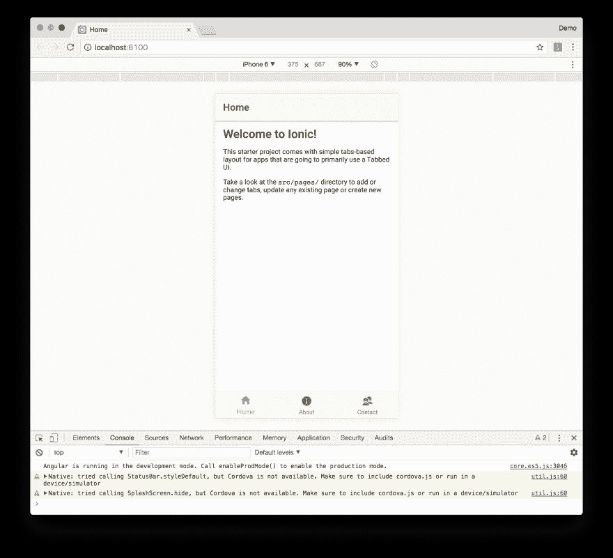T2】](https://res.cloudinary.com/practicaldev/image/fetch/s--2TashILJ--/c_limit%2Cf_auto%2Cfl_progressive%2Cq_auto%2Cw_880/https://developer.okta.com/assets/blog/ionic-authentication/welcome-to-ionic-2de4557f99caa03e895380b0627547e82d8b7a365301745c231d8be9ccde9738.png)

Ionic 的`serve`命令的一个巧妙之处是它在浏览器中显示编译错误，而不是在(有时是隐藏的)开发者控制台中。例如，如果您给`app.component.ts`中的`rootPage`变量赋予了一个无效的类型，您将会看到如下所示的错误。

[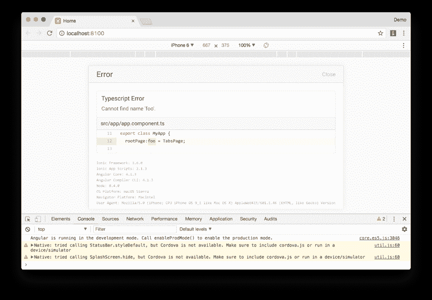T2】](https://res.cloudinary.com/practicaldev/image/fetch/s--3vNxmTZx--/c_limit%2Cf_auto%2Cfl_progressive%2Cq_auto%2Cw_880/https://developer.okta.com/assets/blog/ionic-authentication/typescript-error-8cae045f9dcd9160d3ed4ae07aeed07845a858d2db1360bc156142f789ac161d.png)

## 添加用户认证

离子云提供免费认证服务。它允许通过电子邮件和密码进行身份验证，也允许像脸书、谷歌和 Twitter 这样的社交提供商进行身份验证。它提供了几个类，可以用来在其`@ionic/cloud-angular`依赖项中构建身份验证。它甚至支持自定义认证，但它“需要您自己的服务器来处理认证”，并将于 2018 年 1 月 31 日退役。

虽然目前没有很多关于使用这项服务的教程，但去年有一些。

*   西蒙·雷姆勒的[简单的 Ionic 2 登录与 Angular 2](https://devdactic.com/login-ionic-2/)
*   Raymond Camden 的[一个使用 Ionic 2](https://www.raymondcamden.com/2016/11/04/an-example-of-the-ionic-auth-service-with-ionic-2) 的 Ionic 认证服务的例子
*   Josh Morony 的[在 Ionic 2:第 2 部分](https://www.joshmorony.com/using-json-web-tokens-jwt-for-custom-authentication-in-ionic-2-part-2/)中使用 JSON Web 令牌(JWT)进行自定义认证

您可能会注意到，这两个教程都需要相当多的代码。此外，似乎没有太多关于如何在后端服务中验证来自 Auth 服务的用户凭证的文档。

## 在 Okta 创建一个 OpenID Connect App

OpenID Connect (OIDC)建立在 OAuth 2.0 协议之上。它允许客户端验证用户的身份并获取他们的基本配置文件信息。要集成 Okta 的身份平台进行用户认证，您首先需要:

*   [注册](https://developer.okta.com/signup/)并创建一个 OIDC 应用
*   登录您的 Okta 账户，导航至**申请>添加申请**
*   选择 **SPA** ，点击**下一步**
*   给你的应用命名(如“离子 OIDC”)
*   将**基地 URI** 和**登录重定向 URI** 到`http://localhost:8100`点击**完成**。您应该会看到如下设置:

[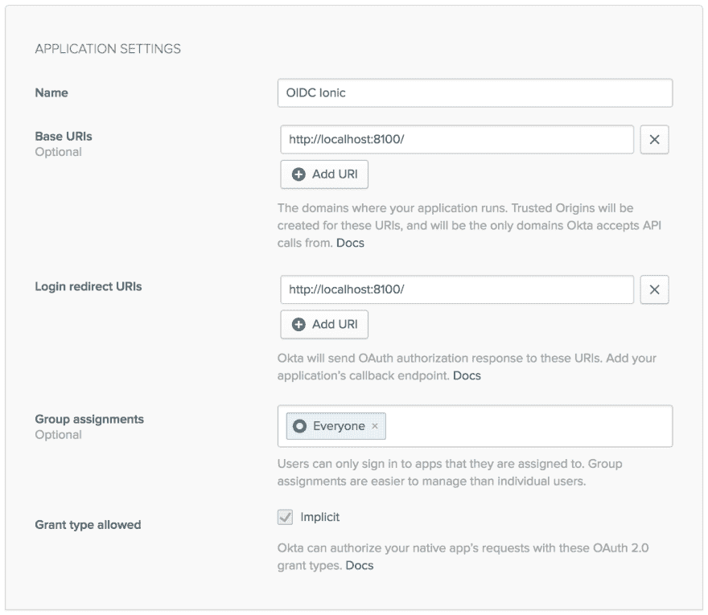T2】](https://res.cloudinary.com/practicaldev/image/fetch/s--VU1Zd6LK--/c_limit%2Cf_auto%2Cfl_progressive%2Cq_auto%2Cw_880/https://developer.okta.com/assets/blog/ionic-authentication/oidc-settings-46747e5e9af164cf56d05f055a659520252558872d9319cadd831d5e7104b990.png)

## 创建登录页面

通过运行以下命令生成一个用于身份验证的登录页面:

```
ionic g page Login 
```

Enter fullscreen mode Exit fullscreen mode

在生成的`src/pages/login/login.html`中，添加一个带有用户名和密码字段的表单。

```
<ion-header>
  <ion-navbar>
    <ion-title>
      Login
    </ion-title>
  </ion-navbar>
</ion-header>
<ion-content padding>
  <form #loginForm="ngForm" (ngSubmit)="login()" autocomplete="off">
    <ion-row>
      <ion-col>
        <ion-list inset>
          <ion-item>
            <ion-input placeholder="Email" name="username" id="loginField"
                       type="text" required [(ngModel)]="username" #email></ion-input>
          </ion-item>
          <ion-item>
            <ion-input placeholder="Password" name="password" id="passwordField"
                       type="password" required [(ngModel)]="password"></ion-input>
          </ion-item>
        </ion-list>
      </ion-col>
    </ion-row>
    <ion-row>
      <ion-col>
        <div *ngIf="error" class="alert alert-danger">{{error}}</div>
        <button ion-button class="submit-btn" full type="submit"
                [disabled]="!loginForm.form.valid">Login
        </button>
      </ion-col>
    </ion-row>
  </form>
</ion-content> 
```

Enter fullscreen mode Exit fullscreen mode

您可以利用几个开源库来执行实际的身份验证。第一个是[曼弗雷德·施泰尔的](https://github.com/manfredsteyer) [angular-oauth2-oidc](https://github.com/manfredsteyer/angular-oauth2-oidc) 。这个库允许您轻松地与身份和访问令牌进行交互。第二个是 [Okta Auth SDK](https://developer.okta.com/code/javascript/okta_auth_sdk) 。OAuth 不是认证协议，但是 OIDC 是。那为什么还要加 Okta 的认证库呢？因为 OIDC 认证通过重定向工作(当在 SPA 中使用时),我宁愿执行认证而不重定向到 Okta。

使用 npm 安装`angular-oauth2-oidc`和 Okta Auth SDK。

```
npm install angular-oauth2-oidc @okta/okta-auth-js --save 
```

Enter fullscreen mode Exit fullscreen mode

在`src/pages/login/login.ts`中，添加`LoginPage`类的基本结构和一个构造器，该构造器使用 angular-oauth2-oidc 中的`OAuthService`配置您的 OIDC 设置。您需要将`{clientId}`替换为 Okta OIDC 设置中的客户 ID，将`{yourOktaDomain}`替换为您帐户的正确 URI。

```
import { Component, ViewChild } from '@angular/core';
import { IonicPage, NavController } from 'ionic-angular';
import { JwksValidationHandler, OAuthService } from 'angular-oauth2-oidc';

@IonicPage()
@Component({
  selector: 'page-login',
  templateUrl: 'login.html'
})
export class LoginPage {
  @ViewChild('email') email: any;
  private username: string;
  private password: string;
  private error: string;

  constructor(private navCtrl: NavController, private oauthService: OAuthService) {
    oauthService.redirectUri = window.location.origin;
    oauthService.clientId = '{clientId}';
    oauthService.scope = 'openid profile email';
    oauthService.issuer = 'https://{yourOktaDomain}.com/oauth2/default';
    oauthService.tokenValidationHandler = new JwksValidationHandler();

    // Load Discovery Document and then try to login the user
    this.oauthService.loadDiscoveryDocument().then(() => {
      this.oauthService.tryLogin();
    });
  }

  ionViewDidLoad(): void {
    setTimeout(() => {
      this.email.setFocus();
    }, 500);
  }
} 
```

Enter fullscreen mode Exit fullscreen mode

修改`src/app/app.component.ts`以查看用户是否登录。如果不是，将`LoginPage`设置为根页面。

```
import { Component } from '@angular/core';
import { Platform } from 'ionic-angular';
import { StatusBar } from '@ionic-native/status-bar';
import { SplashScreen } from '@ionic-native/splash-screen';

import { TabsPage } from '../pages/tabs/tabs';
import { OAuthService } from 'angular-oauth2-oidc';
import { LoginPage } from '../pages/login/login';

@Component({
  templateUrl: 'app.html'
})
export class MyApp {
  rootPage: any = TabsPage;

  constructor(platform: Platform, statusBar: StatusBar, splashScreen: SplashScreen,
              oauthService: OAuthService) {
    if (oauthService.hasValidIdToken()) {
      this.rootPage = TabsPage;
    } else {
      this.rootPage = LoginPage;
    }

    platform.ready().then(() => {
      statusBar.styleDefault();
      splashScreen.hide();
    });
  }
} 
```

Enter fullscreen mode Exit fullscreen mode

更新`src/app/app.module.ts`以添加`OAuthModule`、`HttpClientModule`和`LoginPageModule`作为导入。

```
import { LoginPageModule } from '../pages/login/login.module';
import { OAuthModule } from 'angular-oauth2-oidc';

@NgModule({
  ...
  imports: [
    BrowserModule,
    LoginPageModule,
    OAuthModule.forRoot(),
    IonicModule.forRoot(MyApp)
  ],
  ...
}) 
```

Enter fullscreen mode Exit fullscreen mode

运行`ionic serve`以确保在应用首次加载时显示`LoginPage`。当应用程序试图加载时，你会看到以下错误:

```
No provider for HttpClient! 
```

Enter fullscreen mode Exit fullscreen mode

发生这个错误是因为`OAuthService`依赖于 Angular 的`Http`，但是它还没有被导入到您的项目中。在`src/app/app.module.ts`中增加`HttpModule`作为进口。

```
import { HttpClientModule } from '@angular/common/http';

@NgModule({
  ...
  imports: [
    ...
    HttpClientModule,
    ...
  ],
  ...
}) 
```

Enter fullscreen mode Exit fullscreen mode

现在应该加载登录屏幕。你可以使用 Chrome 的设备工具栏来看看它在 iPhone 6 上会是什么样子。

[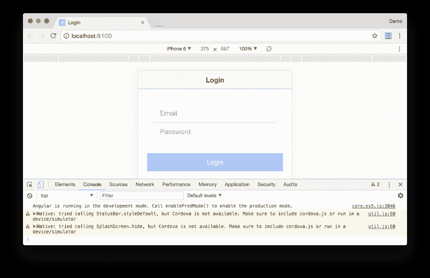T2】](https://res.cloudinary.com/practicaldev/image/fetch/s--6W4doY2e--/c_limit%2Cf_auto%2Cfl_progressive%2Cq_auto%2Cw_880/https://developer.okta.com/assets/blog/ionic-authentication/login-page-3091baa708880a862442451fddb4d2e746ac4b7dad9a77db1b6099b8b28e8261.png)

在`src/app/pages/login/login.ts`中添加一个`login()`方法，该方法使用 Okta Auth SDK 来 1)登录和 2)将会话令牌交换为身份和访问令牌。ID 令牌类似于身份证，采用标准的 JWT 格式，由 OpenID 提供商签名。访问令牌是 OAuth 规范的一部分。接入令牌可以是 JWT。它们用于访问受保护的资源，通常是在发出请求时将它们设置为`Authentication`头。

```
import * as OktaAuth from '@okta/okta-auth-js';
import { TabsPage } from '../tabs/tabs';
...
login(): void {
  this.oauthService.createAndSaveNonce().then(nonce => {
    const authClient = new OktaAuth({
      clientId: this.oauthService.clientId,
      redirectUri: this.oauthService.redirectUri,
      url: 'https://{yourOktaDomain}.oktapreview.com',
      issuer: 'default'
    });
    return authClient.signIn({
      username: this.username,
      password: this.password
    }).then((response) => {
      if (response.status === 'SUCCESS') {
        return authClient.token.getWithoutPrompt({
          nonce: nonce,
          responseType: ['id_token', 'token'],
          sessionToken: response.sessionToken,
          scopes: this.oauthService.scope.split('  ')
        })
          .then((tokens) => {
            const idToken = tokens[0].idToken;
            const accessToken = tokens[1].accessToken;
            const keyValuePair = `#id_token=${encodeURIComponent(idToken)}&access_token=${encodeURIComponent(accessToken)}`;
            this.oauthService.tryLogin({
              customHashFragment: keyValuePair,
              disableOAuth2StateCheck: true
            });
          this.navCtrl.push(TabsPage);
          });
      } else {
        throw new Error('We cannot handle the ' + response.status + ' status');
      }
    }).fail((error) => {
      console.error(error);
      this.error = error.message;
    });
  });
} 
```

Enter fullscreen mode Exit fullscreen mode

您需要一个身份令牌，这样就可以获得关于用户的更多信息。您需要一个访问令牌，这样就可以用它来访问需要无记名令牌的受保护 API。例如，在[将认证添加到您的 Angular PWA](https://developer.okta.com/blog/2017/06/13/add-authentication-angular-pwa) 中，有一个`BeerService`在发出 API 请求时发送一个访问令牌。

```
import { Injectable } from '@angular/core';
import { Http, Response, Headers, RequestOptions } from '@angular/http';
import 'rxjs/add/operator/map';
import { Observable } from 'rxjs';
import { OAuthService } from 'angular-oauth2-oidc';

@Injectable()
export class BeerService {

  constructor(private http: Http, private oauthService: OAuthService) {
  }

  getAll(): Observable<any> {
    const headers: Headers = new Headers();
    headers.append('Authorization', this.oauthService.authorizationHeader());

    let options = new RequestOptions({ headers: headers });

    return this.http.get('http://localhost:8080/good-beers', options)
      .map((response: Response) => response.json());
  }
} 
```

Enter fullscreen mode Exit fullscreen mode

您可以(可选地)通过在表单上方添加一个徽标来美化登录屏幕。下载[这张图片](https://www.okta.com/sites/all/themes/Okimg/blog/Logos/Okta_Logo_BrightBlue_Medium.png)，复制到`src/assets/imgs/okta.png`，在`login.html`中的`<form>`标签上方添加以下内容。您可能需要编辑图像，使其宽度仅为 300 像素。这将它的大小从 110 KB 减少到 12 KB。

```
<ion-row>
  <ion-col text-center>
    
  </ion-col>
</ion-row> 
```

Enter fullscreen mode Exit fullscreen mode

当你登录时，用户界面上没有太多的证明。在主屏幕的右上角添加一个“注销”按钮。用下面的 HTML 替换`src/pages/home/home.html`中的`<ion-header>`。

```
<ion-header>
  <ion-navbar>
    <ion-title>Home</ion-title>
    <ion-buttons end>
      <button ion-button (click)="logout()">
        Logout
      </button>
    </ion-buttons>
  </ion-navbar>
</ion-header> 
```

Enter fullscreen mode Exit fullscreen mode

在`src/pages/home/home.ts`中，添加一个`logout()`方法，以及从身份令牌获取名称和声明的方法。ID 令牌中的声明是关于发布者、用户、目标受众、截止日期和发布日期的信息。你可以在 OIDC 规范中看到[标准声明。](https://openid.net/specs/openid-connect-core-1_0.html#IDToken) 

```
import { Component } from '@angular/core';
import { App } from 'ionic-angular';
import { LoginPage } from '../login/login';
import { OAuthService } from 'angular-oauth2-oidc';

@Component({
  selector: 'page-home',
  templateUrl: 'home.html'
})
export class HomePage {

  constructor(public app: App, public oauthService: OAuthService) {
  }

  logout() {
    this.oauthService.logOut(true);
    this.app.getRootNavs()[0].setRoot(LoginPage);
  }

  get givenName() {
    const claims: any = this.oauthService.getIdentityClaims();
    if (!claims) {
      return null;
    }
    return claims.name;
  }

  get claims() {
    return this.oauthService.getIdentityClaims();
  }
} 
```

Enter fullscreen mode Exit fullscreen mode

要在主页选项卡上显示此信息，请在`src/app/home/home.html`的第二段后添加以下 HTML。

```
<div *ngIf="givenName">
  <hr>
  <p>You are logged in as: <b>{{ givenName }}</b></p>
  <div class="claims">
    <strong>Claims from Identity Token JWT:</strong>
    <pre>{{claims | json}}</pre>
  </div>
</div> 
```

Enter fullscreen mode Exit fullscreen mode

更新`src/app/home/home.scss`添加一些 CSS，使原始 JSON 看起来更好一点。

```
page-home {
  .claims {
    pre {
      color: green;
    }
  }
  pre {
    border: 1px solid silver;
    background: #eee;
    padding: 10px;
  }
} 
```

Enter fullscreen mode Exit fullscreen mode

现在，您应该可以在登录时看到您的姓名和索赔信息。

[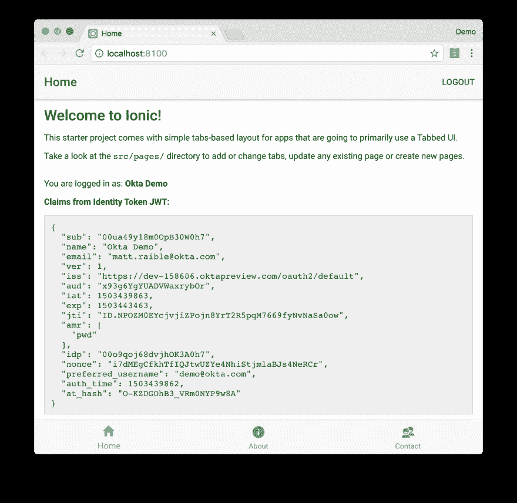T2】](https://res.cloudinary.com/practicaldev/image/fetch/s--NCd8T6vK--/c_limit%2Cf_auto%2Cfl_progressive%2Cq_auto%2Cw_880/https://developer.okta.com/assets/blog/ionic-authentication/home-claims-daf6b5729a3b77345b2cc1e9bf9e3077e32b1cafce795fa4e0b8c06f2de4b411.png)

您还应该能够注销并看到带有徽标的登录屏幕。

[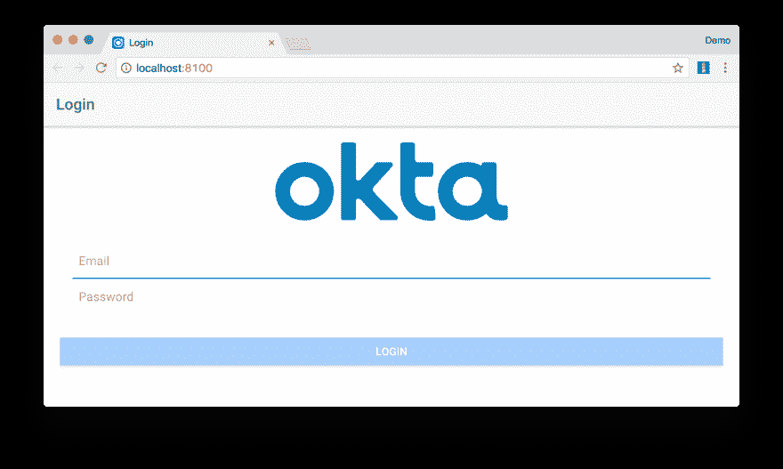T2】](https://res.cloudinary.com/practicaldev/image/fetch/s--OR_jFkDK--/c_limit%2Cf_auto%2Cfl_progressive%2Cq_auto%2Cw_880/https://developer.okta.com/assets/blog/ionic-authentication/login-with-logo-95c6223626ff262ff1db89dfc8b7e3c7ed0e23b174769cf5a6aa23d2d1da3420.png)

## 部署到移动设备

你可以在浏览器中用 Ionic 开发移动应用，这很酷。然而，很高兴看到你的劳动成果，并验证你的应用程序在手机上看起来有多棒。它的外观和行为确实像一个原生应用程序！

要查看您的应用程序在不同设备上的外观，您可以运行`ionic serve --lab`。`--lab`标志会在您的浏览器中打开一个页面，让您看到您的应用程序将如何在各种设备上显示。

[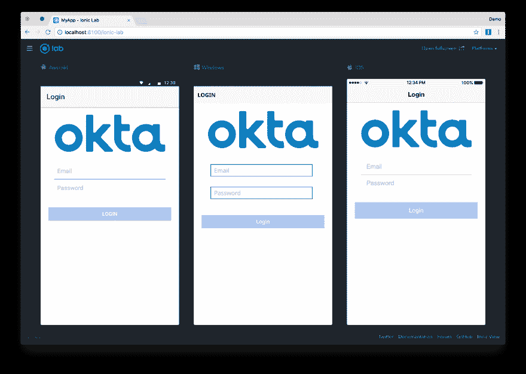T2】](https://res.cloudinary.com/practicaldev/image/fetch/s--naioK4Fw--/c_limit%2Cf_auto%2Cfl_progressive%2Cq_auto%2Cw_880/https://developer.okta.com/assets/blog/ionic-authentication/ionic-labs-af72a6964445850e20e953512d6891e76e3d847194036cc478721fadf8480ff3.png)

加载时，`LoginPage`试图自动聚焦到`email`字段。要自动激活键盘，你需要告诉 Cordova，可以在没有用户交互的情况下显示键盘。你可以通过在根目录的`config.xml`中添加以下内容来实现。

```
<preference name="KeyboardDisplayRequiresUserAction" value="false" /> 
```

Enter fullscreen mode Exit fullscreen mode

### iOS

要模拟或部署到 iOS 设备，你需要一台 Mac 和一个全新安装的 [Xcode](https://developer.apple.com/xcode/) 。如果你想在 Windows 上开发 iOS 应用，Ionic 提供了一个 [Ionic 包](http://ionic.io/cloud#packaging)服务。

**确保打开 Xcode 来完成安装。**然后运行`ionic cordova emulate ios`在模拟器中打开你的应用。

您可能会遇到如下错误:

```
** BUILD SUCCEEDED **

Error: Cannot read property 'replace' of undefined

[ERROR] An error occurred while running cordova emulate ios (exit code 1). 
```

Enter fullscreen mode Exit fullscreen mode

这是一个，可以通过运行以下命令来解决:

```
cd platforms/ios/cordova && npm install ios-sim 
```

Enter fullscreen mode Exit fullscreen mode

**提示:**我在模拟器中运行 app 时发现的最大问题是很难让键盘弹出来。为了解决这个问题，当我需要在字段中键入文本时，我使用了**硬件** > **键盘** > **切换软件键盘**。

如果您在登录屏幕上输入您的凭证，您会注意到什么也没有发生。打开 Safari，导航到**开发** > **模拟器** > MyApp / **登录**，你会看到最终控制台会出现一个错误。如果您没有看到开发菜单，请查看本文[中的步骤](https://www.computerworld.com/article/3156141/apple-mac/how-to-use-the-safari-develop-menu-on-a-mac.html)来启用它。

[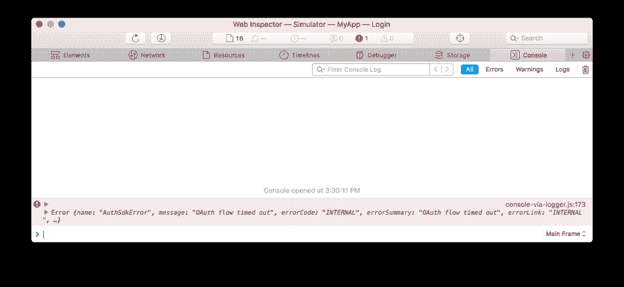T2】](https://res.cloudinary.com/practicaldev/image/fetch/s--6q5v5i_T--/c_limit%2Cf_auto%2Cfl_progressive%2Cq_auto%2Cw_880/https://developer.okta.com/assets/blog/ionic-authentication/webinspector-error-e0926c559701d4b55e965af97dd0dea9e59f4575c3c09e788e15cecc0dc93cc4.png)

如果使用网络选项卡，您可以看到只发出了一个网络请求(对`/authn`)，这与在浏览器中运行时发出的两个请求(对`/authn`和`/authorize`)不同。

[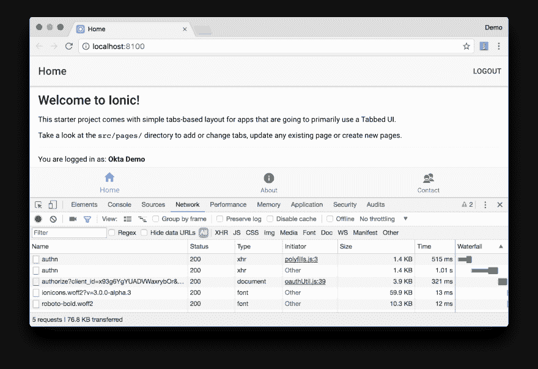T2】](https://res.cloudinary.com/practicaldev/image/fetch/s--tBjOajas--/c_limit%2Cf_auto%2Cfl_progressive%2Cq_auto%2Cw_880/https://developer.okta.com/assets/blog/ionic-authentication/devtools-network-requests-f8f4f42856ce9d831c7b99ce7044753b3b97c79a2fcbb25af619b20d95dae1a0.png)

我相信当应用程序与 Cordova 打包在一起时，这是行不通的，因为它使用嵌入的 iframe 向服务器发出请求，然后使用 postMessage 发送回当前窗口。似乎 Ionic/Cordova(目前)还不支持这种流量。要解决这个问题，您可以使用 Cordova 提供的应用内浏览器直接与 Okta 的 OAuth 服务对话。 [Nic Raboy](https://twitter.com/nraboy) 展示了如何在 Ionic 2 移动应用中使用 OAuth 2.0 服务与[的脸书一起完成这项工作。](https://www.thepolyglotdeveloper.com/2016/01/using-an-oauth-2-0-service-within-an-ionic-2-mobile-app/)

使用以下命令安装 [Cordova 应用内浏览器插件](https://cordova.apache.org/docs/en/latest/reference/cordova-plugin-inappbrowser/):

```
ionic cordova plugin add cordova-plugin-inappbrowser 
```

Enter fullscreen mode Exit fullscreen mode

打开`src/app/pages/login/login.html`,用一个`<div>`包装`<form>`,它只在浏览器中运行时显示这个登录表单。添加一个新的`<div>`，当在模拟器或设备上运行时显示。

```
<ion-content padding>
  <ion-row>
   <!-- optional logo -->
  </ion-row>
  <div showWhen="core">
    <form>
     ...
    </form>
  </div>
  <div hideWhen="core">
    <button ion-button full (click)="redirectLogin()">Login with Okta</button>
  </div>
</ion-content> 
```

Enter fullscreen mode Exit fullscreen mode

打开`src/pages/login/login.ts`并在导入下方添加对`window`的引用。

```
declare const window: any; 
```

Enter fullscreen mode Exit fullscreen mode

然后添加下面的方法，以便于使用 OAuth 登录。

```
redirectLogin() {
  this.oktaLogin().then(success => {
    const idToken = success.id_token;
    const accessToken = success.access_token;
    const keyValuePair = `#id_token=${encodeURIComponent(idToken)}&access_token=${encodeURIComponent(accessToken)}`;
    this.oauthService.tryLogin({
      customHashFragment: keyValuePair,
      disableOAuth2StateCheck: true
    });
    this.navCtrl.push(TabsPage);
  }, (error) => {
    this.error = error;
  });
}

oktaLogin(): Promise<any> {
  return this.oauthService.createAndSaveNonce().then(nonce => {
    let state: string = Math.floor(Math.random() * 1000000000).toString();
    if (window.crypto) {
      const array = new Uint32Array(1);
      window.crypto.getRandomValues(array);
      state = array.join().toString();
    }
    return new Promise((resolve, reject) => {
      const oauthUrl = this.buildOAuthUrl(state, nonce);
      const browser = window.cordova.InAppBrowser.open(oauthUrl, '_blank',
        'location=no,clearsessioncache=yes,clearcache=yes');
      browser.addEventListener('loadstart', (event) => {
        if ((event.url).indexOf('http://localhost:8100') === 0) {
          browser.removeEventListener('exit', () => {});
          browser.close();
          const responseParameters = ((event.url).split('#')[1]).split('&');
          const parsedResponse = {};
          for (let i = 0; i < responseParameters.length; i++) {
            parsedResponse[responseParameters[i].split('=')[0]] =
              responseParameters[i].split('=')[1];
          }
          const defaultError = 'Problem authenticating with Okta';
          if (parsedResponse['state'] !== state) {
            reject(defaultError);
          } else if (parsedResponse['access_token'] !== undefined &&
            parsedResponse['access_token'] !== null) {
            resolve(parsedResponse);
          } else {
            reject(defaultError);
          }
        }
      });
      browser.addEventListener('exit', function (event) {
        reject('The Okta sign in flow was canceled');
      });
    });
  });
}

buildOAuthUrl(state, nonce): string {
  return this.oauthService.issuer + '/v1/authorize?' +
      'client_id=' + this.oauthService.clientId + '&' +
      'redirect_uri=' + this.oauthService.redirectUri + '&' +
      'response_type=id_token%20token&' +
      'scope=' + encodeURI(this.oauthService.scope) + '&' +
      'state=' + state + '&nonce=' + nonce;
} 
```

Enter fullscreen mode Exit fullscreen mode

将构造函数中设置的`redirectUri`改为硬编码`http://localhost:8100`。如果您跳过这一步，`window.location.origin`将导致当应用程序在设备上运行时发送一个`file://`原点。通过使它成为一个已知的 URL，我们可以在“loadstart”事件上用应用内浏览器查找它。

```
constructor(private navCtrl: NavController, private oauthService: OAuthService) {
  oauthService.redirectUri = 'http://localhost:8100';
  ...
} 
```

Enter fullscreen mode Exit fullscreen mode

完成这些更改后，你必须将应用重新部署到你的手机上。

```
ionic cordova emulate ios 
```

Enter fullscreen mode Exit fullscreen mode

现在，您应该可以通过点击“使用 Okta 登录”按钮并输入有效凭证来登录。

[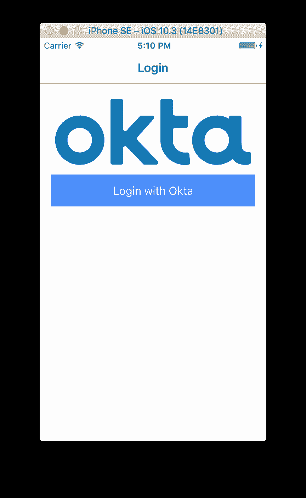](https://res.cloudinary.com/practicaldev/image/fetch/s---kQlVEwZ--/c_limit%2Cf_auto%2Cfl_progressive%2Cq_auto%2Cw_880/https://developer.okta.com/assets/blog/ionic-authentication/emulator-login-c4b218091f6549081c063e2eb71af4b1bcf371d49cffd109d3f77e6019ec85ce.png)[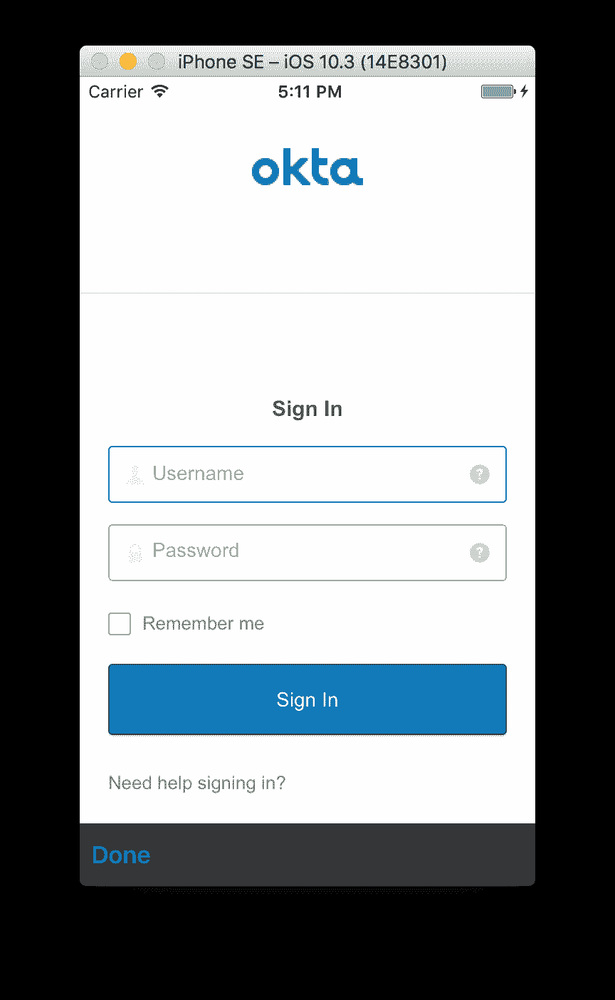](https://res.cloudinary.com/practicaldev/image/fetch/s--lvl5zFZT--/c_limit%2Cf_auto%2Cfl_progressive%2Cq_auto%2Cw_880/https://developer.okta.com/assets/blog/ionic-authentication/emulator-okta-login-03521c0da232257989de99fe3c41e81f1c822d1397d4b5e2e8a5371b21aef085.png)[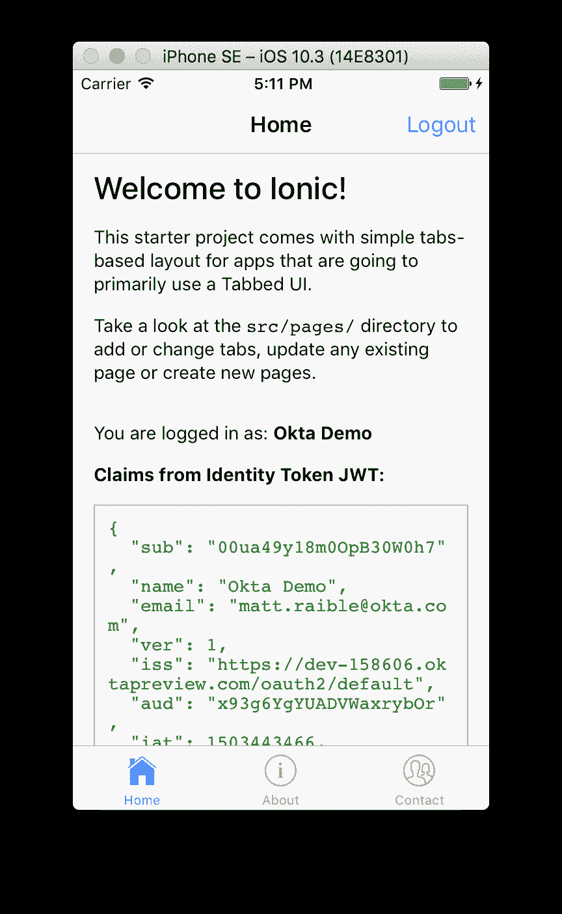](https://res.cloudinary.com/practicaldev/image/fetch/s--aj_6jsde--/c_limit%2Cf_auto%2Cfl_progressive%2Cq_auto%2Cw_880/https://developer.okta.com/assets/blog/ionic-authentication/emulator-home-935f74e0cd70e31bcf49f782c0b1371c8ad1af4d44f6da3002a91cbf42a95d55.png)

使用这种技术的好处是 Okta 登录屏幕支持记住我和忘记密码，所以您不需要自己编写代码。

要将应用程序部署到 iPhone 上，首先要将一个应用程序插入电脑。然后运行以下命令构建应用程序并在您的设备上运行。

```
ionic cordova run ios 
```

Enter fullscreen mode Exit fullscreen mode

如果您以前没有为您的应用程序设置代码签名，此命令可能会失败。

```
Signing for "MyApp" requires a development team. Select a development team in the project editor.
Code signing is required for product type 'Application' in SDK 'iOS 10.3' 
```

Enter fullscreen mode Exit fullscreen mode

使用下面的命令在 Xcode 中打开您的项目。

```
open platforms/ios/MyApp.xcodeproj 
```

Enter fullscreen mode Exit fullscreen mode

Ionic 的部署文档提供了解决这一问题的说明。

在 Xcode 中选择您的手机作为目标，然后点按播放按钮来运行您的应用程序。第一次这样做时，Xcode 可能会旋转一段时间，顶部会显示“正在处理符号文件”信息。

配置好手机、电脑和 Apple ID 后，您应该可以打开应用程序并登录。下面是它在我的 iPhone 上的样子。

[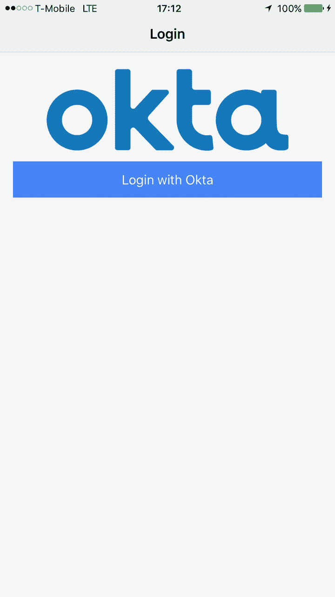](https://res.cloudinary.com/practicaldev/image/fetch/s--nkObHUFf--/c_limit%2Cf_auto%2Cfl_progressive%2Cq_auto%2Cw_880/https://developer.okta.com/assets/blog/ionic-authentication/iphone-login-5f731e6ba21115febd9c4c21ba802c636370a5eeb9d9e3b47812bb64171c1efb.png)[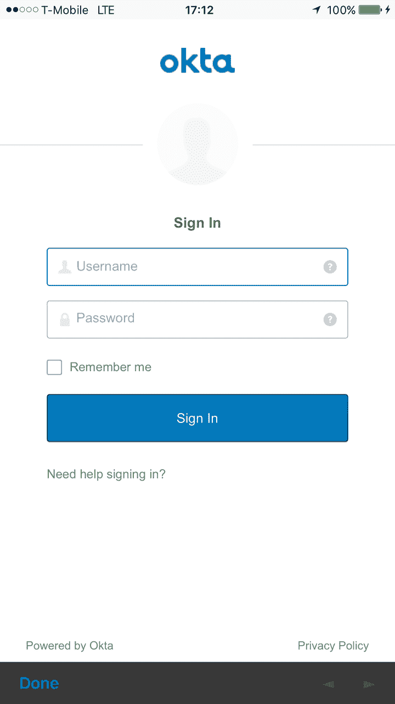](https://res.cloudinary.com/practicaldev/image/fetch/s--WcsAWgvK--/c_limit%2Cf_auto%2Cfl_progressive%2Cq_auto%2Cw_880/https://developer.okta.com/assets/blog/ionic-authentication/iphone-okta-login-920b0eb85c7865bb6e822e471c4ff5655050ac7342832bbb21cf9a928516dfc0.png)[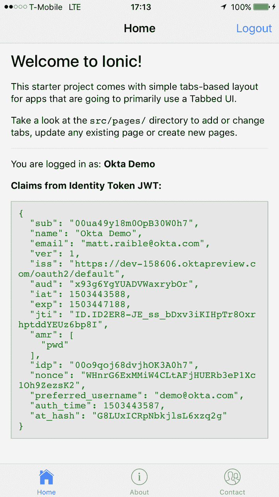](https://res.cloudinary.com/practicaldev/image/fetch/s--6LZeLk05--/c_limit%2Cf_auto%2Cfl_progressive%2Cq_auto%2Cw_880/https://developer.okta.com/assets/blog/ionic-authentication/iphone-home-f50201f8cc12ab535ee9583a23990c218cc9a23b50bba61302ae708ae9dd8d47.png)

### 安卓

为了模拟或部署到 Android 设备上，你首先需要安装 [Android Studio](https://developer.android.com/studio/index.html) 。作为安装的一部分，它会向你显示它安装 Android SDK 的位置。将该路径设置为 ANDROID_HOME 环境变量。在 Mac 上应该是`~/Library/Android/sdk/`。

如果您刚刚安装了 Android Studio，请确保将其打开以完成安装。

要部署到 Android 模拟器，运行`ionic cordova emulate android`。如果您没有任何 AVD (Android 虚拟设备)映像，此命令将安装 Android 支持并显示一个错误。

```
(node:9300) UnhandledPromiseRejectionWarning: CordovaError: No emulator images (avds) found.
1\. Download desired System Image by running: /Users/mraible/Library/Android/sdk/tools/android sdk
2\. Create an AVD by running: /Users/mraible/Library/Android/sdk/tools/android avd
HINT: For a faster emulator, use an Intel System Image and install the HAXM device driver 
```

Enter fullscreen mode Exit fullscreen mode

要创建一个新的 AVD，打开 Android Studio 并导航到**工具**>**Android**>**AVD 管理器**。创建一个新的虚拟设备，然后单击播放。我选择了像素 2。

执行这些步骤后，您应该能够运行`ionic cordova emulate android`并看到您的应用程序在 AVD 中运行。

[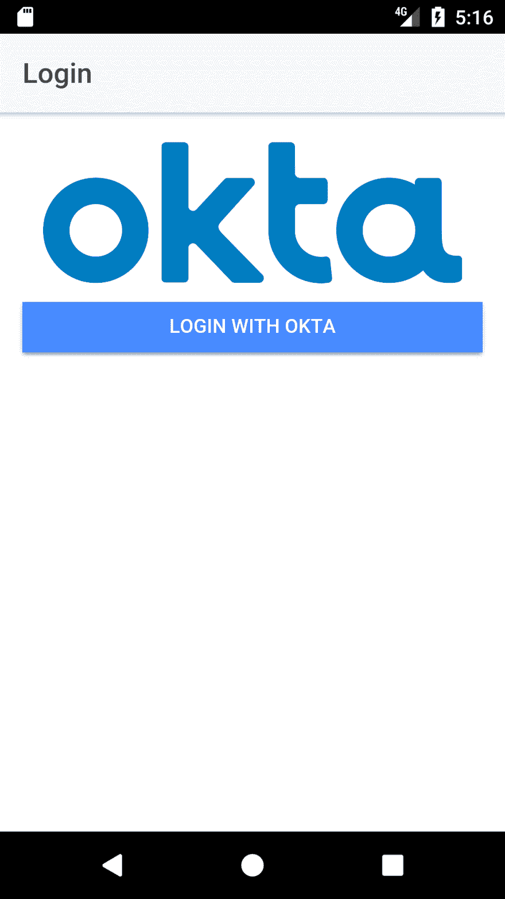](https://res.cloudinary.com/practicaldev/image/fetch/s--bz8Z2IKx--/c_limit%2Cf_auto%2Cfl_progressive%2Cq_auto%2Cw_880/https://developer.okta.com/assets/blog/ionic-authentication/android-login-a0363756fc25a974e87668bc0900acb783f7eec80a1b83b0c5de0a5016004f94.png)[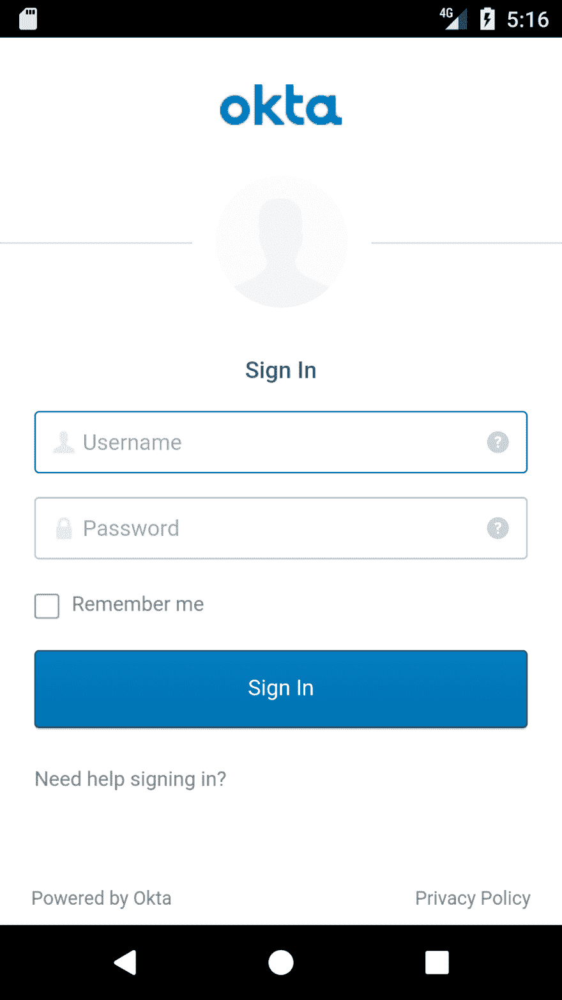](https://res.cloudinary.com/practicaldev/image/fetch/s--Nqpo5If1--/c_limit%2Cf_auto%2Cfl_progressive%2Cq_auto%2Cw_880/https://developer.okta.com/assets/blog/ionic-authentication/android-okta-login-bb57b05d91580c165352d0f21d2da0415827601a25720ec2121f269ae20618ae.png)[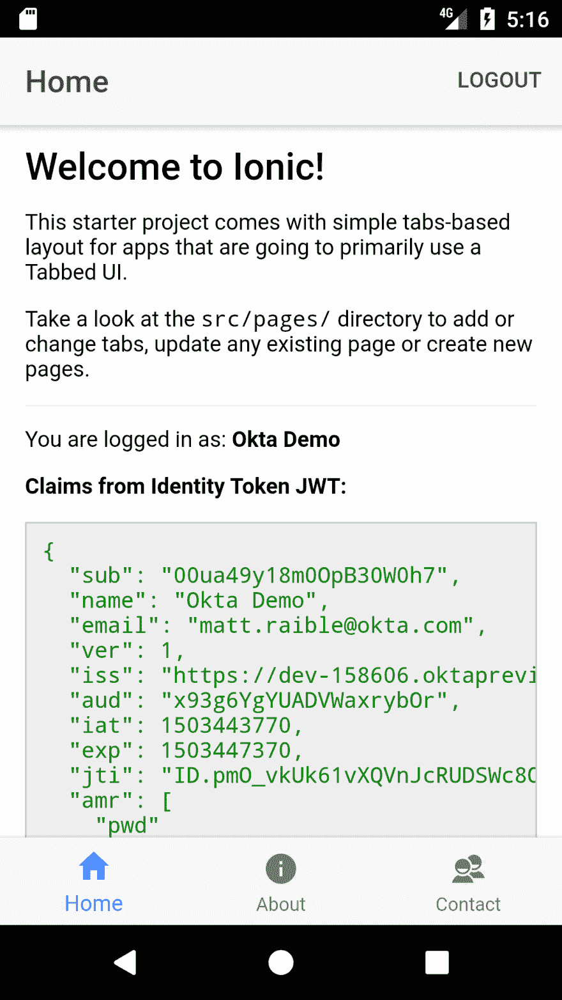](https://res.cloudinary.com/practicaldev/image/fetch/s--hR1SlPSG--/c_limit%2Cf_auto%2Cfl_progressive%2Cq_auto%2Cw_880/https://developer.okta.com/assets/blog/ionic-authentication/android-home-9438a0b8324d932abc0dcece445af75c8009350e683bb46d526baaa614e1de13.png)

**注意**:如果你得到一个应用程序错误，说“服务器连接不成功。(`file:///android/www/index.html`)”，在`config.xml`中增加下面一行。这一行将默认超时设置为 60 秒(默认值为 20)。感谢[栈溢出社区](http://stackoverflow.com/a/31377846)提供了这个解决方案。

```
<preference name="loadUrlTimeoutValue" value="60000"/> 
```

Enter fullscreen mode Exit fullscreen mode

## PWAs 用离子

Ionic 支持创建渐进式 web 应用程序(pwa)。这意味着你可以将 Ionic 应用部署为一个网络应用(而不是移动应用)，并在支持服务人员的浏览器中离线运行。

通过阅读[如何使用 Ionic 和 Spring Boot](https://developer.okta.com/blog/2017/05/17/develop-a-mobile-app-with-ionic-and-spring-boot) 开发移动应用的 [PWAs 部分](https://developer.okta.com/blog/2017/05/17/develop-a-mobile-app-with-ionic-and-spring-boot)，您可以了解如何启用服务人员并使您的应用成为 PWA。PWA 是可以“安装”在您的系统上的 web 应用程序。当你没有互联网连接时，它可以离线工作，利用你上次与应用程序交互时缓存的数据。增加 PWA 功能可以让你的应用程序加载速度更快，创造出快乐的用户。要了解更多关于 PWAs 的信息，请看[渐进式网络应用的最终指南](https://developer.okta.com/blog/2017/07/20/the-ultimate-guide-to-progressive-web-applications)。

爱奥尼亚投入巨资支持艾滋病毒感染者和病人。你可以在 [阅读更多关于为什么进步的网络应用能为你做什么](http://blog.ionicframework.com/what-progressive-web-apps-can-do-for-you/)。

## 了解更多

我希望你喜欢这次爱奥尼亚岛、角岛和奥克塔岛之旅。我喜欢 Ionic 如何将你的 web 开发技能提升一个档次，并允许你创建外观和行为都很自然且运行迅速的移动应用程序。

你可以在 GitHub 上看到这个项目[的完整源代码。如果您有任何问题，请通过 Twitter](https://github.com/oktadeveloper/okta-ionic-auth-example) [@mraible](https://twitter.com/mraible) 或 [Okta 开发者论坛](https://devforum.okta.com/)联系我。

要了解有关 Ionic、Angular 或 Okta 的更多信息，请参阅以下资源:

*   [向您的 Angular PWA 添加认证](https://developer.okta.com/blog/2017/06/13/add-authentication-angular-pwa)
*   [教程:用 Ionic 和 Spring Boot 开发手机应用](https://developer.okta.com/blog/2017/05/17/develop-a-mobile-app-with-ionic-and-spring-boot)
*   [用 Angular 和 Spring Boot 构建你的第一个渐进式网络应用](https://developer.okta.com/blog/2017/05/09/progressive-web-applications-with-angular-and-spring-boot)