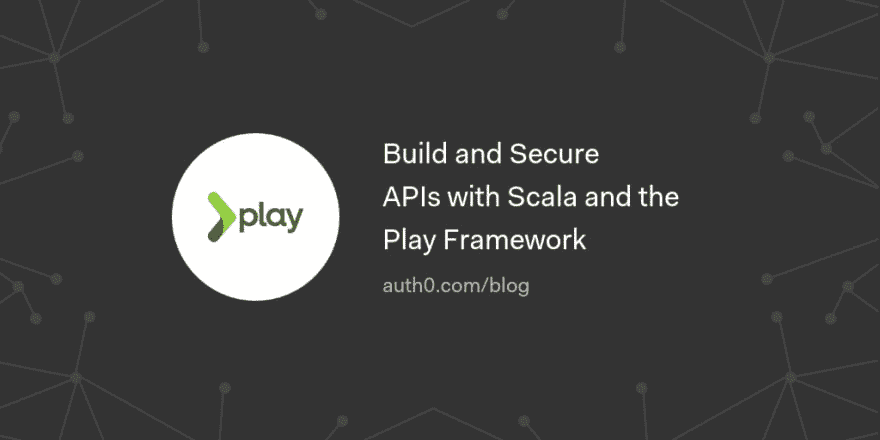

# 使用 Scala 和 Play 框架构建和保护 API

> 原文：<https://dev.to/auth0/build-and-secure-apis-with-scala-and-the-play-framework-45h1>

在本文中，我们将使用 Scala 和 Play 框架来构建一个 API，为博客文章和评论提供服务，然后使用访问令牌来保护 API。

[读下去🏄🏾‍♂️](https://auth0.com/blog/build-and-secure-a-scala-play-framework-api/?utm_source=dev&utm_medium=sc&utm_campaign=scala_play)

[T2】](https://res.cloudinary.com/practicaldev/image/fetch/s--phOCrUkg--/c_limit%2Cf_auto%2Cfl_progressive%2Cq_auto%2Cw_880/https://thepracticaldev.s3.amazonaws.com/i/xu3vd2ljvdi5caxgwmm5.png)