# 构建并理解一个带有用户身份验证的简单 Node.js 网站

> 原文：<https://dev.to/oktadev/build-and-understand-a-simple-nodejs-website-with-user-authentication-4ml9>

建立网站与用户认证和管理(登录，注册，密码重置等)。)，可以是巨大的痛苦。作为一名开发人员，你需要担心无数的小事:

*   将用户存储在数据库中
*   确保您定义了正确的用户属性
*   强制用户登录才能查看页面
*   建筑物注册和登录表格
*   创建通过电子邮件向用户发送链接的密码重置工作流
*   当新用户通过电子邮件注册时验证他们
*   等等…

这个清单还在继续。

今天，我不仅要向你展示如何快速构建一个支持上述所有内容的 Node.js 网站，我还将告诉你幕后到底发生了什么，这样你就能完全*理解*web 认证是如何工作的。

如果你曾经对网络认证和用户安全的工作原理感到好奇，你会喜欢这个。=)

## 我们在建造什么

正如我上面提到的，今天我们将构建一个简单的 Node.js 站点，它支持几个关键的用户流:

*   用户注册
*   用户登录
*   密码重置
*   电子邮件验证

本文的最终产品如下所示:

[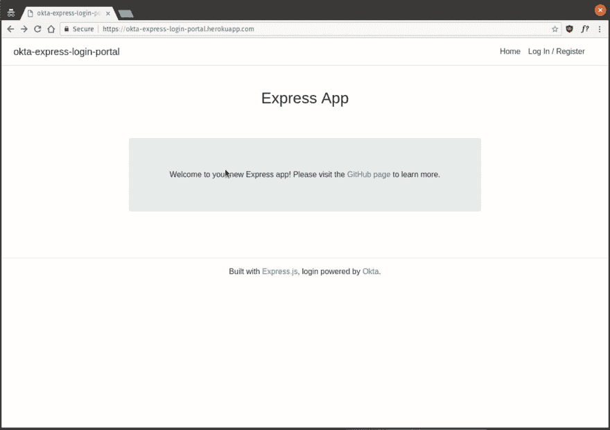T2】](https://res.cloudinary.com/practicaldev/image/fetch/s--zvs952J7--/c_limit%2Cf_auto%2Cfl_progressive%2Cq_66%2Cw_880/https://developer.okta.com/assets/blog/build-understand-auth-node/using-the-site-ad78534a9856b7ad496c7e2c42b4bd8fad0daedee34a410da9a872d5c49b90d1.gif)

如果你想看这个项目的现场预览，你可以在这里做:[https://okta-express-login-portal.herokuapp.com/](https://okta-express-login-portal.herokuapp.com/)。

该网站将使用几个不同的工具来构建(您不需要了解它们):

*   [Express.js](https://expressjs.com/) ，Node.js 生态系统中最流行的 web 框架。
*   [express-session](https://github.com/expressjs/session) ，一个流行的会话管理库。这将允许我们创建和存储能够记住用户身份的 cookies。
*   Pug ，一种流行的模板语言，使得编写 HTML 变得简单了一些。
*   [oidc-middleware](https://github.com/okta/okta-oidc-js/tree/master/packages/oidc-middleware) ，一个流行的开发者库，它使得使用 [OpenID Connect](https://developer.okta.com/blog/2017/07/25/oidc-primer-part-1) 协议处理认证变得简单

## 安装工具

您需要做的第一件事是安装我们将用来构建 Node.js 站点的所有开源工具。

**PS** :如果你的电脑上还没有安装和运行 Node.js，你可以去查看[这个链接](https://nodejs.org/en/download/package-manager/)，它向你展示了不管你用的是什么操作系统，让它运行的最好方法。

接下来，安装 [express-generator](https://github.com/expressjs/generator) 工具，这是官方支持的用于快速入门 Express.js 的引导工具

```
npm install express-generator@4.16.0 
```

Enter fullscreen mode Exit fullscreen mode

一旦完成，您将需要使用 express-generator 来搭建新的 Express.js 站点。

```
express --view pug login-portal
cd login-portal
npm install 
```

Enter fullscreen mode Exit fullscreen mode

您现在有了一个简单的 Express.js 网站，可以运行并测试它。通过运行`npm start`启动新的网络服务器，然后在浏览器中访问`http://localhost:3000`,确保一切正常。如果一切正常，您应该会看到如下所示的页面。

[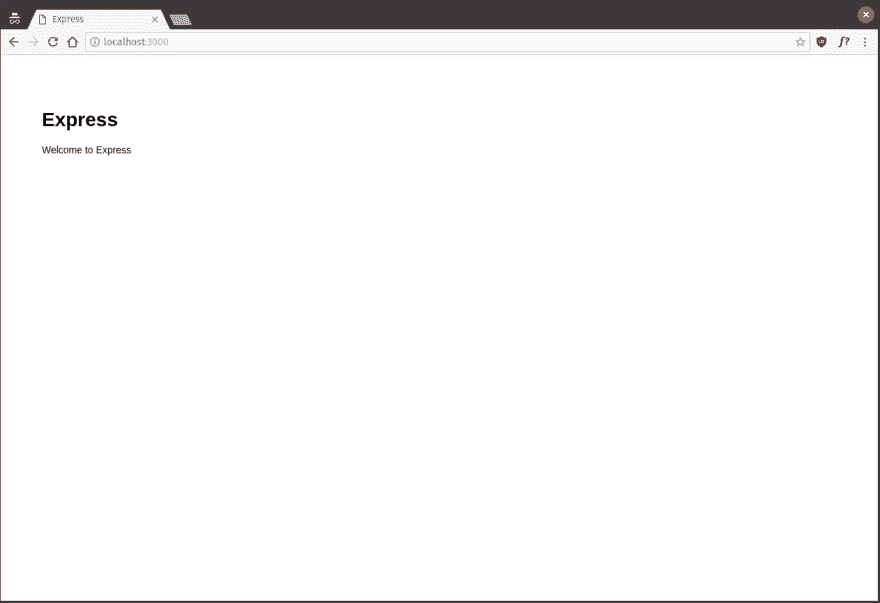T2】](https://res.cloudinary.com/practicaldev/image/fetch/s--uqRoyubv--/c_limit%2Cf_auto%2Cfl_progressive%2Cq_auto%2Cw_880/https://developer.okta.com/assets/blog/build-understand-auth-node/express-starter-page-74a7d3ac4c7b71de0bf430dd737a2a298a8b65c7a9bc569212fde39a3a59bb92.png)

接下来，安装一些额外的包。我们将在余下的教程中使用这些包。预先将它们安装好，以后会更简单。

要安装所有额外的依赖项，请在终端中运行以下命令。

```
npm install express-session@1.15.6
npm install @okta/oidc-middleware@0.1.3
npm install @okta/okta-sdk-nodejs@1.1.0 
```

Enter fullscreen mode Exit fullscreen mode

现在，继续表演！

## 设置您的授权服务器

从历史上看，实现 web 身份验证有点混乱。每个人过去都以不同的、任意的方式实现认证模式。然而，在过去的几年里，随着 OpenID Connect 协议的引入和日益流行，游戏发生了很大的变化。如果你想阅读 OpenID Connect，我推荐这个系列的。

OpenID Connect 的核心租户之一是**授权服务器**。授权服务器是为您的应用程序处理所有用户登录流的一站式商店。其思想是您的应用程序重定向到授权服务器来处理用户登录，然后授权服务器在用户通过身份验证后将用户重定向回您的网站。

授权服务器使处理用户管理变得非常简单，风险更低——所以这就是我们今天要做的:使用授权服务器提供者( [Okta](https://developer.okta.com/) )来使这个过程变得简单和安全。

Okta 可以免费使用，并允许您创建和管理用户、授权服务器和许多其他任务，使处理 web 身份验证变得简单。

要开始设置授权服务器，你首先需要创建一个免费的 Okta 开发者账户:[https://developer.okta.com/signup/](https://developer.okta.com/signup/)。一旦你创建了你的帐户并登录，按照下面的步骤配置 Okta，然后你就可以准备写一些代码了！

[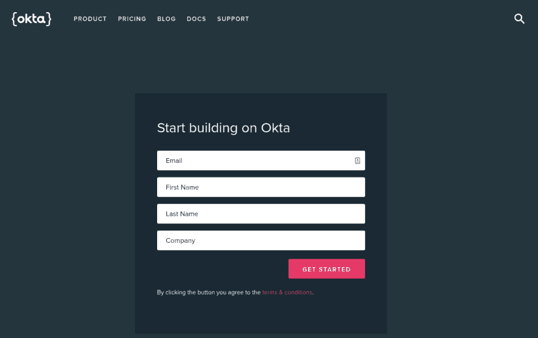T2】](https://res.cloudinary.com/practicaldev/image/fetch/s--HDaXSp4r--/c_limit%2Cf_auto%2Cfl_progressive%2Cq_auto%2Cw_880/https://developer.okta.com/assets/blog/build-understand-auth-node/okta-signup-ee14e7516bdc7df3e6e950a2c385706754c5300d842a1374785fd9e43cab2a6b.png)

### 第一步:存储您的组织网址

您需要做的第一件事是从 Okta 仪表板页面的右上方复制下 **Org URL** 。此 URL 将用于路由到您的授权服务器，与之通信，等等。稍后您将需要这个值，所以不要忘记它。

[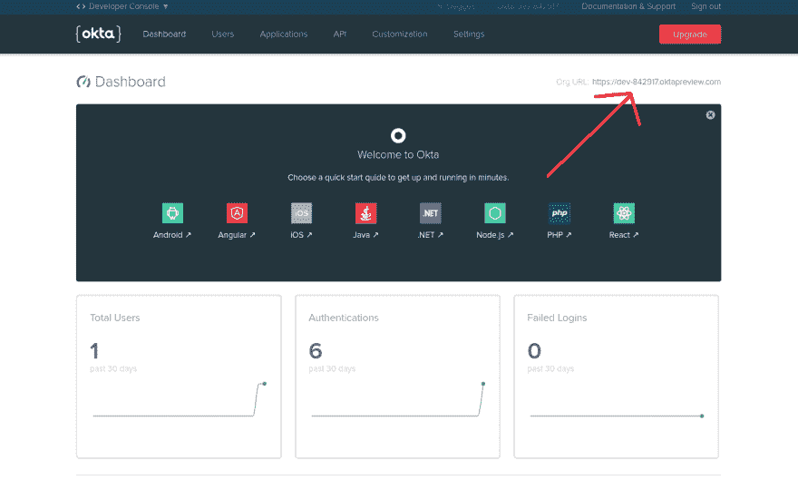T2】](https://res.cloudinary.com/practicaldev/image/fetch/s--FQ3yy0qc--/c_limit%2Cf_auto%2Cfl_progressive%2Cq_auto%2Cw_880/https://developer.okta.com/assets/blog/build-understand-auth-node/okta-org-url-b26a98af3fa71a8f88519b5154d16d10fae846ff3df95d09995fcd61fa2c6175.png)

### 步骤 2:创建一个 OpenID Connect 应用程序

Okta 允许您为您可能创建的多个应用程序存储和管理用户。这意味着在我们继续之前，您需要为这个项目创建一个新的 OpenID Connect 应用程序。

OpenID Connect 中的应用程序有一个用户名和密码(称为客户端 ID 和客户端密码)，允许您的授权服务器在任何给定时间识别哪个应用程序正在与它对话。

要创建新的应用程序，请浏览到**应用程序**选项卡，并点击**添加应用程序**。

[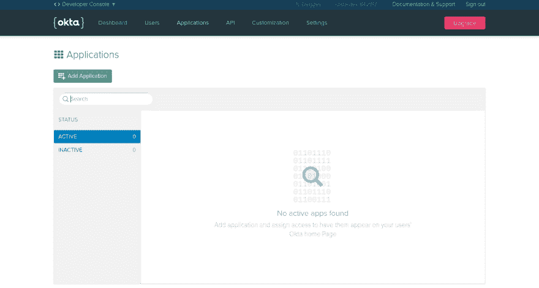T2】](https://res.cloudinary.com/practicaldev/image/fetch/s---0eQzZnw--/c_limit%2Cf_auto%2Cfl_progressive%2Cq_auto%2Cw_880/https://developer.okta.com/assets/blog/build-understand-auth-node/okta-app-dashboard-5d3d0ee99d0d6888f30bffc5fa3d58ddaafe907dfd2ec315589435b2fc7bb23b.png)

接下来，点击 **Web** 平台选项(因为这个项目是一个 web app)。

[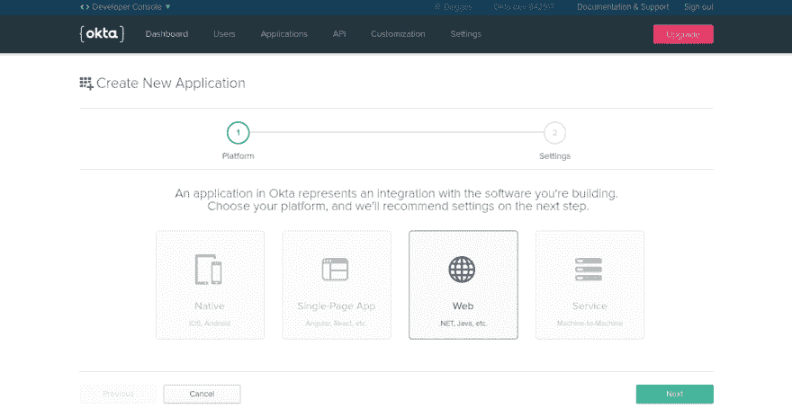T2】](https://res.cloudinary.com/practicaldev/image/fetch/s--axjWuIt4--/c_limit%2Cf_auto%2Cfl_progressive%2Cq_auto%2Cw_880/https://developer.okta.com/assets/blog/build-understand-auth-node/okta-create-app-platform-681dcd71ac7de879a92e80d243020f9c9be6edc17e6ae0b0adb40a70936eac24.png)

在“设置”页面上，输入以下值:

*   **名称**:登录门户
*   **基地 URIs** : `http://localhost:3000`
*   **登录重定向 URIs** : `http://localhost:3000/users/callback`

您可以保持所有其他值不变。

[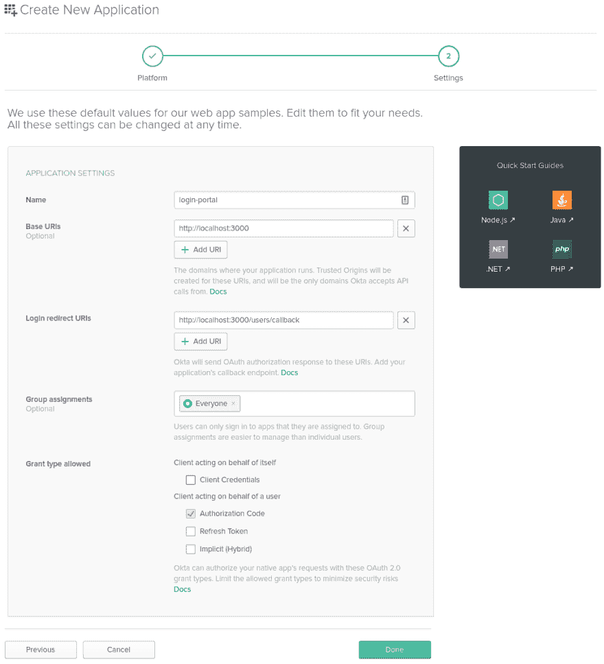T2】](https://res.cloudinary.com/practicaldev/image/fetch/s--LMSqH9bK--/c_limit%2Cf_auto%2Cfl_progressive%2Cq_auto%2Cw_880/https://developer.okta.com/assets/blog/build-understand-auth-node/okta-create-app-settings-e232b231bc66f56f47e4ed7e784cde968a64d982f3a065c82d0ba62d929b2ac0.png)

现在您的应用程序已经创建好了，请记下下页的**客户端 ID** 和**客户端秘密**值，稍后我们开始编写代码时会用到它们。

[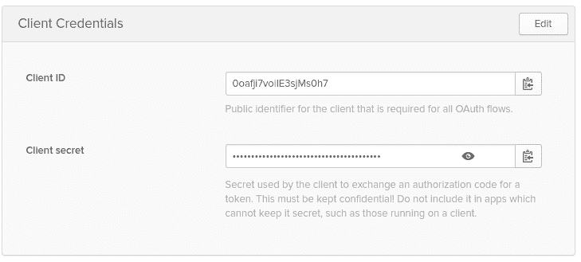T2】](https://res.cloudinary.com/practicaldev/image/fetch/s--ORQiawxl--/c_limit%2Cf_auto%2Cfl_progressive%2Cq_auto%2Cw_880/https://developer.okta.com/assets/blog/build-understand-auth-node/okta-app-credentials-2f5b916ff40dc7425e731c801f9b087342846ed828a7979ab79127059d67d6b3.png)

### 步骤 3:创建认证令牌

为了访问 Okta APIs 并能够更精细地管理您的用户帐户，您还需要创建一个 Okta 身份验证令牌。这是一个 API 密钥，稍后将用于与 Okta APIs 通信，并允许您执行以下操作:

*   创建、更新和删除用户
*   创建、更新和删除组
*   管理应用程序设置
*   等等。

要创建认证令牌，单击页面顶部的 **API** 选项卡，然后单击**创建令牌**按钮。给你的令牌起一个名字，最好和你的应用程序同名，然后点击**创建令牌**。创建令牌后，请将令牌值复制下来，因为您稍后会需要它。

[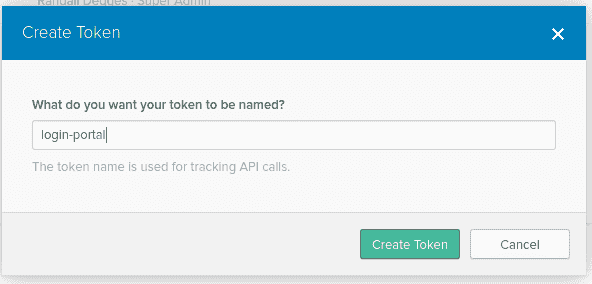T2】](https://res.cloudinary.com/practicaldev/image/fetch/s--F0P_U4Yg--/c_limit%2Cf_auto%2Cfl_progressive%2Cq_auto%2Cw_880/https://developer.okta.com/assets/blog/build-understand-auth-node/okta-create-token-008a4364f7541ac93b9baf5d3b381ba889bd7188fd6101b19901f0cdf9821a6c.png)

### 第四步:启用用户注册

您需要完成的最后一项设置是为授权服务器启用用户注册功能。通常，授权服务器只支持登录、注销之类的功能。但是 Okta 的授权服务器也支持自助注册，用户可以创建账号、登录账号、重置密码，基本上所有的事情都不用你为它写任何代码。

在您的 Okta 仪表板中，您会注意到页面左上角有一个标有 **< >开发者控制台**的小按钮。将鼠标悬停在该按钮上，选择出现的**经典用户界面**菜单选项。

[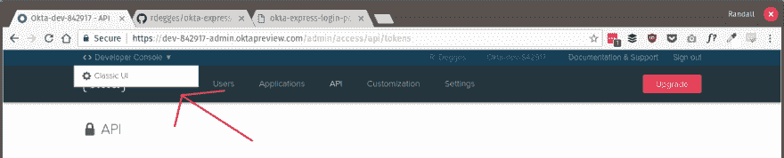T2】](https://res.cloudinary.com/practicaldev/image/fetch/s--IlWKyYti--/c_limit%2Cf_auto%2Cfl_progressive%2Cq_auto%2Cw_880/https://developer.okta.com/assets/blog/build-understand-auth-node/okta-switch-to-classic-ui-249d1b924c3db38af5d62bf17be65a32579117d9d23c8c28cb7e365eba7d8f85.png)

接下来，将鼠标悬停在页面顶部的**目录**选项卡上，然后选择**自助注册**菜单项。在此页面上点击**启用注册**按钮。

[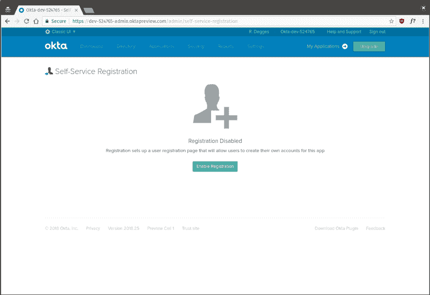T2】](https://res.cloudinary.com/practicaldev/image/fetch/s--Fq3x_MY2--/c_limit%2Cf_auto%2Cfl_progressive%2Cq_auto%2Cw_880/https://developer.okta.com/assets/blog/build-understand-auth-node/okta-enable-registration-2cfef05884c196fa53bc7c55728c77437713fffa5d549e1874e18c2593825b1f.png)

在配置页面上，将所有设置保留为默认值，除了**默认重定向**选项。对于该选项，点击**自定义 URL** 单选框，输入`http://localhost:3000/dashboard`作为值。

该设置实际上是告诉授权服务器，当用户在您的站点上成功创建新帐户后，将他们重定向到哪里。

一旦你点击了**保存**，你需要做的最后一件事就是切换回开发者控制台。

[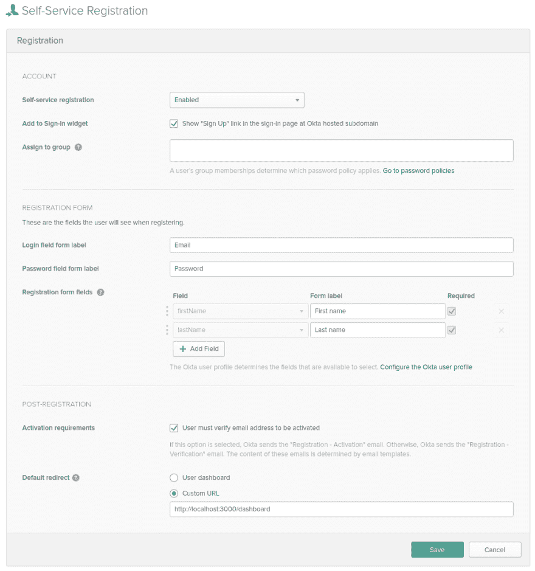T2】](https://res.cloudinary.com/practicaldev/image/fetch/s--yXcKiFYI--/c_limit%2Cf_auto%2Cfl_progressive%2Cq_auto%2Cw_880/https://developer.okta.com/assets/blog/build-understand-auth-node/okta-registration-settings-1c56ddf046d5ddf4c58559a76adf32dd03624a076c2ba13a5d92639b9fe1280e.png)

将鼠标悬停在页面右上角的**经典 UI** 按钮上，从下拉菜单中选择 **< >开发者控制台**菜单项。

## 配置会话管理

现在所有的设置工作都完成了，让我们写一些代码吧！

我们将添加到这个基本 Express.js 站点的第一件事是使用 [express-session](https://github.com/expressjs/session) 库支持会话。

会话管理是任何认证系统的核心。它允许用户保持登录到您的网站，而不必在查看每个页面之前重新输入他们的凭证。处理用户会话最安全的方式是通过服务器端的 cookie，这也是我们使用快速会话库的原因:它允许我们创建和管理服务器端的 cookie。

首先，在您最喜欢的编辑器中打开`./app.js`文件(我更喜欢 [neovim](https://neovim.io/) ，并在文件顶部导入会话库和其他导入语句。`app.js`文件是 Express.js 站点的核心。它初始化 Express.js web 服务器，包含站点设置等。

```
var createError = require('http-errors');
var express = require('express');
var path = require('path');
var cookieParser = require('cookie-parser');
var logger = require('morgan');
var session = require("express-session"); 
```

Enter fullscreen mode Exit fullscreen mode

接下来，您需要删除 express-generator 默认包含的`cookie-parser`库，因为我们不会使用它。在`./app.js`文件中删除下面两行代码。

```
var cookieParser = require('cookie-parser');

// and...

app.use(cookieParser()); 
```

Enter fullscreen mode Exit fullscreen mode

现在您需要做的就是将 express-session 库和其他中间件一起插入到`./app.js`文件中。

```
app.use(logger('dev'));
app.use(express.json());
app.use(express.urlencoded({ extended: false }));
app.use(cookieParser());
app.use(express.static(path.join(__dirname, 'public')));
app.use(session({
  secret: 'LONG_RANDOM_STRING_HERE',
  resave: true,
  saveUninitialized: false
})); 
```

Enter fullscreen mode Exit fullscreen mode

确保用您键入的实际随机字符串替换`LONG_RANDOM_STRING_HERE`。这个字符串将保护你的用户的 cookies 不被泄露。我个人喜欢用手在键盘上敲击几秒钟来产生一些随机的东西。

[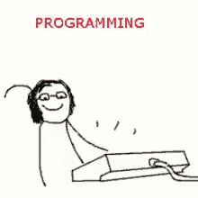T2】](https://res.cloudinary.com/practicaldev/image/fetch/s--HgGwJqVv--/c_limit%2Cf_auto%2Cfl_progressive%2Cq_66%2Cw_880/https://developer.okta.com/assets/blog/build-understand-auth-node/programming-103ce847f2a5747490d5037401aa3c12f5623f61862c34be0affa9a183498ff1.gif)

该会话库在后台处理大量工作:

*   它创建安全的、加密签名的 cookies，因此您可以将数据存储在用户的浏览器中。加密签名是一种技术，它允许您的服务器判断用户是否试图“修改”他们的 cookies，使其看起来像是他们不是的人。
*   它为您提供了一个创建和删除 cookies 的简单 API
*   它允许您根据需要调整和配置 cookie 设置

稍后您将会看到，oidc 中间件库在幕后使用这个库来实现神奇的用户认证。

## 创建 Express.js 视图

接下来我们要做的是创建我们的 Express.js 视图。Express.js 中的视图只不过是我们想要显示给用户的 HTML 模板(网页)。但是与普通的 HTML 不同，我们将使用 [Pug](https://pugjs.org/api/getting-started.html) 模板语言来创建我们的视图。

Pug 是 Node.js 生态系统中最流行的模板语言之一，因为它允许您更简洁地编写 HTML、使用变量等等。

### 创建布局视图

第一个(也是最重要的！)我们要创建的视图是`./views/layout.pug`视图。这是我们所有其他视图都将扩展的“基础”视图。

在这个视图中，我们将定义所有页面的基本布局，导航条等等。打开`./views/layout.pug`，用以下内容替换文件中的内容。

```
block variables

doctype html
html(lang="en")
  head
    meta(charset="utf-8")
    meta(name="viewport" content="width=device-width, initial-scale=1, shrink-to-fit=no")
    link(rel="stylesheet" href="https://maxcdn.bootstrapcdn.com/bootstrap/4.0.0/css/bootstrap.min.css" integrity="sha384-Gn5384xqQ1aoWXA+058RXPxPg6fy4IWvTNh0E263XmFcJlSAwiGgFAW/dAiS6JXm" crossorigin="anonymous")
    link(rel="stylesheet", href="/stylesheets/style.css")
    title okta-express-login-portal: #{title}
  body
    div.top-bar.d-flex.flex-column.flex-md-row.align-items-center.p-3.px-md-4.mb-3.bg-white.border-bottom.box-shadow
      h5.my-0.mr-md-auto.font-weight-normal
        a(href="/", title="Expresso") okta-express-login-portal
      nav.my-2.my-md-0.mr-md-3
        a.p-2.text-dark(href="/", title="Home") Home

        if user == undefined
          a.p-2.text-dark(href="/users/login") Log In / Register
        else
          a.p-2.text-dark(href="/dashboard") Dashboard
          a.p-2.text-dark(href="/users/logout") Logout
    .container
      block content

    footer.
      Built with #[a(href="https://expressjs.com/") Express.js], login powered by #[a(href="https://developer.okta.com/") Okta]. 
```

Enter fullscreen mode Exit fullscreen mode

如果您熟悉 HTML，您可能会发现，pug 与 HTML 非常相似，但它使用空格而不是结束标记(像 Python 编程语言一样)。

这个布局视图除了呈现一个简单的页面，顶部有一个导航栏，底部有一个页脚，还有两个特殊的构造，`block variables`和`block content`。

文件顶部的`block variables`行意味着从这个模板继承的任何模板都能够将一些变量注入页面。您可能已经注意到了`title`标签包含一个变量:`#{title}`——这是一个子模板稍后可以覆盖的变量。

你注意到页脚正上方的那一行了吗？这个块允许一个子模板在适当的位置将 HTML 注入到我们的布局模板中——这样我们的子模板就不需要重新定义导航条、页眉等等。

通过使用这两个块:`variables`和`content`，我们的子模板可以构建完整的 web 页面，只包含一个标题和一些正文内容。相当漂亮。

### 创建主页视图

我们将创建的下一个视图是`./views/index.pug`视图。打开该文件并插入以下代码。

```
extends layout

block variables
  - var title = "Home"

block content
  h2.text-center Express App

  .row
    .offset-sm-2.col-sm-8
      .jumbotron.text-center.
        Welcome to your new Express app! Please visit the
        #[a(href="https://github.com/rdegges/okta-express-login-portal", title="okkta-express-login-portal on GitHub") GitHub page] to learn more. 
```

Enter fullscreen mode Exit fullscreen mode

注意顶部的`extends layout`行。这告诉 pug 这个模板是我们之前创建的`layout`模板的子模板。

在`block variables`部分，我们定义我们的`title`变量，它将在布局模板中用来输出页面标题，在`block content`部分，我们为页面的其余部分插入 HTML。

正如您现在所看到的，Pug 中的模板继承非常简单。

### 创建仪表板视图

下一个要创建的视图是仪表板视图。这是用户登录网站后将看到的页面。打开`./views/dashboard.pug`文件并插入以下代码。

```
extends layout

block variables
  - var title = "Dashboard"

block content
  h2.text-center Dashboard

  .row
    .offset-sm-2.col-sm-8
      .jumbotron.text-center.
        Welcome to your dashboard page, #{user.profile.firstName}. 
```

Enter fullscreen mode Exit fullscreen mode

您会注意到在这个模板中使用了一个新变量:`#{user}`。这将*最终*指向当前登录的用户，稍后您将会看到。

### 创建错误视图

您需要创建的最后两个视图用于处理错误。

打开`./views/error.pug`视图并插入以下代码。

```
extends layout

block content
  h1= message
  h2= error.status
  pre #{error.stack} 
```

Enter fullscreen mode Exit fullscreen mode

当用户点击一个不存在的 URL 时(404)，或者当 web 服务器出现问题时(5XX)，将呈现该视图。

您还需要创建一个名为`./views/unauthenticated.pug`的文件，并插入以下代码。如果用户访问需要他们登录的页面，该视图将显示给用户。

```
extends layout

block variables
  - var title = "Unauthenticated"

block content
  h2.text-center You Must Log In to View This Page
  p.text-center.
    You must be signed in to view this page. Please #[a(href="/users/login", title="Login") login or register] to view this page. 
```

Enter fullscreen mode Exit fullscreen mode

## 创建公共路线

Express.js 中的 Routes 是您定义应用程序逻辑的地方。它们规定了当用户点击特定 URL 时运行什么代码，以及发回什么响应。

首先，让我们删除 express-generator 为您创建的默认路线。运行以下命令删除它们。

```
rm routes/* 
```

Enter fullscreen mode Exit fullscreen mode

接下来，创建一个名为`./routes/public.js`的文件，并插入以下代码。

```
const express = require("express");

const router = express.Router();

// Home page
router.get("/", (req, res) => {
  res.render("index");
});

module.exports = router; 
```

Enter fullscreen mode Exit fullscreen mode

在这个模块中，我们将创建一个新的 [Express.js 路由器](https://expressjs.com/en/4x/api.html#router)，并告诉它如果用户向`/` URL 发出 GET 请求，那么我们将运行一个函数来呈现我们之前创建的`index.pug`视图文件，并将其返回给用户。

现在这还不会生效(原因您将在后面了解)，但是一旦这个路由器被“启用”，每次用户请求站点的主页时，例如:`http://localhost:3000`，这个代码将运行，并且将显示`index.pug`视图。

很漂亮，对吧？

接下来，创建一个名为`./routes/dashboard.js`的文件，并插入以下代码。

```
const express = require("express");

const router = express.Router();

// Display the dashboard page
router.get("/", (req, res) => {
  res.render("dashboard");
});

module.exports = router; 
```

Enter fullscreen mode Exit fullscreen mode

这个路由器的行为类似于上面的主页路由器，除了它呈现我们的仪表板页面。虽然现在还没有意义，但是如果用户最终访问了`/dashboard` URL，这个函数将会运行，呈现之前定义的`dashboard.pug`。

如果你要进入这个文件并定义另一条路线，例如:

```
router.get("/test", (req, res) => {
  res.render("test");
}); 
```

Enter fullscreen mode Exit fullscreen mode

…您会发现用户需要访问`/dashboard/test`来触发该功能的运行。再说一遍:不要担心这个还没有加起来，我们将在下面讨论这个。

## 启用路线

现在您已经为公共页面创建了一些路径，让我们用 Express.js 来*启用*它们，这样我们就可以实际看到它们了！

为此，打开`./app.js`文件并删除以下两行。

```
var indexRouter = require('./routes/index');
var usersRouter = require('./routes/users'); 
```

Enter fullscreen mode Exit fullscreen mode

用下面的两行代码替换这两行。

```
const dashboardRouter = require("./routes/dashboard");        
const publicRouter = require("./routes/public"); 
```

Enter fullscreen mode Exit fullscreen mode

现在，我们正在导入上面定义的正确的路径文件。

接下来，向下滚动，直到看到下面两行代码，然后删除它们。

```
app.use('/', indexRouter);
app.use('/users', usersRouter); 
```

Enter fullscreen mode Exit fullscreen mode

这些代码行加载了我们刚刚删除的旧路线。现在您需要更改这些代码行，如下所示。

```
app.use('/', publicRouter);
app.use('/dashboard', dashboardRouter); 
```

Enter fullscreen mode Exit fullscreen mode

现在开始有意义了吗？这些`app.use`行代码告诉 Express.js，如果用户访问`/` URL，它应该查看`./routes/public.js`文件，并开始匹配要运行的 URL。因此，如果用户访问主页，例如:`/`，Express.js 将在`./routes/public.js`文件中查找，找到服务于`/` URL 的路径，然后运行相关的功能。

下面的`dashboardRouter`也是如此。如果用户访问了`/dashboard`，那么 Express.js 将在`./routes/dashboard.js`文件中查找调用`/` URL 时运行的函数，因为`/dashboard` + `/`是用户正在访问的路径！

Express.js 中的 Routes 使得用许多嵌套的 URL 组成复杂的站点变得容易，而不需要做很多工作。

现在您已经启用了您的路线，去测试它们。通过运行下面的命令启动您的 web 服务器。

```
npm start 
```

Enter fullscreen mode Exit fullscreen mode

然后在浏览器中访问`http://localhost:3000`。您应该会看到下面呈现的页面。

[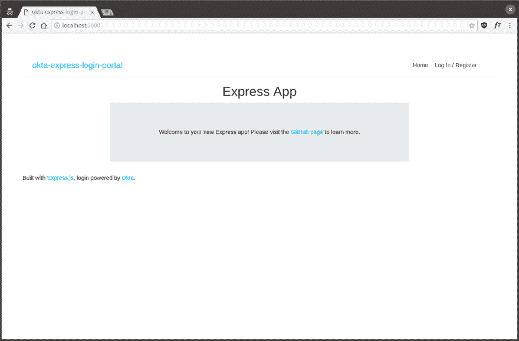T2】](https://res.cloudinary.com/practicaldev/image/fetch/s--HMiS_kPR--/c_limit%2Cf_auto%2Cfl_progressive%2Cq_auto%2Cw_880/https://developer.okta.com/assets/blog/build-understand-auth-node/app-unstyled-6a691ad9bdb0c2ea4bacaf4cf9c11398cd1a4e79e985a0b94f32bb06de4ef8b0.png)

**注意**:这个页面看起来还不太好，因为我们还没有创建任何 CSS。我们最后再做。

如果您现在访问您创建的仪表板页面`http://localhost:3000/dashboard`，您会注意到出现了一个错误。这是因为 Pug 视图引用了我们还没有定义的`#{user}`变量。我们很快就会谈到这一点。

## 配置用户认证

既然我们的 Express.js 站点已经开始发挥作用，让我们更深入地研究用户认证。

您需要做的第一件事是打开`./app.js`并在文件顶部导入以下两个库。

```
var createError = require('http-errors');
var express = require('express');
var path = require('path');
var cookieParser = require('cookie-parser');
var logger = require('morgan');
var session = require('express-session');
var okta = require("@okta/okta-sdk-nodejs");
var ExpressOIDC = require("@okta/oidc-middleware").ExpressOIDC; 
```

Enter fullscreen mode Exit fullscreen mode

我们刚刚添加的两个库在列表的底部:`@okta/okta-sdk-nodejs`和`@okta/oidc-middleware`。这两个库处理所有的 OpenID 连接通信和路由。

接下来我们需要做的是创建一个`oktaClient`对象和一个`ExpressOIDC`对象。一旦我们对它们进行了配置并为它们提供了正确的凭证，我们马上就会用到它们。

为此，再次打开您的`./app.js`文件，找到显示`var app = express();`的那一行，并在它下面插入下面的代码。

```
var oktaClient = new okta.Client({
  orgUrl: 'https://{yourOktaDomain}',
  token: '{yourOktaToken}'
});

const oidc = new ExpressOIDC({
  issuer: "https://{yourOktaDomain}/oauth2/default",
  client_id: {yourClientId},
  client_secret: {yourClientSecret},
  redirect_uri: 'http://localhost:3000/users/callback',
  scope: "openid profile",
  routes: {
    login: {
      path: "/users/login"
    },
    callback: {
      path: "/users/callback",
      defaultRedirect: "/dashboard"
    }
  }
}); 
```

Enter fullscreen mode Exit fullscreen mode

现在，还记得我在这篇文章开始时告诉你写下的那些价值观吗？现在你需要它们了！确保你用下面的变量代替正确的值:`{yourOktaDomain}`、`{yourOktaToken}`、`{yourClientId}`和`{yourClientSecret}`。

创建的`oidc`对象处理 100%的 OpenID 连接协议支持。它处理用户到授权服务器的路由，以处理用户注册、登录、密码重置等。它使用安全 cookies(由 express-session 提供支持)处理用户登录到您的应用程序，它还处理其他所有事情。

`oktaClient`对象仅仅用于从 Okta API 服务中检索用户数据。

既然我们的 OpenID Connect 支持已经可以使用了，让我们来启用它。为此，打开`./app.js`并找到之前的会话中间件，然后在它下面添加下面一行。

```
app.use(session({
  secret: 'asdf;lkjh3lkjh235l23h5l235kjh',
  resave: true,
  saveUninitialized: false
}));
app.use(oidc.router); 
```

Enter fullscreen mode Exit fullscreen mode

只需调用`app.use(oidc.router);`就可以告诉 Express.js 启用 oidc-middleware 库附带的路由来处理所有的 OpenID 连接支持。你可能已经注意到，当我们创建`oidc`对象时，我们在配置中指定了一些`routes`。这些设置规定了我们想要使用什么 URL 来处理用户登录，以及我们想要在用户登录后将他们重定向到什么 URL。

启用该路由器的一个好处是，从这一点开始，在我们的路由代码的 *any* 中，我们将可以访问一个特殊的变量`req.userinfo`，它包含一些当前登录用户的基本配置文件信息(从 Okta 获取)。

虽然`req.userinfo`很好，但是如果我们能够得到*我们想要的关于当前登录用户的任何*数据，那就更好了。

因此，让我们继续定义另一个中间件来帮助我们。在`app.use(oidc.router);`代码的正下方，插入以下内容:

```
app.use((req, res, next) => {
  if (!req.userinfo) {
    return next();
  }

  oktaClient.getUser(req.userinfo.sub)
    .then(user => {
      req.user = user;
      res.locals.user = user;
      next();
    }).catch(err => {
      next(err);
    });
}); 
```

Enter fullscreen mode Exit fullscreen mode

该中间件将根据每个用户请求运行，并执行以下操作:

*   它通过查看`req.userinfo`对象来检查是否有当前登录的用户。如果没有用户登录，它将什么也不做(`return next();`)。
*   如果有用户登录，这个中间件将使用 Okta 节点 SDK 库从 Okta API 中检索用户对象。
*   最后，它将创建两个新值:`req.user`和`res.locals.user`，它们直接指向用户对象。

这意味着在我们稍后定义的任何路线中，我们都可以直接访问`req.user`对象来查看用户的信息，编辑它，甚至删除它。

例如，您可以创建以下路由，以便在用户每次访问`/test` URL:
时显示用户的配置文件信息

```
app.get('/test', (req, res) => {
  res.json({ profile: req.user ? req.user.profile : null });
}); 
```

Enter fullscreen mode Exit fullscreen mode

让我们继续创建一个额外的中间件`loginRequired`，它将只允许已经登录的用户访问一条路线。如果您想要构建只有登录用户才能访问的页面(仪表板等)，这将非常方便。).

在上面的代码下面，继续定义下面的函数。

```
function loginRequired(req, res, next) {
  if (!req.user) {
    return res.status(401).render("unauthenticated");
  }

  next();
} 
```

Enter fullscreen mode Exit fullscreen mode

因为我们希望确保只有登录的用户才能查看我们的仪表板页面，所以让我们也返回并修改仪表板的路由代码。

在您的`./app.js`中找到启用仪表板路线的代码行。

```
app.use('/dashboard', dashboardRouter); 
```

Enter fullscreen mode Exit fullscreen mode

现在把它修改成这样。

```
app.use('/dashboard', loginRequired, dashboardRouter); 
```

Enter fullscreen mode Exit fullscreen mode

通过在 URL 模式之后立即注入`loginRequired`函数，Express.js 将在处理`dashboardRouter`之前首先运行我们的`loginRequired`中间件。这样，如果用户访问任何以 URL `/dashboard`开头的*页面，他们将被要求登录才能访问！*

我们完成身份验证组件需要做的最后一件事是定义注销路由。oidc-middleware 库提供注销功能，但不会自动为它生成路由。

为此，创建一个名为`./routes/users.js`的新文件，并将以下代码放入其中。

```
const express = require("express");

const router = express.Router();

// Log a user out
router.get("/logout", (req, res) => {
  req.logout();
  res.redirect("/");
});

module.exports = router; 
```

Enter fullscreen mode Exit fullscreen mode

正如您可能知道的，如果用户向`/users/logout` URL 发送 POST 请求，该路由会将用户从其帐户中注销。我们现在唯一需要做的就是在我们的`./app.js`中启用这条路由。

打开`./app.js`，将这个新的路径文件与文件顶部的其他路径文件一起导入。

```
const dashboardRouter = require("./routes/dashboard");
const publicRouter = require("./routes/public");
const usersRouter = require("./routes/users"); 
```

Enter fullscreen mode Exit fullscreen mode

接下来，向下滚动，直到看到您的其它路由器被启用，并启用该路由器。

```
app.use('/', publicRouter);
app.use('/dashboard', loginRequired, dashboardRouter);
app.use('/users', usersRouter); 
```

Enter fullscreen mode Exit fullscreen mode

祝贺您，您现在已经为您的网站完全配置了用户管理和验证！你甚至不必写任何代码，管理任何密码，在数据库中存储任何东西，等等！

## 认证如何工作

既然你已经看到了如何成功地为你的 Node.js 网站设置认证，让我们再多谈谈*它是如何工作的，并探索完整的认证流程。*

为了解释每个组件，让我们假设您正在访问这个网站，并且当前没有登录到您的帐户。

当您第一次点击页面顶部的`Log In / Register`按钮时，oidc-middleware 库会将您重定向到 Okta 托管的域(授权服务器)。您将被重定向到以下类型的 URL:

```
https://dev-842917.oktapreview.com/login/login.htm?fromURI=/oauth2/v1/authorize/redirect?okta_key=qBpZVCpQIJlxUALtybnI9oajmFSOmWJNKL9pDpGtZRU 
```

Enter fullscreen mode Exit fullscreen mode

**注**:你可以使用 Okta 完全自定义这个域名，外观，感觉。

一旦您登录到授权服务器页面，您可以输入您的帐户凭证并立即登录，或者创建一个新帐户。该功能完全由授权服务器处理。

如果您输入您的凭证并点击授权服务器上的**登录**按钮，那么后台发生的情况是:

*   您的密码经过哈希处理，您的凭证会对照 Okta 用户数据库进行检查，以确定它们是否正确
*   如果您的凭证是正确的，那么在 Okta 托管的域上将为您创建一个新的会话 cookie(例如:本例中的`dev-842917.oktapreview.com`，并且您将被重定向到您之前在定义`ExpressOIDC`对象时提供的`redirect_uri`设置。在这种情况下，您会被重定向到`http://localhost:3000/users/callback`。当你被重定向到这个 URL 时，授权服务器也会传递一个特殊的`code`令牌。这是 [OpenID 连接授权代码流](https://developer.okta.com/authentication-guide/implementing-authentication/auth-code)的一部分。
*   您的 Express.js 应用程序将接收对`/users/callback`的请求，并使用 oidc-middleware 库的内置路由自动为请求提供服务。服务于该 URL 的路由将拦截该请求，并将`code`令牌交换为`access`和`id`令牌。这个交换代码令牌的过程是 OpenID Connect 授权代码流的一部分，在这里有更详细的描述:[/authentic ation-guide/implementing-authentic ation/auth-code # 3-exchange-the-code-for-token](https://developer.okta.com/authentication-guide/implementing-authentication/auth-code#3-exchanging-the-code-for-tokens)。
*   一旦检索到这些令牌，oidc-中间件库就会获取嵌入在 id 令牌中的用户基本信息，并将其存储在会话 cookie 中。
*   然后，oidc-middleware 库将您作为完全登录的用户重定向到仪表板页面。
*   从这一点开始，每次您的浏览器向 Express.js 网站发出请求时，包含您的个人资料信息的 cookie 将被发送回 Express.js，以便 oidc-middleware 库可以识别您是谁，并用您的帐户数据填充一个`req.userinfo`对象。

一旦您的会话 cookies 过期(或通过注销程序被清除)，该过程将重新开始。

## 创建样式

我不是专业设计师，但即使是我也能让这个网站看起来好一点。

创建一个名为`./public/stylesheets/style.css`的文件，并将下面的 CSS 放入其中。

```
.top-bar a {
 text-decoration: none;
  color: inherit;
}

footer {
  border-top: 1px solid rgba(0,0,0,.1);
  margin-top: 4em !important;
  padding-top: 1em;
  text-align: center;
  margin-top: 1em;
}

h2 {
  margin-bottom: 2em;
}

.container {
  padding-top: 2em;
} 
```

Enter fullscreen mode Exit fullscreen mode

这将使页面样式看起来更好一点。

## 测试您的新登录门户

既然你的 Express.js 网站建好了，为什么不拿去试驾一下呢？通过运行`npm start`命令启动您的 web 服务器，访问`http://localhost:3000`，并进行测试！

[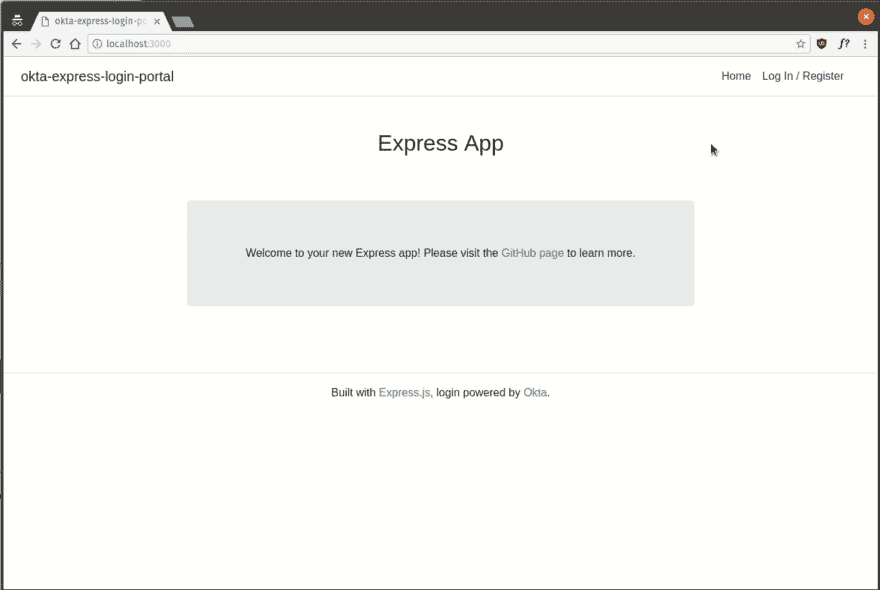T2】](https://res.cloudinary.com/practicaldev/image/fetch/s--MFK8Oqqy--/c_limit%2Cf_auto%2Cfl_progressive%2Cq_66%2Cw_880/https://developer.okta.com/assets/blog/build-understand-auth-node/using-the-site-local-37f57f615a88df903b03ecf76b3987f4eda2e346025ac5ef371398705e61d62c.gif)

您会注意到一些事情:

*   如果您点击页面顶部的`Log In / Register`按钮，您可以创建一个新的用户帐户或登录到一个现有的帐户。这个功能都是 Okta 的授权服务器自动提供的。
*   登录后，您将被重定向到`/dashboard`页面，该页面会以您的名字向您问好。还记得前面的`./views/dashboard.pug`文件中的`#{user.profile.firstName}`变量吗？该变量现在是您的实际用户帐户，因为您现在已经插入了所有适当的中间件。
*   如果您注销，然后立即再次点击`Log In / Register`按钮，您将立即登录，无需重新输入您的用户名和密码。这是 OpenID Connect 的一个特性——授权服务器会在一段时间内记住您的身份。这是同样的方式，谷歌登录和脸书登录工作！

如果您已经登录了您的 Okta 帐户，并立即登录到仪表板，不要担心。只需在浏览器中打开一个新的匿名窗口，在那里浏览流程。

## 了解关于 Node.js 和认证的更多信息

我希望你喜欢看 OpenID Connect 和 Node.js 的身份验证工作。建立带有用户管理的网站可能是一件痛苦的事情，但是像 OpenID Connect 这样的新协议以及像 [Okta](https://developer.okta.com) 这样的提供商使这个过程变得更加简单。

如果您想了解更多关于在 Node 中构建 web 应用程序的信息，您可能想看看这些其他很棒的帖子:

*   [使用 Passport.js 和 OpenID Connect 建立安全节点认证](https://developer.okta.com/blog/2018/05/18/node-authentication-with-passport-and-oidc)
*   [用 Node、React 和 Okta 建立用户注册](https://developer.okta.com/blog/2018/02/06/build-user-registration-with-node-react-and-okta)
*   [简单节点认证](https://developer.okta.com/blog/2018/04/24/simple-node-authentication)
*   [用 Vue.js 和节点](https://developer.okta.com/blog/2018/02/15/build-crud-app-vuejs-node)构建一个基本的 CRUD App

最后，请[在 Twitter](https://twitter.com/OktaDev) 上关注我们，寻找更多类似的优秀资源，请求我们撰写其他主题，并关注我们新的开源库和项目！

**PS** :如果你喜欢这个项目，想在一个地方看到源代码，请去查看并启动 [GitHub 库](https://github.com/rdegges/okta-express-login-portal)。

还有…如果你有任何问题，请在下面留下评论！