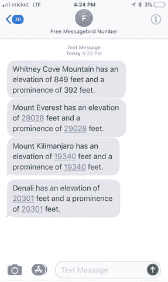
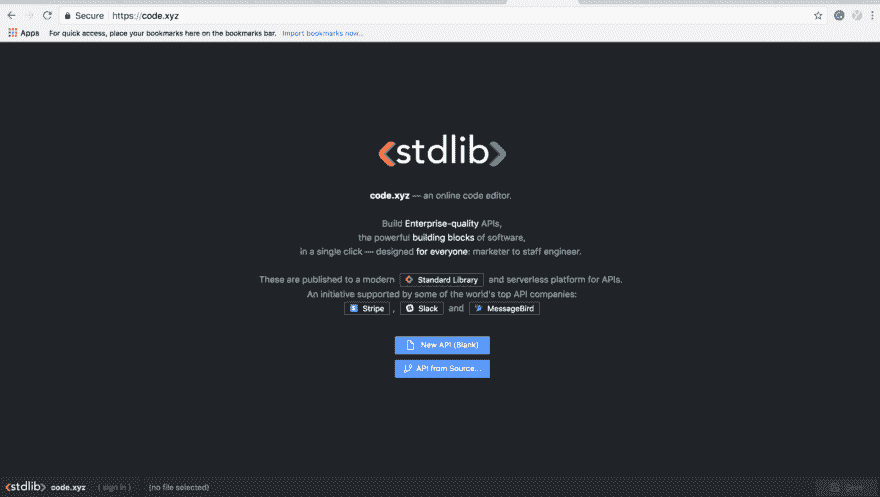
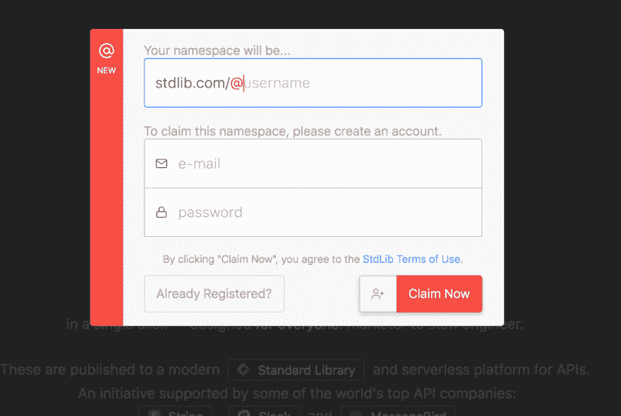
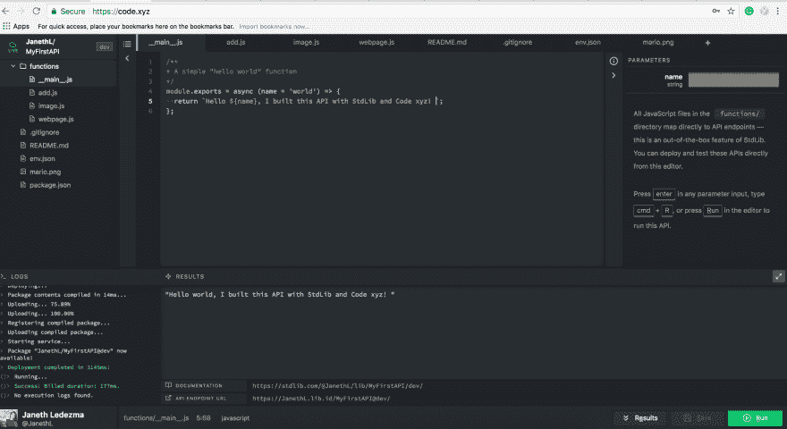

# 通过 6 个简单的步骤，使用 Code.xyz 和 Node.js 构建、部署和发布 API

> 原文：<https://dev.to/janeth/build-deploy-and-publish-an-api-using-codexyz-and-nodejs-in-6-easy-steps-3mp0>

* * *

API，软件的构建模块，运行着我们的世界。它们是软件系统相互通信的方式，也是我们人类与软件通信的方式。知道如何构建 API 不仅是软件开发人员的一项关键技能，也是一般编码素养的基础部分——这项技能可以在职业生涯中帮助任何人。

在本教程中，你将学习如何使用在线 API 编辑器 [code.xyz](//code.xyz) 直接从你的网络浏览器构建一个 API——不需要其他工具。无论您是软件开发的新手，还是寻找更快的方法来发布代码的老手，我都将展示如何用 [code.xyz](//code.xyz) 快速构建一个可用的 API。我们将使用 [code.xyz](//code.xyz) 构建一个全功能的 SMS 服务，该服务集成了用于识别山脉信息的 [AscenDB 的 Peaks API](https://stdlib.com/@ascendb/lib/peaks/) 和用于发送 SMS 消息的 [MessageBird 的 API](https://stdlib.com/@messagebird/lib/sms/) 。

[T2】](https://res.cloudinary.com/practicaldev/image/fetch/s--9wcrJIXL--/c_limit%2Cf_auto%2Cfl_progressive%2Cq_auto%2Cw_880/https://cdn-images-1.medium.com/max/1200/1%2APjVW4qAsbtCmvqOlIRRBTA.jpeg)

该服务接收任何山的名称，并以该山的海拔和突出程度作为响应。AscenDB 的 Peaks API 提供了全球超过 700 万座山峰的数据——你可以在 StdLib 上查看他们的[文档](https://stdlib.com/@ascendb/lib/peaks/)。你不必是一个狂热的登山者发现这个教程很有用，你可以用你选择的任何 API 重复这些步骤来创建你自己的短信服务！

[T2】](https://res.cloudinary.com/practicaldev/image/fetch/s--FnSa6Kun--/c_limit%2Cf_auto%2Cfl_progressive%2Cq_auto%2Cw_880/https://cdn-images-1.medium.com/max/1600/1%2Aql_HL0-jHwQINyab-NaJVw.png)

## **事先需要什么**

1x 美国手机号码
1x 创意和大胆的灵魂

## **第一步:Code.xyz** 入门

第一步是前往 https://code.xyz/。 [code.xyz](//code.xyz) 是由[标准库](https://stdlib.com/)的团队构建的在线 API 编辑器——一个用于轻松构建 API、webhooks 和工作流自动化任务的嵌入式开发环境。

在 [code.xyz 的左下角](//code.xyz)点击(**签到**)。如果你有一个 StdLib 账户，点击**已经注册**，使用你的 StdLib 凭证登录。将弹出一个模块，提示您声明一个名称空间(这是您的用户名)。输入您的电子邮件并选择密码。

[T2】](https://res.cloudinary.com/practicaldev/image/fetch/s--3_HRJ3nA--/c_limit%2Cf_auto%2Cfl_progressive%2Cq_auto%2Cw_880/https://cdn-images-1.medium.com/max/1200/1%2A4MWNjLNGCUW-vDVbQ2yZmA.png)

[T2】](https://res.cloudinary.com/practicaldev/image/fetch/s--SQc7Yfi---/c_limit%2Cf_auto%2Cfl_progressive%2Cq_auto%2Cw_880/https://cdn-images-1.medium.com/max/1200/1%2AextzFiXN8e0UbLsm7Y2Ppg.png)

创建帐户后，将出现一个不同的模块，列出订购计划。你只需要一个免费帐户就可以开始了，但你可以在这里阅读更多关于 StdLib 的定价包。
一旦你点击**订阅+赚取积分**，你应该会看到一个确认信息弹出。

点击**继续**返回 [code.xyz](//code.xyz) 登陆页面。

## **第二步:与你的第一个 API 进行代码上的交互。XYZ**

点击**新建 API(空白)**
为你的 API 输入一个名称。出于本教程的目的，我建议你将其命名为 **MyFirstAPI** 并点击**ok**(或按回车键)。

[T2】](https://res.cloudinary.com/practicaldev/image/fetch/s--FtLxHhW7--/c_limit%2Cf_auto%2Cfl_progressive%2Cq_auto%2Cw_880/https://cdn-images-1.medium.com/max/2000/1%2Asw59Smw0DPQ0uRez_hK7rw.png)

一旦您点击 enter，您将在左侧栏(一个文件夹树视图)看到一个自动生成的服务项目框架。此时，您可能已经注意到在( **main** )内部有一个“hello world”Javascript 函数。js)。

 
要测试您的函数，只需点击右下角的运行:
点击“运行”，在短短几秒钟内将您的函数变成一个无限可扩展的 API 端点！在“Results”区域，您会注意到一个文档门户——将 URL 复制并粘贴到浏览器的一个新标签中，以便在 StdLib 上查看您的 API 信息。您还会看到一个 API 端点 URL，将其复制并粘贴到浏览器的新标签中，以查看您的“hello world”直播。

## **第三步:替换默认的“Hello World”函数&设置你的 STDLIB_LIBRARY_TOKEN**

现在，让我们创建我们的 SMS 服务，它将把任何山峰的高度和突出程度发送回文本。首先，我们将替换 **main** .js. **中默认的“hello world”函数，并将我提供给你的以下代码复制粘贴到 **main** 中。js 文件:**