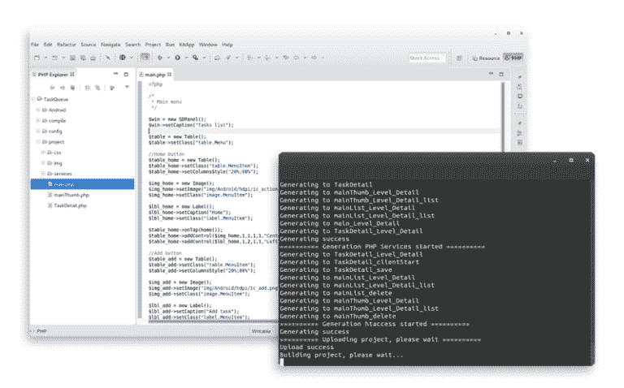

# 用 PHP 开发移动应用，享受生活中的乐趣

> 原文：<https://dev.to/thisisrgaurav/build-mobile-apps-with-php-and-have-some-kik-in-life-36gd>

欢迎所有读者，现在每个人都使用智能手机。智能手机不仅包含硬件，这使得它非常出色，而且还包含大多数用户花时间使用的移动应用程序。早先这些应用程序是由 android 或 Swift 开发的。任何使用这两种框架构建的应用程序都被称为**原生应用程序**,旨在运行在特定的平台上，无论是 android 还是 iPhone。因此，如果任何用户打算在多个平台上推出任何应用程序，他必须为不同的平台创建不同语言的应用程序。但是，这个问题被**混合应用**根除了，它同时针对平台和消费者的数量，而没有增加学习多种语言的开发者社区的开销。这些应用大多是用 javascript 的 **React JS** 构建的。这减少了很多麻烦，但是你必须学习 Javascript，这会消耗你宝贵的时间。

一个通常花大量时间用 PHP 做事情并付诸实践的 Web 后端开发人员必须遵循陡峭的学习路径，这需要更多的头脑风暴，并且通常需要不眠之夜来完成。但是有一个好消息，你也可以用 PHP 构建应用程序。你可能会感到震惊。是的，现在再也没有不眠之夜了，让我来介绍你的救命恩人。

## 什么是 KIKApp？

KikApp 是一个框架，允许从一个 PHP 代码库在包括 Android 和 iOS 在内的平台上创建移动应用程序。Kikapp 是一个基于 PHP 开发原生移动应用的框架。这个工具解释语言，翻译代码，并将其输出到市场上最流行的平台。

## 谁能用？

任何对用 web 开发最常用的语言制作应用程序感兴趣的开发人员。

## 为什么用 PHP？

PHP 是当今企业 web 开发最流行的语言之一，它是云应用程序后端最常见的选择。现在，使用 PHP 的决策者中有 80%的人确认，与其他语言相比，PHP 让他们的团队开发速度更快，PHP 为云应用的开发提供了最简单的选择。

```
80% of the websites are built using PHP.

82% of apps are built by independent app developers.

60% of online traffic now originates from mobile devices. 
```

Enter fullscreen mode Exit fullscreen mode

## 
  
为什么要 KIK App？

**1。简单的**:不需要学习新的语言，比如 Java 或 Objective C 来创建本地应用。

**2。强大的**:基于 PHP 这样简单而强大的语言。

**3。支持**:您将使用一个框架，该框架提供一个包含大量文档、示例和教程的 wiki。

**4。完全原生**:用相同的 PHP 代码构建原生 iOS 和 Android 应用。

## KikApp 特性

KIK framework 提供了创建原生移动应用程序所需的一切——全部来自一个 PHP 代码库。

**完全原生**

跨平台移动应用程序开发，没有混合妥协。
用 PHP 编写，到处运行 native

基于你已经知道的简单而强大的语言。
**应用更好、更快**

创建应用程序不需要学习新的语言，比如 Java 或 Objective C。

## 原生应用的价值

原生应用性能更好，因为它考虑了设备的使用情况。它不仅仅是一个适应手机的网站。在原生应用中，用户的体验是完全不同的。它关系到应用程序如何与设备交互。从本机应用程序，用户有一种不同的方式来访问设备的资源。如果有什么决定了电子商务的成功，工作门户或者你可以做你自己的商业产品取决于你的想法。这是用户的体验及其需求的演变。

## KikApp 开发工具

### 跨平台开发环境

您可以在命令行工具和基于 Eclipse 的插件之间进行选择，发布应用程序从未如此简单。

[T2】](https://res.cloudinary.com/practicaldev/image/fetch/s--vxmWLXys--/c_limit%2Cf_auto%2Cfl_progressive%2Cq_auto%2Cw_880/https://tekraze.com/wp-content/uploads/2018/08/kikapp_development_environm-768x478.png)

#### 基于 Eclipse 的插件

这为跨多种设备和操作系统快速构建、运行和发布移动应用提供了一个简单的环境。

#### 命令行工具(CLI)

CLI 是一组命令行工具，提供许多功能，例如创建、分析和运行应用程序。

最后，我想补充一点，在学习的道路上，不要因为语法或能力而限制任何语言或框架。这是开发者从计算他的银行余额中的零的数目的原因中提出的，并且想要通过他的学习来解决每个人都面临的问题，并且创新一些新的东西来增强语言的能力。用爱学习一切。

**阅读更多** : [用 Php 构建移动应用](https://tekraze.com/2018/08/develop-mobile-app-php-kik/)